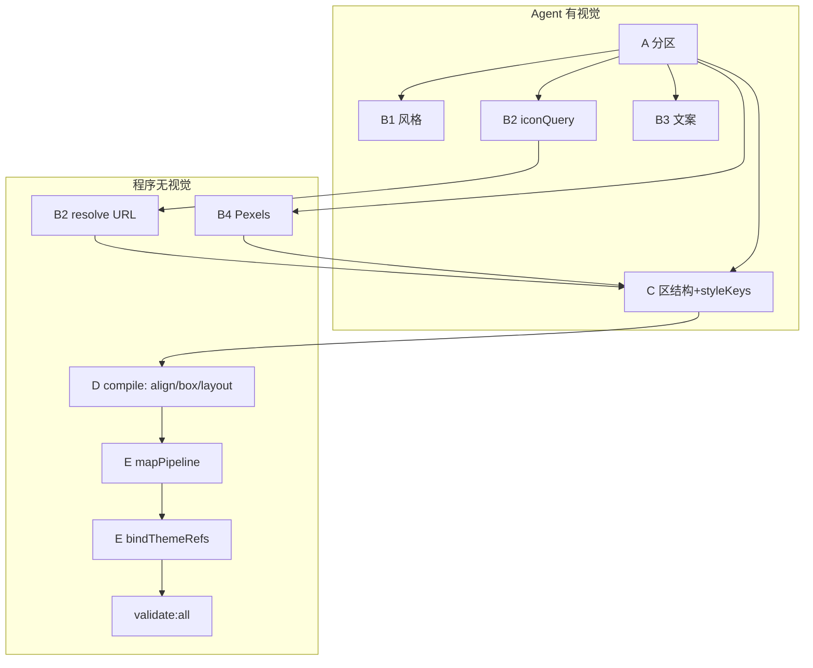

# 以图管线：Agent 决策 vs 程序兜底（深层梳理）

> 回应问题：手工还原（`manual-15` / `generate-manual-15-layout.mjs`）为何比豆包 pipeline（`15-mcp`）更整齐？  
> 是否因为 **非 Agent 决策过多**？若把「结构/样式统一」交回 Agent，是否只需在 **每次 Section 上下文** 里写清规则即可？

---

## 1. 先对齐事实：mjs 几乎就是 JSON，但决策权不在形态

| 层面 | 手工 `manual-15` | Pipeline `15-mcp` |
|------|------------------|-------------------|
| **落盘形态** | nested 4.0.0 `template.json` + `tokenPresets.json` | 同 |
| **谁写出每个参数** | 一次（或人脑全局）**语义决策** → 脚本展开 | **多段 LLM** + **多段 TS 编译/绑定** |
| **mjs 的角色** | 可重复的「Agent 决策快照」 | Pipeline **没有**等价物；决策散落在 A/B/C 与 D/E |

结论：**差距主要不是 JSON 缺字段**，而是 **同一字段由谁、在什么信息下、是否会被后续覆盖**。

Pipeline 的设计（`方案-以图AI生成邮件版式.md` §4）本身合理：**先总 → 再分 → 再总**、紧凑 IR、E 唯一落盘。问题出在 **「再总」阶段承担了过多「重新理解设计图」的职责**，而 C 阶段的 Agent 已做的判断被静默改写。

---

## 2. 你的直觉：哪些对、哪些要 nuance

### 2.1 对的部分

1. **手工 ≈ Agent 判完全部参数**（Logo 黑色、CTA 黑字、链接不是按钮、4 列信任区），全局一致。  
2. **拆步骤是为了单次输出上限**，不是天生要低质量。  
3. **很多错误来自「后补逻辑」在 C 之后改语义**（`bindThemeRefs`、`mapPipelineResult` 默认白字按钮、A 的 `gridColumns:3` 锁死 s6）。  
4. **「为统一而统一」若由无视觉的脚本执行**，容易与单区 Agent 输出冲突 → **不整齐**。

### 2.2 需要 nuance 的部分

1. **并非「逻辑兜底 = 坏」**  
   - Pexels 搜图、icon CDN、Zod 校验、`validate:all`、IR→nested  lowering **必须**程序做。  
   - 坏的是 **程序做「语义选择」**（这行字是按钮还是链接？该绑 primary 还是 black？）。

2. **「把统一规则写进 Section 上下文」可行，但不够**  
   - 上下文解决 **C 生成时** 的对齐。  
   - 若 E 仍强制 `button.textColor → colors.surface`，上下文白写。  
   - **统一性应：Agent 在 C 用 styleKeys/字面量表态 → E 只做机械映射 + 可选升格 themeRef（不改语义）**。

3. **手工 mjs 也不是「一次性大 JSON LLM」**  
   - 它是 **全局蓝图已在内** 的压缩；Pipeline 的等价物应是 **`MergedEmailDraft` + 每区 C 的完整 packet**，而不是更多 D/E 启发式。

---

## 3. 决策分层框架（建议作为管线宪法）

把每个字段归到四类之一，新增能力时先归类，避免再在 E 加「聪明默认值」。

### A. 感知语义（必须 Agent，且最好带图）

**定义**：离开设计图无法可靠判定；不同设计师/模板答案不同。

| 决策 | 当前阶段 | 说明 |
|------|----------|------|
| 区段划分与顺序 | A | s2/s3 边界错 → 后面全错 |
| 区段内 block 树（叠放 vs 竖排、grid 列数） | A 提示 + **C 主责** | A 的 `gridColumns` 宜作 hint，C 可推翻 |
| 文案归属区段 | B3 | 串区是典型 Agent 失败 |
| text / button / link 角色 | **C**（缺则补 B5 微阶段） | 页头链 → button 即此类 |
| 哪些块是 icon vs 图 vs 纯文字 logo | B2 + C | 金融圆标、UL/TÜV |
| 颜色**语义**（强调/正文/弱化/CTA 上文字色） | B1 档位 + **C styleKeys** | 非「凡等于某 hex 就绑 primary」 |
| **邮件主体底色**（B1 `emailBackground` → `emailRoot.props.backgroundColor`） | B1 | **不是**编辑器工作区外侧灰（`outerBackgroundColor` 已禁止；固定 `EMAIL_CANVAS_WORKSPACE_BACKGROUND`）。全白设计稿应 `emailBackground` = `contentSurface` = `#FFFFFF` |
| 字号层级（display/h1/body/caption） | C styleKeys | 非法值可程序回退 body |

**原则**：这些 **不允许** D/E 用默认值「猜」；程序只能 **校验 + 拒绝 + 触发 C 重试**。

---

### B. 资产解析（必须程序，Agent 只给 query）

| 决策 | 阶段 | Agent 输入 | 程序输出 |
|------|------|------------|----------|
| 搜哪张图 | A `imageQuery` / C `backgroundImageRef` | 自然语言 query | Pexels URL |
| 用哪个 icon | B2 `iconQuery` + pack | slug 语义 | jsDelivr URL |
| query 去重、棚拍偏好 | **程序策略** | 可选 A 标 `role: product-studio` | B4 规则 |

**原则**：Agent **不填 URL**；程序 **不改 query 语义**（可去重、可失败为空）。

---

### C. 契约与投影（必须程序，且应「无损」）

**定义**：已知 IR + tokens + manifest → nested template；**不改变视觉语义**。

| 步骤 | 模块 | 应是 | 当前风险 |
|------|------|------|----------|
| sanitize | `sanitizeCompactIr` | 删非法字段 | OK |
| allowlist | `sectionCompactGuard` | 防跨区引用 | OK；**不**修 B3 串区 |
| align 补全 | `applySectionContentAlign` | 仅补 **缺失** 的 align | 继承规则需与 prompt 一致 |
| layout 约束 | `compactLayoutConstraints` | 契约内补全 | 勿覆盖 C 已写 align |
| lowering | `mapPipelineResultToEasyEmail` | 1:1 映射 | **按钮默认 surface 白字** ← 语义覆盖 |
| themeRef | C `styleKeys` 的 `*Bind` / `{ literal, tokenPath }` + E `applyStyleKeys` | Agent 声明颜色/字色绑定；程序校验字段白名单 | `bindThemeRefs` 仅补绑间距/圆角等与 B1 一致的字面量，**不再**猜绑颜色 |
| validate | `validate:all` | 硬门禁 | OK |

**原则（E 阶段宪法）**：

```text
E 不得引入 C/IR 中未出现的样式语义。
E 的默认值只能是「契约安全缺省」（如 border 0），不能是「设计偏好缺省」（如 CTA 白字）。
themeRef 升格 = 记录 Agent 已选的字面量与 token 一致，不是替 Agent 选色。
```

---

### D. 全局一致（Agent 声明 + 程序强制执行同一套）

「结构统一、样式统一、主题绑定」**可以同时满足**，但分工应是：

| 统一目标 | 推荐做法 | 不推荐 |
|----------|----------|--------|
| 模块壳 / pageInline / section gap | B1 tokens + **C prompt 固定模块壳 kind** + E `resolveSectionRootPadding` | E 另算一套间距 |
| 同区 typography | C 每节点 `styleKeys` 引用 B1 档位名 | E 强行绑 primary |
| themeRef | C 可写字面量；E **仅匹配升格** | E 见按钮就绑 primary/surface |
| 跨区对齐 | A `layoutHints` + C `wrapper.contentAlign` | D 用另一套 center 默认盖掉 C |

**核心**：统一规则 = **写入每区 C 的 system packet 的「Style Bible」**，程序只 **校验是否违反 Bible**，不在 E **第二套 Bible**。

---

## 4. 当前管线：决策权实际落点（与模板 15 事故对应）



| 模板 15 现象 | 根因类型 | 决策本应归属 |
|--------------|----------|--------------|
| Logo/标题变黄 | E2 绑 primary / C 写了 primary | **C + B1** 声明「primary 仅 CTA 背景」；E2 禁止绑 heading |
| CTA 白字 | E1 默认 + E2 绑 surface | **C** 写 `textColor: #1A1A1A`；E 禁止覆盖 |
| 页头变按钮 | C 选 kind | **C**（prompt：引导链 → text+underline） |
| TAKE ANOTHER LOOK 在 s2 | B3 串区 | **B3** 或 B3 后 **Agent 校验 pass** |
| 信任区 3 列 | A gridColumns | **C** 见 4 个并列资产应输出 grid 4；A 仅 hint |
| 金融无 icon | B2 未产出 + C 无 icon | **B2+C** |
| 商品图户外 | B4 query | **A/B4** role + query 模板 |

**结论**：模板 15 的「不整齐」**约 60% 是 C 之前/之中 Agent 表意错误，约 40% 是 E/D 后补覆盖 Agent 表意**（颜色、按钮、列数锁定）。不是「拆步」本身，而是 **后段承担了 A 类决策**。

---

## 5. 是否「太多非 Agent 决策」？——定量直觉

| 阶段 | 决策条数（量级） | Agent 占比（理想） | 当前风险 |
|------|------------------|-------------------|----------|
| A | 低（~7 区 × hints） | 高 | 列数等应用 hint 非 lock |
| B | 中（文案条、icon 条） | 高 | B3 无区界校验 |
| C | **高（每区整棵树）** | **应最高** | prompt 够但可被 D/E 洗掉 |
| D | 中（align/box） | 低（仅补缺失） | 继承逻辑与 C 冲突时谁赢？需明确 |
| E | **极高（每 block 每字段）** | **应接近 0 语义** | **实际很高** ← 主矛盾 |

**答案**：是的，**主要矛盾在 E（及 bindThemeRefs）做了过多语义决策**；D 次之；不是 B4/Pexels 太多。

---

## 6. 若交回 Agent：Section 上下文应包什么？

每次 `runStageCForSection` 的 packet 建议固定为 **6 块**（比「多写几句统一」更结构化）：

```text
1) Global Style Bible（来自 B1，全文）
   - primary 仅用于 CTA 背景；正文 #1A1A1A；弱化 secondary；CTA 文字 #1A1A1A

2) Section Grounding（来自 A 本区）
   - components、layoutHints、imageSlots（勿把 gridColumns 当铁律）

3) Section Copy（来自 B3 本区 textId 列表，禁止其他区 textId）

4) Section Assets（本区 iconRef + backgroundImageRef 表）

5) Pattern Catalog（程序提供的 3–5 个 JSON 片段示例，非全模板）
   - header-space-between、hero-centered-cta、social-overlay-grid-4、trust-grid-4 …

6) Hard Negatives（本仓库反模式，来自 email-template-restore-check 摘要）
   - 禁止 wordmark 用 colors.primary；禁止把单行链做成 action.button …
```

**仍然需要程序的部分**（写进 packet 边界，不由 C 违反）：

- 白名单 kind、`textId`/`iconRef` 必须来自块 3/4  
- 禁止 `$themeRef`、`bindings`、落盘字段  

**不需要在 E 重复写的「统一」**：若在 packet 1/5/6 已声明，E **不得再实现第二套**。

---

## 7. 推荐演进路线（按架构，非单模板打补丁）

### 7.1 短期：E 阶段「语义冻结」（已实现 2026-06-04）

1. `mapPipelineResultToEasyEmail` + `semanticStyleDefaults.ts`：正文缺省 `#1A1A1A`；CTA 字色按 primary 亮度选黑/白；`loweringSemantic` 计数写管线日志。  
2. `bindThemeRefsAfterAiLowering`：按钮 **不再强制** `textColor → surface`；text **禁止**将非 primary 字面量升格为 `colors.primary`。  
3. `rebalanceTextExtractRegions` + `normalizeTextExtractFromLlm`：B3 后挪回「TAKE ANOTHER LOOK」；弱化「test ride」→ button role。  
4. `buildStyleBiblePromptSection`：Stage C 每区注入 Global Style Bible。

### 7.2 中期：B3 区界 + C packet（部分已实现 2026-06-04）

4. B3 后 **规则 pass**（已实现）：`rebalanceTextExtractRegions` + `normalizeTextExtractFromLlm`；完整 6 块 packet 仍待做。  
5. **gridColumns 后验**（已实现）：`refineGroundingGridColumns` 在 B 后、C 前抬高；A prompt 注明 `gridColumns` 仅为 hint（`compactIr.buildGroundingLayoutHintsPromptSection`）。  
6. **D 仅补缺失 align**（已实现）：`wrapperContentAlign.needsContentAlignPatch` + `mergeContentAlignPreservingExplicit`；`compactLayoutConstraints` 两轴齐全时不 patch。  
7. **B2 金融/认证 icon**（已实现）：`stageB2IconPrompt` 扩展 UL/TÜV/Affirm 等 tabler 语义。  
8. **Golden 结构回归**（已实现）：`layoutStructureMetrics` + `manual-15/template.json` 单测。

仍待：C 改为 6 块 packet；`gridColumns` 字段改名为 `gridColumnsHint`（破坏性，可二期）。

### 7.3 长期：可选「C-style」子调用（按需）

9. C 拆成 `C-structure`（kind/children/ref）+ `C-style`（仅 styleKeys），两次小 JSON，仍 per-section，总 token 可控。  
10. 二期 **B5 UI 角色**：对 B3 每条 text 标 `role: link | button | heading | body`，供 C 机械选 kind。

### 7.4 不建议

- ❌ 让豆包一次输出整份 `template.json`（schema 过大、难校验、难 retry）。  
- ❌ 继续增加 E 启发式「变好看」。  
- ❌ 去掉 IR 层直接 C→template（丧失 D 的可测性）。

---

## 8. 与手工 mjs 的对照：pipeline 目标态

| 手工 mjs 隐含能力 | Pipeline 目标态 |
|-------------------|-----------------|
| 全局看一眼定区界 | A + **B3 校验** |
| 每块 kind/align/色 | **C + packet**，E 不改 |
| 统一 token | B1 + C styleKeys，themeRef 可选升格 |
| Pexels/icon URL | B4/B2 resolve（保持程序） |
| 可维护 | `manual-15` 式脚本改为 **golden IR fixture**，测 D+E 无损 |

手工版应逐步变为 **「IR 黄金样例 + 测 E 映射」**，而不是长期平行维护两套 template。

---

## 9. 直接回答你的三个问题

**Q1：是否太多非 Agent 决策导致不整齐？**  
**主要是 E/bindThemeRefs 的语义决策过多，以及 A/B3 的 Agent 决策错误未被拦截**；不是 Pexels/校验太多。D 的 align 补全若与 C 冲突也会加剧，但是次要。

**Q2：统一性能否只靠 Section 上下文，不走逻辑写入？**  
**一半**：统一性规则应写在 **C 的上下文**（Style Bible + Pattern + Negatives）。  
**另一半**：程序负责 **(1) 资产 URL (2) 契约 sanitize (3) 无损 lowering (4) validate**，以及 **检测 Agent 违反 Bible 时 fail/retry**，而不是在 E **另写一套统一**。

**Q3：mjs 是否已够、pipeline 只差 Agent 决策？**  
mjs 证明 **IR/模板字段足够表达设计**；pipeline 缺的是 **决策权闭环**——Agent 在 C 表态 → 程序 **忠实投影**，而不是 Agent 表态 → 程序 **重新设计**。

---

## 10. 相关文档

- [方案-以图AI生成邮件版式.md](./方案-以图AI生成邮件版式.md) §4、§7  
- 代码：`runImageToLayoutVariantPipeline.ts` → `mergeSections` (D) → `mapPipelineResultToEasyEmail` + `bindThemeRefsAfterAiLowering` (E)
