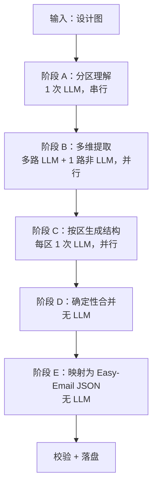

# 以图还原管线逻辑（参考 handoff）

> **文档性质**：记录 handoff 项目**已验证的产品/工程逻辑**，供 Easy-Email 自行实现。  
> **不**要求复制其目录、函数名、组件模型或 prompt 原文；只对齐**阶段划分、依赖关系、并行方式、中间产物、失败策略**。

对照时可看 handoff：`project/server/src/lib/pipeline/runPipeline.ts`（实现细节以对方仓库为准）。

---

## 1. 结论

Easy-Email「以图创建版式」应对齐下面这一套**逻辑**：

1. 一张设计图进来。  
2. **先**用一次视觉 LLM 做「分区理解」（自上而下有哪些区块）。  
3. **再并行**几路分析（风格档位、图标、文案、真实配图 URL），都只依赖分区结果。  
4. **再并行**按区生成结构（每区一次 LLM，输入含图 + 前面各路的 JSON）。  
5. **最后只用确定性代码**拼成最终模板（本仓库是 `template.json` + `tokenPresets.json`），并跑校验落盘。

不需要 handoff 的：聊天 ReAct、工具 XML、截图自动修复管线、会话标题等。

---

## 2. 总流程（逻辑图）



**核心思想**：LLM 只产出**小而专的中间 JSON**；大块树结构按区拆开生成；**禁止**一次 LLM 直接吐整封邮件的最终 schema。

---

## 3. 各阶段逻辑说明

### 阶段 A：分区理解（Grounding）

| 维度 | 逻辑 |
|------|------|
| **目的** | 把设计图切成若干「视觉区块」（头图、标题区、商品卡、页脚…），供后续步骤共用同一份「分区清单」。 |
| **次数** | 1 次多模态 LLM（带整张或同一张图）。 |
| **输入** | 设计图 + 指令：只输出 JSON 数组，每项描述一个区块（id、区域名、大致有什么组件、是否含图、叠放关系等）。 |
| **输出（中间态）** | 分区列表，例如：是否需要搜图、英文搜索词、建议宽高、是否有图上叠字等。 |
| **失败** | **§6.2**：可重试 **1 次**；仍失败则用兜底（例如整图当作单一区块「整体」），避免管线直接中断。 |

---

### 阶段 B：多维提取（并行，且只依赖阶段 A）

四路**同时**跑，彼此**不**互相等待（除共同依赖分区清单）：

| 子步骤 | 是否 LLM | 目的 | 中间产物（概念） |
|--------|----------|------|------------------|
| B1 设计风格 | 是 | 色板、间距节奏、字号档位、画布背景等 → 对应本仓库 **tokenPresets** | 预设名 + 可选覆盖色 |
| B2 图标 | 是 | 识别品牌/功能图标（系统图标 vs 自定义 SVG） | 图标 id、颜色、素材引用 |
| B3 文案 | 是 | 按分区提取可见文字列表 | 分区 id → 文案数组 |
| B4 配图 | **否** | 对「需要真实照片」的分区用关键词搜图（Pexels，见 [pexels-image-search.md](./pexels-image-search.md)） | 分区 id → 图片 URL |

| 维度 | 逻辑 |
|------|------|
| **失败策略** | 风格档可 retry 后给默认值；图标/文案/搜图失败多为**降级为空**，不阻断整条管线（handoff 如此，Easy-Email 可沿用）。 |

---

### 阶段 C：按区生成结构（并行）

| 维度 | 逻辑 |
|------|------|
| **目的** | 每个视觉区块单独生成一棵**紧凑**组件树（比最终 template 抽象一层，字段更少）。 |
| **次数** | 分区有几个，就发起几次 LLM（可并行）。 |
| **每次输入** | 设计图 + 当前分区描述 + 阶段 B 的 tokens / 文案 / 图标 / 配图 URL。 |
| **每次输出** | 该区的紧凑树（layout / grid / text / image / button 等，按对方或本仓库 block 语义命名即可）。 |
| **后处理（确定性）** | 校验引用（图标 ref、空图 src）、删掉无效节点，再展开成「较完整」的节点树。 |
| **失败** | **§6.2 重试 1 次**；仍失败则 **跳过该区**，其它区继续；全区均失败则整单失败。 |

---

### 阶段 D：确定性合并（无 LLM）

| 维度 | 逻辑 |
|------|------|
| **目的** | 把各区的树按从上到下顺序接成一封邮件；统一间距规则；由风格档推导画布级配置（宽 600、背景色等）。 |
| **输入** | 阶段 C 各区的树 + 阶段 B1 风格档。 |
| **输出** | 逻辑上的「完整邮件结构 + 画布配置 + 设计 token」——形态由**本仓库**定义，不必与 handoff 相同。 |

---

### 阶段 E：映射为 Easy-Email 落盘形态（无 LLM）

handoff 到此结束在其自有组件模型上；Easy-Email **必须**再加一层纯代码：

| 输出 | 本仓库真源 |
|------|------------|
| 区块树、bindings、`$themeRef` | `layouts/<id>/template.json`（nested 4.0.0） |
| 样式档位 | 同版式 `tokenPresets.json` |
| 业务变量（若需要） | 场景级 `payload.json`（MVP 可先不写，或只写常量） |

映射规则应遵守：`src/block-contract/`、`email-token-preset-standard-scope`、`npm run validate:all`。

---

## 4. LLM 调用方式（逻辑层，与 handoff 一致的部分）

| 原则 | 说明 |
|------|------|
| **模型** | 多模态豆包（火山方舟 Ark），OpenAI 兼容 `POST …/chat/completions`。 |
| **同图多次** | 阶段 A、B1–B3、C 都会再看设计图；注意成本，但逻辑上允许。 |
| **消息形态** | 用户消息 = `image_url`（base64 或 https）+ 可选文字说明；系统消息 = 该阶段的任务说明。 |
| **结构化输出** | **Easy-Email MVP 启用** Ark `response_format` 约束各阶段 **IR**（见 §4.1）；返回后仍 Zod + normalize。handoff 仅 prompt 要求 JSON。 |
| **LLM 重试** | **统一最多再请求 1 次**（§6.2 与方案正文一致）；A/B1/B2/B3/C 各 stage 单元相同；C 按区独立计数。 |
| **流式** | 服务端可流式接收再拼成完整字符串；对前端仍是一次「开始生成 → 等待 → 成功/失败」。 |
| **超时** | 整段管线包在 **120s** 内（`LAYOUT_VARIANT_AI_FROM_IMAGE_TIMEOUT_MS`），不是单步 120s。 |

环境变量层面只需：**API Key、Base URL、一个多模态 endpoint id、推理强度（可选）**——不必照搬 handoff 的 `LLM_CHAT_*` 等多场景配置。

### 4.1 豆包 `response_format`（IR json_schema，MVP）

与 [方案-以图AI生成邮件版式.md](./方案-以图AI生成邮件版式.md) **§6.1** 一致：

| 项 | 说明 |
|----|------|
| **是什么** | `chat/completions` 请求体字段，**不是** `template.json` 的 schema |
| **约束谁** | 阶段 A/B1/B2/B3/C 的中间 JSON（`GroundingResult`、`StyleTokensResult` 等） |
| **Schema 来源** | `src/lib/ai-pipeline/schemas/` 的 Zod 派生 JSON Schema |
| **双保险** | API `json_schema` → 返回后 `Zod.safeParse` → `normalize` → E 映射 → `validate:all` |
| **回退** | endpoint 不支持 `json_schema` → `json_object` → 无 `response_format` + prompt 解析 |
| **文档** | [结构化输出（beta）](https://www.volcengine.com/docs/82379/1568221) |

**请求片段（A 阶段示例）**

```json
{
  "response_format": {
    "type": "json_schema",
    "json_schema": {
      "name": "grounding_result_v1",
      "strict": true,
      "schema": { "type": "object", "required": ["schemaVersion", "order", "sections"] }
    }
  }
}
```

实现：`doubaoClient.ts` 按 `stage` 调用 `getResponseFormatForStage(stage)`；完整 schema 定义见方案 §14 响应示例与 §15.5 目录表。

---

## 5. 不必参考的 handoff 逻辑

| 能力 | 原因 |
|------|------|
| 聊天 + ReAct 多轮改模板 | Easy-Email 入口是「新建版式弹窗」，无对话 UI |
| 从聊天工具触发 `createTemplateFromImage` | 已改为 HTTP `ai-from-image` 直接触发 |
| 截图对比 + 自动修复（verify pipeline） | 可选二期，非 MVP |
| 规划子 Agent（plan） | 还原管线内已隐含分区，无需另开规划 |

---

## 6. Easy-Email 实现时自检（按逻辑，不按文件）

- [ ] 是否有**单独的分区理解**阶段，且先于其它 LLM？  
- [ ] 风格 / 图标 / 文案 / 搜图是否在**有分区后并行**？  
- [ ] 结构是否**按区并行**生成，而不是一次生成整棵树？  
- [ ] 合并与写入 `template` / `tokenPresets` 是否**无 LLM**？  
- [ ] LLM 各阶段是否带 **`response_format`（IR json_schema）**，且返回后仍 **Zod + normalize**（§4.1）？  
- [ ] LLM 各阶段是否统一 **§6.2**（每调用单元最多再请求 **1** 次）？  
- [ ] 整段是否在 120s 内、成功后 `validate:all`、失败不落半成品版式？  

实现位置：`server/layoutVariantAiFromImage.ts`（函数名与模块划分自定）。

---

## 7. 与「多路 specialist」口语的对应

| 口语 | 对应阶段 |
|------|----------|
| 分析版式结构 | A 分区 + C 按区结构 |
| 分析颜色 / 间距 / 圆角字号 | B1 设计风格 → tokenPresets |
| 分析图标 | B2 |
| 提取文案 | B3 |
| 查询占位图 | B4（`src/lib/pexelsClient.ts` → `searchPexelsBest`） |
| 合成最终 JSON | D + E（确定性脚本） |

**不必**在 Easy-Email 再设计一套不同的并行拆法；按上表实现即可。

---

## 8. 外部参考

- handoff 实现对照：`emailbuilder2.0-handoff-export` → `project/server/src/lib/pipeline/runPipeline.ts`  
- 豆包方舟文档：[火山引擎 · 方舟大模型](https://www.volcengine.com/docs/82379)
