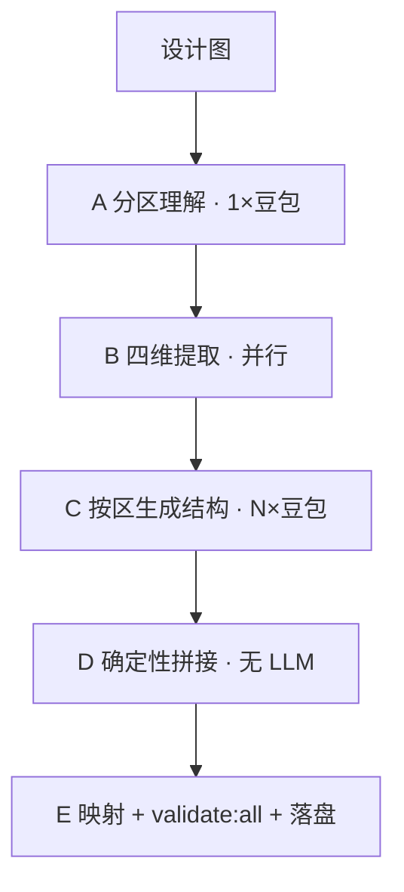
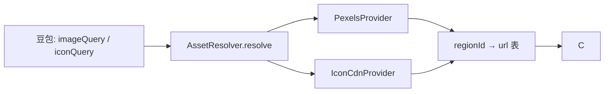
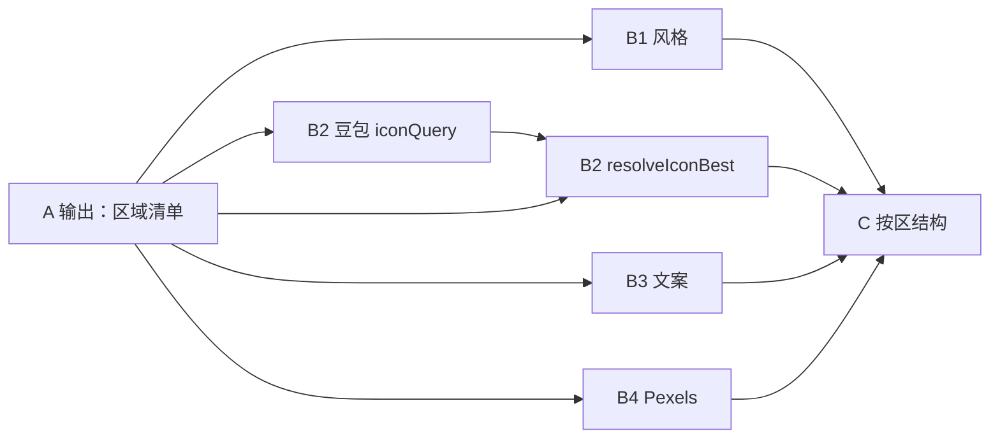

# Easy-Email：以图 AI 生成邮件版式方案

本文档汇总 **Easy-Email 专属** 的「上传设计图 → 自动生成版式（`template.json` + `tokenPresets.json`）」方案，包含已与产品/实现讨论 **确认的结论**。  
技术步骤细节见 [doubao-ark-chat-completions.md](./doubao-ark-chat-completions.md)；Pexels 见 [pexels-image-search.md](./pexels-image-search.md)；图标 CDN 解析见本文 **§7.3**。

---

## 1. 要解决的问题

| 项 | 说明 |
|----|------|
| **用户动作** | 在「新建版式」弹窗选择「以图创建（AI）」，上传一张邮件设计图（JPG/PNG/WebP，≤10MB），填写版式名称后提交。 |
| **系统产出** | 新版式 `template.json`（**样式为字面量**，无 AI 路径 `$themeRef`）+ **`tokenPresets.json`（B1 同步）** + **空** `payload.json`；nested 4.0.0，E 末段 **`validate:all`** 通过后才落盘。 |
| **不做** | 不通过聊天/ReAct 改模板；**MVP 不做** G 截图修复、URL HEAD、repeat/visibility（§7.4）；不一次性让 LLM 输出整封邮件最终 schema。 |

---

## 2. 数据落哪一层（已确认）

| 层级 | 是否由本方案写入 | 说明 |
|------|------------------|------|
| **版式** `template.json` + `tokenPresets.json` | **是** | 结构 + **字面量**进 template；**`tokenPresets.json`** 的 `presets.default.tokens` **与 B1 结果同步写入**（§7.1）；template **仍不绑** `$themeRef` |
| **场景** `payload.json` | **是（空）** | MVP 落盘**合法空 payload**：`slots: {}`、`values: {}`（与脚手架一致）；不做业务变量/列表 |
| **模板**（顶栏「模板」资源） | **否** | 本入口是「新建版式」，不是新建整封邮件场景。 |

结论：**以图还原的主体是版式，不是整封邮件目录。**

---

## 3. 产品交互（已确认）

| 项 | 约定 |
|----|------|
| 入口 | `LayoutVariantCreateModal`：空白 / 以图创建（AI）；同名、同弹窗内上传图。 |
| 提交后 | 全页 blocking loading；**120s** 超时（`LAYOUT_VARIANT_AI_FROM_IMAGE_TIMEOUT_MS`）。 |
| 成功 | 关闭弹窗，切换到新版式，预览可见生成结果。 |
| 失败 | **不**关闭弹窗、**不**落盘半成品；API 返回可展示错误（如 C 全区失败、整段超时、`validate:all` 不过）→ 弹窗内提示**失败请重试**或换图后再提交 |
| HTTP | `POST /api/v1/emails/:emailKey/layout-variants/ai-from-image` |
| 实现挂点 | `server/layoutVariantAiFromImage.ts` → `generateLayoutVariantFromDesignImage` |

---

## 4. 管线总览：「先总、再分、再总」

与 handoff **`runImageToTemplatePipeline` 逻辑对齐**，**不要求拷贝对方代码或组件模型**。

用小白话记：

1. **先总**：一张图 → 划出从上到下有哪些**视觉区域**（还不是最终 block 树）。  
2. **再分**：四件事**同时**做（都只依赖区域清单）。  
3. **再分**：**每个区域单独**让 AI 搭这一块里的排版结构（可并行）。  
4. **再总**：用 **程序（TypeScript）** 拼接、翻译成 Easy-Email 的 JSON，校验后落盘。



### 4.1 阶段对照表

| 阶段 | 做什么 | 是否 LLM | 产出（概念） |
|------|--------|----------|--------------|
| **A** | 分区理解（Grounding） | 是（豆包多模态） | 区域清单：id、区域名、是否含图、搜图关键词等 |
| **B1** | 设计风格 | 是 | **9 键数值选档** + **colors hex**（§7.1.1）→ E 展开 template 字面量 |
| **B2** | 图标 | 豆包 **`iconQuery`** → **`AssetResolver`**（`icon-cdn`，§4.4 / §7.3） |
| **B3** | 文案提取 | 是 | 区域 → 可见文字（**抄字**） |
| **B4** | 真实配图 | **否** | A 的 **`imageSlots[].imageQuery`** → **`AssetResolver`**（`pexels-photo`，§4.4） |
| **C** | 按区生成结构 | 是（每区 1 次，并行） | 每区 **紧凑 IR**（§4.2），**禁止** native `template.json` |
| **D** | 合并 | 否（TS 脚本/服务代码） | 自上而下接成一封邮件逻辑树 + 画布配置 |
| **E** | 映射落盘 | 否 | nested `template.json` + **`tokenPresets.json`（B1 同步）** + 空 `payload.json`；**`npm run validate:all`** |

**已讨论澄清：**

- 第 1 步是 **划区域**，不是拆最终 `layout/grid` 细结构；细结构在第 3 步（紧凑 IR）。  
- 第 2 步 **不全是「内容复制」**：B1 分析风格、B2/B4 经 **资产解析**（§4.4）、B3 抄文案。  
- 最后拼接 **不是必须 Python**；本仓库用 **Node/TypeScript**（`server/` + `src/lib/`）。  
- **阶段 E 必须按 Easy-Email 契约**（`block-contract`、`template-disk-contract`、`validate:all`），不必与 handoff 组件模型一致。  
- **所有 LLM 阶段**（A/B1/B2/B3/C）管线内对同一调用 **最多自动重试 1 次**（§6.2）。

### 4.2 三层数据形态与紧凑 IR（已确认）

管线内数据分三层，**禁止跳层**（尤其禁止 C 直接写落盘 JSON）：

| 层级 | 阶段 | 形态 | 说明 |
|------|------|------|------|
| **① 分区/素材表** | A、B1–B4 | 清单与键值表 | `GroundingResult`、`StyleTokensResult.tokens`、`TextExtractResult`、`assetManifest` 等 |
| **② 紧凑结构 IR** | **C** | `CompactSectionTree`（命名待定） | 每区一棵**简化**组件树；参考 handoff `CompactComponent`，**不是** nested 4.0.0 |
| **③ 落盘 JSON** | **D + E** | `template.json`、`tokenPresets.json` | 全字段契约、字面量样式、`validate:all` |

**阶段 C 应包含（概念）：**

- 块 **`kind`**：与 `blockMeta.blockType` 对齐（如 `content.image`、`action.button`，见 §15.3）。  
- `children` 父子关系。  
- 内容**引用**：`textId` → B3；`wrapper.backgroundImageRef` / `iconRef` → `assetManifest`（§15.4）。  
- 关键样式：`styleKeys` 点路径或少量字面量（由 E 从 B1 `tokens` 确定性展开）。  

**阶段 C 禁止包含：**

- `schemaVersion`、`root` 邮件壳、`bindings`、`$themeRef` / `bindings.tokenPath`。  
- `repeat` 物化、`visibility` 表达式（MVP）。  
- 任意 **未在紧凑 IR 契约中声明** 的 `wrapperStyle` 路径（避免与 `validateTemplate` 缠在一起）。

实现时维护 **`compactSchemaVersion`**（如 `"1"`）与 TypeScript 类型（建议 `src/lib/ai-pipeline/compactTypes.ts`）；变更 IR 时同步改 `mapPipelineResultToEasyEmail`。

### 4.3 架构原则：解耦、可扩展、企业级落地（已确认）

**设计层面**：本方案已是 **分阶段 + 中间表示（IR）+ 确定性映射**，便于在环节增量演进，而不推倒重来。

**扩展规则（加能力时遵守）：**

| 规则 | 含义 |
|------|------|
| B 路并行只依赖 A | 新增 `B5` 等路与 B1–B4 一样 `Promise.all`，避免 B 间环形依赖 |
| B 只产出表/清单 | 不在 B 写 half-template |
| C 只产出紧凑 IR | 见 §4.2 |
| **仅 E（+D）写 nested template** | 唯一落盘真源路径 |
| IR 版本化 | `compactSchemaVersion` + 映射器同改 |

**方便插入的位置：**

- **加厚 A**：栅格列数、资产类型（图/图标/底图）、叠放提示（ROI 高，仍算 1 次 LLM）。  
- **新 B 路**：如链接语义、底图角色（仅依赖 A）。  
- **D / E**：`normalizeSpacing`、**`validate:all`（E 末段必跑，§7.4）**。
- **二期 G**：截图对比自动修复（**MVP 不做**）。  
- **MVP 不做清单**：见 **§7.4**（F/HEAD、repeat、像素测 spacing、公网 icon API 等）。

**企业级落地仍待实现（代码）：** 详见 **§15**。

- 各阶段 **Zod schema**（`src/lib/ai-pipeline/schemas/`）；  
- `ai-pipeline` 薄编排 + Parse/Normalize + 单测（IR 映射、`assetManifest`、`AssetResolver`、mock LLM）；  
- 统一日志字段：`pipelineRunId`、`stage`、`regionId`、`durationMs`（§15.2）。

### 4.4 统一资产解析 `AssetResolver`（已确认）

**B4 配图**与 **B2 图标**在编排上是同一抽象：**LLM 给出查询条件 → 程序解析为 URL → 写入 template 字面量**。差异只在 **Provider**，不是管线阶段语义不同。



| 项 | Pexels（B4） | Icon CDN（B2） |
|----|--------------|----------------|
| LLM 产出 | `imageQuery` | `iconQuery` + `pack` |
| Provider | HTTP `searchPexelsBest` | `resolveIconBest` + 静态 JSON（§7.3） |
| 写入 template | `wrapperStyle.backgroundImage.src` 等（`content.image`） | `icon.props.src`、`props.color` |
| 密钥 | `PEXELS_API_KEY` | 无 |

**建议类型（`src/lib/ai-pipeline/assetResolve.ts` 或同级）：**

```ts
type AssetResolveKind = "pexels-photo" | "icon-cdn";

type AssetResolveRequest = {
  kind: AssetResolveKind;
  query: string;
  regionId?: string;
  pack?: "simple-icons" | "tabler" | "lucide";
  orientation?: "landscape" | "portrait" | "square";
};

type AssetResolveResult = { url: string; alt?: string; tintable?: boolean } | null;
```

- 对外 **`resolveAsset(req)`**：按 `kind` 分发到现有 `searchPexelsBest` / `resolveIconBest`。  
- 共用：**规范化 query、失败返回 null、可选 HEAD 200、统一 warn 日志**。  
- **未来**：`kind: "project-upload"` 等新增 Provider，**不改 C 的紧凑 IR 形态**。

B2 编排可保留「豆包 → resolve」两步命名；实现上 **B2b/B4 均走 `AssetResolver`**。

---

## 5. 阶段 B 并行（逻辑图）



| 子步骤 | 失败策略（**LLM 均先 §6.2 重试 1 次**） |
|--------|--------------------------------------|
| **A** | 仍失败 → 整图当作单一区域「整体」 |
| **B1** | 仍失败 → **`AI_PIPELINE_B1_FALLBACK_TOKENS`** 整表（§7.1.1）→ E 字面量展开 |
| **B2**（豆包段） | 仍失败 → `IconQueryItem[]` 为空；**resolve 段**无 LLM，单条失败省略该 icon |
| **B3** | 仍失败 → 文案表为空；不阻断 |
| **B4** | **无 LLM**；单 slot 搜图失败 → 该 `slotId` 无 URL |
| **C**（按区） | 仍失败 → **跳过该区**；其它区继续；**全区均失败** → **整单失败**，API 错误 → **弹窗提示重试**（§3） |

> **C 已确认**：区级 retry 1 次后跳过坏区，**不**因单区失败整单中断（除非无任何有效区）。

---

## 6. LLM 与外部服务

| 项 | 约定 |
|----|------|
| 厂商 | 火山方舟 Ark（OpenAI 兼容 `POST …/chat/completions`） |
| 环境变量 | `DOUBAO_API_KEY`、`DOUBAO_BASE_URL`、`LLM_PIPELINE_VENDOR=doubao`、`LLM_PIPELINE_MODEL`；可选 `DOUBAO_REASONING_EFFORT` |
| 配图 | `PEXELS_API_KEY` → `src/lib/pexelsClient.ts`（`searchPexelsBest`） |
| 图标 | **无第三方 API Key**；`src/lib/iconCdnResolve.ts`（`resolveIconBest`）+ `data/icon-cdn/*.json`（§7.3） |
| 配置位置 | 项目根 `.env`（勿提交 Git）；示例见 `.env.example` |
| 整段超时 | **120s**（整段管线，非单步）；重试消耗计入同一超时预算 |
| 调用形态 | 多模态 `image_url` + 各阶段 system/user prompt；**MVP 启用** Ark `response_format` 约束 IR 输出（§6.1）；服务端仍走 Parse + Zod + normalize |
| **LLM 重试** | 统一 **§6.2**：每 stage（C 含 `sectionId`）最多 **再请求 1 次** |

**不接入（MVP）：** handoff 的 Chat、ReAct 工具循环、verify 截图修复、plan 规划 Agent、PostgreSQL 图片库缓存（`searchWithCache`）。

### 6.1 豆包结构化输出 `response_format`（MVP **定稿启用**）

> **指 Ark `chat/completions` 请求体上的结构化输出能力**（非 optional 开关）。约束对象为 **§14 / §15.3 各阶段 IR**（如 `GroundingResult`、`CompactSectionTree`），**不是** nested `template.json`。

| 项 | 约定 |
|----|------|
| **定稿** | 每次 LLM 调用 **必须**带 `response_format: { type: "json_schema", json_schema: { name, strict: true, schema } }` |
| **启用范围** | 所有 LLM 阶段：**A、B1、B2、B3、C**（B4 无 LLM） |
| **Schema 真源** | 与本仓库 **Zod** 同构（`src/lib/ai-pipeline/schemas/`）；**必须**由 Zod **`zod-to-json-schema` 派生**注入请求，**禁止**手写第二份与代码漂移的键表 |
| **约束对象** | 中间 IR 的 `schemaVersion` / 字段枚举 / 必填项；**不含** `blockMeta`、`bindings`、`$themeRef` |
| **与 Zod 关系** | **双保险**：API 约束生成形态 → 返回后仍 `Zod.safeParse` + `normalize`；API 不替代 E 映射与 `validate:all` |
| **官方文档** | [火山方舟 · 结构化输出（beta）](https://www.volcengine.com/docs/82379/1568221) |

**请求示例（程序侧，随阶段切换 `name` / `schema`）**

```json
{
  "model": "<LLM_PIPELINE_MODEL>",
  "messages": [ "…" ],
  "response_format": {
    "type": "json_schema",
    "json_schema": {
      "name": "grounding_result_v1",
      "strict": true,
      "schema": {
        "type": "object",
        "additionalProperties": false,
        "required": ["schemaVersion", "order", "sections"],
        "properties": {
          "schemaVersion": { "type": "string", "const": "1" },
          "order": { "type": "array", "items": { "type": "string" } },
          "sections": { "type": "array" }
        }
      }
    }
  }
}
```

完整 `schema` 与 §14 各阶段响应示例一一对应；实现时由 `schemas/grounding-result.schema.json` 等文件维护，或由 `zod-to-json-schema` 从 Zod 导出。

**Endpoint 能力回退（实现必做）**

部分接入点仅支持 `json_object` 或不识别 `type: json_schema`。客户端应：

1. **首选** `json_schema` + 对应阶段 IR schema；  
2. 若 HTTP **400** 且错误含 `response_format` / `json_schema` 不支持 → **降级** `type: json_object`（仍保证合法 JSON，字段形状靠 prompt + Zod）；  
3. 仍异常 → 不带 `response_format`，走 `stripMarkdownFence` + 解析（最后兜底）。

**实现挂点（建议）**

| 模块 | 职责 |
|------|------|
| `src/lib/ai-pipeline/doubaoClient.ts` | 封装 `chat/completions`；**默认** `json_schema` + `strict: true`；按 §14.0 组装 messages；处理能力回退 |
| `src/lib/ai-pipeline/prompts/buildSystemPrompt.ts` | 各 stage **system** 文案（格式/语义/禁止项） |
| `src/lib/ai-pipeline/prompts/buildUserPrompt.ts` | 各 stage **user** 文案（图 + 任务 + 业务入参） |
| `src/lib/ai-pipeline/schemas/*.ts` | Zod 真源 + 导出 JSON Schema |
| `src/lib/ai-pipeline/stageSchemas.ts` | `getResponseFormatForStage(stage)` → 上述 schema |

**不做的误用**

- 不要把 nested 4.0.0 **`template.json` JSON Schema** 传给豆包（过大、易幻觉、与 E 职责冲突）。  
- 不要因启用了 API schema 而跳过 **Zod / normalize / mapPipelineResultToEasyEmail**。

### 6.2 LLM 统一重试（已确认）

**适用范围**：所有调用豆包的阶段——**A、B1、B2（iconQuery）、B3、C（每区一次）**。  
**不含**：B4、D、E、F（无 LLM 或纯程序）。

**规则**

| 项 | 约定 |
|----|------|
| **次数** | 每个 **stage 调用单元** 最多 **再请求 1 次**（首次失败后可 retry **1** 次，合计最多 **2** 次 HTTP） |
| **调用单元** | A/B1/B2/B3：各 **1** 单元；**C**：每个 **`sectionId` 各 1** 单元（并行区互不影响） |
| **触发 retry** | HTTP/网络错误、超时、响应非 JSON、`JSON.parse` 失败、**Zod.safeParse** 失败 |
| **不触发 retry** | 已成功解析但走**业务降级**（如 B2 resolve 单条 null、B4 无图）——那是下游逻辑，不是同 stage 重打豆包 |
| **retry 后仍失败** | 走 §5 表该阶段 **降级**，**不**无限重试、**不**自动重跑整段管线 |
| **与用户重试区分** | 用户在弹窗**换图再点提交** = 新的 `pipelineRunId` 整段重跑（§3）；§6.2 仅指**单次提交内**程序自动 retry |

**实现建议**

| 常量 / 模块 | 说明 |
|-------------|------|
| `AI_PIPELINE_LLM_MAX_RETRIES = 1` | 放在 `src/layout-variant-ai-contract/constants.ts` 或 `ai-pipeline/constants.ts` |
| `callLlmStageWithRetry(stage, sectionId?, fn)` | 统一包装；日志字段 `attempt: 1\|2`、`stage`、`sectionId` |
| `response_format` 回退 | 计入**同一次** attempt 内的客户端降级（§6.1），**不**额外占用 retry 次数 |

**与 120s 超时**：所有 stage 的 attempt 累计在整段 `generateLayoutVariantFromDesignImage` 超时内；实现可设单 stage 软超时，避免 C 多区 retry 挤爆总预算。

---

## 7. Easy-Email 专属：阶段 E 映射（已确认重点）

handoff 在阶段 D 后停在其自有 `CompactComponent` 模型；本仓库 **必须增加阶段 E**：

| 输出文件 | 真源契约 |
|----------|----------|
| `template.json` | `src/template-disk-contract/`、`src/lib/templateTreeAdapter.ts`；nested 4.0.0（`schemaVersion` + `root`） |
| `tokenPresets.json` | `src/token-preset-contract/`；**`presets.default.tokens` 与 B1 同步**（§7.1） |
| `payload.json` | **空**合法结构（§7.1） |
| 校验 | `npm run validate:all`；失败则不落盘 |

映射层（待实现，命名示例）：`mapPipelineResultToEasyEmail(...)`，输入为阶段 D 的逻辑树 + B1 风格结果 + 绑定关系，**禁止**在映射里再调 LLM。

### 7.1 风格提取：借用标准 12 键范围，落盘用字面量（已确认）

**结论（与「手工维护版式」区分）：**

| 维度 | 以图 AI 还原（本方案） | 手工/按图还原技能维护的版式 |
|------|------------------------|----------------------------|
| **管线 B1** | 用与 `token-preset-contract` **相同的 12 键名** 组织 LLM 输出（色/间距/字号/圆角），便于稳定解析 | 常维护完整 `tokenPresets.json` |
| **`template.json` 样式** | **一律写字面量**（`#RRGGBB`、`16px`、`12px` 等），**不**生成 `$themeRef` / `bindings.tokenPath` | 可按技能绑 `$themeRef` 换档 |
| **`tokenPresets.json`** | **`presets.default.tokens` = normalize 后的 B1**（§7.1）；与 template 字面量并存，template **不**生成 `$themeRef` | 手工版式可绑 `$themeRef` 换档 |

也就是说：**12 键是管线里的「抽取表格」**，不是要求 AI 版式必须走主题绑定；阶段 E 把 B1 抽到的值 **展开进各 block 的 style 字段常量** 即可。

#### 机器真源（仅借用键名范围，非绑定契约）

| 项 | 路径 |
|----|------|
| 12 键列表（B1 prompt / 中间 JSON  schema） | `src/token-preset-contract/standard-keys.ts` |
| 落盘 `tokenPresets` 校验 | `src/token-preset-contract/validate.ts` |
| 手工版式 `$themeRef` 白名单（**本管线 MVP 不用**） | `src/token-preset-contract/theme-ref-paths.ts` |
| 公共预设库（手工版式参考，**非** AI 落盘默认） | `data/token-presets/public-neutral-saas.json` 等 |
| B1 选档枚举与管线兜底 | `src/lib/ai-pipeline/b1StyleTierPresets.ts`（§7.1.1） |

#### 标准 12 键（B1 中间态字段名）

| family | scale |
|--------|-------|
| `colors` | `primary`, `secondary`, `surface` |
| `spacing` | `section`, `gap`, `pageInline` |
| `typography` | `display`, `h1`, `body`, `caption` |
| `radius` | `panel`, `cta` |

与 `presets.*.tokens` 键名一致，便于复用 `normalizeTokenPresetTokens` 做解析与降级；**不要求**把该对象原样写入落盘 `tokenPresets` 并被 template 引用。

#### 与 handoff B1 的差异

| handoff | Easy-Email 本方案 |
|---------|-------------------|
| LLM 输出预设**名** | LLM **选档**（数值 9 键，§7.1.1）+ **colors 直出 hex** |
| 展开后进组件 / token 体系 | 展开后进 **template 字面量** |
| 可有 design token 引用 | **MVP 禁止** AI 路径生成 `$themeRef` |

#### B1 策略（MVP，已确认）

**主路径 — 识图选档，非报任意 px：**

1. 豆包根据设计图，对 **spacing / typography / radius** 共 **9 个数值键** 在 **§7.1.1 预设枚举** 中各选 **一档**（相似度判断）。  
2. **`colors.*` 三键不在枚举内**：豆包直接输出图中 **`#RRGGBB` hex**（`canvas.emailBackground` / `contentSurface` 同理）。  
3. **`normalizeStyleTokens`**：校验枚举 → 修正 typography 单调性 → 格式化为 `"Npx"` 字符串。  
4. 阶段 E 字面量展开进 template；**同时**把 normalize 后的 B1 写入 **`tokenPresets.json` 的 `presets.default.tokens`**（§7.1）。

**失败降级（管线继续，不中断）：** 各阶段 LLM 调用均先走 **§6.2**（最多再请求 1 次），再按下表降级。

| 触发 | 处理 |
|------|------|
| B1 解析 / Zod 失败 | **§6.2 重试 1 次** → 仍失败 → **`AI_PIPELINE_B1_FALLBACK_TOKENS`**（§7.1.1 偶数兜底整表） |
| 单键非法 / 缺键 | 该键取兜底表对应值；仍缺 → 整表兜底 |
| spacing 超过 24px | clamp 到 **24**（枚举内最大档） |

> 兜底表为管线专用 **偶数档** 常量（`src/lib/ai-pipeline/b1StyleTierPresets.ts`）。**B1 成功或兜底后的 tokens** 均写入落盘 **`tokenPresets.json`**（与 template 字面量并存，§7.1）。

**MVP 不做：** 像素测量间距、自由填写非枚举 px。

#### 7.1.1 B1 数值选档枚举（colors 除外，已确认）

> **原则**：数值键 = **选择题**（`json_schema` `enum` + Zod）；**colors = 填空题**（hex）。AI 管线**统一偶数 px**，不对齐手工模板里的 15px、18px 等。

**`colors`（无枚举，豆包直出）**

| 键 | 输出格式 | 说明 |
|----|----------|------|
| `primary` | `#RRGGBB` | 主色：标题、主按钮等 |
| `secondary` | `#RRGGBB` | 副文案、页脚等（多为灰，勿全填 primary） |
| `surface` | `#RRGGBB` | 内容区/卡片底 |

**`spacing`（须为下列之一，输出 `"Npx"`）**

| 键 | 可选档（px，偶数） | 语义（写入 prompt） |
|----|-------------------|---------------------|
| `section` | **12 \| 16 \| 20 \| 24** | 模块与模块之间竖直间距 |
| `gap` | **8 \| 12 \| 16 \| 20** | 同一模块内元素之间间距 |
| `pageInline` | **16 \| 20 \| 24** | 左右页边距 / 模块壳左右 padding 节奏 |

约束：`section` ≥ `gap`（normalize 不满足时提升到最近合法组合）；各档 **≤ 24**（`EMAIL_CONTAINER_SPACING_MAX_PX`）。

**`typography`（须为下列之一，输出 `"Npx"`）**

| 键 | 可选档（px，偶数） | 语义 |
|----|-------------------|------|
| `display` | **28 \| 32 \| 36** | 最大标题 / 头图叠字 |
| `h1` | **22 \| 24 \| 26** | 模块主标题 |
| `body` | **14 \| 16** | 正文 |
| `caption` | **12 \| 14** | 辅助说明、页脚小字 |

约束：normalize 强制 **`display` ≥ `h1` ≥ `body` ≥ `caption`**（按 px 数值）；违反时逐级下调或取兜底表。

**`radius`（须为下列之一，输出 `"Npx"`）**

| 键 | 可选档（px） | 语义 |
|----|-------------|------|
| `panel` | **0 \| 8 \| 12 \| 16** | 模块壳 / 卡片圆角 |
| `cta` | **0 \| 8 \| 24 \| 9999** | 按钮胶囊；`9999` = 全圆角胶囊语义 |

**`canvas`（程序 + 豆包 hex）**

| 字段 | 规则 |
|------|------|
| `width` | 固定 **`"600px"`**（程序可覆盖，豆包填同值即可） |
| `emailBackground` | hex，画布外侧感背景 |
| `contentSurface` | hex，版心内容区底 |

**`AI_PIPELINE_B1_FALLBACK_TOKENS`（整表兜底，偶数档）**

```json
{
  "colors": { "primary": "#111827", "secondary": "#6B7280", "surface": "#FFFFFF" },
  "spacing": { "section": "16px", "gap": "12px", "pageInline": "20px" },
  "typography": { "display": "32px", "h1": "24px", "body": "16px", "caption": "12px" },
  "radius": { "panel": "12px", "cta": "8px" }
}
```

**实现挂点**

| 模块 | 职责 |
|------|------|
| `src/lib/ai-pipeline/b1StyleTierPresets.ts` | 上表 **枚举常量** + `B1_TIER_ENUMS` + `AI_PIPELINE_B1_FALLBACK_TOKENS` |
| `src/lib/ai-pipeline/normalizeStyleTokens.ts` | 选档校验、单调性、`"Npx"` 格式化、整表兜底 |
| `src/lib/ai-pipeline/schemas/b1-style-tokens.ts` | Zod：`colors` 正则 hex；数值键 `enum`；导出供 §6.1 `json_schema` |

#### 7.1.2 全局样式（B1）与区段样式（C）谁说了算（已确认）

> 小白话见 **§7.5**。

| 场景 | 用谁 | 落盘方式 |
|------|------|----------|
| 正文/标题字号、模块间距、圆角、主色 | **B1** | E 按 12 键展开为 template **字面量** |
| 头图/底图上的**反白字**、叠层标题等特殊样式 | **C 的 `styleKeys`**（若有） | 仅覆盖**该 text 节点**的 color/fontSize 等 |
| 同一 text 节点 B1 与 C 都写了 color | **C 优先**（仅 `styleKeys` 声明的字段） | normalize 合并后 E 写入 |
| 未写 `styleKeys` 的 text | **B1** | 按 role 映射 typography 档 |

**禁止**：C 在 IR 里重写全局 spacing/gap 或整模块壳样式（除非二期扩展 schema）。

#### 阶段 E：字面量展开与落盘（示意）

实现时维护一张 **「12 键 → template 字段路径」** 的确定性映射（无 LLM），例如：

- `colors.primary` → 标题/按钮主色等节点的 `color` / `backgroundColor` 字面量  
- `spacing.gap` → 根或模块 `gap` 字面量  
- `typography.body` → 正文 `fontSize` 字面量  
- `radius.panel` → 模块壳 `borderRadius` 字面量  

#### `tokenPresets.json` + `payload.json` 落盘（MVP，已确认）

| 文件 | 规则 |
|------|------|
| **`tokenPresets.json`** | **`presets.default.tokens` = normalize 后的 B1**（成功或 `AI_PIPELINE_B1_FALLBACK_TOKENS`）；外壳字段与脚手架一致；**与 template 字面量并存**（template 仍不生成 `$themeRef`） |
| **`payload.json`** | **空**：`{ schemaVersion, slots: {}, values: {} }`（`scaffoldNewEmail` 同形）；文案/URL 在 MVP 写进 template 字面量，不进 payload |

### 7.2 template.json 映射（摘要）

- 结构、repeat 遵守 `block-contract` 与 nested 4.0.0。  
- **样式：字面量写入**；**禁止**在本入口生成 `$themeRef` / `bindings.tokenPath`（用户可在生成后于编辑器手动改绑）。  
- 文案/图片 URL：来自 B3/B4，MVP 以字面量写入对应 content 字段（可不拆 `payload.json`）。  
- **图标**：来自 B2 → `resolveIconBest` 的 `src`，写入 `content.icon` 的 `props.src` 字面量；`props.color` 用 B2 的 `colorHex`（§7.3）。  
- 骨架类（`widthMode`、`direction`、`contentAlign` 等）仍为字面量，见 `email-template-restore-check`。  
- **宽高缺省与分工**：见 **§7.2.1**（C 优先、normalize/E 按块类型补默认）。

#### 7.2.1 宽高分工与缺省表（normalize / E 映射）

**三层分工（已确认）**

| 层级 | 谁决定 | 决定什么 |
|------|--------|----------|
| **① 邮件版心** | **程序（D/E）** | 根节点 `props.width = "600px"`（`EMAIL_ROOT_FIXED_WIDTH`）；`canvas.width` 同值；**不由豆包改** |
| **② 块级模式** | **豆包（C 阶段）** | 多数块：`wrapper.widthMode` / `heightMode`；**`content.image` 例外**——容器视窗尺寸见 **§7.2.2**（程序按 `role` 定，不由 AI/素材像素决定） |
| **③ 缺省兜底** | **程序（normalize → E）** | C 未写或 Zod 后字段缺失时，按本表 **`applyBoxModeDefaults(kind, context)`** 补全；**不**再调 LLM |

**模式语义（与 `render-defaults-contract` 一致）**

- `fill`：铺满父级可用宽/高  
- `hug`：随内容/子块收缩  
- `fixed`：须同时写 `wrapperStyle.width` 或 `wrapperStyle.height`（px 字符串）

**按 block 类型缺省表（E 映射真源；实现：`mapPipelineResultToEasyEmail` + `normalize.ts`）**

| `blockMeta.blockType` | 典型场景 | `wrapperStyle.widthMode` | `wrapperStyle.heightMode` | `fixed` 尺寸来源 | 其它 |
|----------------------|----------|--------------------------|---------------------------|------------------|------|
| **`email.root`** | 画布根 | `fill` | `hug` | `props.width` **固定** `"600px"` | D 阶段写入；与 B1 `canvas.width` 对齐 |
| **`layout.container`** | 模块壳 / 竖向栈 / 全宽区块 | `fill` | `hug` | — | 默认模块占满版心宽 |
| **`layout.container`** | 横向**图标条**外层（A：`primaryAsset=content-icon`） | `hug` | `hug` | — | 配合 `contentAlign.horizontal: center`；**子 icon 勿用 fill**（见 restore-check §5） |
| **`layout.container`** | 横向行内「左图右文」等 | `fill` | `hug` | — | 行本身满宽，子块各自 hug/fill |
| **`layout.grid`** | 商品宫格 / 多列卡 | `fill` | `hug` | 单元格高：`props.cellHeightMode: fixed` + `props.cellHeight`（C 或 normalize 默认 `"120px"`） | 宫格间距 `props.gap` 来自 B1 `spacing.gap` |
| **`content.text`** | 标题 / 正文 / 页脚 | `fill` | `hug` | — | 行高由内容与 `fontSize` 决定 |
| **`content.image`** | **全宽头图 / 横幅**（`imageSlots.role=hero`） | `fill` | `fixed` | 容器高见 **§7.2.2 角色预设表**（`layoutTier` → px） | 素材 URL **不**参与定高；`backgroundImage.fit` 默认 `cover` |
| **`content.image`** | **Logo**（`role=logo`） | `fixed` | `fixed` | **§7.2.2** 预设 `160px`×`40px` | `fit: contain` |
| **`content.image`** | **宫格卡图**（`role=card`，在 `layout.grid` 内） | 随单元格 | 随单元格 | 高由 **`layout.grid` 的 cellHeight** 定，非图片文件尺寸 | `fit: cover` |
| **`content.image`** | 叠放层（底图 + 子 text/button） | `fill` | `fixed` | 同 hero 角色预设 | 视窗裁切；子块在 `children` |
| **`content.icon`** | 社媒 / UI 图标 | `hug` | `hug` | — | `props.size` 默认 `"24px"`（C 可覆盖） |
| **`action.button`** | CTA / 行内按钮 | **`fill`**（外层容器） | `hug` | — | **按钮胶囊本体**：`props.buttonStyle.widthMode: hug`（`render-defaults` 分工） |
| **`separator.divider`** | 分隔线 | `fill` | `hug` | — | **线本体**：`props.lineWidthMode: fill`；`props.height` 默认 `"1px"` |
| **`indicator.progress`** | 进度条（MVP 少见） | `fill` | `hug` | — | **条本体**：`props.barWidthMode: fill`；`props.barHeight` 默认 `"8px"` |

**C 阶段（豆包）相对缺省表的覆盖规则**

| A / 设计线索 | C 应倾向写入的 IR |
|--------------|------------------|
| `layoutHints.fullWidth: true` | 该区根或主图块 `widthMode: fill`（**不写**容器 px） |
| `imageSlots[].role` + **`layoutTier`（hero 必填）** | **仅引用** `backgroundImageRef`；容器 px 由 E 按 §7.2.2 查表，C **禁止**写 `wrapper.height`/`width` |
| `assetHints.primaryAsset: content-icon` | 图标行父 `layout.container` → `hug` + 水平居中；子 `content.icon` → `hug` |
| `hasOverlay: true` | 底图 `content.image` + `children` 叠放；容器尺寸仍走 §7.2.2 |
| `layoutHints.gridColumns: N` | `layout.grid` + `props.columns`；卡图容器高由 grid `cellHeight` 定 |

**normalize 行为（程序，无 LLM）**

1. 紧凑 IR 节点**缺少** `wrapper.widthMode` / `heightMode` → 查上表 + `context`（A 的 section、`imageSlots`、`assetHints`）补全。  
2. **`content.image`**：一律 **`resolveImageContainerPreset(role, layoutTier)`**（§7.2.2）写 wrapper 盒；**忽略** Pexels 返回图宽高、忽略 A/B4 搜图参数。  
3. 非图片块：`heightMode: fixed` 缺 `height` 等按 §7.2.1 表补。  
4. C 对非图片块已显式写入且通过 Zod → **以 C 为准**；**C 对 `content.image` 写的容器 px 一律丢弃**，只保留结构与 `backgroundImageRef`。  
5. 映射完成后 `validateTemplate`；非法组合在 normalize 末段修或丢弃该节点。

**与 §14 C 提示词**：非图片块可写 `widthMode`/`heightMode`；**`content.image` 只写 `backgroundImageRef` 与叠放关系，不写容器 px**（§7.2.2）。

#### 7.2.2 图片块 = 容器视窗（已确认）

> 与 `content.image` 契约一致：资源在 **`wrapperStyle.backgroundImage`**；块本体是**布局容器**，不是「按图片文件尺寸缩放的 ``」。

**核心原则**

| 原则 | 说明 |
|------|------|
| **容器服务布局** | 邮件里图片块的 `wrapperStyle` 宽高由**版式角色 / 栅格 / 预设表**决定，服务于整区排版 |
| **素材只填充视窗** | Pexels URL 写入 `backgroundImage.src`；用 `fit`（默认 **`cover`**）+ `position` 在容器内裁切/对齐 |
| **禁止素材定盒** | **不得**用图片文件 intrinsic 宽高、A 阶段估的像素、或 C 阶段「看图猜高宽」来设 `wrapperStyle.height`/`width` |
| **AI 边界** | A 标注 **`role`**；**`hero` 必填 `layoutTier`**（AI 从三档中选，§7.5）；C 只绑 **`backgroundImageRef`**；**容器 px 仅 normalize/E 查表** |

**`imageSlots` 字段分工（阶段 A，修订）**

| 字段 | 用途 | 是否写入 template 盒模型 |
|------|------|---------------------------|
| `slotId` | B4/C/E 引用键 | 否 |
| `imageQuery` | B4 Pexels 搜索词 | 否 |
| `role` | `hero` / `card` / `logo` / `background` → §7.2.2 预设表 | 间接（查表） |
| `layoutTier` | **`hero` 必填**：`compact` \| `standard` \| `tall`（AI 看图选档，非 px） | 间接（查表 → px） |
| `orientation?` | B4 搜图：`landscape` \| `portrait` \| `square` | 否 |
| ~~`imageWidth` / `imageHeight`~~ | **废弃**（勿让 AI 报素材像素） | **禁止**用于 wrapper |

**B4 Pexels**：`targetWidth` 固定取版心 **`600`**（或常量 `PEXELS_SEARCH_TARGET_WIDTH`），仅为下载/裁剪质量；**与容器 `wrapperStyle.height` 无关**。

**容器角色预设表（`resolveImageContainerPreset`，E/normalize 真源）**

| `role` | `widthMode` | `heightMode` | 默认盒尺寸（px） | `backgroundImage.fit` | 备注 |
|--------|-------------|--------------|------------------|----------------------|------|
| `hero` | `fill` | `fixed` | 高见下 **`layoutTier`** | `cover` | 全宽横幅视窗 |
| `hero` + `layoutTier: compact` | `fill` | `fixed` | **`200px`** 高 | `cover` | AI 判「矮横幅」 |
| `hero` + `layoutTier: standard` | `fill` | `fixed` | **`280px`** 高 | `cover` | AI 判「常规横幅」 |
| `hero` + `layoutTier: tall` | `fill` | `fixed` | **`360px`** 高 | `cover` | AI 判「高横幅」 |
| `logo` | `fixed` | `fixed` | **`160px` × `40px`** | `contain` | 品牌 Logo 槽 |
| `card` | （继承 **`layout.grid` 单元格**） | | 高 = grid `cellHeight`（默认 **`120px`**） | `cover` | 不在 image 块单独定高 |
| `background` | `fill` | `fixed` | **`180px`** 高（模块底图视窗） | `cover` | 模块级底图 |

**`layoutTier` 规则（已确认）**

- **由阶段 A 的豆包根据设计图视觉比例选档**（`compact` / `standard` / `tall` 三选一）；**禁止**程序静默默认某一档。  
- **200 / 280 / 360 px** 仅为 **程序查表映射**，不是 AI 直接输出的数字。  
- A 缺 `layoutTier` 或非法值 → normalize **报错并重试 A**（§6.2）；仍失败则整单失败（§5）。

**实现挂点**

| 模块 | 函数（建议名） |
|------|----------------|
| `src/lib/ai-pipeline/imageContainerPresets.ts` | `resolveImageContainerPreset(role, layoutTier?)` → wrapper 盒 + 默认 fit |
| `src/lib/ai-pipeline/normalize.ts` | 对 `content.image` 强制套用预设；剥离 C 误写的容器 px |
| `src/lib/ai-pipeline/mapPipelineResultToEasyEmail.ts` | 写 `wrapperStyle.backgroundImage.src` + 上表盒模型 |

### 7.3 图标解析：静态索引 + `resolveIconBest`（对标 Pexels，已确认）

**结论：** 与 Pexels 相同分工——**豆包只输出查询条件**，程序侧封装 **解析服务** 得到可落盘 URL；**不**调用 Simple Icons 官方搜索 API，**不**要求 LLM 拼 jsdelivr 完整链接。

#### 与 Pexels 的对称

| | Pexels（B4） | 图标（B2） |
|--|--------------|------------|
| LLM 产出 | `imageQuery`（英文搜索词） | `iconQuery` + `pack`（如 `simple-icons` + `instagram`） |
| 程序服务 | `searchPexelsBest(query)` → HTTP API | `resolveIconBest({ pack, iconQuery })` → 查 **静态 JSON** + 拼 CDN URL |
| 落盘 | 图片块 `src` 字面量 | `content.icon` 的 **`props.src` 字面量** + `props.color` |
| 密钥 | `PEXELS_API_KEY` | **不需要** |

jsDelivr 形态（版本须锁死，与技能 **`email-remote-asset-urls`**、`data/project-assets/icons/manifest.json` 一致）：

```text
https://cdn.jsdelivr.net/npm/simple-icons@13.16.0/icons/{slug}.svg
https://cdn.jsdelivr.net/npm/@tabler/icons@3.19.0/icons/outline/{name}.svg
https://cdn.jsdelivr.net/npm/lucide-static@0.469.0/icons/{name}.svg
```

#### 静态 JSON 索引（推荐）

| 路径（待建） | 内容 |
|--------------|------|
| `data/icon-cdn/simple-icons-index.json` | `version`、`slugs[]`、`aliases`（如 `twitter` → `x`）、可选 `titles` 供模糊匹配 |
| `data/icon-cdn/tabler-outline-index.json` | 可选；MVP 也可把常用 Tabler 名写死在代码常量 |

**MVP：** 索引可先从 `data/project-assets/icons/manifest.json` 反解已有 `src` + 扩充常用社媒 slug；后期用脚本 `scripts/build-icon-cdn-index.mjs` 从 npm `simple-icons` 生成全量 slug 表。

**全量生成非 MVP 必做**；交付以「能解析 prompt 里常见品牌/通用图标」为准。

#### 解析服务（待实现，对标 `pexelsClient.ts`）

建议 `src/lib/iconCdnResolve.ts`：

| 导出 | 职责 |
|------|------|
| `resolveIconBest(input)` | 管线入口：`pack` + `iconQuery` → `{ src, label, tintable } \| null` |
| `simpleIconsSvgUrl(slug)` 等 | 按锁版本拼 URL |
| （MVP 不做）`verifyIconSrcReachable` | ~~HEAD 探测~~；MVP 仅白名单 slug 拼 URL，失败即 **省略块**（§7.3） |

`resolveIconBest` 内部（无 LLM）：

1. 规范化 `iconQuery`（小写、trim）。  
2. 查 **aliases** → 命中 **slugs 白名单**。  
3. 可选：对 `titles`/slug 做子串匹配（`instagram logo` → `instagram`）。  
4. 拼 URL；不在白名单则 `null`（**禁止** LLM 编造 slug 直链）。  

**对内** lib 即可；公网 HTTP 包装（如 `GET /api/v1/icon-cdn/resolve`）为可选项，MVP 不必。

#### B2 豆包输出（中间 JSON 示例）

每条对应一个需图标的区域（与阶段 A 的 `regionId` 对齐）：

```json
{
  "regionId": "footer-social-1",
  "pack": "simple-icons",
  "iconQuery": "instagram",
  "colorHex": "#000000"
}
```

| `pack` | 适用 | `iconQuery` 含义 |
|--------|------|------------------|
| `simple-icons` | 品牌 / 社媒 Logo | slug，如 `facebook`、`instagram` |
| `tabler` | 通用 UI（outline） | 图标名，如 `truck-delivery`、`gift` |
| `lucide` | 通用 UI | 图标名，如 `map-pin`、`store` |

Prompt 约束建议：

- **只输出** `pack` + `iconQuery`，**不要**输出完整 URL。  
- 品牌类优先 `simple-icons`，且 **slug 须来自提供的允许列表**（索引 JSON 或 prompt 附录）。  
- 多色复杂 Logo、无法对应 slug：**省略**该 icon 块（不保留空块）。  
- B2 若判定某区应走图片而非图标：写入 `imageSlots`（`role=logo`），不走 B2。

管线在 B2 LLM 之后对每条调用 `resolveAsset({ kind: 'icon-cdn', ... })`（实现可委托 `resolveIconBest`），结果表 `regionId → { src, color }` 供阶段 C/E 写入 `content.icon`。与 B4 共用抽象见 **§4.4**。

#### 与编辑器内置图标库

- Inspector：`GET /api/v1/project-assets/icons` → `manifest.json`。  
- 管线：**同一套 CDN 版本与 slug 规则**，使 AI 生成与用户手选图标 URL 形态一致。  
- `content.icon` 契约：`props.src` / `props.color` / `props.size`（`src/block-contract/by-type/content.icon.ts`）。

#### 失败策略（已确认）

| 情况 | 行为 |
|------|------|
| `resolveIconBest` 返回 `null`（slug 不在白名单、HEAD 失败等） | **省略**该 `content.icon` 块；不写入空 `src` |
| B2 整条 LLM 失败 | §6.2 重试 1 次 → 仍失败则该区无图标清单；C 不生成 icon 子节点 |
| 复杂 Logo 无法匹配 slug | **省略** icon 块（同上） |

不阻断 B3/B4/C 其它内容；阶段 C 无 `iconRef` 时不强行生成 icon。

### 7.4 MVP 明确不做（已确认）

| 项 | 说明 |
|----|------|
| **阶段 F / URL HEAD** | 落盘前**不**对远程图片/图标 URL 做 HTTP HEAD 可达性探测；**仍须**在 E 末段跑 **`npm run validate:all`**（契约门禁，见 §7.5） |
| **截图对比自动修复 G** | 二期 |
| **`repeat` / `visibility`** | 二期；C IR 与 template 均不物化 |
| **B1 像素测量兜底 spacing** | 不做；B1 只靠 enum 选档 + `AI_PIPELINE_B1_FALLBACK_TOKENS` |
| **公网 `GET /api/v1/icon-cdn/resolve`** | 不做；仅 `src/lib/iconCdnResolve.ts` 进程内调用 |
| **payload 业务变量** | 落盘**空** `payload.json`（§7.1） |

### 7.5 术语小白话（产品决策对照）

#### ① `layoutTier` 是什么？和 200/280/360 什么关系？

- 头图（`role=hero`）在邮件里是一个**固定高度的「窗口」**，Pexels 图只是往窗口里 **`cover` 填充**，窗口多高由版式决定，**不是**图片文件有多高就多高。  
- **`layoutTier`** = AI 在阶段 A 看图后选的**三档高度标签**：`compact`（偏矮）、`standard`（常规）、`tall`（偏高）。  
- **200 / 280 / 360 px** 是程序内部的**对照表**：AI **只选档位名**，**不填像素**；映射在 `imageContainerPresets.ts` 写死。  
- **已确认**：必须让 **AI 选档**；程序**不得**悄悄默认 `standard`。

#### ② B1 全局样式 vs C 区段 `styleKeys` 冲突怎么办？

- **B1** = 整封邮件的「默认皮肤」：正文字号、标题字号、模块间距、主色、圆角等 **12 键**（§7.1.1）。  
- **C** = 某一区里的 block 树；多数块**不写**样式，交给 B1 展开成 template 字面量。  
- **例外**：头图上的**白字标题**、叠层按钮等特殊样式，C 可在 text 节点写 **`styleKeys`**（如 `color: #FFFFFF`）。  
- **合并规则（§7.1.2）**：默认 **B1 打底**；同一 text 节点若 C 写了 `styleKeys`，**仅这些字段覆盖 B1**；未写的字段仍用 B1。

#### ③ 「阶段 F」和 MVP 里的 `validate:all` 是一回事吗？

- **不是。** 文档里曾把「落盘前质检」叫 **阶段 F**，里面有两类事：  
  1. **URL HEAD**（检查 Pexels/图标链接能不能打开）→ **MVP 不做**（你已确认）。  
  2. **`validate:all`**（检查 JSON 是否符合 Easy-Email 契约）→ **MVP 必做**，合在 **阶段 E 末尾**，校验不过**整单失败、不落盘**。  
- 因此 MVP 流程图**不再有单独 F 框**；E = 映射 + `validate:all` + 写盘。

---

## 8. 与 handoff 的关系（已确认）

| 对齐 | 不对齐 |
|------|--------|
| 阶段划分 A→B→C→D | 目录、函数名、prompt 原文 |
| 并行方式（B 四路、C 按区） | 最终 JSON 形态 |
| 失败降级思路 | Chat / ReAct / verify pipeline |
| Pexels 搜索语义 | DB `image_library` 三级缓存 |
| 图标「认 + 查 URL」分工 | handoff 常让 LLM 出 `svgDataUrl` / `iconType`；本方案 **iconQuery + 静态索引 + jsdelivr**（§7.3） |

参考实现路径（只读对照）：`emailbuilder2.0-handoff-export/project/server/src/lib/pipeline/runPipeline.ts`。

---

## 9. 本仓库现状（截至 2026-06-03 实现）

| 能力 | 状态 |
|------|------|
| 弹窗、上传校验、全页 loading、API 路由 | 已有 |
| `pexelsClient.ts` + 测试 | 已有，已接入 B4 |
| `src/lib/ai-pipeline/`（A→E 编排 + E 映射） | **已实现** |
| `iconCdnResolve.ts` + `data/icon-cdn/simple-icons-index.json` | **已实现**（MVP 常用 slug） |
| `doubaoClient.ts` + `prompts/` + `stageSchemas` | **已实现** |
| `.env` 豆包 / Pexels 密钥 | 本地配置（`.env.example` 已有占位） |
| `generateLayoutVariantFromDesignImage` | **已接入** `runImageToLayoutVariantPipeline` |
| 阶段 A–C LLM 编排 + B4 资产 | **已实现** |
| 阶段 D/E 映射 + `validatePipelineOutput` | **已实现** |
| 浏览器验收（真实设计图 + 豆包） | **待人工**（需 `DOUBAO_*` + 可选 `PEXELS_API_KEY`） |

---

## 10. 建议实现拆分（供排期）

按源头驱动顺序，建议模块如下（路径可调整，职责固定）：

| 序号 | 模块 | 职责 |
|------|------|------|
| 1 | `src/lib/ai-pipeline/` + 编排入口 | 薄编排 A→B→C→D→E（+可选 F）；§4.3 |
| 2 | `schemas/` + `b1StyleTierPresets.ts` + `compactTypes.ts` | Zod + **§7.1.1 B1 枚举/兜底** + 紧凑 IR 类型 |
| `src/lib/ai-pipeline/doubaoClient.ts` | `chat/completions` + §6.1 `response_format` + **`callLlmStageWithRetry`（§6.2）** |
| 4 | `assetResolve.ts` | 统一 `resolveAsset`；接入 Pexels + Icon CDN（§4.4） |
| 5 | `iconCdnResolve.ts` + `data/icon-cdn/*` | IconCdnProvider（§7.3） |
| 5b | `imageContainerPresets.ts` | §7.2.2 图片容器视窗预设（role/layoutTier → wrapper 盒） |
| 6 | `prompts/` + `parseLlmJson` + `normalize.ts` | §14 夹具；Parse/Normalize（§15.5）；B2/B4 → `assetManifest` |
| 7 | `literalStyleExpand` + `mapPipelineResultToEasyEmail` | 紧凑 IR + manifest → nested template 字面量（§7.1、§7.2.1、§15.3–15.4） |
| 8 | `layoutVariantAiFromImage.ts` | 替换占位 |
| 9 | 测试 | mock LLM；单测 IR 映射、`resolveAsset`、Pexels |

交付门禁：改动落盘后 `npm run validate:all`；涉及 UI 时按 `easy-email-frontend-chrome-verify` 浏览器验收。

---

## 11. 口语 ↔ 阶段速查

| 口语 | 阶段 |
|------|------|
| 先拆有哪些块 | A |
| 分析颜色、间距、字号 | B1（**colors hex + 数值选档** §7.1.1）→ E 写入 template **字面量** |
| 认图标并解析 URL | B2 豆包 `iconQuery` → `resolveIconBest`（§7.3） |
| 抄图上文字 | B3 |
| 搜真图 | B4 |
| 每块里怎么排版 | C |
| 粘成一封邮件 | D |
| 变成我们编辑器 JSON | E（仅此处 native template） |
| 查资源 URL（图/图标） | B2/B4 → `AssetResolver`（§4.4） |

---

## 14. 提示词与 JSON 契约（按场景）

> **对照来源**：`emailbuilder2.0-handoff-export` → `project/server/src/lib/pipeline/prompts.ts`（Step1 Grounding、Step2 Token、Step2.5 Icon、Step2.6 Text、Step3 Section Structure）。  
> **本仓库差异**：B1 用 **12 键名** + **数值 enum 选档**（§7.1.1，colors 除外直出 hex）；B2 用 **iconQuery + pack** 非 `svgDataUrl`；B3 用 **`textBody.paragraphs` + `textId`** 非 HTML `content`；C 用 **Easy-Email 紧凑 IR**（`kind` / `backgroundImageRef` / `textId`）非 handoff `$colors` / `props.src`；B4 **无 LLM**（由 A 的 `imageSlots` + `AssetResolver`）。  
> **企业级契约**（信封、Zod、`assetManifest`、Parse/Normalize）：见 **§15**；**IR 字段真源** = §14 响应示例 + §15.3 + `schemas/`。  
> **messages 组装（定稿）**：见 **§14.0** — **system / user 分工**；下文各节「响应示例」仍为 IR 真源；「请求示例」按 §14.0 拆分，**勿**在 user 重复完整 JSON Schema（已由 §6.1 `json_schema` 承担）。

### 14.0 system / user 分工与豆包决策（定稿）

**原则（MVP 定稿，实现与后续 prompt 微调均遵守）**

| 角色 | 写什么 | 不写什么 |
|------|--------|----------|
| **system** | 助手角色；**输出形态**（只 JSON、无 markdown）；**字段语义**与**全局禁止项**（禁止 URL、禁止 `$themeRef`、禁止 template 壳）；**枚举/档位规则**（如 spacing 只能从 enum 选一档）；C 阶段 **紧凑 IR 结构规则**（`kind` 白名单、嵌套≤3 层） | 本次上传图的内容描述；运行时注入的区域 JSON |
| **user** | **`image_url`**（设计图 base64）；**任务引入**（「分析下图邮件…」「只生成区域 s1…」）；**业务入参**（区域清单 JSON、单区 JSON、B1 枚举表、icon slug 允许列表、本区 B3 文案、assetManifest 片段）；**轻量格式提醒**（「只输出 JSON 对象/数组，不要其它文字」） | 与 Zod/`json_schema` **重复**的完整字段表（API 已约束形状） |

**`response_format`**：§6.1 **定稿必须** `json_schema` + `strict: true`；prompt 微调时 **不改** schema 真源（改 `schemas/` + 同步 §14 响应示例）。

**豆包须做的判断（程序不静默默认）**

| 阶段 | 豆包决策 | 程序 |
|------|----------|------|
| A | 分区、`imageSlots.role`、**hero 必填 `layoutTier`**（compact/standard/tall）、`orientation`、overlay/grid 线索 | 非法/缺 `layoutTier` → retry A（§6.2）；容器 px 不在 A 输出 |
| B1 | 9 键 **enum 各选一档**；colors/canvas **hex** | normalize + 兜底表（§7.1.1） |
| B2 | `pack` + `iconQuery` | `resolveIconBest`；失败省略块 |
| B3 | 抄字 → `textBody.paragraphs` + `textId` | 禁止 HTML |
| C | 每区 block 树、`styleKeys` 局部例外 | 图片容器 px 由 E 查表；§7.2.1 缺省 |

**代码挂点**

```
src/lib/ai-pipeline/prompts/
  buildSystemPrompt.ts      # (stage) → system 字符串
  buildUserPrompt.ts        # (stage, ctx) → user parts（含 image_url）
  sections/                 # 各 stage user 侧任务/入参模板（微调主要改这里）
```

**文档维护**：调整 wording 时改 `sections/*` 与本文 §14 对应小节；**字段/enum 变更**须同步 `schemas/`、§15.3 与 §14 **响应示例**。

---

下列 `messages` 为豆包 Ark **OpenAI 兼容** 形态（`POST …/chat/completions`）。`user.content` 中设计图统一为：

```json
{ "type": "image_url", "image_url": { "url": "data:image/jpeg;base64,<BASE64>" } }
```

程序侧：`buildSystemPrompt(stage)` + `buildUserPrompt(stage, ctx)` + **§6.1 `response_format`**。**解析层**仍 `Zod.safeParse` + `normalize`（必要时 `stripMarkdownFence` 兜底）。

---

### 14.1 阶段 A — 分区理解（Grounding）

**请求（messages JSON，按 §14.0 拆分）**

```json
{
  "stage": "A",
  "messages": [
    {
      "role": "system",
      "content": "<A_SYSTEM_PROMPT：见下>"
    },
    {
      "role": "user",
      "content": [
        { "type": "image_url", "image_url": { "url": "<DESIGN_IMAGE_DATA_URL>" } },
        { "type": "text", "text": "<A_USER_PROMPT：见下>" }
      ]
    }
  ],
  "response_format": { "type": "json_schema", "json_schema": { "name": "grounding_result_v1", "strict": true, "schema": "…" } }
}
```

**`A_SYSTEM_PROMPT`（格式 + 字段语义 + 规则 — 相对稳定，微调少）**

```text
你是邮件版式分析助手。观察设计图，按从上到下输出区域清单。

输出：只输出一个 JSON 对象（不要 markdown、不要解释文字）。根字段 schemaVersion、order、sections。

sections[] 每项语义：
- id / order / region(2-6字) / components(元素简述)
- layoutHints: fullWidth?, align(left|center|right), gridColumns?, gapAbove?, gapBelow?
- assetHints: hasIcons?, iconCount?, primaryAsset(content-image|content-icon|layout-module-bg|text-only)
- hints?: 可选视觉线索（heading/body/bgColor 等，供 B/C 参考）
- hasImage?, imageSlots[]: { slotId, imageQuery(英文2-4词), role(hero|card|logo|background), layoutTier(compact|standard|tall), orientation? }
  · role=hero 时 layoutTier 必填，必须从 compact|standard|tall 三档中选一档（禁止输出 px 宽高）
  · 禁止 imageWidth/imageHeight
- hasOverlay?, overlayAlign?, overlayItems?

规则：水平并排算同一区域；摄影图写在 imageSlots；纯图标条 primaryAsset=content-icon。
```

**`A_USER_PROMPT`（任务引入 + 轻量格式提醒）**

```text
请分析上图邮件设计，按视觉顺序输出区域清单 JSON。
只输出 JSON 对象，不要其它文字。
```

> 完整 JSON 形状由 §6.1 `json_schema`（`GroundingResult` Zod）约束；上表为 **语义说明**，供 system 与人工校对；**不必**在 user 重复 schema 字段表。

**响应示例（`GroundingResult`，§15.3 A）**

```json
{
  "schemaVersion": "1",
  "order": ["s1", "s2"],
  "sections": [
    {
      "id": "s1",
      "order": 1,
      "region": "头图横幅",
      "components": "全宽摄影图 + 叠加标题与按钮",
      "layoutHints": { "fullWidth": true, "align": "left", "gapBelow": "24px" },
      "assetHints": { "primaryAsset": "content-image", "hasIcons": false },
      "hints": {
        "heading": { "fontSize": "28px", "fontWeight": "700", "color": "#FFFFFF" },
        "bgColor": "#1A1A1A"
      },
      "hasImage": true,
      "imageSlots": [
        {
          "slotId": "s1-hero",
          "imageQuery": "outdoor hiking family",
          "role": "hero",
          "layoutTier": "standard",
          "orientation": "landscape"
        }
      ],
      "hasOverlay": true,
      "overlayAlign": "left",
      "overlayItems": "主标题 + CTA 按钮"
    },
    {
      "id": "s2",
      "order": 2,
      "region": "社媒图标行",
      "components": "4 个品牌图标横排",
      "layoutHints": { "fullWidth": false, "align": "center", "gapAbove": "16px", "gapBelow": "16px" },
      "assetHints": { "primaryAsset": "content-icon", "hasIcons": true, "iconCount": 4 },
      "hasImage": false
    }
  ]
}
```

**失败降级**：**§6.2 重试 1 次** → 仍失败 → `{ "schemaVersion": "1", "order": ["s1"], "sections": [{ "id": "s1", "order": 1, "region": "整体", "components": "完整邮件" }] }`。

---

### 14.2 阶段 B1 — 设计风格（12 键：数值选档 + colors hex）

**请求（messages JSON，按 §14.0 拆分）**

```json
{
  "stage": "B1",
  "messages": [
    {
      "role": "system",
      "content": "<B1_SYSTEM_PROMPT：见下>"
    },
    {
      "role": "user",
      "content": [
        { "type": "image_url", "image_url": { "url": "<DESIGN_IMAGE_DATA_URL>" } },
        { "type": "text", "text": "<B1_USER_PROMPT：含 SECTIONS_JSON>" }
      ]
    }
  ],
  "response_format": { "type": "json_schema", "json_schema": { "name": "style_tokens_result_v1", "strict": true, "schema": "…" } }
}
```

**`B1_SYSTEM_PROMPT`（格式 + enum 规则 — enum 数值与 §7.1.1 / `b1StyleTierPresets.ts` 同源）**

```text
你是邮件设计分析助手。根据设计图输出全局样式 tokens + canvas。

输出：只输出 JSON 对象（schemaVersion, tokens, canvas）。不要 markdown。

【colors】primary / secondary / surface — 直出 #RRGGBB，无 enum。

【spacing】各键只能选下列一档（输出带 px，如 "16px"）：
  section: 12|16|20|24  ·  gap: 8|12|16|20  ·  pageInline: 16|20|24
  须 section ≥ gap。

【typography】各键只能选：
  display: 28|32|36  ·  h1: 22|24|26  ·  body: 14|16  ·  caption: 12|14
  须 display ≥ h1 ≥ body ≥ caption。

【radius】panel: 0|8|12|16  ·  cta: 0|8|24|9999

【canvas】width 固定 "600px"；emailBackground / contentSurface 为 #RRGGBB。

规则：从枚举中选最接近设计稿的一档；颜色观察实际 hex；禁止自造 enum 外的 px。
```

**`B1_USER_PROMPT`（业务入参）**

```text
请结合下图与下方区域清单，输出全局样式 JSON。
只输出 JSON 对象，不要其它文字。

区域清单：
<SECTIONS_JSON>
```

**响应示例（`StyleTokensResult` → normalize → E 展开，§7.1.1）**

```json
{
  "schemaVersion": "1",
  "tokens": {
    "colors": {
      "primary": "#111827",
      "secondary": "#6B7280",
      "surface": "#FFFFFF"
    },
    "spacing": {
      "section": "16px",
      "gap": "12px",
      "pageInline": "20px"
    },
    "typography": {
      "display": "32px",
      "h1": "24px",
      "body": "16px",
      "caption": "12px"
    },
    "radius": {
      "panel": "12px",
      "cta": "8px"
    }
  },
  "canvas": {
    "width": "600px",
    "emailBackground": "#F3F4F6",
    "contentSurface": "#FFFFFF"
  }
}
```

**失败降级**：**§6.2 重试 1 次** → **`AI_PIPELINE_B1_FALLBACK_TOKENS`** 整表（§7.1.1）；管线继续。

---

### 14.3 阶段 B2 — 图标查询条件（豆包）→ AssetResolver（程序）

**请求（messages JSON，按 §14.0 拆分）**

```json
{
  "stage": "B2",
  "messages": [
    { "role": "system", "content": "<B2_SYSTEM_PROMPT：见下>" },
    {
      "role": "user",
      "content": [
        { "type": "image_url", "image_url": { "url": "<DESIGN_IMAGE_DATA_URL>" } },
        { "type": "text", "text": "<B2_USER_PROMPT：含 SECTIONS_JSON + 允许 slug 摘要>" }
      ]
    }
  ],
  "response_format": { "type": "json_schema", "json_schema": { "name": "icon_query_list_v1", "strict": true, "schema": "…" } }
}
```

**`B2_SYSTEM_PROMPT`（格式 + 字段语义）**

```text
你是邮件图标识别助手。输出图标查询条件供 CDN 解析（程序拼 URL）。

输出：JSON 数组。每项 { id, regionId, pack, iconQuery, colorHex, label? }。
禁止：完整 URL、SVG Data URL、编造不在允许列表内的 slug。

pack：simple-icons（品牌/社媒）| tabler | lucide（通用 UI）。
多色复杂 Logo、无法对应 slug → 不要输出该项。无图标 → []。
```

**`B2_USER_PROMPT`（业务入参 — 允许 slug 列表从 `data/icon-cdn` 或 prompt 附录注入）**

```text
识别下图中的图标，结合区域清单输出查询条件 JSON 数组。
只输出 JSON 数组，不要其它文字。

区域清单：
<SECTIONS_JSON>

允许 simple-icons slug（节选）：
<ALLOWED_SLUGS_SNIPPET>
```

**豆包响应示例（`IconQueryItem[]`）**

```json
[
  {
    "id": "icon_ig_s2",
    "regionId": "s2",
    "pack": "simple-icons",
    "iconQuery": "instagram",
    "colorHex": "#000000",
    "label": "Instagram"
  },
  {
    "id": "icon_ig_s2_2",
    "regionId": "s2",
    "pack": "simple-icons",
    "iconQuery": "facebook",
    "colorHex": "#1877F2",
    "label": "Facebook"
  }
]
```

**程序解析后（`IconResolved[]`，供 C/E，非 LLM 输出）**

```json
[
  {
    "id": "icon_ig_s2",
    "regionId": "s2",
    "src": "https://cdn.jsdelivr.net/npm/simple-icons@13.16.0/icons/instagram.svg",
    "colorHex": "#000000",
    "tintable": false
  }
]
```

**失败降级（豆包段）**：**§6.2 重试 1 次** → 仍失败 → `[]`；**resolve 段**无 LLM，单条失败省略该 icon（§5）。

---

### 14.4 阶段 B3 — 文案提取

**请求（messages JSON，按 §14.0 拆分）**

```json
{
  "stage": "B3",
  "messages": [
    { "role": "system", "content": "<B3_SYSTEM_PROMPT：见下>" },
    {
      "role": "user",
      "content": [
        { "type": "image_url", "image_url": { "url": "<DESIGN_IMAGE_DATA_URL>" } },
        { "type": "text", "text": "<B3_USER_PROMPT：含 SECTIONS_JSON>" }
      ]
    }
  ],
  "response_format": { "type": "json_schema", "json_schema": { "name": "text_extract_result_v1", "strict": true, "schema": "…" } }
}
```

**`B3_SYSTEM_PROMPT`**

```text
你是邮件文案提取助手。逐字抄写可见文字，按区域分组。

输出：JSON 对象 { schemaVersion, regions[] }。
regions[].paragraphs[]：{ textId, role, textBody }。
role: heading|subheading|body|button|caption|footer|other。
textBody.paragraphs[].runs[].text 为纯文本；禁止 HTML、禁止 props.content。
textId 建议 "<regionId>-<role>-<n>"。看不清用 "[unclear]"。
```

**`B3_USER_PROMPT`**

```text
提取下图可见文案，结合区域清单输出 JSON。
只输出 JSON 对象，不要其它文字。

区域清单：
<SECTIONS_JSON>
```

**响应示例（`TextExtractResult`，对齐 `content.text` / `action.button` 映射源，§15.3 B3）**

```json
{
  "schemaVersion": "1",
  "regions": [
    {
      "regionId": "s1",
      "paragraphs": [
        {
          "textId": "s1-heading-0",
          "role": "heading",
          "textBody": {
            "paragraphs": [
              { "runs": [{ "text": "Summer Collection", "bold": true }] }
            ]
          }
        },
        {
          "textId": "s1-button-0",
          "role": "button",
          "textBody": {
            "paragraphs": [{ "runs": [{ "text": "SHOP NOW" }] }]
          }
        }
      ]
    },
    {
      "regionId": "s3",
      "paragraphs": [
        {
          "textId": "s3-footer-0",
          "role": "footer",
          "textBody": {
            "paragraphs": [
              { "runs": [{ "text": "© 2026 Brand Name" }] },
              { "runs": [{ "text": "123 Main St" }] }
            ]
          }
        }
      ]
    }
  ]
}
```

**E 映射要点**：`role=button` → `action.button` 的 `props.text`（取 runs 拼接）；其余 → `content.text` 的 `props.textBody`（禁止 HTML）。

**失败降级**：**§6.2 重试 1 次** → 仍失败 → `{ "schemaVersion": "1", "regions": [] }`（§5）。

---

### 14.5 阶段 B4 — 真实配图（无 LLM）

**无 messages**；输入来自 **A** 各区的 **`imageSlots[]`**（按 `slotId` 去重）。

**程序输入示例**

```json
{
  "stage": "B4",
  "schemaVersion": "1",
  "inputs": [
    {
      "slotId": "s1-hero",
      "regionId": "s1",
      "imageQuery": "outdoor hiking family",
      "targetWidth": 600,
      "orientation": "landscape"
    }
  ]
}
```

**`AssetResolver` 输出示例（并入 `assetManifest.images`，§15.4）**

```json
[
  {
    "slotId": "s1-hero",
    "regionId": "s1",
    "url": "https://images.pexels.com/photos/325185/pexels-photo-325185.jpeg?auto=compress&cs=tinysrgb&w=1200",
    "alt": "雾中城市天际线",
    "photographer": "Pexels Author"
  }
]
```

> B4 请求侧 `targetWidth: 600` 仅为 Pexels 下载宽度常量；**容器视窗高**由 §7.2.2 `layoutTier` → `280px` 等预设决定，与返回图文件比例无关。

与 handoff Step 2.7 一致：关键词来自 Grounding，搜索由 `searchPexelsBest` 完成。

---

### 14.6 阶段 C — 按区生成紧凑 IR（每区 1 次 LLM）

**请求（messages JSON，按 §14.0 拆分）**

```json
{
  "stage": "C",
  "sectionId": "s1",
  "messages": [
    { "role": "system", "content": "<C_SYSTEM_PROMPT：见下>" },
    {
      "role": "user",
      "content": [
        { "type": "image_url", "image_url": { "url": "<DESIGN_IMAGE_DATA_URL>" } },
        { "type": "text", "text": "<C_USER_PROMPT：见下>" }
      ]
    }
  ],
  "response_format": { "type": "json_schema", "json_schema": { "name": "compact_section_tree_v1", "strict": true, "schema": "…" } }
}
```

**`C_SYSTEM_PROMPT`（紧凑 IR 规则 — 相对稳定）**

```text
你是邮件结构助手。只为指定区域输出一棵紧凑组件树（Easy-Email 紧凑 IR）。

输出：单个 JSON 对象 { compactSchemaVersion, sectionId, root }。
禁止：nested template、$themeRef、bindings、schemaVersion/root 邮件壳。

root：{ kind, props?, wrapper?, children?, styleKeys? }。
kind 白名单：layout.container | layout.grid | content.text | content.image | action.button | content.icon | content.divider
- 文案：props.textId → B3（禁止 HTML）
- 图片：wrapper.backgroundImageRef → assetManifest（禁止 URL、禁止 props.src）
- 图片容器：禁止写 wrapper height/width px（§7.2.2）
- 图标：props.iconRef；props.color 用 #RRGGBB
- 布局：wrapper.widthMode/heightMode 可省略（hug|fill|fixed），E 按 §7.2.1 补默认
- styleKeys：局部例外（如叠层反白字）；12 键点路径或短字面量
- 叠层：hasOverlay 时 content.image.children 放 text/button
- 嵌套 ≤3 层；禁止 grid 套 grid
```

**`C_USER_PROMPT`（任务 + 本区业务入参 — `buildSectionPrompt` 拼装）**

```text
## 当前任务
只生成区域 <SECTION_ID>（<REGION_NAME>）的根组件。
只输出 JSON 对象，不要其它文字。

## 上下文（JSON）
区域: <SECTION_JSON>
样式: <STYLE_TOKENS_JSON>
本区文案: <SECTION_TEXTS_JSON>
资产表: <ASSET_MANIFEST_SNIPPET>
全局图标: <ICONS_RESOLVED_JSON>
```

**响应示例（`CompactSectionTree`，单区根节点）**

```json
{
  "compactSchemaVersion": "1",
  "sectionId": "s1",
  "root": {
    "kind": "content.image",
    "wrapper": {
      "backgroundImageRef": "s1-hero",
      "contentAlign": { "horizontal": "left", "vertical": "top" },
      "padding": { "mode": "unified", "value": "32px" }
    },
    "props": { "direction": "vertical", "gapMode": "fixed", "gap": "12px" },
    "children": [
      {
        "kind": "content.text",
        "props": { "textId": "s1-heading-0" },
        "wrapper": {
          "widthMode": "fill",
          "contentAlign": { "horizontal": "left", "vertical": "top" }
        },
        "styleKeys": {
          "fontSize": "typography.display",
          "color": "#FFFFFF",
          "bold": true
        }
      },
      {
        "kind": "action.button",
        "props": { "textId": "s1-button-0" },
        "wrapper": { "widthMode": "hug", "contentAlign": { "horizontal": "left", "vertical": "top" } },
        "styleKeys": {
          "buttonStyle.backgroundColor": "#000000",
          "buttonStyle.textColor": "#FFFFFF",
          "buttonStyle.borderRadius": "tokens.radius.cta"
        }
      }
    ]
  }
}
```

**社媒图标行示例（`s2`）**

```json
{
  "compactSchemaVersion": "1",
  "sectionId": "s2",
  "root": {
    "kind": "layout.container",
    "props": { "direction": "horizontal", "gapMode": "fixed", "gap": "12px" },
    "wrapper": {
      "widthMode": "hug",
      "heightMode": "hug",
      "contentAlign": { "horizontal": "center", "vertical": "top" },
      "padding": { "mode": "unified", "value": "16px 0" }
    },
    "children": [
      {
        "kind": "content.icon",
        "props": { "iconRef": "icon_ig_s2", "color": "#000000", "size": "24px" },
        "wrapper": { "widthMode": "hug", "heightMode": "hug" }
      },
      {
        "kind": "content.icon",
        "props": { "iconRef": "icon_ig_s2_2", "color": "#1877F2", "size": "24px" },
        "wrapper": { "widthMode": "hug", "heightMode": "hug" }
      }
    ]
  }
}
```

**相对 handoff Step3 的差异摘要**

| handoff Compact | Easy-Email 紧凑 IR（§15） |
|-----------------|---------------------------|
| `$colors.primary` | `styleKeys` 点路径或 E 从 B1 `tokens` 展开 |
| `iconType` + `customSrc` | `iconRef` → `assetManifest.icons` |
| image `props.src` 直链 | `wrapper.backgroundImageRef` → `assetManifest.images` |
| `text` HTML `content` | `textId` → B3 `textBody.paragraphs` |
| 扁平 `type` | `kind` = `blockMeta.blockType` 语义 |

**失败降级（按区）**：**§6.2 重试 1 次** → 仍失败 → **跳过该 `sectionId`**（§5）；其它区继续。

---

### 14.7 阶段 D / E — 无 LLM 提示词

| 阶段 | 输入 | 输出 |
|------|------|------|
| **D** | 各区 `CompactSectionTree[]` + `StyleTokensResult` + `assetManifest` + `sectionOrder` | `MergedEmailDraft`（逻辑树 + 画布宽/背景） |
| **E** | `MergedEmailDraft` | nested `template.json`（字面量）+ **B1 同步** `tokenPresets.json` + **空** `payload.json`；**`validate:all`**（不过则整单失败） |

**说明**：原「阶段 F（URL HEAD + validate）」已拆分——**HEAD 不做**（§7.4）；**validate:all 并入 E**（§7.5③）。

**D 合并后中间态示例（片段）**

```json
{
  "schemaVersion": "1",
  "canvas": { "width": "600px", "backgroundColor": "#F3F4F6", "contentBackground": "#FFFFFF" },
  "sectionOrder": ["s1", "s2"],
  "sections": [
    {
      "sectionId": "s1",
      "root": {
        "kind": "content.image",
        "wrapper": { "backgroundImageRef": "s1-hero" },
        "children": []
      }
    },
    {
      "sectionId": "s2",
      "root": { "kind": "layout.container", "props": { "direction": "horizontal" }, "children": [] }
    }
  ],
  "assetManifest": { "images": {}, "icons": {} }
}
```

---

### 14.8 场景与 handoff 对照索引

| 本方案阶段 | handoff 函数 | 说明 |
|------------|--------------|------|
| A | `buildGroundingPrompt` | 加厚 `assetHints` / `gridColumns` |
| B1 | `buildTokenPrompt` | 改为 **enum 选档** + colors hex（§7.1.1） |
| B2 | `buildIconExtractionPrompt` | 改为 iconQuery+pack，无 SVG |
| B3 | `buildTextExtractionPrompt` | 增加 `role` |
| B4 | `runImageSearch`（代码） | 无 prompt |
| C | `buildSectionStructurePrompt` | 紧凑 IR + ref，无 `$icon` / `$colors` |
| — | `buildReviewPrompt` | MVP 不接入（§4.3 二期 G） |

实现落盘：`src/lib/ai-pipeline/prompts/buildSystemPrompt.ts` + `buildUserPrompt.ts` + `sections/*`（与上表 stage 对应）；**Zod 契约**见 §15.5 与 `schemas/`。**Prompt 微调**主要改 `sections/*` 与本文 §14 对应 `*_USER_PROMPT` 文案；**字段/enum 变更**须同步 `schemas/` 与 §14 **响应示例**。

---

## 15. 企业级契约优化（推荐落地）

> 本节汇总对 §14 入参/出参的评估结论：**架构已解耦，契约层须再收一层**，使「LLM 只填 IR」与「E 只写 `block-contract` 允许路径」严格对齐。实现时 **§14 示例 = 文档真源**，代码从 §15.5 的 schema 派生校验。

### 15.1 总原则

| 原则 | 说明 |
|------|------|
| **LLM 边界** | A/B/C 只产出 §15.3 声明的 JSON；禁止 native `template.json`、禁止 `$themeRef` |
| **E 边界** | 唯一落盘映射器：`mapPipelineResultToEasyEmail`（`literalStyleExpand` + block 白名单） |
| **版本字段** | 每阶段响应含 `schemaVersion`（或 C 用 `compactSchemaVersion`）；破坏性变更升版本 |
| **引用不嵌 URL** | 图/图标用 `slotId` / `iconRef` → `assetManifest`；E 才写 URL 字面量 |
| **正文结构化** | B3/C 走 `textBody.paragraphs` + `textId`；禁止 handoff HTML |

### 15.2 管线请求信封（程序侧，非 LLM）

每次调用豆包前后，编排层记录（日志/追踪，不必拼进 `messages`）：

```json
{
  "pipelineRunId": "uuid",
  "stage": "C",
  "schemaVersion": "1",
  "emailKey": "step23x2",
  "layoutVariantId": "layout-ai-xxx",
  "sectionId": "s1",
  "model": "doubao-seed-2-0-pro-250615",
  "startedAt": "2026-06-03T12:00:00.000Z",
  "durationMs": 4200,
  "tokenUsage": { "prompt": 0, "completion": 0 }
}
```

失败时追加 `errorCode`（如 `LLM_PARSE_FAILED`、`PEXELS_NO_RESULT`、`VALIDATE_TEMPLATE_FAILED`），便于 120s 超时内定位阶段。

### 15.3 各阶段响应契约（TypeScript 命名建议）

| 阶段 | 类型名 | 关键字段 |
|------|--------|----------|
| **A** | `GroundingResult` | `order[]`, `sections[]`, `imageSlots[]`（`role`/`layoutTier`/`orientation`，**无** px 宽高）, `assetHints.primaryAsset` 枚举 |
| **B1** | `StyleTokensResult` | `tokens`（**9 键 enum 选档** + **3 键 colors hex**）；`canvas` |
| **B2** | `IconQueryItem[]` | `id`, `regionId`, `pack`, `iconQuery`, `colorHex` |
| **B3** | `TextExtractResult` | `regions[].paragraphs[]` 含 `textId`, `role`, `textBody` |
| **B4** | `ImageResolved[]` | 按 **`slotId`**（非仅 `regionId`） |
| **C** | `CompactSectionTree` | `kind`, `wrapper.backgroundImageRef`, `props.textId`, `styleKeys` |
| **D** | `MergedEmailDraft` | `sectionOrder`, `sections[]`, `canvas`, `assetManifest` |
| **E** | — | nested `template.json` + B1 同步 `tokenPresets.json` + 空 `payload.json` + **`validate:all`**（§7.4、§7.5③） |

**C 节点 `kind` 与落盘 `blockMeta.blockType` 对照（节选）**

| 紧凑 IR `kind` | 落盘 `blockMeta.blockType` | 内容/资产字段 |
|----------------|----------------------------|---------------|
| `layout.container` | `layout.container` | `props.direction`, `gap` |
| `layout.grid` | `layout.grid` | `columnsPerRow` |
| `content.text` | `content.text` | `textId` → `props.textBody` |
| `content.image` | `content.image` | `backgroundImageRef` → `wrapperStyle.backgroundImage.src` |
| `action.button` | `action.button` | `textId` → `props.text` |
| `content.icon` | `content.icon` | `iconRef` → `props.src` |
| `content.divider` | `content.divider` | — |

### 15.4 统一资产表 `assetManifest`

B2/B4 解析完成后、进入 C 之前合并为一张表（D 携带至 E）：

```json
{
  "images": {
    "s1-hero": {
      "url": "https://images.pexels.com/...",
      "alt": "…",
      "fit": "cover",
      "position": "center"
    }
  },
  "icons": {
    "icon_ig_s2": {
      "src": "https://cdn.jsdelivr.net/npm/simple-icons@13.16.0/icons/instagram.svg",
      "colorHex": "#000000",
      "tintable": false
    }
  }
}
```

- C 只引用 key，不写 URL。  
- E 写入：`content.image` → `wrapperStyle.backgroundImage`；`content.icon` → `props.src` / `props.color`（§7.3）。  
- **F** 可对 `images`/`icons` 中 URL 做 HEAD 200；失败则整单不落盘。

### 15.5 Parse → Normalize → Validate（无 LLM）

**与 §6.1 的分工**：豆包 API `response_format` 约束**生成**；本节后处理约束**消费**（含 API 未覆盖的 normalize 与 E 映射）。

```
chat/completions（response_format: 阶段 IR json_schema，§6.1）
  → 正文 stripMarkdownFence（兜底）→ JSON.parse
  → Zod.safeParse(stageSchema)     // 失败：§6.2 重试 1 次 → 降级/跳过（§5）
  → normalizeStageOutput(stage)    // 补 order、默认 canvas、裁剪非法 enum
  → （D 后）mapPipelineResultToEasyEmail
  → validateTemplate + validate:all
```

**建议目录（待建）**

| 路径 | 职责 |
|------|------|
| `src/lib/ai-pipeline/schemas/a-grounding.ts` | `GroundingResult` Zod + 导出 JSON Schema |
| `src/lib/ai-pipeline/schemas/b1-style-tokens.ts` | `StyleTokensResult` Zod + **enum** + 导出 JSON Schema |
| `src/lib/ai-pipeline/b1StyleTierPresets.ts` | §7.1.1 枚举与 `AI_PIPELINE_B1_FALLBACK_TOKENS` |
| `src/lib/ai-pipeline/normalizeStyleTokens.ts` | B1 选档校验、单调性、兜底 |
| `src/lib/ai-pipeline/schemas/b2-icon-query.ts` | `IconQueryItem[]` Zod + 导出 JSON Schema |
| `src/lib/ai-pipeline/schemas/b3-text-extract.ts` | `TextExtractResult` Zod + 导出 JSON Schema |
| `src/lib/ai-pipeline/schemas/compact-section.ts` | `CompactSectionTree` Zod + 导出 JSON Schema |
| `src/lib/ai-pipeline/doubaoClient.ts` | `response_format` 注入与 endpoint 回退（§6.1） |
| `src/lib/ai-pipeline/stageSchemas.ts` | `getResponseFormatForStage(stage)` |
| `src/lib/ai-pipeline/parseLlmJson.ts` | 剥离 ```json 围栏 |
| `src/lib/ai-pipeline/normalize.ts` | 各阶段 normalize；**§7.2.1 宽高缺省** |
| `src/lib/ai-pipeline/assetManifest.ts` | B2/B4 → manifest 合并 |
| `src/lib/ai-pipeline/mapPipelineResultToEasyEmail.ts` | **唯一** E 映射 |

单测优先：`normalize` + `mapPipelineResultToEasyEmail`（mock B 表/manifest）+ `resolveAsset`。

### 15.6 与 §14 的维护关系

- 改 §14 示例 → 同步改 §15.3 表与对应 Zod schema。  
- 改 `block-contract` 允许路径 → 先改 §15.3 对照表与 E 映射器，再改 §14 C 规则说明。  
- 二期能力（repeat、`visibility`、payload 槽）**不得**塞回 C 的 MVP schema，应新升 `compactSchemaVersion`。

---

## 12. 文档维护

- **产品/逻辑变更**（步骤、IR、AssetResolver、失败策略）：先改本文档 §4–§7，再改 [doubao-ark-chat-completions.md](./doubao-ark-chat-completions.md)。  
- **提示词微调**：改 `src/lib/ai-pipeline/prompts/sections/*` 与本文 **§14.0、§14.x `*_USER_PROMPT`**（system 与 enum 规则变更须同步 §14 `*_SYSTEM_PROMPT`、§7.1.1、`b1StyleTierPresets.ts`）。  
- **提示词 / IR 字段变更**：同步 **§14 响应示例**、**§15.3**、**§15.5** `schemas/`。  
- **B1 选档枚举变更**：同步 **§7.1.1**、§14.2 B1 system、`b1StyleTierPresets.ts`、`schemas/b1-style-tokens.ts`。  
- **API/环境变量 / 豆包结构化输出变更**：同步 [doubao-ark-chat-completions.md](./doubao-ark-chat-completions.md) §4.1、方案 §6.1 与 `.env.example`。  
- **Pexels 配图 API 变更**：同步 [pexels-image-search.md](./pexels-image-search.md)。  
- **图标索引 / CDN 版本变更**：同步 §7.3、§14.3、`email-remote-asset-urls`、`manifest.json`。  
- **实现完成度**：更新本文档 §9 状态表。

---

## 13. 已确认讨论记录（摘要）

1. 结构/样式写入**版式**；**`payload.json` MVP 落盘为空**（`slots`/`values` 空对象）。  
2. 管线为 **先分区 → 四路并行提取 → 按区生成结构 → 程序拼接 → Easy-Email 映射**。  
3. 第 2 步不全是复制；第 3 步才是每区结构；最后拼接用 **TS**，且 **E 层必须走本仓库契约**。  
4. 逻辑参考 handoff **pipeline**，不抄 Chat/ReAct/verify。  
5. LLM 用豆包 Ark；配图用 Pexels（本仓库已实现 HTTP 层）。  
6. 入口为新建版式弹窗 + `ai-from-image` API，120s 超时；**C 全区失败 / validate 失败** → API 错误 → **弹窗提示重试**，不落半成品。  
7. **B1**：**colors 直出 hex**；**spacing/typography/radius 从偶数 enum 选档**（§7.1.1）；失败 → **`AI_PIPELINE_B1_FALLBACK_TOKENS`**；template **字面量** + **`tokenPresets.json` 同步 B1**（§7.1）。  
8. B1 **不用** handoff 的 `colorPreset` 预设名；数值键用 **§7.1.1 enum 选档**（**不做**像素测量兜底）。  
9. **图标**：豆包 `iconQuery` + **`resolveIconBest`**；resolve 失败 / 复杂 Logo 无 slug → **省略 icon 块**；**不做**公网 resolve API（§7.3、§7.4）。  
10. **C 只产出紧凑 IR**，禁止 native `template.json`；**仅 D/E 映射落盘**（§4.2）；**不做** repeat/visibility（§7.4）。  
11. **B2/B4 统一为 `AssetResolver`**（query → url）；便于扩展新资源 Provider（§4.4）。  
12. 管线**设计已解耦可扩展**；**MVP 不做 G 截图修复、F/URL HEAD**；E 末段 **`validate:all` 必跑**（§7.4、§7.5）。  
13. 各阶段 **提示词 messages + 响应 JSON 示例** 见 **§14**（对照 handoff `prompts.ts`，已按 Easy-Email 契约改写）。  
14. **企业级契约优化**：统一信封、`schemaVersion`、B3 `textBody`+`textId`、A `imageSlots`、C `kind`/`backgroundImageRef`、`assetManifest`、Zod Parse/Normalize（**§15**）。  
15. **豆包 API `response_format`**：MVP 对各 LLM 阶段启用 **IR 级 `json_schema`**（§6.1），与 Zod 双保险；endpoint 不支持时回退 `json_object`。  
16. **宽高缺省**：600px 版心程序定；非图片块 C 优先；**图片块**容器由 **`role` + AI 选的 `layoutTier`** 查表（§7.2.2）。  
17. **图片块 = 容器视窗**：素材 URL 只填充 `backgroundImage`；**禁止** AI/文件尺寸定盒。  
18. **B1 vs C 样式**：默认 B1 展开；C **`styleKeys` 局部覆盖**（§7.1.2、§7.5②）。  
19. **LLM 统一重试**：A/B1/B2/B3/C 每调用单元 **最多再请求 1 次**（§6.2）；C 单区失败 **跳过**；**全区失败整单失败**。  
20. **产品二次确认（2026-06-03）**：① hero **`layoutTier` 只选档**；② **B1 打底、C `styleKeys` 局部覆盖**；③ **无独立阶段 F**，`validate:all` 并入 E。  
21. **Prompt 定稿（2026-06-03）**：§14.0 **system/user 分工** — system 管格式/语义/enum 规则；user 管图+任务+业务入参+轻量格式提醒；**`json_schema` strict 必开**（§6.1）；微调改 `prompts/sections/*` 并同步本文 §14。
