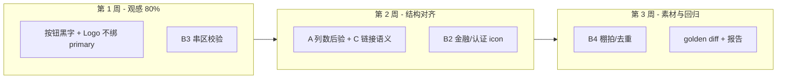

# 模板 15：豆包 Pipeline（15-mcp）vs 手工还原（manual-15）对比报告

> **日期**：2026-06-04  
> **邮件**：`step23x2-2`（Step2嵌套3x2验收）  
> **设计图**：废弃购物车 3（模板 15）  
> **对比对象**  
> - **Pipeline**：`layouts/15-mcp`（豆包 A→E，`logs/ai-pipeline-llm.jsonl`）  
> - **手工基线**：`layouts/manual-15`（`scripts/generate-manual-15-layout.mjs`，不经 LLM）

---

## 1. 执行摘要

| 维度 | 15-mcp（Pipeline） | manual-15（手工） | 谁更接近设计图 |
|------|-------------------|------------------|----------------|
| **宏观区段** | 7 区齐全 | 7 区齐全 | 平 |
| **文案完整度** | 高（OCR 准） | 高（人工抄写） | 平 |
| **区块归属** | s2/s3 串区；s6/s7 页脚错位 | 区段边界正确 | **手工** |
| **色彩语义** | 大量黄字（primary 误绑） | 黑字 + 灰辅 + 黄仅 CTA | **手工** |
| **按钮形态** | 3 个黄底白字按钮 | 2 个黄底黑字 + 页头文字链 | **手工** |
| **栅格列数** | 社交 4 / 信任 **3** | 社交 4 / 信任 **4** | **手工** |
| **图标覆盖** | 社媒 4 + 门店/盾；**无金融 icon** | 社媒 4 + 金融 2 + 门店/盾 | **手工** |
| **配图质量** | 商品户外图；社交 1 张重复 | 商品棚拍；社交 4 张不重复 | **手工** |
| **综合美观度（主观）** | ~55–65% | ~80–85% | **手工** |

**一句话**：Pipeline 在「结构骨架 + 文案」上已接近可用，但 **颜色绑定、区段归属、按钮语义、列数与图标** 四类问题叠加，导致画布观感与设计图差距明显；手工版主要赢在 **按设计语义写死规则**，而非模型更强。

---

## 2. 前端对比（Chrome DevTools MCP）

### 2.1 验收方式

- 本地 `http://127.0.0.1:5180`，桌面预览 600px  
- 分别打开 `layout=manual-15` 与 `layout=15-mcp`，全页截图  
- 对照设计图副本：`docs/ai-email-generation-api/template-15-design-reference.png`

### 2.2 截图存档

| 版式 | 截图路径 |
|------|----------|
| manual-15 | `docs/prd-assets/compare-manual-15-baseline.png` |
| 15-mcp | `docs/prd-assets/compare-15-mcp-pipeline.png` |

### 2.3 肉眼可见差异（高置信）

| 区域 | manual-15 | 15-mcp | 设计图意图 |
|------|-----------|--------|------------|
| **Logo AVENTON** | 黑色粗斜体 | **黄色**（与 CTA 同色） | 黑色 wordmark |
| **页头右侧** | 灰字 + **下划线文字链** | 灰字 + **黄色小按钮** | 文字链，非 CTA |
| **首屏** | 标题/副标题/SHOP NOW | 多一行 **TAKE ANOTHER LOOK:** | 小标题应在商品区 |
| **CTA 按钮** | 黄底 **黑字** | 黄底 **白字** | 黄底黑字 |
| **商品区** | 有「TAKE ANOTHER LOOK:」+ 棚拍图 | 缺小标题 + 户外实景 | 白底产品图 |
| **金融区** | 黑标题 + 蓝 icon 双列 | 标题偏黄 + **无圆形 icon** | 蓝圈 icon + 黑字 |
| **信任区** | **4 列** 栅格 | **3 列** 栅格，排版挤 | 4 列认证 |
| **页脚** | 免责在页脚区 | 免责曾出现在信任区下方（结构树错位） | 独立页脚 |

### 2.4 快照文案对照（无障碍树，两版均加载成功）

两版核心英文文案一致；差异在 **块类型与区段位置**（见 §3.2）。

---

## 3. 后端 JSON / 脚本对比

### 3.1 产物路径

```
data/emails/step23x2-2/
├── layout-manifest.json          # 含 15-mcp、manual-15
├── layouts/15-mcp/
│   ├── template.json             # ~125KB，pipeline 落盘
│   └── tokenPresets.json
├── layouts/manual-15/
│   ├── template.json             # 生成脚本产出
│   └── tokenPresets.json
└── scripts/generate-manual-15-layout.mjs
```

### 3.2 区块树与文案归属（按 section）

| 区段 | manual-15 子项 | 15-mcp 子项 | 差异说明 |
|------|----------------|-------------|----------|
| **顶部导航** | AVENTON / 灰字 / **文字链** | AVENTON / 灰字 / **[BTN] Book…** | Pipeline 多 1 个 button |
| **首屏提示** | 3 项 | **4 项**（含 TAKE ANOTHER LOOK:） | B3 串区 → C 生成到 s2 |
| **商品推荐** | 小标题 + 图 + 名 + CTA | 图 + 名 + CTA（**缺小标题**） | 同上 |
| **金融服务** | 10 文本 + **2 icon**（grid 内） | 10 文本，grid 内 **无 icon** | B2/C 未落金融 icon |
| **社交** | 4×（图+icon+平台名） | 同结构 | 结构一致；图源不同 |
| **服务保障** | **grid=4** + 底部认证句 | **grid=3** + 认证句 + **免责误入** | Stage A 列数 3；C 结构合并 |
| **页脚** | 免责 + 退订 + 地址 | 退订 + 地址（免责在 s6） | 区段边界错误 |

### 3.3 量化结构差异

| 指标 | manual-15 | 15-mcp |
|------|-----------|--------|
| layout 数 | 20 | 20 |
| text 数 | 31 | 30 |
| button 数 | **2** | **3** |
| icon 数 | **8** | **6** |
| image（底图）数 | 5 | 5 |
| grid 列配置 | `[2, 4, **4**]` | `[2, 4, **3**]` |
| `$themeRef` 次数 | 94 | 87 |

### 3.4 样式与 token（关键字段）

**tokenPresets**：两版 `colors.primary` 均为 `#E3D026`（B1 识别正确）。

差异在 **谁消费 primary**：

| 元素 | manual-15 | 15-mcp |
|------|-----------|--------|
| Logo `props.color` | 字面量 `#1A1A1A` | `$themeRef: colors.primary` |
| 正文/标题 | 多数 `#1A1A1A` / `colors.secondary` | 大量 `colors.primary`（黄字） |
| CTA `textColor` | 字面量 `#1A1A1A` | `$themeRef: colors.surface`（白字） |

**代码落点（Pipeline 根因）**：

```288:291:src/lib/ai-pipeline/bindThemeRefsAfterAiLowering.ts
  if (block.type === "button") {
    bind("props.buttonStyle.backgroundColor", themeRefPathForStorage("colors", "primary"));
    bind("props.buttonStyle.textColor", themeRefPathForStorage("colors", "surface"));
```

```280:284:src/lib/ai-pipeline/mapPipelineResultToEasyEmail.ts
          backgroundColor:
            styledButtonStyle.backgroundColor ?? draft.styleTokens.colors.primary,
          textColor: styledButtonStyle.textColor ?? draft.styleTokens.colors.surface,
```

黄底 CTA 在设计稿上是 **黑字**；Pipeline 默认 **surface 白字**，且 Stage C / 后置绑定会把 Logo 等黑字绑成 primary。

### 3.5 远程素材 URL

| 槽位 | manual-15（Pexels id） | 15-mcp（Pexels id） |
|------|------------------------|---------------------|
| 商品 | **15009948**（棚拍） | 32366003（户外） |
| 社交 1 | 15020556 | 15020556 |
| 社交 2 | 32564943 | 9156414 |
| 社交 3 | 13738398 | 12886722 |
| 社交 4 | 30173534 | **15020556（与 1 重复）** |

图标：manual 使用 `simple-icons`（twitter→**x.svg**）+ `tabler`（金融/门店/盾）；mcp 社媒用 twitter.svg，金融区无 tabler icon。

---

## 4. 差距归因：Pipeline 阶段 vs 手工决策

| # | 现象 | 主要归因阶段 | 手工如何避免 |
|---|------|--------------|--------------|
| 1 | 全站黄字 | E `bindThemeRefs` + C 色值 | 黑/灰字面量；primary 只给按钮底 |
| 2 | CTA 白字 | E 按钮规则 + `mapPipelineResult` 默认 | `textColor: #1A1A1A` |
| 3 | 页头变按钮 | C 把链接建成 `action.button` | `content.text` + underline |
| 4 | TAKE ANOTHER LOOK 在 s2 | **B3 串区** | 按设计分区抄写 |
| 5 | 信任区 3 列 | **A `gridColumns: 3`** | 按图数 4 列 |
| 6 | 金融无 icon | **B2 未识别** + C 无 icon 子节点 | tabler dollar-off / clock |
| 7 | 商品图不对 | B4 query + 无 studio 约束 | 明确 studio / white background query |
| 8 | 社交图重复 | B4 未去重 | 4 query 各异 + 去重 |
| 9 | 页脚错位 | C/D 区段合并/溢出 | 严格 7 区互斥 |

---

## 5. Pipeline 优化建议（按 ROI 排序）

目标：在不改「A→E 分阶段」架构的前提下，把观感拉近 **manual-15** 水平。

### P0 — 色彩与 CTA（1–2 天，收益最大）

1. **按钮文字色规则**  
   - 当 `colors.primary` 为高明度色（如 `#E3D026`）时，`buttonStyle.textColor` 默认 `#1A1A1A`，**不要**绑 `colors.surface`。  
   - 修改：`mapPipelineResultToEasyEmail.ts`、`bindThemeRefsAfterAiLowering.ts`（按钮分支）。  
   - B1 提示补充：`primary` = 按钮背景；正文黑 `#1A1A1A` 勿写入 primary。

2. **禁止 Logo/标题绑 primary**  
   - `bindThemeRefsAfterAiLowering`：`resolveUniqueColorTokenPath` 对 `role=brand|heading` 且字面量接近 `#000/#1A1A` 时绑 `secondary` 或保持字面量，**禁止**绑 `colors.primary`。  
   - Stage C 提示：wordmark / 大标题用 `#1A1A1A` 或 `colors.secondary`，**禁止**用 `colors.primary` 写非按钮文字。

3. **新增 token（可选）**  
   - `colors.onPrimary: #1A1A1A` 专用于 CTA 文字，避免与 `surface`（白）混用。

### P0 — 区段边界（B3 后处理）

4. **B3 分区校验器**（`src/lib/ai-pipeline/`，纯函数）  
   - 输入：Stage A `components` 摘要 + B3 `texts[]`  
   - 规则：若 s2 出现「TAKE ANOTHER LOOK」类商品区关键词且 s3 有图槽 → 将条目 **移动到 s3**  
   - 重复：连续相同 `FINANCING AVAILABLE` 可保留（设计稿确有），但记录 warning  
   - 失败不阻断，写 `pipeline warnings` 供日志

5. **Stage C 区段互斥强化**  
   - `stageCSectionPrompt.ts`：再次强调「本区 texts 条数上限」；商品区必须含小标题 block  
   - C 输出后校验：s3 必须含 `content.image` 前至少有 heading text

### P1 — 栅格与图标（2–4 天）

6. **Stage A 列数后验**  
   - 对「服务保障 / 社交」类：若 B2 icon≥4 或 B3 有 4 组并列短语 → 覆盖 `gridColumns` 为 4  
   - 实现：`compactIr` 编译前 `normalizeSectionGridColumns(draft)`

7. **B2 扩展**  
   - 提示词增加：**金融特性**（美元禁止/时钟）、**认证 logo**（UL/TÜV 用 text 或 image 槽，勿漏）  
   - Affirm：无 simple-icons slug 时输出 `imageSlot` 或保留 B3 文本 + Stage C `content.text` 样式字

8. **Stage C 链接 vs 按钮**  
   - 页头「Book a test ride」→ 强制 `content.text` + `decoration: underline`，禁止 `action.button`  
   - 在 `compactIr` sanitize 层：单行长链文案不得转 button

### P1 — 配图（B4）

9. **Pexels query 模板**  
   - `role=product` → 追加 `studio white background product`  
   - `role=card` 社交 → 4 条 query 不得重复；落盘后 **photoId 去重**  
   - 修改：`layoutVariantAiFromImage` / B4 合并逻辑

### P2 — 结构与页脚（1–2 天）

10. **区段 id 与页脚隔离**  
    - Stage C s7 只允许 disclaimer/unsubscribe/address；若 C 在 s6 生成 `*The federal` 长免责 → 自动迁移到 s7  
    - 编译后 `validateSectionBoundaries(template)` 接入 `runImageToLayoutVariantPipeline`（warn 或 retry C）

11. **回归夹具**  
    - 以 `manual-15` 为 golden 参考（非逐字节），对 **区段 texts 列表、grid 列数、button 数、primary 绑字计数** 做 snapshot test  
    - 模板 15 设计图 + `public/test-assets/abandoned-cart-template-15.png` 固定进 CI

### P2 — 观测与对比

12. **Pipeline 报告字段**  
    - 每次 run 输出：`sectionTextCounts`、`gridColumns`、`buttonCount`、`primaryTextBindings`  
    - 与 `manual-15` diff 写入 `logs/ai-pipeline-report.json`（方便你和本次手工版对比）

---

## 6. 建议实施路线图



---

## 7. 你如何复现本次对比

```bash
# JSON 结构对比（仓库内）
node -e "/* 见本报告 §3 脚本，或自行 diff */"

# 浏览器
open 'http://127.0.0.1:5180/editor?emailKey=step23x2-2&layout=manual-15'
open 'http://127.0.0.1:5180/editor?emailKey=step23x2-2&layout=15-mcp'

# 校验
npm run validate:all

# 重新生成手工基线（可选）
node scripts/generate-manual-15-layout.mjs
```

---

## 8. 相关文档

- Pipeline 单次验收（偏设计图）：`模板15-pipeline还原差距汇报.md`  
- 方案总览：`方案-以图AI生成邮件版式.md`  
- 手工基线生成：`scripts/generate-manual-15-layout.mjs`

---

*本报告基于 2026-06-04 MCP 双版截图 + `template.json` 程序化对比 + `bindThemeRefsAfterAiLowering` / `mapPipelineResultToEasyEmail` 源码归因。*
