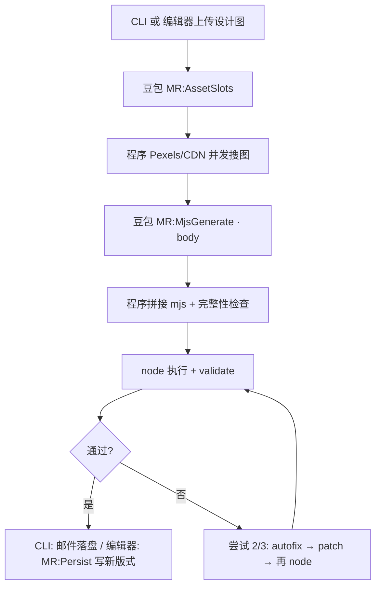

# 豆包手工 mjs 还原脚本 — 执行说明（小白版）

> 说明豆包 mjs 还原管线的完整流程、**编辑器以图创建**的前端进度、分工、重试与日志。  
> **核心编排**：`src/lib/ai-pipeline/manual-restore/runManualRestoreViaDoubao.ts`  
> **两条入口**：CLI `scripts/run-manual-restore-doubao.ts`；编辑器 `POST …/layout-variants/ai-from-image`（SSE）

---

## 一、入口：CLI 与编辑器

### 1a. 命令行（整封邮件 demo）

```bash
npm run manual-restore:doubao -- \
  --image "设计图.png" \
  --email-key "邮件目录名" \
  --display-name "显示名称"
```

| 参数 | 含义 |
|------|------|
| `--image` | 设计图路径（PNG/JPG） |
| `--email-key` | 落盘目录名，如 `data/emails/<emailKey>/` |
| `--display-name` | 编辑器里显示的邮件名称 |

- `persistMode` 默认 **`full-email`**：mjs footer 写出 `meta.json`、`layout-manifest.json`、`payload.json` 到邮件根目录，版式进 `layouts/default/`。
- 环境变量：`DOUBAO_API_KEY`、`LLM_PIPELINE_MODEL`（项目根 `.env`）。
- 不带参数时 demo 默认模板 53 的设计图（仅本地试跑）。

### 1b. 编辑器「以图创建版式」（产品路径）

用户在 **5180 编辑器** → 新建版式 → 上传设计图 →「开始生成」：

| 层 | 路径 | 作用 |
|----|------|------|
| 前端 | `App.tsx` → `api.createLayoutVariantFromDesignImage` | 读 SSE `progress` / `done` / `error` |
| HTTP | `server/index.ts` `POST /api/v1/emails/:emailKey/layout-variants/ai-from-image` | multipart 上传设计图，流式推送进度 |
| 编排 | `server/layoutVariantAiFromImage.ts` | `persistMode: layout-only`，staging 后读 template/tokenPresets |
| 落盘 | `persistNewLayoutVariantOnDisk` | 写入 `layouts/<newId>/`，更新 manifest |

- 设计图限制：JPG/PNG/WebP，≤ 10MB（`layout-variant-ai-contract/constants.ts`）。
- 生成结果：**新版式**（未发布），不切全局 payload；staging 目录 `.ai-staging/<runId>/` 跑完后删除。
- mjs 脚本仍保存到 `scripts/generate-doubao-<email>-<layoutId>-layout.mjs` 便于排查。

可以把它理解成：

> **给豆包一张邮件设计图，让它写出「生成 template + tokenPresets 的脚本」，程序执行并 validate；编辑器里按步骤展示进度，成功后写入新版式目录。**

---

## 二、最终要产出什么？

### CLI（full-email）

| 产出 | 位置 |
|------|------|
| 生成脚本 | `scripts/generate-doubao-xxx-layout.mjs` |
| 邮件数据 | `data/emails/<emailKey>/`（meta、manifest、payload + `layouts/default/template.json` 等） |
| 运行日志 | `logs/manual-restore-mjs-xxxx/` |

### 编辑器（layout-only）

| 产出 | 位置 |
|------|------|
| 新版式 | `data/emails/<emailKey>/layouts/<newId>/template.json` + `tokenPresets.json` |
| mjs / 日志 | 同 CLI（脚本在 `scripts/`，日志在 `logs/`） |
| staging | 临时 `.ai-staging/…`（自动清理） |

预览：`http://127.0.0.1:5180/?email=<emailKey>&layout=<newId>`

---

## 三、大分工：谁干什么？

```
用户 / CLI          → 提供设计图 + 邮件/版式名
程序（工程侧）       → 搜图、拼 header/footer、执行 node、validate、autofix、进度 SSE
豆包（AI）          → 列资产槽、写 mjs body、validate 失败时打 SEARCH/REPLACE 补丁
```

### 程序负责

- Prompt 真源：`promptsApiFixedContext.ts`、`promptsMjs.ts`、`promptsMjsEdit.ts`、`mjsValidateContract.ts`（**不**在运行时读 `.cursor/skills/`）
- 看图搜图：`MR:AssetSlots` → Pexels / 图标 CDN
- 三层拼接：`mjsScaffold.ts`（header + 豆包 body + footer；layout-only 用 `buildMjsFooterLayoutOnly`）
- `tryPostProcessMjs`：提取 body、完整性检查；**可恢复错误**（如大括号未闭合）仍保留 source，进入 patch 重试
- validate 失败 → `mjsAutofix` → 豆包 patch
- 前端进度：`PipelineProgressReporter` + `reduceAiPipelineProgress`（**渐进 append**，见第十一节）

### 豆包负责

- 仅 HTTPS `system` + `user` → 返回 `content` 文本
- 不能读仓库、不能写磁盘、不能执行 node
- 阶段：`MR:AssetSlots` → `MR:MjsGenerate`（body）→ `MR:MjsPatch`（补丁）

### 已移除

- `--reference-mjs` 从手工脚本抠 PEXELS/ICON（统一走设计图 → 资产槽 → Pexels/CDN）

---

## 四、全流程（按时间顺序）



### 第 1 步：资产槽 + 搜图

- **1a** 豆包 `MR:AssetSlots`：输出 `imageSlots` + `iconSlots` JSON；解析失败最多重试 1 次
- **1b** 程序 `resolveBlueprintAssets`：`Promise.all` 并发 Pexels + CDN

### 第 2 步：豆包写 mjs body

- system + user（设计图 base64 + 槽位表 + 块 id 前缀 `P`）
- 只输出 body：`COLORS`、助手函数、`buildS1…`、`tokenPresets`、`template`（**字面量**，禁止 `$themeRef` / `bindings`）
- `MJS_MAX_TOKENS = 32768`，降低截断概率

### 第 3 步：程序后处理

1. `extractMjsBodyFromLlm` → `assembleMjsFromBody` → `mjsAutofix` → `literalizeMjsThemeRefs`
2. 完整性：无自编 URL、`assertMjsComplete`（含大括号平衡）
3. **若完整性失败但已有拼接 source**：不立即终止，标记为 node 类失败，进入 autofix + patch（与 node 语法错误同路径）
4. 保存 `scripts/generate-doubao-*.mjs`

### 第 4～5 步：node + validate

- layout-only：只 validate staging 下 `template.json` / `tokenPresets.json`（`validateScene: false`）
- full-email：另校验邮件根 `meta.json`、`layout-manifest.json`
- 最多 **3 次尝试**（`MANUAL_RESTORE_MJS_MAX_ATTEMPTS`）

---

## 五、重试时发生什么？

### 走 patch 路径（`kind: validate | node`）

validate 失败、node 执行失败、**程序处理 mjs 未完全通过但已有 source**（如截断）：

```
尝试 N+1：
  ① append 新行「豆包生成还原脚本 — autofix → patch」（MR:MjsGenerate retry）
  ② 程序 autofix（可选 silent node 试跑，进度写在 generate 行 logDetail）
  ③ 豆包 MR:MjsPatch（SEARCH/REPLACE）
  ④ generate 行 succeed → append「执行脚本并校验」行 → node + validate
```

补丁格式：

```
<<<<<<< SEARCH
（原文，必须一字不差）
=======
（改后）
>>>>>>> REPLACE
```

- 补丁 **0 处命中** → `kind: generate`，下一轮 **整段重写** `MR:MjsGenerate`
- body **完全提取失败**（无 source）→ 整段重写，不 patch

### 不再批量 fail 未执行步骤

- 已删除 `failPipelineSteps` 同时把「生成 + 校验」标红的行为
- 生成阶段失败只 fail **MR:MjsGenerate**；校验/node 失败只 fail **MR:RunValidate**
- **MR:Persist** 仅在实际 `start()` 之后失败才标红（生成阶段报错不会出现「落盘 ×」）

### 重试次数

- 一共最多 **3 次**（首次 + 2 次重试）
- validate/node 类失败 **优先** autofix + patch，非每次整段重写

---

## 六、控制台日志怎么读？

典型顺序（与前端进度时序一致：先校验失败行，再 patch 行）：

```
[manual-restore:mjs] 资产注入完成（74.0s）
[manual-restore:mjs]   豆包 MR:MjsGenerate API（尝试 1 · 首次）…
[manual-restore:mjs]   豆包 API 返回（尝试 1）（155.0s）
[manual-restore:mjs]   程序处理并写入 mjs（尝试 1）
[manual-restore:mjs]   node 执行完成（尝试 1）（1.6s）
[manual-restore:mjs]   validate 未通过（尝试 1）
[manual-restore:mjs]   豆包 MR:MjsPatch API（尝试 2）…
[manual-restore:mjs]   应用补丁 3 处（尝试 2）
[manual-restore:mjs]   validate 通过（patch 后，尝试 2）
```

**耗时**：几乎都在豆包 API（首次 MjsGenerate >> AssetSlots >> Patch）。

---

## 七、日志目录里有什么？

| 文件 | 含义 |
|------|------|
| `00-injected-assets.txt` | PEXELS/ICON + slotGuide |
| `01-llm-raw-attempt-N.txt` | 豆包 MjsGenerate 原文 |
| `01-postprocess-warn-attempt-N.txt` | 完整性告警（截断等） |
| `02-mjs-run-attempt-N.log` | node stdout/stderr |
| `02-mjs-run-attempt-N-autofix.log` | autofix 后试跑 |
| `03-autofix-attempt-N.mjs` | autofix 后的脚本 |
| `04-patch-raw-attempt-N.txt` | Patch API 原文 |
| `05-patched-attempt-N.mjs` | 打完补丁的脚本 |
| `03-validation.json` | 成功时 `{ ok: true }` |

---

## 八、和「手工还原」的关系

| | 手工 `generate-manual-*.mjs` | 豆包 `generate-doubao-*.mjs` |
|--|------------------------------|------------------------------|
| 谁写结构 | 人 | 豆包 |
| 图链 | 人写在脚本里 | MR:AssetSlots + Pexels/CDN |
| template 写法 | 可含 themeRef | 豆包 body **字面量** + 程序 `literalizeMjsThemeRefs` |
| 用途 | 像素对照、母版 | CLI demo + **编辑器以图创建** |

路径：**设计图 → 列槽 + 搜图 → 豆包 body → 拼接执行 validate → 邮件/版式 JSON**

---

## 九、相关源码索引

| 模块 | 路径 |
|------|------|
| CLI 入口 | `scripts/run-manual-restore-doubao.ts` |
| 主编排 | `src/lib/ai-pipeline/manual-restore/runManualRestoreViaDoubao.ts` |
| 编辑器编排 | `server/layoutVariantAiFromImage.ts` |
| SSE 路由 | `server/index.ts`（`ai-from-image`） |
| 前端 API | `src/api/client.ts` `createLayoutVariantFromDesignImage` |
| 进度契约 | `src/layout-variant-ai-contract/progress.ts` |
| 进度上报 | `src/lib/ai-pipeline/ports/PipelineProgressReporter.ts` |
| 进度 UI | `src/components/ui/LayoutVariantAiStepList.tsx` |
| 创建弹窗 | `src/components/ui/LayoutVariantCreateModal.tsx` |
| 资产槽 | `resolveMjsAssetsFromDesign.ts` + `resolveBlueprintAssets.ts` |
| 拼接 | `mjsScaffold.ts` |
| Prompt | `promptsMjs.ts`、`promptsApiFixedContext.ts`、`promptsAssetSlots.ts`、`promptsMjsEdit.ts`、`mjsValidateContract.ts` |
| autofix / patch | `mjsAutofix.ts`、`mjsPatchApply.ts`、`mjsLocateSnippets.ts` |
| 执行校验 | `mjsRunValidate.ts` |

---

## 十、一句话总结

**一张设计图** → 程序**列槽搜图、拼 shell** → 豆包**只写 body** → 程序**执行 + validate** → 不合格则 **autofix + patch**（最多 3 次）→ 编辑器 **SSE 渐进展示步骤** 并 **落盘新版式**。

---

## 十一、编辑器前端进度（与实现对齐）

### 步骤 ID（逻辑名）

定义于 `MANUAL_RESTORE_MJS_UI_STEPS_INITIAL`：

| stepId | 界面文案 |
|--------|----------|
| `MR:AssetSlots` | 识别图片与图标槽位 |
| `MR:ResolveAssets` | 搜索远程素材（Pexels/CDN） |
| `MR:MjsGenerate` | 豆包生成还原脚本 |
| `MR:RunValidate` | 执行脚本并校验 |
| `MR:Persist` | 落盘新版式 |

### 展示规则（2026-03 实现对齐）

1. **不预展示 5 步**：`emitPlan(..., { display: 'hidden' })`，初始列表为空；**执行到哪一步才 append 哪一行**。
2. **重试 append 新行**：失败行保持 `failed`，下一次尝试在列表**末尾**追加（`append: true`），**不按 stepId 插入中间**，保证时序：  
   `MjsGenerate 成功 → RunValidate 失败 → MjsGenerate patch 行 → RunValidate 再跑`。
3. **单行文案**：detail 拼进 `label`（如 `— validate 未通过（尝试 1/3）`），无副行。
4. **autofix 试跑**：patch 路径里 autofix 后的 node 结果写在 **MjsGenerate 行 logDetail**，不单独占 RunValidate 行，避免 patch API 出现在校验失败之前。
5. **Persist**：仅 server 在 `generateLayoutVariantFromDesignImage` 成功后 `start`；生成失败不会误显示「落盘 ×」。

### SSE 事件

- `event: progress` → `AiPipelineProgressPayload`（`plan` | `step` | `stepDetail`）
- `event: done` → 新版式 id、manifest 等
- `event: error` → `AI_GENERATION_FAILED` / `AI_GENERATION_TIMEOUT`

前端：`setAiPipelineSteps([])` 开始，每条 progress 经 `reduceAiPipelineProgress` 合并。

---

## 附录 A：常见 validate 失败（共性）

| 错误类型 | 原因 |
|----------|------|
| `buttonStyle.padding` | 按钮内边距禁止持久化 |
| button `wrapperStyle.heightMode` 非 `hug` | 程序 autofix 会改；prompt 要求 hug |
| 背景节点缺 `border` / `borderRadius` | 有背景必须显式写出 |
| 父 hug + 子 fill | 父子 widthMode 冲突 |
| 父 fixed + 子 text hug | 定宽徽章内 text 应 fill |
| text 缺 `italic` / `decoration` | 每个 text 必填 |
| `wrapperStyle.margin` | 无 margin 字段 |
| grid 下裸 text 色卡 | 每格须 layout 复合单元（如 `colorSwatch`） |
| `imageContainer` 写死 `right` | alignH/alignV 须按设计图每次显式传入 |

---

## 附录 B：豆包 Prompt 真源（勿在本文件维护全文）

> **维护约定**：HTTP prompt **以源码为准**；改 prompt 只改 `src/lib/ai-pipeline/manual-restore/` 下文件，**不要**在本 markdown 手工粘贴逐字副本（易与 `themeRef` 旧稿漂移）。

### B.0 请求次序

| 次序 | stepId | 触发 | user 含设计图 |
|------|--------|------|----------------|
| ① | `MR:AssetSlots` | 流程开始；JSON 失败重试 1 次 | ✅ |
| ② | `MR:MjsGenerate` | 资产注入后；patch 未命中或 body 无法提取时整段重写 | ✅ |
| ③ | `MR:MjsPatch` | validate/node/完整性失败且 attempt>1 有 source | ❌ |

每次 HTTP 调用均为 **独立** `messages: [system, user]`，无 assistant 历史。

### B.1 源码文件

| 阶段 | 文件 |
|------|------|
| 资产槽 system/user | `promptsAssetSlots.ts` |
| MjsGenerate system | `promptsMjs.ts`（拼装 `buildMjsImageAsContainerSection`、`buildMjsValidateContractSection`、`buildMjsApiHelperSnippetsSection` 等） |
| 领域文案 / 助手样例 | **`promptsApiFixedContext.ts`** |
| validate 契约摘要 | **`mjsValidateContract.ts`** |
| Patch system/user | `promptsMjsEdit.ts` |
| header/footer 拼接 | `mjsScaffold.ts`（**不进**豆包 prompt） |

### B.2 body 写法要点（与当前实现一致）

- template 树：**COLORS + 字面量 px**；**禁止** `$themeRef`、`bindings`、`mainAlign`、`crossAlign`
- `tokenPresets` 仍输出 12 标准键；template 内不绑 theme
- 助手：`sectionShell`、`textBlock`、`buttonBlock`（button 外层 **heightMode: hug**）、`rowLayout`、`gridBlock`、`colorSwatch`、`imageContainer`
- **`imageContainer(id, name, src, alt, height, overlayChildren, alignH, alignV)`**：**无默认参数**；色名角标常见 `left, top`，按设计图传
- 图内叠放：`content.image` + `children` + `wrapperStyle.contentAlign`；底图 `backgroundImage.position` 只管 cover 焦点
- grid：每格一个 layout 复合块，禁止 grid 下裸 text 色卡

### B.3 动态段（随运行变化，不在固定 system 里）

- user 槽位表：`injectedAssets.slotGuide`
- 整段重写追加：`buildMjsFullRegenHint`（上一轮 body + 错误）
- Patch user：完整 mjs + `buildMjsErrorSnippets` 片段 + validate 错误列表

### B.4 本地查看某次实际 prompt

见 `logs/manual-restore-mjs-<id>/01-llm-raw-attempt-*.txt` 与 `04-patch-raw-attempt-*.txt`。
