# 邮件模板编辑器第一期 prd

## 目标

接入 loyalty 内部运营平台，支持 loyalty 发送给商家的邮件使用新的邮件编辑器的模板

## 编辑器功能结构

编辑器功能结构分为两部分：

- 部分 1：模板列表
- 部分 2：编辑器页面

## 详细功能说明

### 邮件模板列表

#### 模板与版式的概念

模板列表的构成为模板与版式构成

结构为，1 个模板下，可存在多个版式的模板，且由于这多个版式共同属于一个模板，所以他们使用的是统一的数据变量

可以简单理解为，相同场景的模板，比如说新品推荐的模板。可能都是使用同一组商品列表。但是模板的排版布局是可以不一样。所以我这里称之为 1 个模板下有多个版式的概念

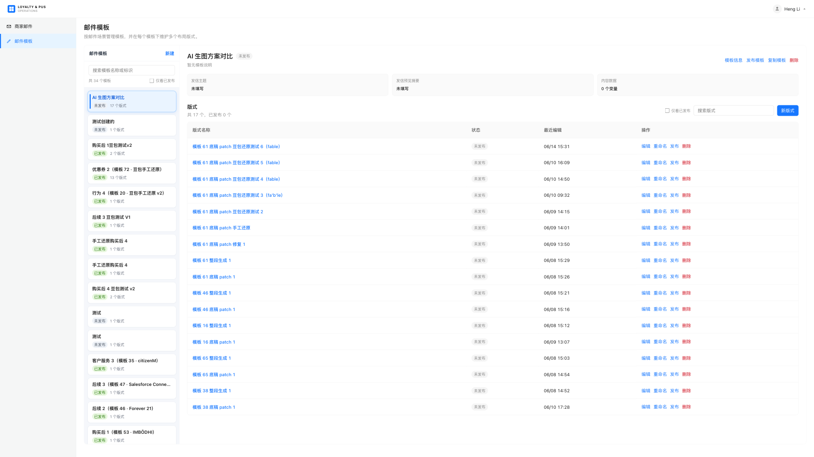

#### 左侧模板列表

左侧模板列表。支持弹窗新建，新建后则创建一个有一个默认版式的模板记录

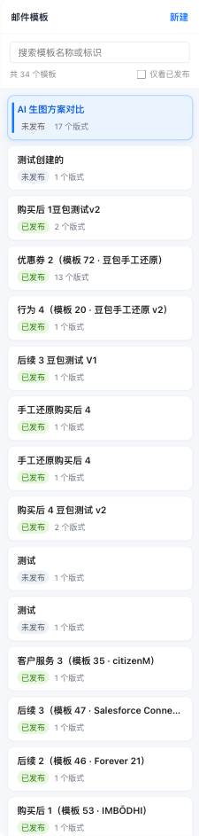

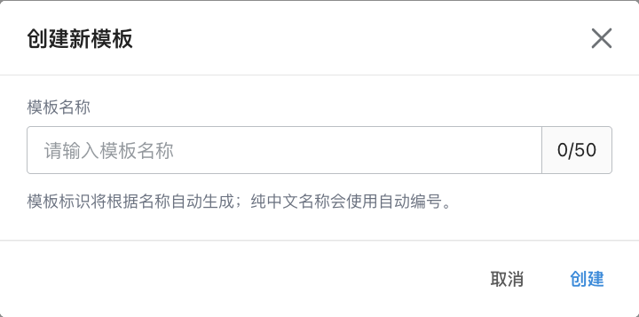

- 模板名称允许重复，名称限制 50 个字符
- 模板列表按创建时间倒叙排序
- 且模板列表支持模板名称模糊搜索，以及发布状态的快捷筛选

发布状态用于 loyalty 创建商家邮件发送活动时，允许选择，以及实际发送时允许通过的逻辑校验，未发布的模板不允许在商家邮件活动时选择和实际后端发送

#### 右侧：选中模板的版式列表

在右侧的选中的模板的版式列表处

**上部分：基础信息展示**

上部分是展示当前模板的一些基础信息，分别为：

- 模板标题
- 模板描述
- 模板的发信标题
- 模板的发信摘要
- 和变量数量


**模板层级操作**

且模板层级的操作支持：

- **模板信息编辑（弹窗）**
  - 分别编辑模板名称（50 个字符）必填
  - 模板的说明（100 个字符）非必填
  - 模板的发信标题（50 个字符）非必填
  - 模板的发信摘要（100 个字符）非必填
  - 模板的发信标题和发信摘要是对模板下的所有版式生效的。目前近对发送测试邮件生效。不影响实际的商家邮件活动时的邮件发信标题和摘要的逻辑

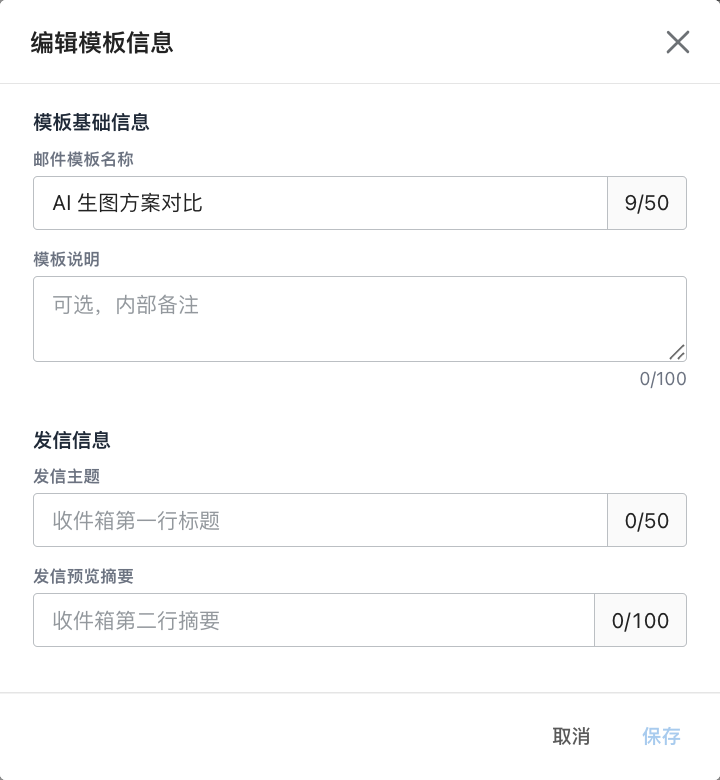

- **发布和撤回发布**（做一个状态变更）
- **复制模板**
  - 将模板的所有信息，都复制一遍，文件级的复制，包括模板下的所有版式都复制

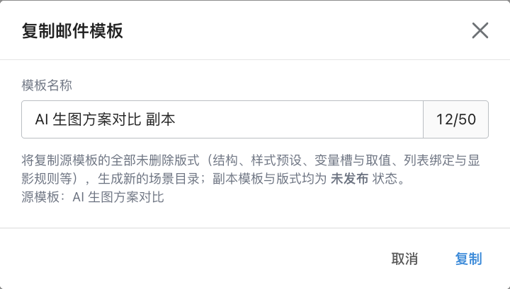

- **删除模板**（逻辑删除，弹窗二次确认）


**版式列表**

版式列表，同样支持版式名称模糊搜索，以及仅查看已发布的

已发布的状态与模板一致，仅已发布的模板支持在创建 loyalty 的商家邮件活动时被选择，以及实际后端发送时允许通过发送

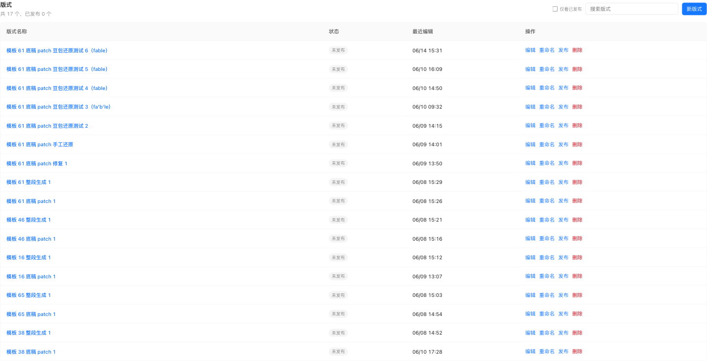

新增版式支持两种方案：

- 一种是空白方案，则创建一个空白的版式模板
- 一种是 AI 以图创建版式，详见下文「AI 以图创建版式」

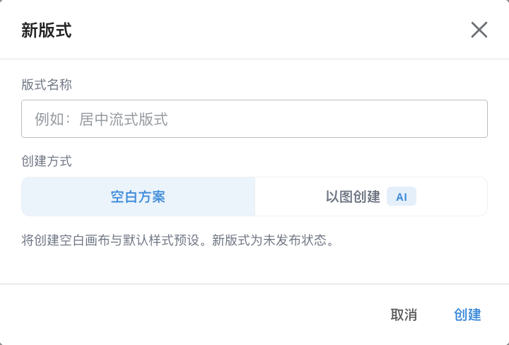

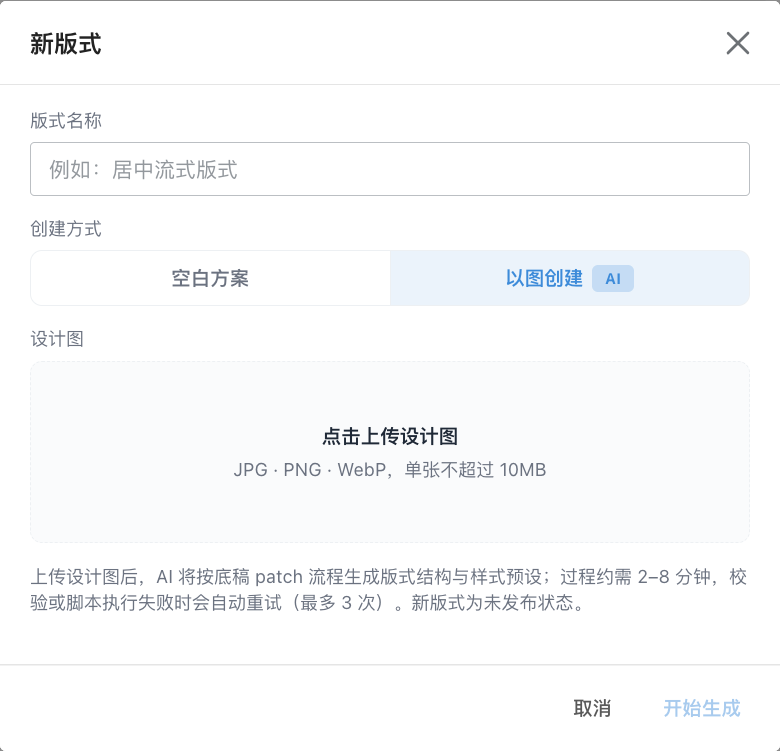

- 版式的名称必填，（50 个字符）
- 版式列表的排序同样也是创建时间倒叙

版式支持操作为：

- 编辑 or 点击版式名称，进入编辑器页，选中该版式
- 重命名则弹窗修改版式名称

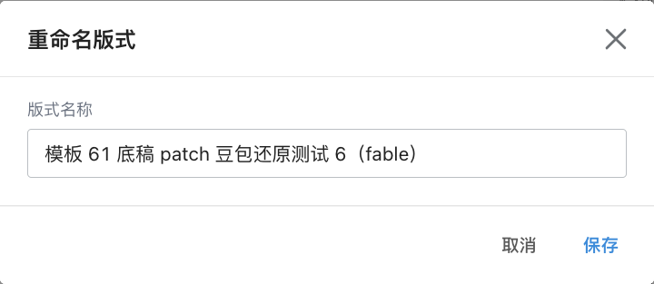

- 复制版式
  - 复制版式，相当于复制整个版式的内容。包括数据变量，和主题的绑定关系

- 发布 和撤回发布，变更发布状态
- 删除（逻辑删除，弹窗二次确认）

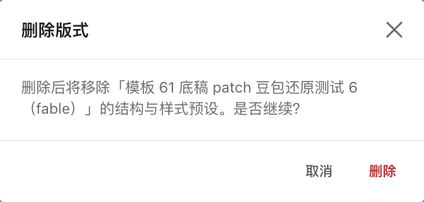

### 邮件编辑器

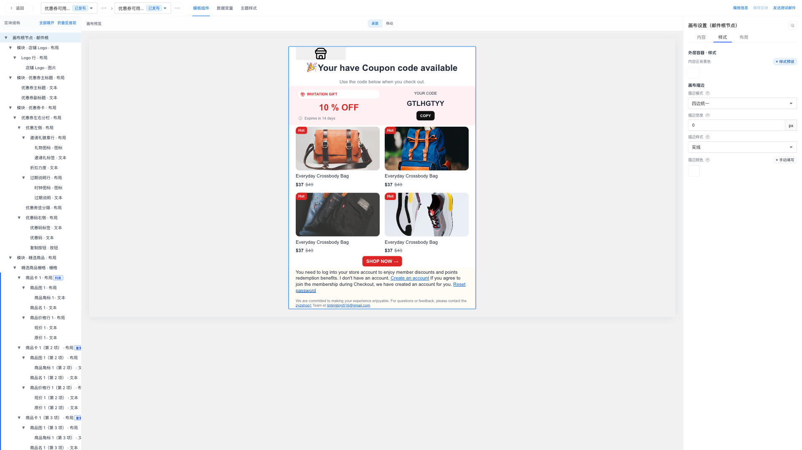

#### 顶栏

顶栏有以下的操作：

- 返回上一页
- 模板选择器 & 操作
- 版式选择器 & 操作

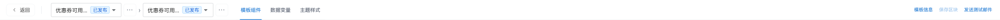

操作都与外面模板列表页的一致，此处不赘述了

#### 工作视图 Tab

当前模板的 3 个 tab 的切换：

- 模板组件（模板组件数 block 的页面）
- 数据变量（变量配置页）
- 主题样式（公共颜色配置页）

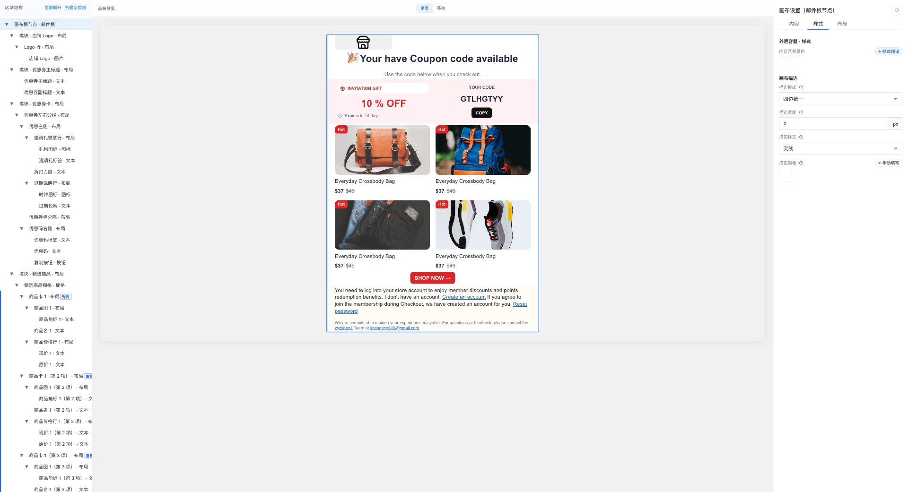


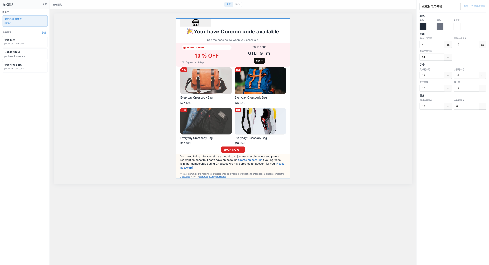

#### 顶栏其他操作

- 模板信息配置按钮（与外面模板列表页的一致，此处不赘述了）
- 保存区块，和发送测试邮件

**保存区块**

保存区块对模板组件的 tab 生效

含义是用来保存对区块的一些编辑

包括内容变更， 区块数量变化

且当做变更后，支持放弃未保存区块的按钮，用于前端恢复上一次未提交保存的状态。以为一旦保存区块，那么则会入库写入。否则都支持前端的临时呈现，刷新后会丢失

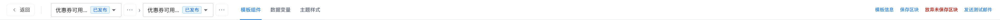

**发送测试邮件**

发送测试邮件自由输入收信邮箱，以及取模信息处配置的发信的内容，来进行发信


#### 邮件模板组件 tab

##### 左侧 block 树

左侧 block 树，支持 2 个操作：

- 全部展开与折叠至首层

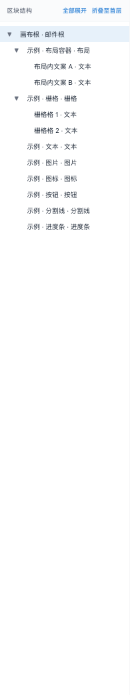

折叠至首层指的是，收起至第一层容器组件

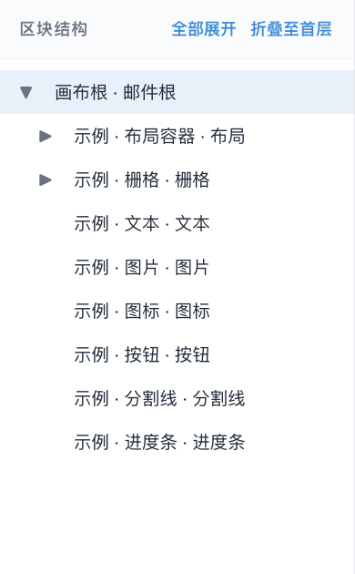

##### 画布交互

画布中，选中某一个 block 组件

在左侧的 block 树中，需要同步选中，且若在收起态时，需要展开并且定位到被选中的那个 block 那里

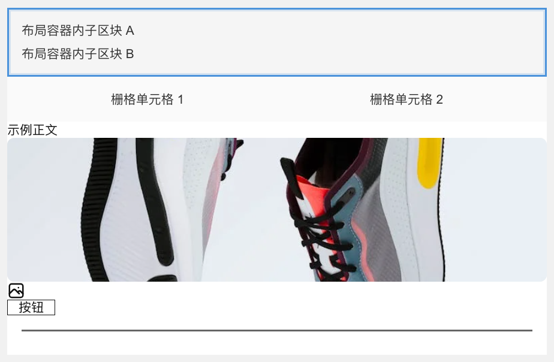

画布的交互形式是采取选中并且通过操作按钮来做相关的操作

不支持做拖拽的相关操作

在画布中，非容器类的 block 支持的操作有：

- 上移下移、复制、下方插入、存为模块、删除

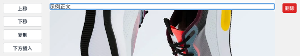

如果是容器了的 block 就支持多一个操作就是插入子级，意思是在这个容器内插入

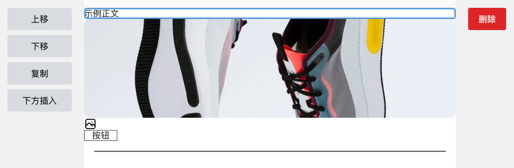

- 上移下移指的是在同一层级里做上下移动，若上下方区域不足时，不允许操作
- 复制则为整个 block 一起复制，包括子级的内容
- 下方插入则弹出弹窗，允许选择邮件编辑器最小的 8 种不同类型的 block、以及插入用户存储的 block 集合，也就是模块，模块的部分后面再介绍

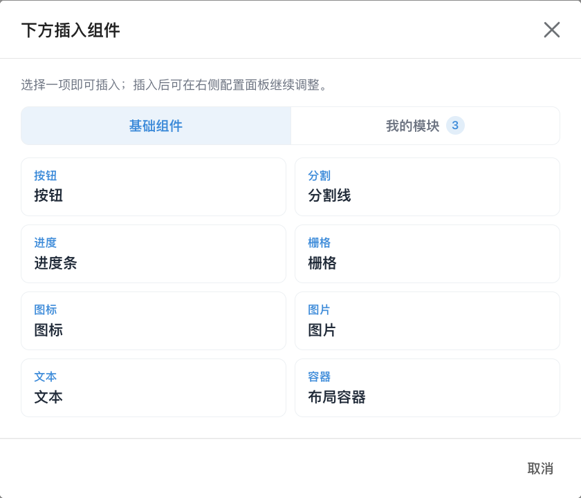

基础的 8 种 block 分别为：

- 按钮、分割线、进度条、栅格、图标、图片、文本、容器

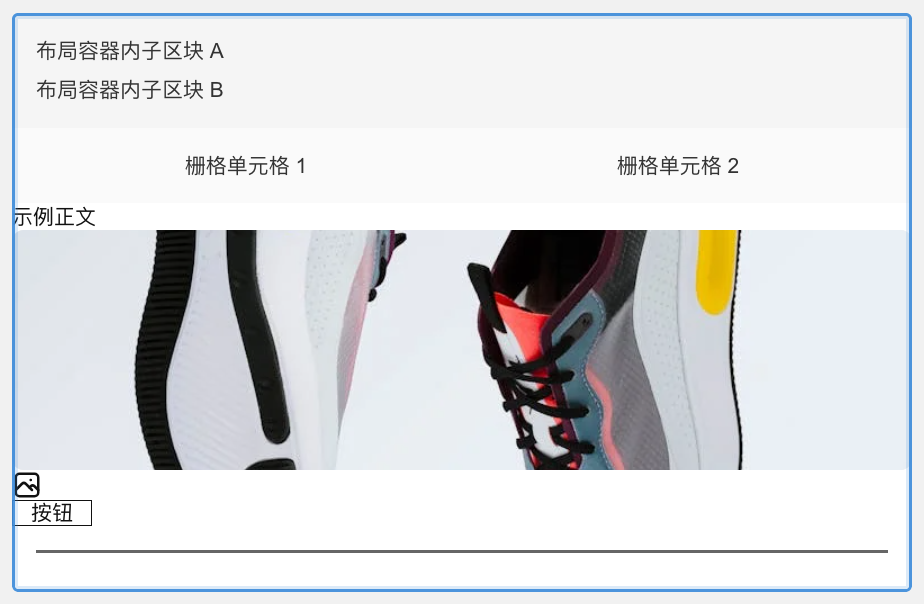

##### 右侧配置面板 · 公共配置

每一个组件在右侧的组件配置面板中都有以下的几个配置：

- 内容、样式、布局、数据组、显隐

其中样式和布局，存在着 8 种组件都有的公共的配置

也就是：

- 外层容器 · 样式
- 与
- 外层容器 · 布局

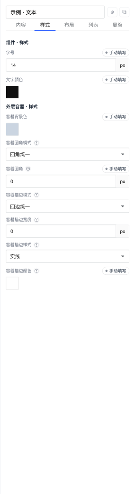

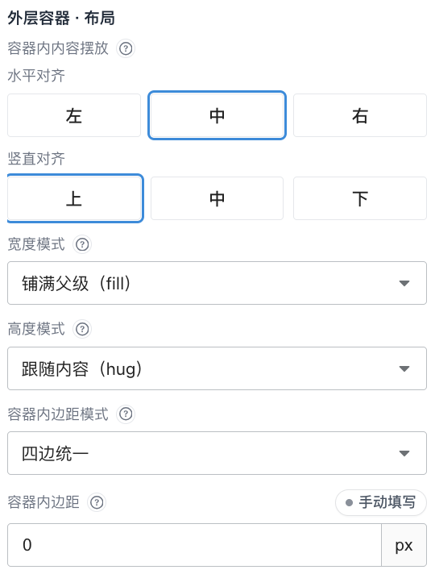

这是因为这 8 种组件的基本构成，都是由组件自己本身，加上一个外层容器构成的

而这个外层容器支持以下的配置

**样式配置有**

- 容器背景色
- 圆角模式（四个统一还是分别配置）
- 圆角 px
- 描边模式（四边统一还是分别配置）
- 描边宽度
- 描边样式（实线虚线点线）
- 描边颜色

**布局配置有**

- 水平对齐（左中右）
- 垂直对齐（上中下）

用于控制外层容器控制中间的内容，在它的容器内的摆放外置的

一般情况下可能看不出区别。但是一旦通过自定义这个外层容器的宽高。使得里边的内容与容器不是贴边的。那么就可以看出效果了

- 宽度模式（跟随内容、铺满父级、自定义）
- 高度模式（跟随内容、铺满父级、自定义）

这里要注意，如果这个 block 的父级容器，比如 布局组件，或者栅格组件

的生效逻辑是铺满父级或跟随内容时

这个作为子级的 block 会存在一些宽高的配置限制

- 当父级的宽为跟随内容时，子级的宽不能选铺满父级。因为会造成死循环

同理

- 当父级的高为跟随内容时，子级的高不能选铺满父级，也是因为会造成死循环

- 容器内边距模式（四边统一，分别配置）
- 容器内边距数值

容器内边距其实就是 padding

讲完了block 都有的公共配置，那么就来到了每个 block 都有的特有的配置了

##### 各 block 特有配置

**按钮：**

内容支持配置

- 按钮文字
- 链接地址

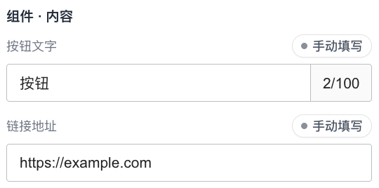

样式支持配置

- 按钮宽度（跟随文字、铺满父级（按钮的外层容器）、自定义）
- 按钮背景色
- 按钮文字颜色
- 按钮文字字号
- 按钮文字样式（加粗和斜体）
- 按钮圆角模式（四边统一，还是分别配置）
- 按钮圆角数值
- 按钮描边模式（四边统一，还是分别配置）
- 描边宽度
- 按钮描边样式（实线、虚线、点线）
- 按钮描边颜色

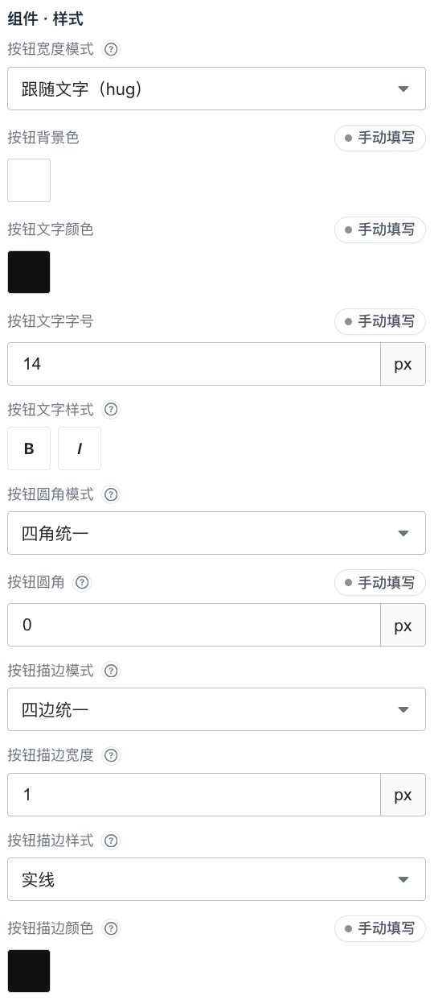

**分割线组件**

- 内容：无配置
- 样式：
  - 分割线颜色
  - 线条宽度模式
  - 铺满容器、自定义
  - 线条粗细

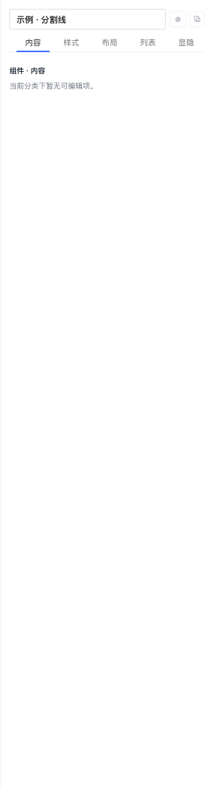

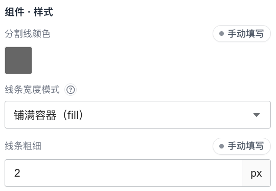

**进度条组件**

- 内容
  - 当前进度值
  - 满槽进度值

这两个配置是用来画布做计算，当前的进度条应该展示多少的进度用的

- 样式
  - 进度槽底色
  - 进度填充色（进度值的颜色）
  - 条带宽度模式（铺满容器、自定义）
  - 条带高度
  - 条带圆角模式（四边统一，分别配置）
  - 条带圆角

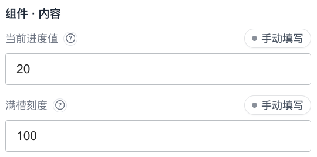

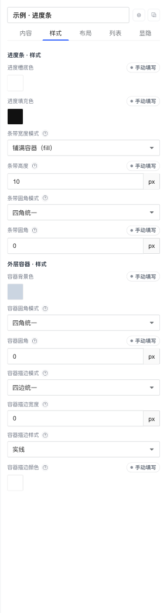

**栅格组件**

- 内容：
  - 支持启用背景图
  - 那么栅格的组件的外层容器会有覆盖一层背景图
  - 背景图地址
  - 背景链接地址（用于点击跳转的链接）
  - 背景图填充策略（裁切铺满、完整显示）
  - 背景画面位置（仅裁切铺满时支持配置）
  - 九宫格方向，控制背景图的裁切展示方向
  - 因为图片以短边裁切铺满视窗后，虽然默认是正中心展示。但是通过这个配置，可以让用户选择裁切展示的方向是九宫格的哪个方向
- 布局
  - 每行列数
  - 控制栅格一行有多少个格子
  - 间距
  - 控制栅格格子之间的上下和左右的gap
  - 单元格宽度模式（自动均分、固定宽度）
  - 自动均分指的是根据父级预留的宽度，实现均分宽度
  - 单元格高度模式（按行内容最大高度、固定高度）
  - 按行内容最大高度，指的是取单元格中，最大的那个单元格的高度。赋值给其他单元格
  - 栅格的每个单元格实际上宽高都必须是统一的
  - 所以此处配置的宽高都是给每个格子生效的
  - 且栅格的每个单元格实际上是一个垂直方向布局的单元格

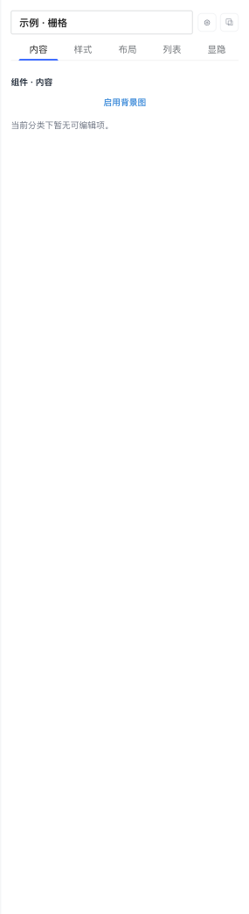

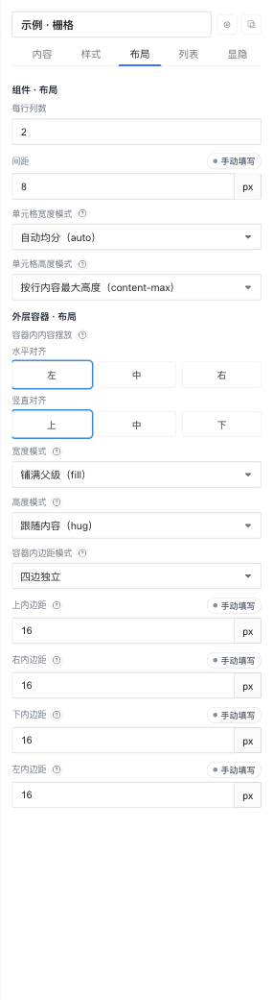

在栅格上插入子级时，是每次插入的时候都会自动插入到没有内容的子级中。

比如说栅格是 一行 2 个的，现状是只有第一行第一个有内容。那么在插入子级时，会自动插入到第一行第二个

那么此时如果再插入，就会自动插入第二行第一个

**图标组件**

- 内容：
  - 图标来源：链接、内置图标
  - 如果是链接，那么就支持手动填写链接，与本地上传svg
  - 链接地址（点击图标的跳转地址）
- 样式：
  - 图标颜色
  - 尺寸（同时生效于图标的宽高）
  - 如果遇到宽高不同的图标怎么办？
  - 那么其实以图标的长边为准。图标自适应缩放

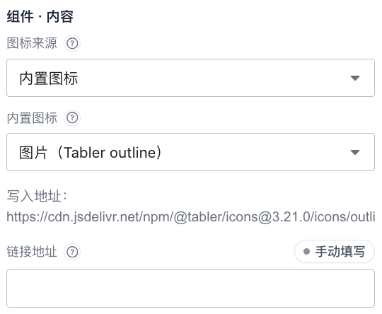

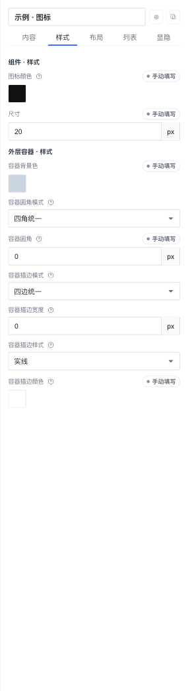

**图片组件**

- 内容：
  - 图片地址
  - 链接地址
  - 填充策略
  - 画面位置
  - 这两个配置的逻辑，与背景图一致，此处不赘述
- 布局：
  - 排列方向
  - 纵向布局、横向布局
  - 控制图片上叠加子级时的排列方向
  - 间距模式（固定像素、自由均分）
  - 自由均分（根据子级组件的宽度，自由平摊间距，最小为 0）

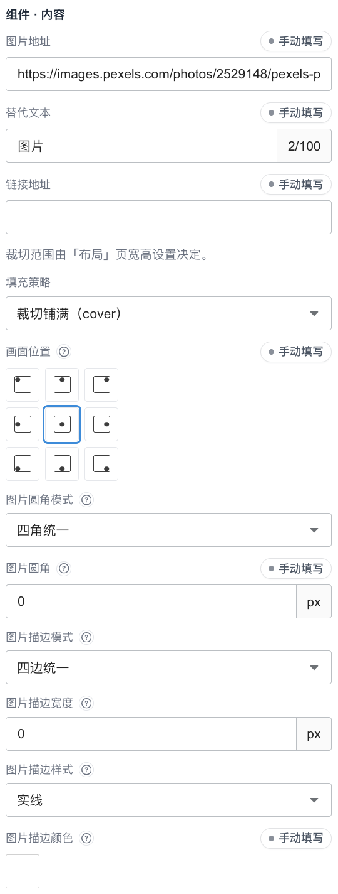

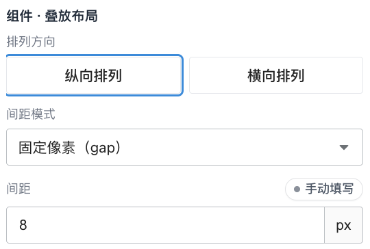

图片组件的实现方案，与布局组件一致。所以支持直接插入子级，也属于容器类组件

**文本组件**

- 内容：
  - 富文本输入框
  - 支持字符级别的一下样式配置
  - 字号、加粗、斜体、下划线、删除线、顶部线、链接、颜色、绑定字符级别的文中变量（支持选择非列表变量）
  - 支持换行
- 样式：
  - 字号（生效于所有没有赋值字符级字号的文本）
  - 文字颜色（如果文本没有赋值字符级的颜色，那么就以这个生效）

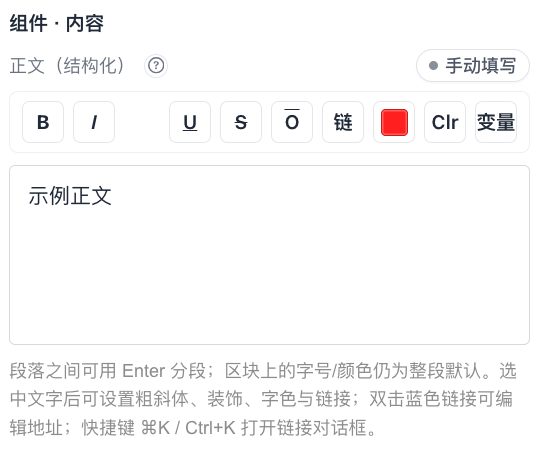

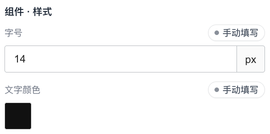

**布局组件**

- 内容：启用背景图
  - 逻辑与图片那些一致，此处不赘述了
- 布局：
  - 与图片那些一致，此处不赘述了

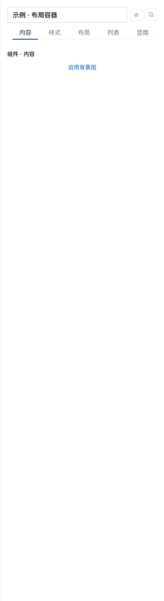

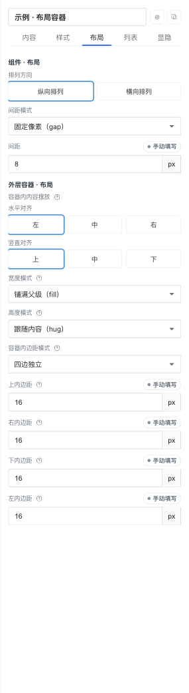

##### 画布层（邮件根）

在左侧的 block 树可以选中画布层

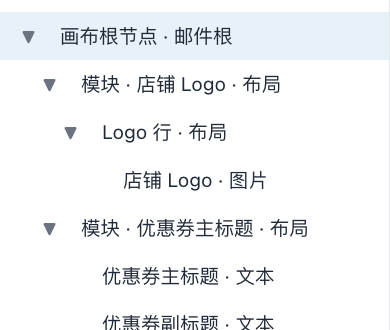

**内容**

画布层的内容配置，为启用背景图

与容器的组件一致，此处不赘述

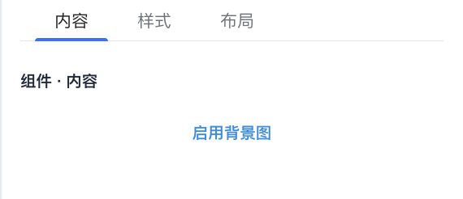

**样式层**

支持配置内容区背景色

- 描边模式（统一，分别配置）
- 描边样式（实线、虚线、点线）
- 描边宽度

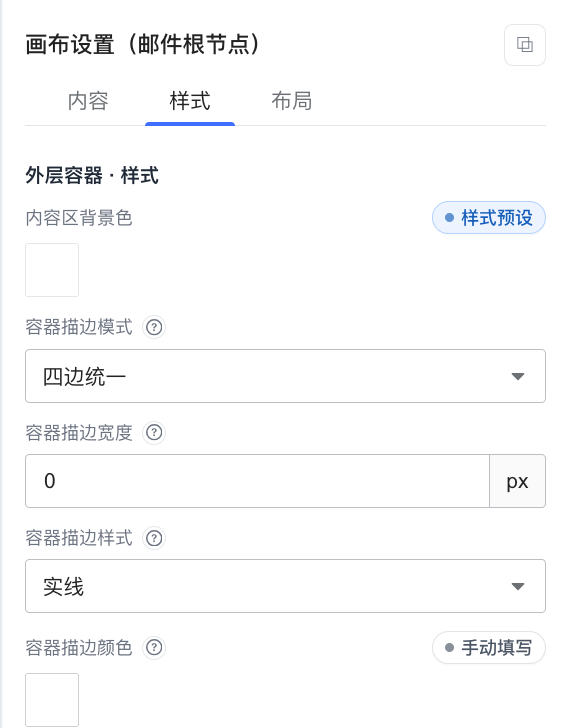

**布局**

- 间距模式（固定像素、均分）
- 内边距（四边统一、分别配置）
- 内边距数值
- 画布宽度（固定 600 回显）

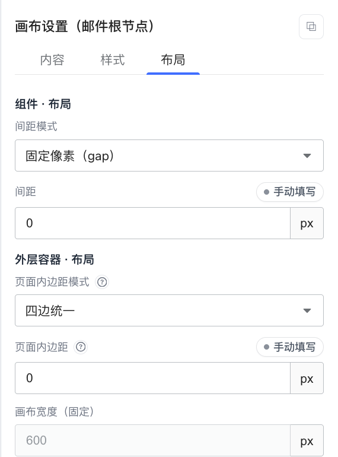

**预览视窗（桌面 / 移动）**

画布顶部可切换预览桌面和移动


切换预览移动时，则是相当于以画布的宽度临时修改为 375px 的尺寸来进行预览

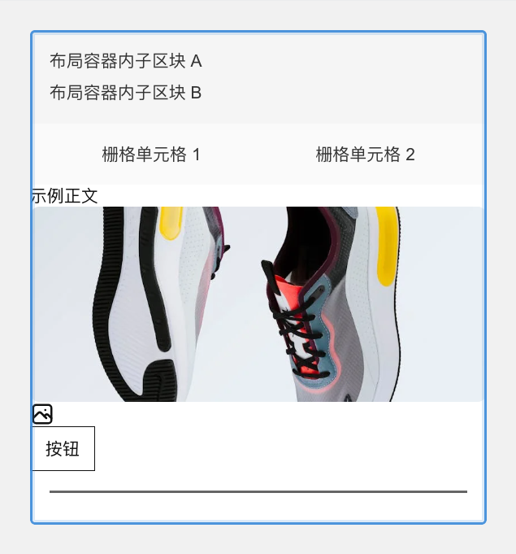

画布中的 block 的宽度渲染逻辑不变

仍然是，自定义的采取裁切的逻辑。hug 和 fill 的block 自适应换行

##### 区块 Inspector 顶栏

每个组件添加后，可以在右侧的面板的顶部：

- 修改组件的名称，10 个字符
- 以及保存该组件类型的默认配置
- 与复制该组件的定位信息 （这个主要是用于方便定位组件 bug 使用的）

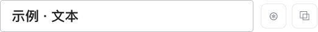

##### 存为模块

在画布中，对于容器类的组件，支持一个操作是叫做存为模块

这个功能是用于将某个模板中配置好的容器类组件包括它的子级一起存为一个模板来方便下一次在制作其他模板是快速复用使用的。

- 模板的名称 20 个字符，必填，并且允许重复

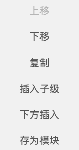

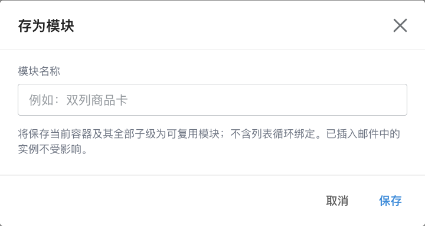

##### 我的模块

在插入组件的面板中，切换至模块的 tab，就可以查看并且管理已经添加的模块

- 并且允许对模块进行重命名，以及删除。此处的删除也走逻辑删除

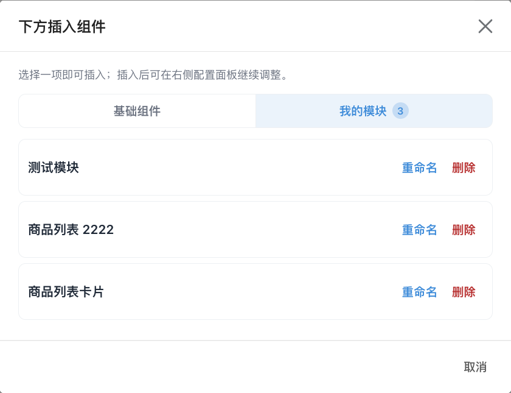

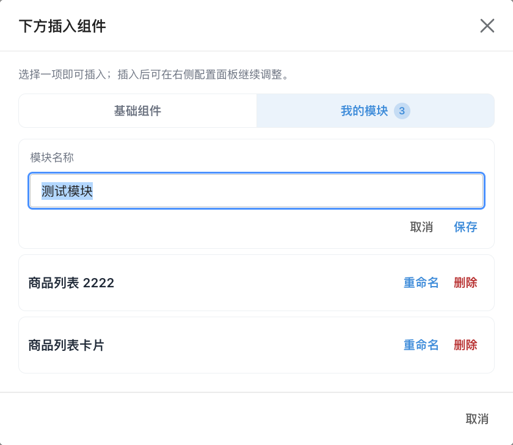

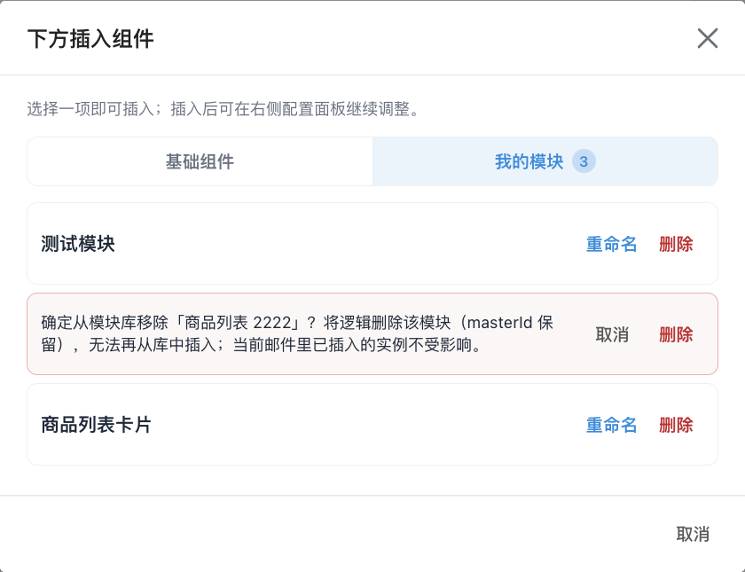

并且由于插入模板实际上是以常量的形式插入，不存在任何关联的变量。所以模块删除后，不影响已经添加过该模块的模板。不需要做那种母版的逻辑。


#### 数据变量 tab

首先数据变量是模板层级的，所有版式共用的

左侧是可以选择添加变量

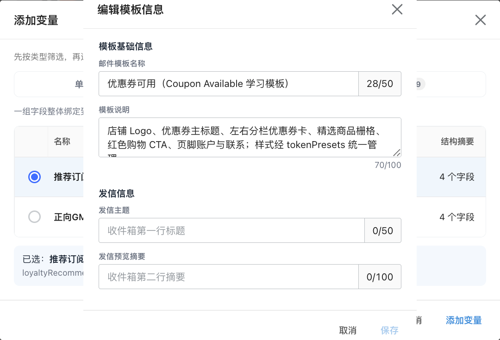

邮件模板编辑器中的变量只承担对于变量的格式定义，以及变量与模板的 block 的绑定的关系。不处理数据的传入关系。

举个例子也就是，在模板编辑器中。只定义，在我这边，店铺名称的 key 值为 storeName，以及数据类型为文本类型。不处理这个 storeName 具体传入的内容是什么。

商品列表的 key 为 productList，数据类型为列表，且为有 spu 与 sku 的 2 重循环的结构以及对应的参数。不处理具体有什么值传入。

在模板编辑器中变量添加后，所有的变量值在编辑器中，使用的都是 mock 的数据。

具体的真实数据，由接入方传入。

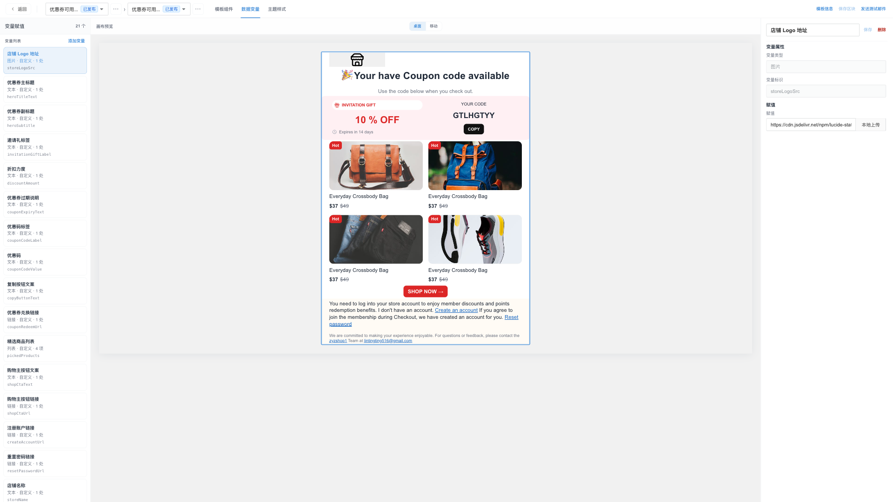

##### 第一期变量清单

目前目前第一期需要实现的变量为：

**单值变量：**

- 店铺链接
- 店铺名称
- 用户名

这 3 个变量的的数据使用 mock 数据用于画布展示

暂不接入数据源


**对象变量：**

- 推荐订阅套餐
- 正向 GMV 汇总

这两个变量接入 loyalty 内部后台的数据源

且有 mock 值用于画布

**列表变量：**

- 搭配商品列表： 主 spu 与子 spu 嵌套列表结构
- 商品列表：主 spu 与子 sku 嵌套列表结构
- 商品专辑列表：主商品专辑列表，非嵌套结构
- 相似品列表：主 spu 与子 spu 嵌套列表结构

以上几个列表变量，使用 mock 数据，用于画布展示，不接入数据源

- 收益预测
- 数据展示
- 未完成配置
- 异常配置项
- 正向数据

以上几个列表变量，接入 loyalty 内部后台的数据源

且有 mock 值用于画布

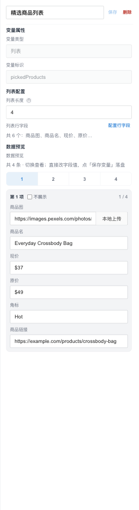

**通用规则**

- 且所有的 变量的 mock 数据，均不允许修改。
- 且以上所有提到的变量的结构，统一由后端决定，产品在此处不提供变量的具体 key 值

列表变量可以在编辑器中配置列表长度，用于控制编辑器的模板在绑定了列表变量后，复制 block 的数量

##### 删除变量

变量详情处支持删除变量

删除变量时，需要同步解除与已绑定的 block 的关系。但是保留 block 中的变量赋值，转换为常量

如果是列表的变量。默认保留复制体的形式解除绑定

##### 变量绑定

**可绑定业务类型的配置**

被定义为业务类型的配置，支持绑定变量

分别为以下的配置

- 背景图地址
- 背景地址链接
- 文本组件的整个正文
- 文本组件的字符级文本
- 按钮的文本
- 链接地址

**单值变量绑定**

单值的变量绑定，是在单个 block 配置处进行绑定的

- 通过弹窗选择单值变量进行绑定
- 绑定后，当前的配置项的赋值，由变量传入，在变量处修改，在 block 的右侧的配置中无法修改
- 绑定后，仅支持切换变量，或恢复手动填写的变量
- 在恢复时，当前配置项的值，变为刚才绑定变量的值


**列表与对象变量**

列表和对象变量，是只能够在容器类的 block 的 数据组 tab下才能发起绑定

容器类的组件有：

- 图片、布局、栅格

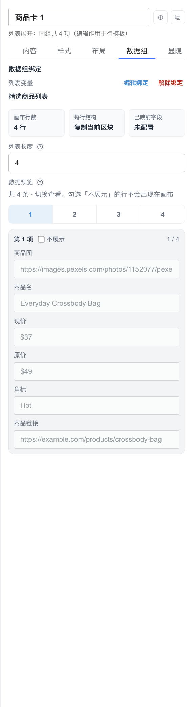

##### 对象变量

我们先来看对象变量

选中对象变量后

在弹窗中，需要解析中 block 中所有的可绑定业务类的配置项

然后右侧则为当前对象变量的数据 key 值

用户需要一一配置每一个 block 的可绑定业务类配置项与右侧的 key 值的对应，或者选择不绑定

确认绑定后则 block 的数值变为绑定的数值

在绑定后，也可以通过右侧取消绑定

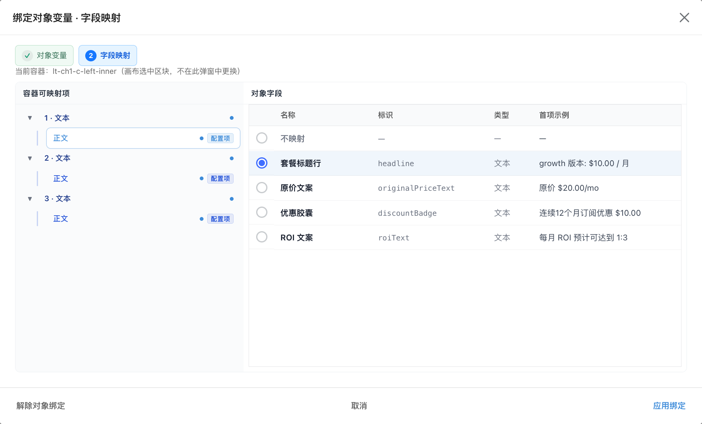

##### 列表变量

再来看列表变量

列表变量会以触发绑定的那个容器变量为复制体。根据列表的长度。复制几块相同的复制体出来

且成功绑定后，右侧的 block树，会有对应的列表重复的 tag 回显

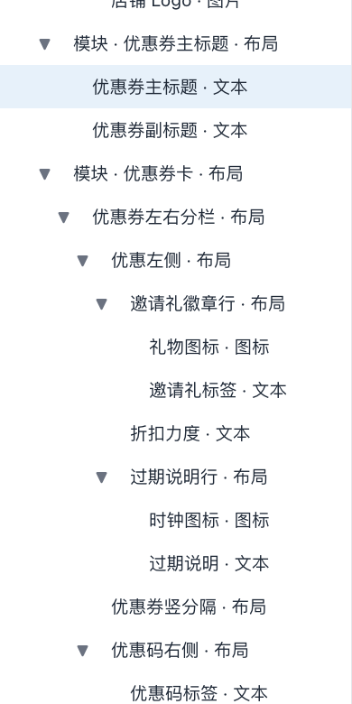

**重复模式**

首先列表变量，首先需要选择重复模式

是每条数据复制一次，还是几条数据复制一次的模式

- 每条数据复制一次的模式，则为每一条数据复制一组复制体
- 几条数据复制一次的模式，则几条数据，才复制一组复制体

几条数据复制一次的模式，多用于不规则的block 的复制

例如商品列表。但是是左图右文+左文右图的这种模式时

用户期望的肯定是左右左右的这种复制模式。那么此时就需要选择 2 条数据为一组的复制模式

分别用第一组数据绑定第一个左图右文，与第二组数据绑定左文右图。由此构建【左图右文+左文右图】为一组复制体。实现左右左右的复制模式

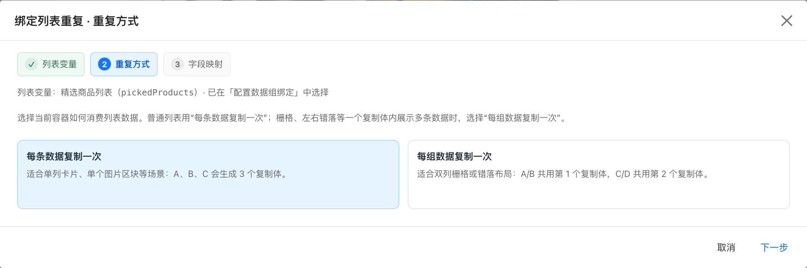

弹窗中选择绑定 block 与变量 key 的模式与对象变量一致。此处不赘述

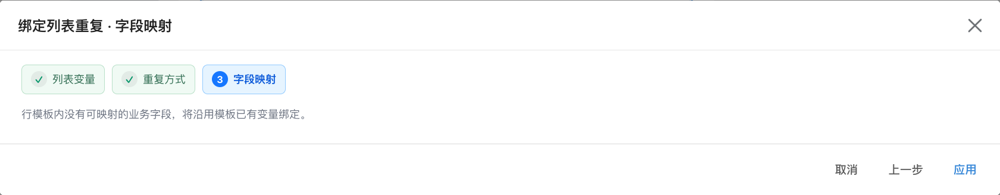

在配置完成后，用户可以在 block 数据组下方配置数组长度。该配置是同步变量 tab 那边的数组长度的。放在此处只是为了快捷配置长度而已。

**嵌套子列表**

列表变量分，拥有子列表嵌套的变量，与没有的变量

若为有子列表嵌套的变量，例如商品列表（主 spu+子 sku 的嵌套列表）

那么在首个触发绑定的 block 处，只能配置绑定主列表循环的那一层数据

如果需要配置子 sku 的绑定。那么需要在触发绑定的 block 的子级的容器类 block 再次编辑绑定列表变量

那么在此处，备选的变量列表中。就可以选择父级block 绑定的列表变量中的子级列表的变量

从而实现（spu+sku 双循环的 block 的绑定）

**解除绑定**

列表变量绑定后。解除变量时，可以选择两种解除方式

- 一种方式时，保留复制体 block 的形式。这种方式会直接以变量循环获取的数值内容。赋值到复制体上
- 另一种方式是仅保留复制的行模板层。那么这种方式，就只保留一层。同样的赋值也是以变量的值来复制。

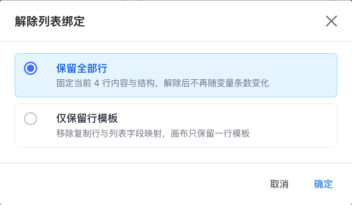

##### 变量补充逻辑

组件 block 不是有保存组件的默认配置

以及容器类组件不是支持保存为模块吗

以上两个操作在保存时。以当前变量的值，以常量的形式，进行存储。不做变量关系的存储

##### 显隐 tab

关于变量还有一个相关的配置就是，每个 block 的显隐藏的 tab

默认是始终显示的，也可以配置为条件显示

当配置为条件显示时，则需要关联变量列表的变量，并且根据变量的不同判断逻辑来决定这个 block 的显示与隐藏状态


**单值变量**

如果是为单值变量的话，那么判断条件有

- 为空
- 不为空
- 等于某值
- 不等于某值

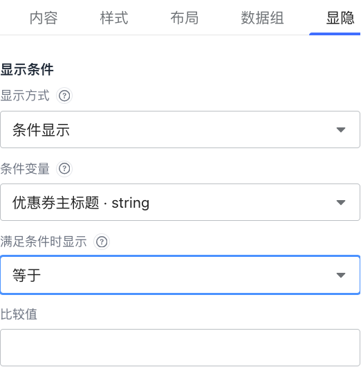

**对象变量**

如果是对象变量。那么对象变量的每个值都会平铺出来

然后判断条件与单值变量一致

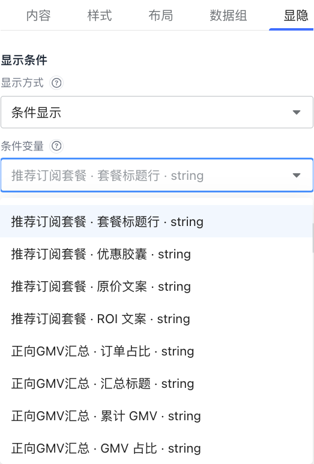

**列表变量**

如果是列表变量

那么判断条件就有

- 数组为空
- 数组不为空
- 长度等于
- 长度大于
- 长度大于等于
- 长度小于
- 长度小于等于

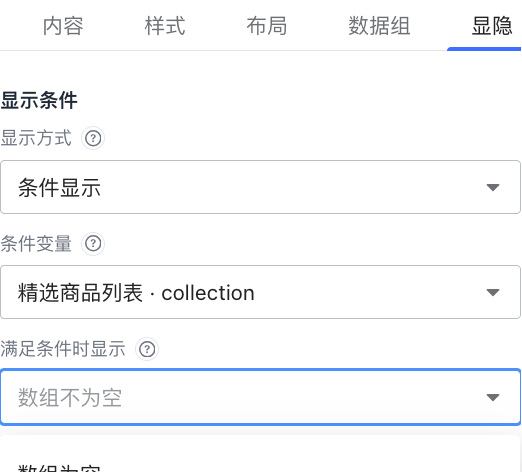

**画布预览**

并且配置了任意 block 为条件显示后

会在画布上方，有一个模拟全部隐藏的勾选


勾选后，你将看到所有条件显示的 block。不可见的画布状态


#### 主题样式 tab

每个版式都会有自己的默认的一个主题预设配置

并且呢，邮件编辑器也会存在公共的多个主题预设配置，所有模板版式都可以使用

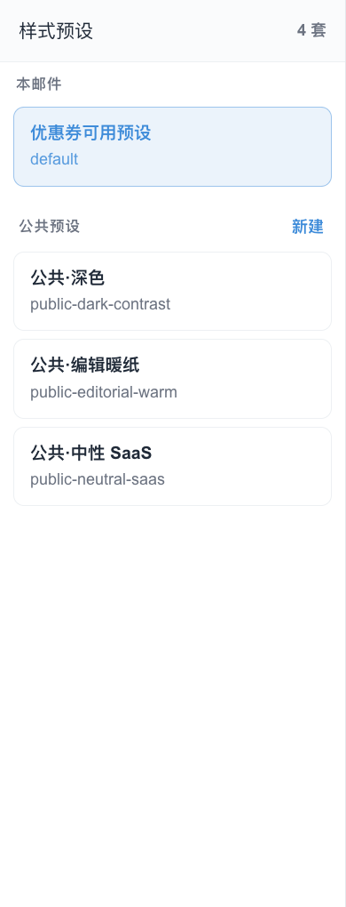

**主题预设的配置范围**

主题预设的配置范围固定为以下的范围：

**颜色 3 款：**

- 主色副色、主背景色

**间距 3 款：**

- 模块上下间距、组件内部间隙、页面左右间距

**字号 4 款：**

- 大标题字号、小标题字号、正文字号、极小字号

**圆角 2 款：**

- 面板容器圆角、主按钮圆角

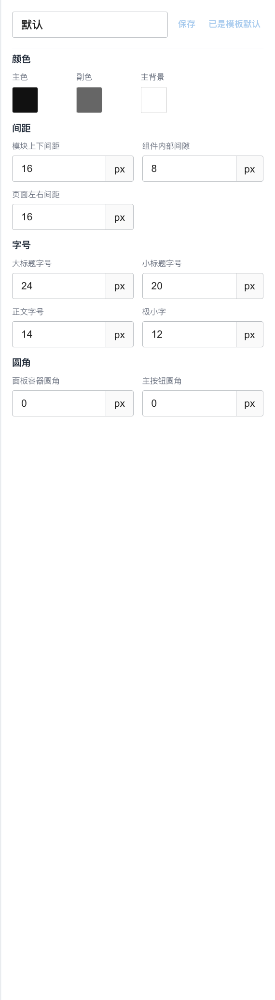

**绑定规则**

不同类型的主题样式预设，能够绑定的 block 的配置项不一样

- 颜色的只能绑定颜色类的配置项
- 间距只能绑定间距类的配置项
- 字号只能绑定字号类的配置项
- 圆角，只能绑定圆角类的配置项

**在 block 上绑定**

在 block 的对应类型的配置项处，可以选择绑定具体的当前类型的主题预设中的哪一款

绑定后，那么在主题样式处，切换当前邮件的默认预设，或公共预设时。则能够再画布中看到实际的渲染效果

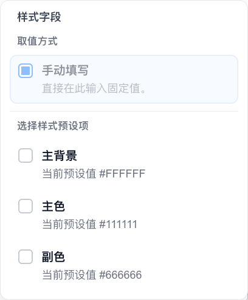

主题样式的配置主要是用于做不同的前端样式切换使用的。

被绑定了的配置项，可以选择解除绑定或者切换相同类型下的其他款的配置的绑定

**保存**

主题样式档位的改动，需要单独保存

在主题样式 Tab 的右侧档位编辑处，修改了颜色、间距、字号、圆角等档位后，需要点击「保存」，才会写入当前样式预设

与顶栏的「保存区块」无关；未保存时刷新会丢失主题样式的临时改动

### 商家邮件活动选择新邮件编辑器的模板

**创建活动 · V2 模板来源**

在创建活动时。本迭代后的新建的商家邮件活动，支持在配置处切换模板来源 V2

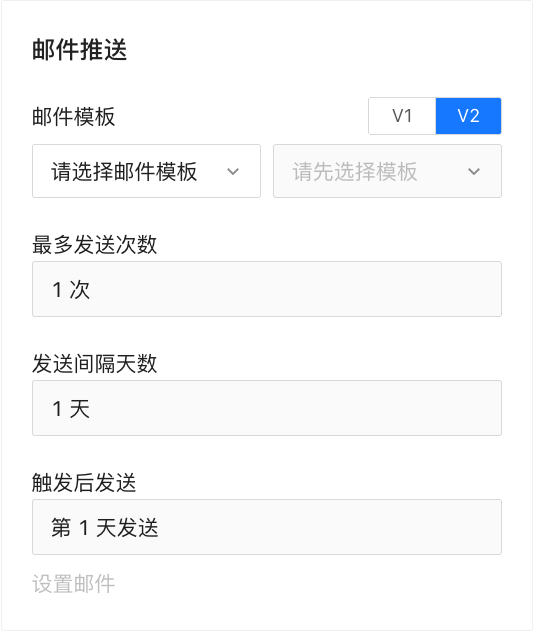

**V2 选择与已发布限制**

在 V2 下可以选择已发布的模板，与已发布的版式

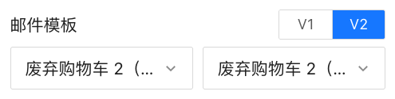

且只允许已发布的模板和版式，执行发布

**活动上下文进入编辑器**

且通过活动选中已发布的版式进入的编辑器，不支持在编辑器顶部切换，模板与版式

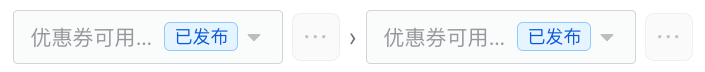

**发信与发布校验**

在发送邮件时，邮件的标题内容仍走原有的邮件活动的逻辑，从邮件活动赋值

若创建邮件活动后，邮件模板版式的内容。变更了。那么也会在发布时使用最新的邮件内容。

若邮件的发布状态变更了。那么在邮件活动实际发送时，仍需要校验活动，若不满足已发布的状态。则发送失败

### AI 以图创建版式

**定位**

AI 以图创建版式，是新建版式时的一种可选提效方式

不改变空白方案、复制版式这些主路径

生成的是版式结构与版式默认的主题样式初稿，不会自动生成业务变量的取值

运营仍需要对照设计图人工验收，并在编辑器里继续调整后，再保存区块、保存主题样式，再考虑发布

**入口**

与空白新建版式相同，有两个入口：

- 模板列表页，选中模板后的版式列表处，新建版式
- 编辑器顶栏，版式选择器处的新建版式

在「新版式」弹窗里，创建方式选择「以图创建」，带 AI 标记


**填写与上传**

- 版式名称必填，（50 个字符）
- 设计图支持 JPG、PNG、WebP，单张不超过 10MB
- 上传设计图后，点击「开始生成」


**生成过程**

提交后，弹窗内展示分步进度，整段过程大约需要 2–8 分钟

生成过程中弹窗不可关闭，需等待完成

分步进度包括：

**识别视觉规格**

AI 看上传的设计图，先整体理解这封邮件长什么样，输出一份「视觉规格」JSON

主要包括：从上到下有哪些模块区域、主色副色和背景色、间距和字号档位、哪些地方需要摄影图或图标、各区域一句 layout 摘要等

这一步是在 **划区域、定规格**，还不是编辑器里最终的 block 树

**参考提示词**

以下为 **参考节选**，占位符（如 `{emailKey}`）由程序在运行时替换；**不要求实现逐字一致**。

```text
你是邮件模板视觉规格分析助手。只看设计图，只输出 JSON，不写模板代码。

须包含：description、colors、spacing、typography、emailRootBackground、
imageSlots、iconSlots、dividers、visualChecks、sections。

imageSlots 只写搜索条件（slotId、query、targetWidth、height），不写 URL。
iconSlots 写 pack（tabler / simple-icons / lucide）、iconQuery、colorHex 等。
sections 自上而下粗分区（sectionId 从 s1 递增），每区一句 summary，不要复制长正文。
只输出 JSON，不要 markdown 或解释。

运行参数：emailKey={emailKey}，displayName={displayName}，idPrefix={idPrefix}
（附带设计图）
```

**返回示例**

```json
{
  "emailKey": "summer-sale",
  "displayName": "夏季促销",
  "idPrefix": "ss",
  "description": "白底促销邮件，顶栏 Logo + 头图 + 双列商品 + 页脚",
  "colors": { "primary": "#000000", "secondary": "#F4F3EA", "surface": "#FFFFFF" },
  "spacing": { "section": "22px", "gap": "13px", "pageInline": "22px" },
  "typography": { "display": "28px", "h1": "26px", "body": "10px", "caption": "6px" },
  "emailRootBackground": "#FFFFFF",
  "imageSlots": [
    { "slotId": "hero", "query": "summer fashion banner", "targetWidth": 600, "height": "280px", "required": true, "usage": "首屏头图" }
  ],
  "iconSlots": [
    { "slotId": "brandLogo", "pack": "simple-icons", "iconQuery": "adidas", "colorHex": "#000000", "required": true, "usage": "顶栏 Logo", "hasBox": false }
  ],
  "dividers": [],
  "visualChecks": ["社媒图标带 1px 外框", "页脚合规文字约 6px"],
  "sections": [
    { "sectionId": "s1", "name": "顶栏", "backgroundColor": "#FFFFFF", "pageInline": true, "padTop": "8px", "padBottom": "8px", "targetHeight": "40px", "gap": "0", "summary": "品牌 Logo 居中", "texts": [], "imageSlotIds": [], "iconSlotIds": ["brandLogo"], "visualChecks": [] },
    { "sectionId": "s2", "name": "头图", "backgroundColor": "#F4F3EA", "pageInline": false, "padTop": "0", "padBottom": "0", "targetHeight": "280px", "gap": "0", "summary": "通栏摄影头图", "texts": [], "imageSlotIds": ["hero"], "iconSlotIds": [], "visualChecks": [] }
  ]
}
```

**搜索远程素材**

根据上一步里写好的搜图条件、图标关键词，由 **程序** 去远程找真实可用的素材 URL

摄影图走 Pexels，图标走 CDN；AI 只提供搜索条件，**不会**在 JSON 里手写 URL

搜到的地址会注入后面的还原脚本，供图片、图标、背景图等 block 使用

**参考提示词**

本步骤 **无 LLM 提示词**，由程序执行。

程序直接读取上一步 visual blueprint 里的 `imageSlots`、`iconSlots`，例如：

- `imageSlots[].query` → 调用 Pexels 搜索摄影图，写入 `PEXELS['slot-id']`
- `iconSlots[].pack` + `iconQuery` → 调用 CDN 解析图标，写入 `ICON['slot-id']`

**生成版式还原脚本**

程序先准备好一份带槽位的还原脚本底稿（含颜色常量、各模块构建函数、样式预设占位等）

AI 再对照设计图，按模块输出 patch，把每个区域的排版结构、文案、样式等填进底稿

相当于 **按设计图把各模块的 block 结构写出来**，拼成一份可在本地执行的脚本

**参考提示词**

**首次生成（参考节选）**

```text
你是 Easy-Email 邮件模板还原工程师。程序已提供一份可运行的 mjs 底稿；
你根据设计图只输出 XML patch，把各 slot 换成真实设计，不要重写整份 body。

须 patch：COLORS、buildS1 … buildSn、tokenPresets、template
禁止 patch：助手函数、const PEXELS / const ICON / 任何 https:// URL
资产引用：PEXELS.*、ICON["…"]（程序已在底稿中注入）

只输出 <mjs-patches>...</mjs-patches> XML
（附带设计图 + 底稿对照 + visual blueprint 摘要）
```

**失败重试 · slot 修补（参考节选）**

```text
你是 Easy-Email mjs 脚本的 slot 级修补工程师。
上一轮执行脚本或校验仍有问题；对每个出错 slot 输出 kind="slot" patch，整段重写该 slot。

只输出 <mjs-patches> XML
（附带 validate 错误列表 + 出错 slot 当前源码 + visual blueprint 摘要）
```

**执行脚本并校验**

在本地运行上一步生成的脚本，产出当前版式的 **版式结构** 与 **版式默认主题样式预设**

同时做契约校验：block 类型是否合法、字段是否在白名单内、嵌套关系是否正确、主题档位是否合法等

若脚本报错或校验不通过，程序会先尝试自动修复，或带着错误信息让 AI patch 修补后 **重试**（与下一步视觉检查一起，最多 3 轮）

**参考提示词**

本步骤 **无 LLM 提示词**，由程序执行。

程序在本地运行 mjs 脚本，并跑全量契约校验（block 白名单、嵌套关系、tokenPresets 形态、`validate:all` 等）

校验失败时，程序先尝试 autofix；仍失败则回到上一步 **失败重试 · slot 修补** 提示词，最多 3 轮

**检查视觉质量**

对照第一步识别出的视觉规格，检查生成结果有没有 **明显跑偏**

例如：图标是否该带外框、页脚字号是否过小、关键区域高度是否差太多等

有 **硬伤** 会触发重试；若最后一轮 **只剩建议项、没有硬伤**，则 **正常完成** 进入编辑器（不算保底交付，但进入编辑器后仍可能看到建议提示）

**参考提示词**

本步骤 **无 LLM 提示词**，由程序执行。

程序对照第一步 visual blueprint 里的 `visualChecks`、`sections[].targetHeight`、字号档位等，扫描生成后的 template 是否明显偏离

例如 blueprint 写了「社媒图标带 1px 外框」「页脚 caption 约 6px」，此处做规则检查；不通过则触发上一步 slot 修补重试

**落盘新版式**

上述步骤通过（或保底交付）后，把版式结构与版式默认主题样式预设 **写入磁盘**

生成的新版式默认 **未发布**；关闭弹窗后自动进入该版式的编辑器，可在画布中预览

**参考提示词**

本步骤 **无 LLM 提示词**，由程序执行。

校验通过后，写入当前邮件 `layouts/<新版式>/` 下的版式结构与默认主题样式预设；默认 **未发布**

校验或执行失败时，会自动重试，最多 3 次

**生成结果**

- 成功：关闭弹窗，自动进入新生成的版式编辑器，可在画布中看到还原结果；新版式默认未发布
- 失败：不落盘半成品，弹窗内提示失败，可换图或稍后重试

生成完成后，仍可能存在待确认项，须对照设计图继续改，不要直接发布

**校验与模板检查**

生成链路在「执行并校验」「检查视觉质量」「写入新版式」几步都会做检查，主要包括：

- 生成的版式结构是否符合编辑器规则（组件类型、允许填写的字段、嵌套关系等）
- 主题样式档位是否在约定范围内
- 对照第一步识别出的视觉规格，有没有明显跑偏（间距、字号、资产是否齐全等）

校验结果分几种情况：

- **全部通过**：结构与视觉检查均无 **须修复** 问题；写入新版式，进入编辑器
- **可自动修复或可重试**：前几轮仍有问题；系统自动修正，或带着问题重新生成，**继续下一轮**（最多 3 轮）。此阶段 **不会** 进入编辑器
- **仍有问题但已有可用产物（保底交付）**：见下节
- **没有可用产物**：创建失败，弹窗提示失败，**不落盘半成品**

**保底交付：什么情况下允许通过**

重试次数用尽（或系统判断继续重试也不会更好）时：**只要版式结构可用**——能在编辑器里打开、在画布上预览——就允许带着未解决问题进入编辑器，并提示运营建议人工确认后再发布。遗留的是规则、视觉还是素材问题，不改变这一判定。

**不允许通过（直接失败）—— 没有可交付的版式**

下列情况 **不允许进入编辑器**，弹窗提示失败，**不写新版式**：

1. **第一步识别视觉规格失败**：读不懂设计图，无法形成可用的视觉规格，后续无法继续
2. **结构不符合要求**：重试用尽后仍 **无法产出可预览的版式**（结构不合法、无法加载预览等）

**进入编辑器后的模板检查**

编辑器会做两个方面的模板检查：

1. 结构是否符合编辑器的要求
2. 配置的值是否符合编辑器的要求，或者是否有空值

**结构不符合编辑器的要求**

如果是结构不符合编辑器的要求，那么编辑器无法渲染当前的模板，需要用户切换其他模板

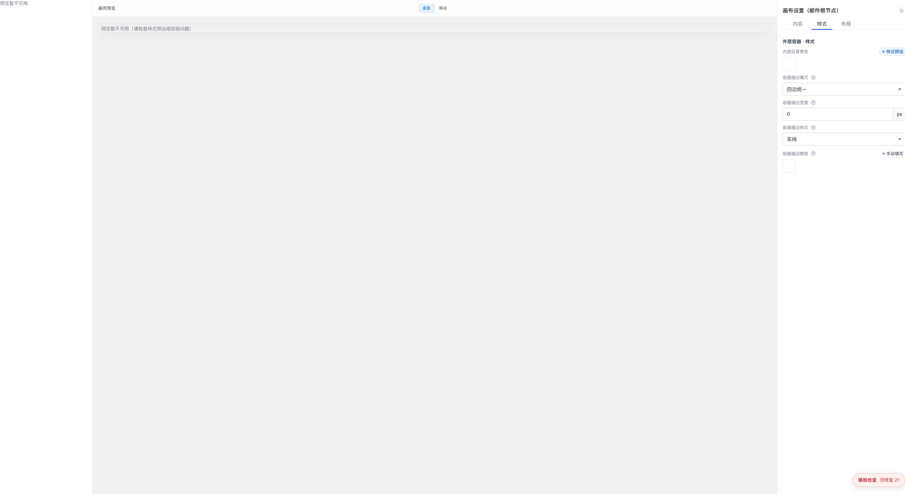

**配置值不符合编辑器的要求**

如果是配置值不符合编辑器的要求，需要在右下角的悬浮气泡处，展示具体是哪一个block 的哪一个配置不符合编辑器的要求，对用户做提醒

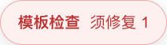

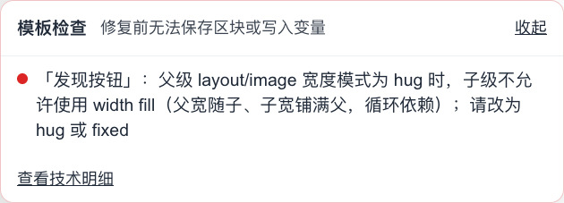

**与变量、主题、活动的关系**

- 以图生成写入的是当前版式的版式结构，与版式默认的主题样式预设
- 数据变量仍属于模板层级，与空白新建版式一样，共用当前模板下的变量目录，不会随 AI 自动生成变量槽和 mock 值
- 生成结果可在主题样式 Tab 里继续改档位，并单独保存
- 版式须发布后，才可在商家邮件活动 V2 中被选用