# 邮件模板新架构 — 产品需求说明（PRD）

> 本文档分两大块：**一、通用邮件模板架构**（公共能力，说明模板长什么样、数据怎么分、外部系统通用对接方式）；**二、Loyalty & Push 系统接入**（本仓库线上会员与 Push 业务如何调用该架构）。

---

## 目录

### 一、通用邮件模板架构

0. [架构总览](#0-架构总览)
1. [需求目标](#1-需求目标)
2. [编辑器里：一封邮件由什么构成](#2-编辑器里一封邮件由什么构成)
3. [版式里能配什么（画布与模块）](#3-版式里能配什么画布与模块)
4. [所有模块的通用规则](#4-所有模块的通用规则)
5. [八种模块分别能配什么](#5-八种模块分别能配什么)
6. [外观主题与配色](#6-外观主题与配色)
7. [正文业务变量](#7-正文业务变量)（含 [7.1 列表变量](#71-列表变量)）
8. [按变量显示或隐藏模块](#8-按变量显示或隐藏模块)
9. [一套数据、多套版式](#9-一套数据多套版式)
10. [一封邮件里：谁是一份、谁有多份](#10-一封邮件里谁是一份谁有多份)
11. [发信：收件人、标题与摘要](#11-发信收件人标题与摘要)
12. [别的系统如何用来发信](#12-别的系统如何用来发信)

### 二、Loyalty & Push 系统接入

2.1 [Loyalty & Push 中的邮件现状与本期范围](#21-loyalty--push-中的邮件现状与本期范围)  
2.2 [本期替换的模板范围](#22-本期替换的模板范围)  
2.3 [迭代后产品需交付什么（按模板）](#23-迭代后产品需交付什么按模板)  
2.4 [发信时：业务变量与发信信息如何接入](#24-发信时业务变量与发信信息如何接入)

---

## 一、通用邮件模板架构

> 本部分描述**与具体业务线无关**的公共邮件模板能力：编辑器里如何维护一封邮件、版式与变量如何分工、发信时先正文后标题、任意业务系统对接时要传什么。原 §0–§12 均归在本章下。

---

### 0. 架构总览

用一句话说清：**邮件长什么样、绑哪些变量、标题怎么写，在编辑器里配一次就好**；CRM、营销系统发信时，只要说「用哪封邮件、这次发给谁、会员名/优惠码填什么」，不必在业务系统里再搭一遍版式。

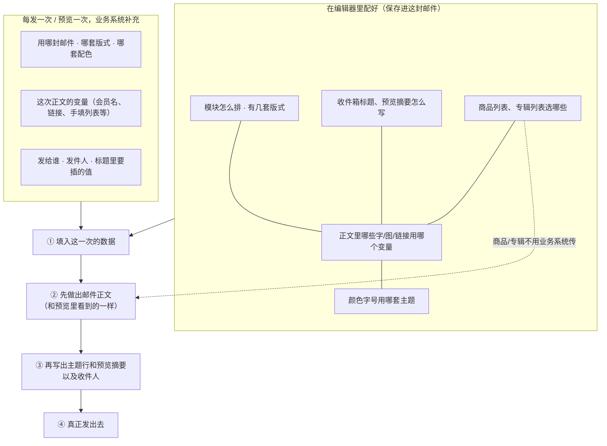
```mermaid
flowchart TB
  subgraph editor["在编辑器里配好（保存进这封邮件）"]
    A["模块怎么排 · 有几套版式"]
    B["正文里哪些字/图/链接用哪个变量"]
    C["颜色字号用哪套主题"]
    D["收件箱标题、预览摘要怎么写"]
    E["商品列表、专辑列表选哪些"]
    A --- B --- C
    D --- B
    E --- B
  end

  subgraph eachSend["每发一次 / 预览一次，业务系统补充"]
    F["用哪封邮件 · 哪套版式 · 哪套配色"]
    G["这次正文的变量（会员名、链接、手填列表等）"]
    H["发给谁 · 发件人 · 标题里要插的值"]
  end

  editor --> S1["① 填入这一次的数据"]
  eachSend --> S1
  S1 --> S2["② 先做出邮件正文<br/>（和预览里看到的一样）"]
  S2 --> S3["③ 再写出主题行和预览摘要<br/>以及收件人"]
  S3 --> S4["④ 真正发出去"]

  E -.->|"商品/专辑不用业务系统传"| S2
```

**五句话：**

1. **编辑器里配好的就不用业务系统再搭** — 模块、版式、变量名、主题、标题/描述的固定句式、商品与专辑选品，都保存在这封邮件里；别的系统不用复制一份排版结构（详见 [§10](#10-一封邮件里谁是一份谁有多份)、[§12](#12-别的系统如何用来发信)）。
2. **每发一次只要补「这一次」的数据** — 告诉系统：哪封邮件、用哪套版式、用哪套配色、这个收件人正文变量填什么、收件箱标题要插什么字、发给谁（详见 [§12](#12-别的系统如何用来发信)）。
3. **先做正文** — 按选定的版式，用这一次的变量把邮件画出来；你在编辑器里预览到的正文，和发出去的正文应是同一套规则（详见 [§3](#3-版式里能配什么画布与模块)–[§7](#7-正文业务变量)、[§9](#9-一套数据多套版式)）。
4. **再做收件箱上的字** — 正文好了之后，再拼出主题行和预览摘要（目前是「固定句子 + 变量」；一次只发一个人）。以后若支持「根据正文自动写标题」，也仍然排在正文后面（详见 [§11](#11-发信收件人标题与摘要)）。
5. **商品列表、专辑列表例外** — 在编辑器里用「选商品」「选专辑」配好的那种列表，发信时**不要**让业务系统再传一串商品 ID；手填的自定义列表、会员名这类变量，才由业务系统按类型传入（详见 [§7.1](#71-列表变量)、[§12](#12-别的系统如何用来发信)）。

后文各章写具体能配什么。[§2](#2-编辑器里一封邮件由什么构成) 只讲**打开编辑器时**这封邮件由哪几块组成，不包含发信顺序与外部传入。

---

### 1. 需求目标

本项目的核心目标是建设一套 **以 Block 为单位的邮件编辑器底层**：一封邮件由区块树构成，每个区块可独立配置，并在画布中预览。

在这一底层上，除最基础的 **样式配置**、**内容数据配置** 外，还须具备：

1. **主题绑定与切换** — 外观字段可绑定主题颜色等样式档位；切换主题后，已绑定字段在预览中同步更新。
2. **同场景多版式** — 同一封邮件可维护多套对外版式，共用一份业务侧数据，切换版式时不必重录数据。
3. **发信信息** — 模板走**发送通道**时，除正文外须配置收件人、邮件标题、邮件描述等信封信息；与正文 [§7](#7-正文业务变量) 的业务变量分离，使用独立的**发信信息变量**（仅文本型）。
4. **外部接入** — 外部系统按场景标识、版式、主题来源与当次变量取值驱动渲染与发送，结构由邮件模块自闭环维护（见 [§12](#12-别的系统如何用来发信)）。

---

### 2. 编辑器里：一封邮件由什么构成

> 与 [§0 架构总览](#0-架构总览) 的区别：§0 含发信顺序与外部系统传什么；本节**仅**说明运营在编辑器里维护一封邮件时，场景里有哪些块（模板层视角）。

一封邮件在编辑器里对应一个**场景**（如「欢迎会员」「弃购提醒」）。场景是整封信的编辑与数据边界，通常包含：

- **场景信息** — 名称、备注、设计稿引用等，不参与具体模块排版；
- **业务侧数据** — 运营或对接方填入的文案、链接、列表等（在场景中维护**一份**）；
- **版式** — 同一场景可对应一种或多种对外样式（如「列表版」「卡片版」），顶栏可切换。

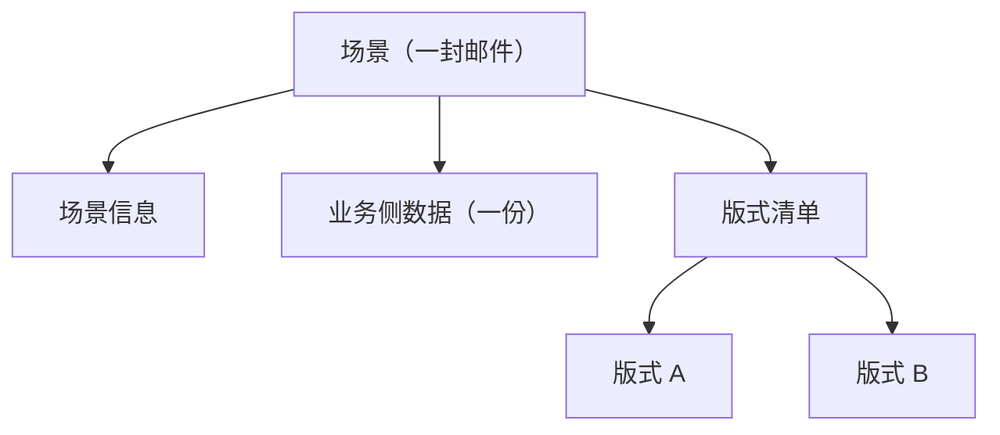
```mermaid
flowchart TB
  scene["场景（一封邮件）"]
  scene --> meta["场景信息"]
  scene --> data["业务侧数据（一份）"]
  scene --> layouts["版式清单"]
  layouts --> vA["版式 A"]
  layouts --> vB["版式 B"]
```

本节只建立「场景、业务侧数据、版式」三个名词，不展开各版式内部的模块与绑定细节。

---

### 3. 版式里能配什么（画布与模块）

每套版式对应一份**模板**，用于定义该版式下邮件长什么样：有哪些模块、如何嵌套与排序。模板**不**写入会员名、优惠码等具体业务取值；取值在场景侧维护，模板只记录结构与绑定关系。

模板层分为两个配置模块：

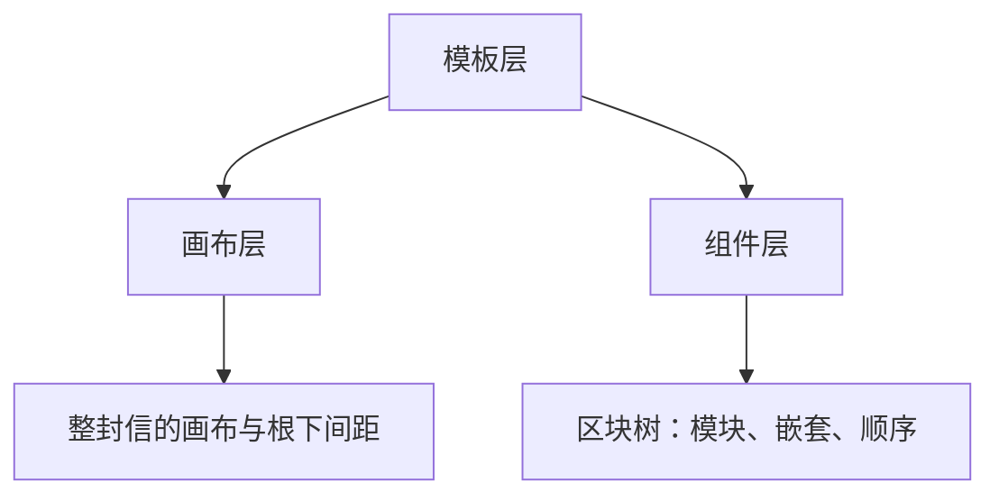
```mermaid
flowchart TB
  tpl["模板层"]
  tpl --> canvas["画布层"]
  tpl --> comp["组件层"]
  canvas --> c1["整封信的画布与根下间距"]
  comp --> c2["区块树：模块、嵌套、顺序"]
```

---

### 3.1 画布层

**画布层**对应每套版式模板中**有且仅有一个**的**邮件根**（画布）。它承载「整封信的版心」：内容区有多宽、底色与底图、版心四边留白、根下各模块如何纵向排布与留缝。画布之下挂载的全部模块属于 [§3.2 组件层](#32-组件层)。

**编辑器中的入口：** 未在区块树中选中任何具体组件时，右侧配置面板展示「画布设置（邮件根节点）」；选中任一子模块后，面板切换为该模块的配置。画布与区块树、预览区的选中状态须联动。

#### 可配置内容

| 配置项 | 能配什么 | 在画布上看到什么 |
| --- | --- | --- |
| 内容区宽度 | 固定 600px（只读） | 内容区宽度：预览里始终是一块 600 像素宽的信纸，两侧是编辑器灰底。 |
| 内容区背景色 | 颜色值；支持透明度；必填 | 内容区背景色：没铺底图时，用户看到整封信纸的底色。 |
| 内容区底图·地址 | 图片 URL | 内容区底图·地址：填了地址才在版心铺出通栏大图。 内容区底图·地址（空）：不显示底图。 |
| 内容区底图·跳转链接 | URL | 内容区底图·跳转链接：点击整图可跳转到配置的链接。 |
| 内容区底图·替代文字 | 文本 | 内容区底图·替代文字：图不可用时的说明文字。 |
| 内容区底图·裁切方式 | 铺满（cover）/ 完整显示（contain） | 铺满：裁切后填满 600px 版心。 完整显示：整张图完整缩在版心内，不裁切。 |
| 内容区底图·画面位置 | 九宫格位置（cover 时生效） | 内容区底图·画面位置：铺满裁切时，保留画面的哪一侧（如偏上、居中）。 |
| 内容区底图·圆角 | 圆角值 | 内容区底图·圆角：底图四角变圆的程度。 |
| 页面内边距·模式 | 四边统一 / 四边分边；必填 | 四边统一：上下左右用同一个留白值。 四边分边：上、右、下、左可分别设置。 |
| 页面内边距·数值 | 长度 | 页面内边距·数值（无底图）：一级模块与信纸边缘之间空出留白。 页面内边距·数值（有底图）：底图仍铺满版心，只把叠在图上的模块往里推。 |
| 画布描边·线宽 | 长度；必填 | 画布描边·线宽：信纸最外圈线的粗细；内描边，越粗版心内可排版区域越小。 |
| 画布描边·线型 | 实线 / 虚线 / 点线 | 实线：外圈线为连续实线。 虚线：外圈线为虚线。 点线：外圈线为点线。 |
| 画布描边·颜色 | 颜色；支持透明度 | 画布描边·颜色：外圈线的颜色。 画布描边·颜色（透明）：看不见框线。 |
| 根下间距·模式 | 固定像素 / 自动均分 | 固定像素：模块之间的竖缝高度由你写的像素决定。 自动均分：竖向多出来的空间均摊到每条缝里，模块被拉开。 |
| 根下间距·数值 | 长度（固定模式时，可为 0） | 根下间距·数值：一级模块之间竖条缝的高度；为 0 时模块紧贴。 |
| 根下排列方向 | 仅纵向 | 根下排列方向：一级模块只能从上到下排；树里谁在上，预览里谁先出现。 |

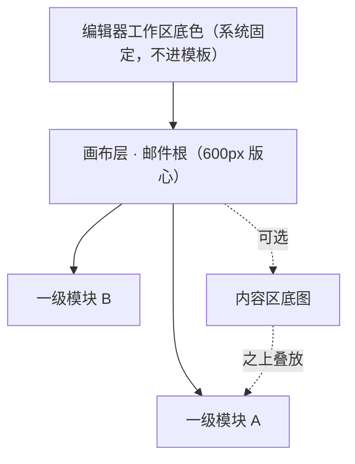
```mermaid
flowchart TB
  workspace["编辑器工作区底色（系统固定，不进模板）"]
  root["画布层 · 邮件根（600px 版心）"]
  m1["一级模块 A"]
  m2["一级模块 B"]
  workspace --> root
  root --> m1
  root --> m2
  root -.->|"可选"| bg["内容区底图"]
  bg -.->|"之上叠放"| m1
```

---

### 3.2 组件层

**组件层**是画布下的**区块树**：由多种组件（区块）组成，可一层层嵌套。选中树中某一组件时，编辑器右侧展示该组件的配置。

仅允许以下八种组件类型，不得扩展为第九种：

| 类型 | 名称 | 职责 |
| --- | --- | --- |
| 布局容器 | 模块容器 | 纵向或横向排列子级；可铺色、可铺底图，底图上可叠标题、按钮等 |
| 栅格 | 宫格容器 | 多列宫格，按顺序一子一格；不支持跨格合并 |
| 文本 | 正文 | 结构化段落与段内多样式 |
| 图片 | 头图 / 底图模块 | 图在外壳底图上，之上可叠放内容；非小图标 |
| 图标 | 图标 | 单色图标，可着色、可设尺寸、可带链接 |
| 按钮 | 行动按钮 | 胶囊按钮：文案、链接与胶囊外观 |
| 分割线 | 分隔线 | 横线颜色、粗细与横向占位 |
| 进度条 | 进度 | 数值、比例与条带外观 |

---

### 4. 所有模块的通用规则

每个区块均包含**外壳**与**块内配置**两层，编辑器须分开展示，禁止混为同一组「模块属性」。

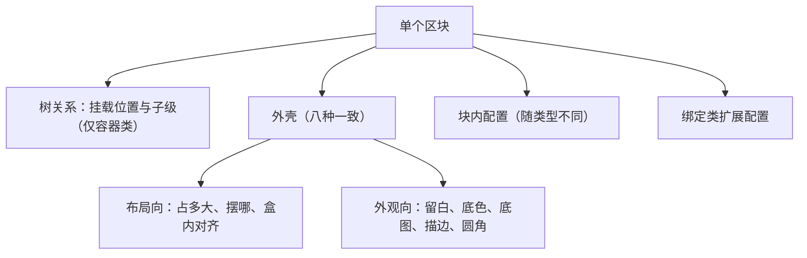
```mermaid
flowchart TD
  node["单个区块"]
  node --> tree["树关系：挂载位置与子级（仅容器类）"]
  node --> shell["外壳（八种一致）"]
  node --> inner["块内配置（随类型不同）"]
  node --> extra["绑定类扩展配置"]

  shell --> layout["布局向：占多大、摆哪、盒内对齐"]
  shell --> visual["外观向：留白、底色、底图、描边、圆角"]
```

- **挂在哪、排第几**：八种组件须声明父级与同级先后顺序；先后顺序决定预览排列（父级纵向排为上→下，横向排为左→右）。
- **子级挂载**：**仅布局容器、栅格、图片**可在当前区块下挂子组件；文本、图标、按钮、分割线、进度条为叶子。画布根下挂一级模块的规则见 [§3.1](#31-画布层)。

### 4.1 外壳 · 布局向

八种组件的外壳均包含下列占位与尺寸能力。画布根版心布局见 [§3.1](#31-画布层)。盒内内容摆放见 [§4.2](#42-盒内内容摆放contentalign)。

| 配置项 | 能配什么 | 在画布上看到什么 |
| --- | --- | --- |
| 宽度模式 | 随内容 / 铺满 / 固定 | 随内容：模块横向边框贴着里面的内容。 铺满：模块横向撑满父级分给它的宽度。 固定：模块横向按固定宽度显示。 |
| 固定宽度 | 长度（宽度模式为固定时） | 固定宽度：模块横向上就是配置的像素宽度。 |
| 高度模式 | 随内容 / 铺满 / 固定 | 随内容：模块纵向边框贴着里面的内容。 铺满：模块纵向撑满父级分给它的高度。 固定：模块纵向按固定高度显示。 |
| 固定高度 | 长度（高度模式为固定时） | 固定高度：模块纵向上就是配置的像素高度。 |

#### 配置约束（布局向）

- 父级若是**横排**，且自己的宽度选**随内容**，里面的子块就不能再选**宽度铺满**——父级宽度要靠子块撑开，子块又说要铺满父级，两边互相等对方先定尺寸，配不出来。
- 父级若是**纵排**，且自己的高度选**随内容**，里面的子块就不能再选**高度铺满**，道理同上。

### 4.2 盒内内容摆放（contentAlign）

八种组件外壳均包含下列对齐配置项（**画布根**不适用盒内内容摆放）。编辑器 Inspector 仅展示 **「容器内内容摆放」** 一项（水平 + 竖直两轴）；持久化字段为 **`wrapperStyle.contentAlign`**（`left|center|right` × `top|center|bottom`）。写入其它对齐字段会校验失败。

| 配置项 | 能配什么 | 在画布上看到什么 |
| --- | --- | --- |
| 水平·盒内内容摆放 | 靠起始 / 居中 / 靠结束 | 靠起始：内容或子级组在容器宽度内靠左。 居中：水平居中。 靠结束：靠右。 |
| 竖直·盒内内容摆放 | 靠起始 / 居中 / 靠结束 | 靠起始：靠上。 居中：竖直居中。 靠结束：靠下。 |

> **模型说明：** 不再使用「九宫格一体选位」，改为**水平、竖直各一档**独立配置。运营侧仍用「靠左/居中/靠右」「靠上/居中/靠下」理解即可；配置项表中统一写作靠起始 / 居中 / 靠结束（对应 JSON：`left` / `center` / `right` 与 `top` / `center` / `bottom`）。

#### 语义说明

- **布局容器 / 栅格 / 图片叠放层（含 `backgroundImage`）**：`contentAlign` 控制**子级整组**在当前容器外壳内的水平与竖直对齐（邮件实现为 presentation **`<table>` + `td align`/`valign`**）。
- **文本、按钮、图标等叶子块**：`contentAlign` 控制**壳内正文/胶囊**在模块宽/高内的对齐。
- **需要 per-child 不同对齐**（例如同一行里 Logo 左、字标右）：不要指望父子「分工两轴」；应**嵌套一层 `layout`**，或在各子块上分别写 `contentAlign`（在 hug 宽/高允许的前提下）。

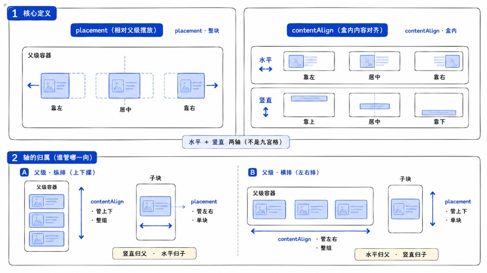

#### 配置约束

下面说的是：**什么情况下配了也白配**、**该改父级还是嵌套 layout**、**保存时什么组合不允许**。

**先记住三条**

1. **水平、竖直都要各有一档**（除 `emailRoot` 外），不能只写一边。
2. **模块宽度/高度为随内容（hug）时**，对应轴向**不可配**非靠起始值，持久化须为 `left` / `top`；Inspector 该轴置灰。
3. **子级要对齐方式不同** → **嵌套 `layout`/`grid`** 或分别配置各子块 `contentAlign`。

**布局容器、栅格、图片叠放**

- 在**定宽/定高或铺满**的壳上，水平与竖直两轴**均可配**（与排列方向纵/横无关）。
- 子级**上下摞**或**左右排**时，均由**该容器自己的** `contentAlign` 决定整组在壳内的偏左/中/右、偏上/中/下。
- **栅格矩阵格**：格内直接子块的 `contentAlign` 映射到该格 `<td>` 的 `text-align` 与 `vertical-align`（见 `gridMatrixSlotContentAlignCss`）；无子块时回退栅格块 `contentAlign`。

**叶子块（文本、按钮等）**

- 宽度不是随内容时，水平对齐才有意义；高度是固定或铺满时，竖直对齐才有意义。
- 宽度/高度为随内容时，对应轴只能为靠起始（`left` / `top`），配居中或靠结束 → **不允许保存**。

**改了排列方向或宽高模式之后**

用户把容器从**上下摞改成左右排**（或反过来）、或把**随内容 / 铺满 / 固定**改掉之后，当前块及其子块须重新满足约束。与旧结构冲突的 `contentAlign` 由系统回落（`normalizeTemplateContentAlignEffectiveness`）；交付数据须通过校验。

**数据规范化**

- hug 轴无效值：`npm run migrate:content-align-hug-neutral:write`。
- 代码真源：`src/lib/contentAlignConfigurability.ts`、`src/lib/validate.ts`。

### 4.3 外壳 · 外观向

八种组件外壳均包含下列外观能力。画布根内容区背景、描边等见 [§3.1](#31-画布层)。**底图**仅布局容器、栅格、图片及画布根可配。

| 配置项 | 能配什么 | 在画布上看到什么 |
| --- | --- | --- |
| 内边距·模式 | 四边统一 / 四边分边；必填 | 四边统一：壳四边用同一个留白值。 四边分边：上、右、下、左可分别设置。 |
| 内边距·数值 | 长度 | 内边距·数值（无底图）：内容与模块壳边缘之间空出留白。 内边距·数值（有底图）：底图仍铺满，只把叠在图上的子内容往里推。 |
| 纯色背景 | 颜色值；支持透明度 | 纯色背景：模块背后铺一层底色。 纯色背景（与底图并存）：底图不透明区域会盖住底色。 |
| 描边·线宽 | 长度 | 描边·线宽：模块外圈线的粗细；内描边。 |
| 描边·线型 | 实线 / 虚线 / 点线 | 实线：外圈线为连续实线。 虚线：外圈线为虚线。 点线：外圈线为点线。 |
| 描边·颜色 | 颜色；支持透明度 | 描边·颜色：模块外圈线的颜色。 描边·颜色（透明）：看不见外框线。 |
| 圆角 | 圆角值 | 圆角：模块四角变圆的程度。 |
| 底图·地址 | 图片 URL | 底图·地址：填了地址才在壳内显示大图。 底图·地址（空）：不显示底图。 |
| 底图·跳转链接 | URL | 底图·跳转链接：点击整图可跳转。 |
| 底图·替代文字 | 文本 | 底图·替代文字：图不可用时的说明文字。 |
| 底图·裁切方式 | 铺满（cover）/ 完整显示（contain） | 铺满：裁切后填满模块区域。 完整显示：整张图完整缩在区域内。 |
| 底图·画面位置 | 九宫格位置（cover 时生效） | 底图·画面位置：铺满裁切时保留画面的哪一侧。 |
| 底图·圆角 | 圆角值 | 底图·圆角：底图四角变圆的程度。 |

### 4.4 块内配置

块内配置仅表达本类型语义：容器与栅格负责子级排列；文本、按钮、图标负责内容。禁止在容器块内配置中存放正文文案或头图 URL（头图归属外壳底图）。

---

### 5. 八种模块分别能配什么

### 5.1 布局容器

可挂多个子区块，用于主视觉区（底图 + 标题 + 按钮）、上下堆叠内容区等。外壳布局与外观见 [§4.1](#41-外壳--布局向)、[§5.3](#53-外壳--外观向)。

| 配置项 | 能配什么 | 在画布上看到什么 |
| --- | --- | --- |
| 子级排列方向 | 横向 / 纵向 | 横向：子模块横着排成一排。 纵向：子模块竖着排成一列。 |
| 子级间距·模式 | 固定像素 / 自动均分 | 固定像素：子模块之间的缝高度固定。 自动均分：主轴剩余空间均到缝里，子模块被拉开。 |
| 子级间距·数值 | 长度（固定模式时，可为 0） | 子级间距·数值：子模块之间缝的大小；为 0 时子模块紧贴。 |

补充渲染语义（邮件 table 友好）：

- 横排 `gapMode=fixed` 且存在 `fill` 子级时，按「`hug/fixed` 子级先占位，`fill` 子级吃剩余宽」渲染；不做所有子级等分。父级该轴须为 `fill` 或 `fixed`（`hug` 父级禁止子级同轴 `fill`，见校验）。
- 横排父级 `widthMode=hug` 且子级全为 `hug/fixed` 时，父容器宽度随内容收缩，不强制满宽；置于纵排 `fill` 父级槽位内时，外壳用 `inline-block` 收缩（避免块级 `width:auto` 仍被 `<td>` 撑满）。
- `gapMode=auto` 才会在主轴做缝隙均分（不是子级均分）。

### 5.2 栅格

按树顺序一子一格，满列换行；不支持跨格合并，不可用单块配置代替多个子区块。外壳见 [§4.1](#41-外壳--布局向)、[§5.3](#53-外壳--外观向)。

| 配置项 | 能配什么 | 在画布上看到什么 |
| --- | --- | --- |
| 每行列数 | 正整数 | 每行列数：一行排几格，满列后换到下一行。 |
| 格间距 | 长度 | 格间距：格子与格子之间的横竖空隙。 |
| 列宽·模式 | 均分 / 固定像素 | 均分：每列宽度相同。 固定像素：每列按配置的宽度排布。 |
| 列宽·数值 | 长度（固定模式时） | 列宽·数值：每一列的像素宽度。 |
| 行高·模式 | 按行最高内容 / 固定高度 | 按行最高内容：同一行里格子随最高内容等高。 固定高度：每一行固定同一个高度。 |
| 行高·数值 | 长度（固定模式时） | 行高·数值：每一行的像素高度。 |

### 5.3 文本

一个文本块承载结构化正文（可多段）；禁止多个文本块拼同一行句子。外壳见 [§4.1](#41-外壳--布局向)、[§5.3](#53-外壳--外观向)。段内多片段横拼机制见 [text-body-runs-render.png](prd-assets/text-body-runs-render.png)。

| 配置项 | 能配什么 | 在画布上看到什么 |
| --- | --- | --- |
| 块级·字号 | 字号 | 块级·字号：未单独改样式的字默认用这种字号。 |
| 块级·颜色 | 颜色；支持透明度 | 块级·颜色：未单独改样式的字默认用这种颜色。 |
| 块级·加粗 | 开 / 关 | 开：默认字加粗。 关：默认字不加粗。 |
| 块级·斜体 | 开 / 关 | 开：默认字斜体。 关：默认字不斜体。 |
| 块级·装饰线 | 无 / 下划线 / 删除线等 | 块级·装饰线：默认字有没有下划线、删除线等。 |
| 片段·加粗 | 开 / 关 | 开：这一小段加粗。 关：这一小段不加粗。 |
| 片段·颜色 | 颜色字面量；支持透明度；仅写字面量 | 片段·颜色：这一小段的字色，仅由模板内写死的颜色决定，不走样式档位绑定与场景变量绑定。 |
| 片段·字号 | 字号字面量；仅写字面量 | 片段·字号：这一小段的字号，仅由模板内写死的字号决定，不走样式档位绑定与场景变量绑定。 |
| 片段·装饰线 | 无 / 下划线 / 删除线等 | 片段·装饰线：这一小段的下划线、删除线等。 |
| 片段·链接 | URL | 片段·链接：这一小段呈蓝色可点击链接样式。 |
| 行高 | —（系统固定） | 行高：行距由系统统一，预览里不能通过配置单独改变。 |

### 5.4 图片

用于头图、主视觉等**底图模块**（非小图标）。与布局容器共用同一套能力，本节不重复列项：

- **底图**（地址、跳转、替代文字、裁切、画面位置、圆角等）：均在 [§5.3 外壳 · 外观向](#53-外壳--外观向) 的「底图」项；**无块内图片地址**。
- **底图之上叠子区块**（标题、按钮等）：子级排列方向、子级间距与 [§5.1 布局容器](#51-布局容器) 一致；**列表重复**绑定能力与布局容器相同（在容器块上配置，见 [§5.1](#51-布局容器)）。
- **外壳布局**（宽高、盒内内容摆放等）：见 [§4.1](#41-外壳--布局向)、[§4.2](#42-盒内内容摆放contentalign)、[§5.3](#53-外壳--外观向)。

纯底图、不挂子区块时，只需配外壳底图即可。

### 5.5 图标

叶子区块，不可再挂子级。外壳见 [§4.1](#41-外壳--布局向)、[§5.3](#53-外壳--外观向)。

| 配置项 | 能配什么 | 在画布上看到什么 |
| --- | --- | --- |
| 图标素材 | 图标资源地址 | 图标素材：预览里显示对应的小图标。 |
| 着色 | 颜色；支持透明度 | 着色：图标的显示颜色。 |
| 尺寸 | 宽高像素 | 尺寸：图标显示得更大或更小。 |
| 点击链接 | 跳转地址 | 点击链接：点击图标可跳转。 点击链接（空）：图标不可点击。 |

### 5.6 按钮

叶子区块；**不提供胶囊高度**配置，高度由字号与系统内边距决定；扩大可点区域靠外壳留白或占位。外壳见 [§4.1](#41-外壳--布局向)、[§5.3](#53-外壳--外观向)。

| 配置项 | 能配什么 | 在画布上看到什么 |
| --- | --- | --- |
| 按钮文案 | 文字 | 按钮文案：胶囊上显示的文字。 |
| 跳转链接 | URL | 跳转链接：点击按钮跳转到配置的地址。 |
| 胶囊·底色 | 颜色；支持透明度 | 胶囊·底色：胶囊背景颜色。 |
| 胶囊·字色 | 颜色；支持透明度 | 胶囊·字色：胶囊上文字颜色。 |
| 胶囊·字号 | 字号 | 胶囊·字号：胶囊上文字字号；胶囊高度随字号与系统内边距，不可单独配高度。 |
| 胶囊·圆角 | 圆角 | 胶囊·圆角：胶囊四角圆度。 |
| 胶囊·描边·线宽 | 长度 | 胶囊·描边·线宽：胶囊外圈线粗细。 |
| 胶囊·描边·线型 | 实线 / 虚线 / 点线 | 实线：胶囊外圈线为连续实线。 虚线：胶囊外圈线为虚线。 点线：胶囊外圈线为点线。 |
| 胶囊·描边·颜色 | 颜色；支持透明度 | 胶囊·描边·颜色：胶囊外圈线颜色。 胶囊·描边·颜色（透明）：看不见胶囊描边。 |
| 胶囊·宽度模式 | 随文案 / 铺满 / 固定 | 随文案：胶囊宽度跟着文字长短走。 铺满：胶囊横向撑满父级分给按钮的宽度。 固定：胶囊按固定宽度显示。 |
| 胶囊·固定宽度 | 长度（宽度模式为固定时） | 胶囊·固定宽度：胶囊横向的像素宽度。 |

### 5.7 分割线

叶子区块。外壳见 [§4.1](#41-外壳--布局向)、[§5.3](#53-外壳--外观向)。

| 配置项 | 能配什么 | 在画布上看到什么 |
| --- | --- | --- |
| 线条颜色 | 颜色；支持透明度 | 线条颜色：分割线的颜色。 |
| 线条粗细 | 高度（像素） | 线条粗细：分割线更粗或更细。 |
| 线条长度 | 铺满 / 固定像素 | 铺满：横线拉满父级分给的长度。 固定像素：横线只有配置的固定长度。 |

### 5.8 进度条

叶子区块。外壳见 [§4.1](#41-外壳--布局向)、[§5.3](#53-外壳--外观向)。

| 配置项 | 能配什么 | 在画布上看到什么 |
| --- | --- | --- |
| 当前值 | 数值 | 当前值：决定进度条已填充部分有多长。 |
| 最大值 | 数值 | 最大值：与当前值一起决定填充比例。 |
| 槽色 | 颜色；支持透明度 | 槽色：未走过部分的轨道颜色。 |
| 填充色 | 颜色；支持透明度 | 填充色：已走过部分的填充颜色。 |
| 条带高度 | 长度（像素） | 条带高度：进度条更粗或更细。 |
| 条带宽度·模式 | 铺满 / 固定像素 | 铺满：条带横贯模块宽度。 固定像素：条带只有固定长度。 |
| 条带宽度·数值 | 长度（固定模式时） | 条带宽度·数值：条带的像素宽度。 |
| 条带圆角 | 圆角 | 条带圆角：条带两端圆角程度。 |

---

### 6. 外观主题与配色

每套版式在**主题预设文件**中维护一条或多条**样式预设**（一条预设 = 一套主题）。每条预设须配置**标准十二档**（颜色 3 项、间距 3 项、字号 4 项、圆角 2 项；与仓库样式预设契约一致，不得新增或删减档位）。模板中的外观字段可绑定到其中某一档；**切换主题**即切换当前使用的预设，已绑定字段在预览中按新预设的十二档同步更新，文案与业务取值不变。

| 配置项 | 能配什么 | 在画布上看到什么 |
| --- | --- | --- |
| 颜色·主色 | 颜色值；支持透明度 | 颜色·主色：绑了该档的字段（如主按钮底色、主标题字色）使用这一主色。 |
| 颜色·辅色 | 颜色值；支持透明度 | 颜色·辅色：绑了该档的字段使用这一辅助色（如次要文案、弱化强调）。 |
| 颜色·表面 | 颜色值；支持透明度 | 颜色·表面：绑了该档的字段使用这一铺底色（如模块壳、信纸衬底）。 |
| 间距·模块段 | 长度（像素） | 间距·模块段：绑了该档的模块竖直节奏（如一级模块之间、卡片内大块留白）按此间距。 |
| 间距·子级缝 | 长度（像素） | 间距·子级缝：绑了该档的容器子级间距（如布局容器、栅格内的子级缝）按此缝宽。 |
| 间距·版心左右 | 长度（像素） | 间距·版心左右：绑了该档的版心左右内边距（如画布根左右留白）按此留白。 |
| 字号·超大标题 | 字号（像素） | 字号·超大标题：绑了该档的超大标题、主视觉字号按此显示。 |
| 字号·一级标题 | 字号（像素） | 字号·一级标题：绑了该档的一级标题字号按此显示。 |
| 字号·正文 | 字号（像素） | 字号·正文：绑了该档的正文默认字号按此显示。 |
| 字号·说明 | 字号（像素） | 字号·说明：绑了该档的辅助说明、脚注类字号按此显示。 |
| 圆角·面板 | 圆角值 | 圆角·面板：绑了该档的模块壳、卡片等面板圆角按此显示。 |
| 圆角·按钮 | 圆角值 | 圆角·按钮：绑了该档的胶囊按钮圆角按此显示。 |

### 主题机制

1. **本版式默认主题**  
   每套版式在主题预设文件中维护一条或多条**样式预设**（一套预设 = 一套完整十二档取值）。打开场景、选中该版式时，默认用**本版式自己的主题预设**解析模板里已绑定主题的外观字段。

2. **字段如何绑定**  
   模板中允许绑主题的外观字段，须绑定到上文**十二档之一**（写死取值或绑定二选一）。绑定后，该字段的颜色、字号、间距、圆角等随当前生效的样式预设变化；**文案与场景侧业务取值不变**。

3. **公共主题**  
   系统提供**公共主题**（全项目共享的样式预设文件）。编辑时可把样式来源切到某一公共主题，或继续使用本版式主题预设；切换后，预览里所有已绑定主题的字段按**当前选中的那一套十二档**一并刷新，无需改区块树或业务数据。

4. **默认用哪套主题**  
   场景信息可声明进入编辑器时默认用「本版式主题预设」或某一公共主题。

### 可绑定主题的配置项

> **说明：** 下表列出的是**允许绑定主题的范围**（哪类配置项、可对应哪些档位），不是「每个模板都必须这样绑」。具体某一版式里、**哪一个区块的哪一个字段**绑哪一档，须在**该模板的区块树里逐个配置**（绑定或写死）；不同版式、不同区块的绑定位置与档位选择可以完全不同。

下列字段属于**外观类**，在允许范围内可绑定十二档或写死字面量。**不可**绑主题者包括：宽高模式、盒内内容摆放（`contentAlign`）、排列方向、以及用于承载具体文案、链接、底图地址的字段（此类字段走变量绑定，不走主题档位）、段内片段颜色/字号等。

#### 画布根

| 配置项 | 可绑定的主题档位（举例） |
| --- | --- |
| 内容区背景色 | 颜色·主色 / 颜色·辅色 / 颜色·表面 |
| 页面内边距·数值 | 间距·版心左右 / 间距·模块段 |
| 画布描边·线宽 | 间距·子级缝（作线宽档位时）或字面量 |
| 画布描边·颜色 | 颜色·主色 / 颜色·辅色 / 颜色·表面 |
| 根下间距·数值 | 间距·模块段 / 间距·子级缝 |
| 内容区底图·圆角 | 圆角·面板 |

#### 外壳层（八种区块一致）

| 配置项 | 可绑定的主题档位（举例） |
| --- | --- |
| 固定宽度 / 固定高度 | 间距·模块段、间距·子级缝等长度类档位（按字段语义择档） |
| 内边距·数值 | 间距·模块段 / 间距·版心左右 / 间距·子级缝 |
| 纯色背景 | 颜色·主色 / 颜色·辅色 / 颜色·表面 |
| 描边·线宽 | 间距·子级缝等长度类档位 |
| 描边·颜色 | 颜色·主色 / 颜色·辅色 / 颜色·表面 |
| 圆角 | 圆角·面板 |
| 底图·圆角 | 圆角·面板 |

#### 块内配置（按区块类型）

| 区块类型 | 可绑定主题的配置项 | 可绑定的主题档位（举例） |
| --- | --- | --- |
| 布局容器 | 子级间距·数值 | 间距·子级缝 / 间距·模块段 |
| 栅格 | 格间距、列宽·数值、行高·数值 | 间距·子级缝 / 间距·模块段 |
| 文本 | 块级·字号、块级·颜色 | 字号·超大标题 / 字号·一级标题 / 字号·正文 / 字号·说明；颜色·主色 / 颜色·辅色 / 颜色·表面 |
| 图片 | 叠放·子级间距·数值 | 间距·子级缝（与布局容器相同） |
| 图标 | 着色 | 颜色·主色 / 颜色·辅色 / 颜色·表面 |
| 按钮 | 胶囊·底色、胶囊·字色、胶囊·字号、胶囊·圆角、胶囊·描边·线宽、胶囊·描边·颜色、胶囊·固定宽度 | 颜色·主色 / 颜色·表面；字号·正文；圆角·按钮；间距·子级缝 |
| 分割线 | 线条颜色、线条粗细、线条长度 | 颜色·主色 / 颜色·辅色；间距·子级缝 |
| 进度条 | 槽色、填充色、条带高度、条带宽度·数值、条带圆角 | 颜色·主色 / 颜色·辅色 / 颜色·表面；圆角·面板 |

---

### 7. 正文业务变量

业务变量在**场景级**维护一份，全版式共用：在场景侧声明**槽目录**（每个变量的类型与说明）和**当前取值**；各版式模板只声明「哪个字段绑哪个变量」，不写入具体取值。改变量面板里的取值，预览中已绑定位置会立即更新。

### 标量变量与区块的绑定关系

标量业务变量（文本、链接、图片、颜色、数值等）按「**先建槽、再在区块上选绑、取值驱动展示**」工作，与列表的「按条数复制区块树」不同。

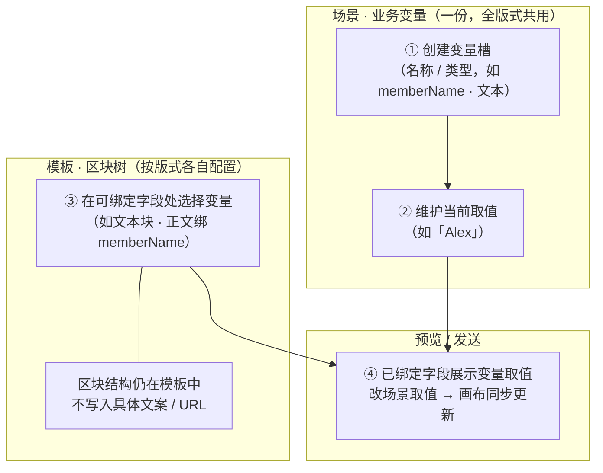
```mermaid
flowchart TB
  subgraph scene["场景 · 业务变量（一份，全版式共用）"]
    A["① 创建变量槽<br/>（名称 / 类型，如 memberName · 文本）"]
    B["② 维护当前取值<br/>（如「Alex」）"]
    A --> B
  end

  subgraph template["模板 · 区块树（按版式各自配置）"]
    C["③ 在可绑定字段处选择变量<br/>（如文本块 · 正文绑 memberName）"]
    D["区块结构仍在模板中<br/>不写入具体文案 / URL"]
    C --- D
  end

  subgraph canvas["预览 / 发送"]
    E["④ 已绑定字段展示变量取值<br/>改场景取值 → 画布同步更新"]
  end

  B --> E
  C --> E
```

| 步骤 | 在哪里做 | 做什么 | 在画布上看到什么 |
| --- | --- | --- | --- |
| ① 创建变量槽 | 场景 · 业务变量 | 新建变量 **key**（槽），并声明类型（文本 / 链接 / 图片等） | 尚无展示，仅目录中出现该变量 |
| ② 维护取值 | 场景 · 业务变量 | 为该槽填写或接入**当前值**（如会员名、跳转链接） | 仍不直接画在模板上；供已绑定字段读取 |
| ③ 字段绑定 | 模板 · 某区块 Inspector | 在**允许绑定**的配置项上，从同类型变量列表中选择该槽 | 模板只记录「绑了谁」，不写死字面量 |
| ④ 取值展示 | 预览 / 发送 | 渲染时用场景中的**当前取值**填入该字段 | 文本显示字符串、按钮带上链接、底图换上 URL 等 |

**要点：**

- **一份数据、多处绑定**：同一变量槽可被多个版式、多个区块字段绑定；改变量取值，所有绑定处一起更新。
- **不是列表复制**：标量绑定**不会**因变量而增加区块份数；区块树结构由模板决定，变的只是字段内容。按条数复制区块属于列表变量能力，与标量绑定不同。
- **类型须一致**：绑定时仅展示与字段兼容的变量类型（如链接字段只能选链接型槽）。

### 变量类型

场景里可为每个变量槽声明下列类型之一（与编辑器变量类型约定一致，不得自定类型名）：

| 变量类型 | 能配什么（取值形态） | 在画布上看到什么 |
| --- | --- | --- |
| 文本 | 字符串 | 文本：绑了该变量的标题、按钮文案、替代文字等显示字符串内容。 |
| 链接 | URL 字符串 | 链接：绑了该变量的跳转地址、底图链接等可点击或用于跳转的 URL。 |
| 图片 | 图片 URL | 图片：绑了该变量的底图地址、图标素材等显示对应图片。 |
| 颜色 | 颜色值；支持透明度 | 颜色：绑了该变量的颜色类字段显示该颜色（按场景约定使用）。**不可**作为区块显隐的「条件变量」。 |
| 数值 | 数字 | 数值：绑了该变量的进度、计数等显示对应数字。 |
| 布尔 | **真 / 假**（场景取值下拉二选一，存 JSON `true` / `false`） | 布尔：多用于开关型判断或与业务规则联动，一般不直接当正文展示；**不能**手输其它字符串。 |
| 列表 | 多行记录；每行含若干列 | 列表：驱动容器按条数重复排版；列定义、列表重复与内置商品等见下文「列表变量」。 |

### 可绑定业务变量的配置项

> **说明：** 下表列出**允许绑定业务变量的范围**（**列表**型与 **布尔**型见变量类型表及列表变量小节，不在此表重复展开）。具体模板里、哪个区块的哪个字段绑哪一个变量，须在**该模板的区块树中逐个配置**。字段与变量类型须一致（如链接字段绑链接变量）；编辑器会按字段类型筛选可绑变量。

**段内样式：** [§5.3](#53-文本) 的**片段·颜色**、**片段·字号**仅写字面量，**不绑**主题与业务变量；段内**文字内容**可绑**文本**变量（表中「正文·片段」）。

#### 画布根

| 配置项 | 可绑定的变量类型 |
| --- | --- |
| 内容区底图·地址 | 图片、链接 |
| 内容区底图·跳转链接 | 链接、文本 |
| 内容区底图·替代文字 | 文本、链接、数值 |

#### 外壳层（八种区块一致）

| 配置项 | 可绑定的变量类型 |
| --- | --- |
| 底图·地址 | 图片、链接 |
| 底图·跳转链接 | 链接、文本 |
| 底图·替代文字 | 文本、链接、数值 |

#### 块内配置（按区块类型）

| 区块类型 | 配置项 | 可绑定的变量类型 |
| --- | --- | --- |
| 布局容器 | — | 块内无标量内容字段；列表重复在列表变量小节说明 |
| 栅格 | — | 同上 |
| 图片 | — | 块内无标量内容字段；列表重复在列表变量小节说明 |
| 文本 | 正文·整段 | 文本、链接、数值 |
| 文本 | 正文·片段（段内横拼中的一段文字） | 文本、链接、数值 |
| 文本 | 片段·链接 | 链接、文本 |
| 图标 | 图标素材 | 图片、链接 |
| 图标 | 点击链接 | 链接、文本 |
| 按钮 | 按钮文案 | 文本、数值 |
| 按钮 | 跳转链接 | 链接、文本 |
| 分割线 | — | 块内仅样式字段，不绑业务变量 |
| 进度条 | 当前值、最大值 | 数值 |

### 7.1 列表变量

**列表**型变量用于「多行同类内容」：在场景里维护条数与每列取值；模板侧在**容器类区块**上开启列表绑定，再指定「行模板」按条数复制。列定义在场景侧与变量一并维护。与标量绑定的区别：列表会**按条数增加区块份数**，而非仅替换字段文案。

### 列表变量与容器区块的绑定关系

列表变量同样遵循「**先建槽、再在模板上绑、取值驱动复制与填充**」，但绑定入口与复制规则不同于标量。

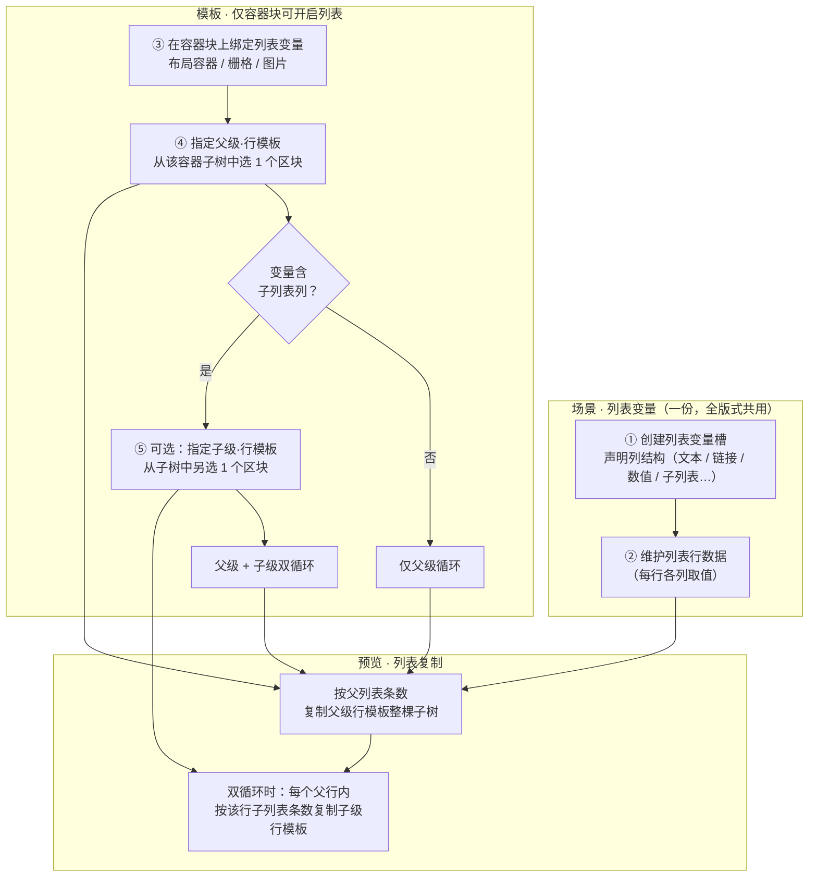
```mermaid
flowchart TB
  subgraph scene["场景 · 列表变量（一份，全版式共用）"]
    A["① 创建列表变量槽<br/>声明列结构（文本 / 链接 / 数值 / 子列表…）"]
    B["② 维护列表行数据<br/>（每行各列取值）"]
    A --> B
  end

  subgraph host["模板 · 仅容器块可开启列表"]
    C["③ 在容器块上绑定列表变量<br/>布局容器 / 栅格 / 图片"]
    D["④ 指定父级·行模板<br/>从该容器子树中选 1 个区块"]
    E{"变量含<br/>子列表列？"}
    F["⑤ 可选：指定子级·行模板<br/>从子树中另选 1 个区块"]
    C --> D --> E
    E -->|否| G["仅父级循环"]
    E -->|是| F --> H["父级 + 子级双循环"]
  end

  subgraph canvas["预览 · 列表复制"]
    I["按父列表条数<br/>复制父级行模板整棵子树"]
    J["双循环时：每个父行内<br/>按该行子列表条数复制子级行模板"]
    G --> I
    H --> I --> J
  end

  B --> I
  D --> I
  F --> J
```

| 步骤 | 在哪里做 | 做什么 | 在画布上看到什么 |
| --- | --- | --- | --- |
| ① 创建列表槽 | 场景 · 业务变量 | 新建**列表型**变量，声明列（含是否含**子列表**列） | 变量目录中出现该列表；尚无区块复制 |
| ② 维护列表数据 | 场景 · 业务变量 | 填写行数与各列取值（或配置内置商品/专辑范围） | 决定父列表条数；有子列表时决定每行内层条数 |
| ③ 绑定列表变量 | 模板 · **容器块** Inspector | 仅在 [§5.1 布局容器](#51-布局容器)、[§5.2 栅格](#52-栅格)、[§5.4 图片](#54-图片) 上可选择并开始列表绑定 | 该容器成为列表**宿主**；文本/按钮等不可作为宿主 |
| ④ 指定父级·行模板 | 模板 · 宿主容器子树 | 在宿主**子级**中点选**一个**区块作为父级复制模板（可为容器类或非容器类） | 列表按父列表条数复制该区块；见下「行模板复制规则」 |
| ⑤ 指定子级·行模板 | 模板 · 同上子树（仅当变量含子列表列） | 再点选**另一个**区块作为子列表复制模板，并绑定子列表列 | 先复制父级行，再在每行内按子列表条数复制子级模板；见下图 |

**行模板复制规则：**

- 父级·行模板、子级·行模板均从列表宿主容器的**子树**内挑选（子级下的容器块或内容块均可）。
- 复制时以所选区块为根，**整棵子树一并复制**：若行模板是**容器类**（如一行布局容器、栅格），则**容器 + 其全部子区块**作为一份复制单元；若行模板是**非容器类**（如单独一张文本、按钮），则只复制该块本身。
- **无子列表列**的列表变量（含内置 **按 SKU** 扁平行）：只能配置**父级·行模板**（1 个），循环模式为**仅父级循环**。
- **含子列表列**的列表变量（**按 SPU**）：除父级·行模板外，可再配置**子级·行模板**（1 个），循环模式为**父级 + 子级双循环**——先按父列表复制父模板，再在每一父行内按该行子列表数据复制子模板（参见 [list-repeat-parent-child-loop.png](prd-assets/list-repeat-parent-child-loop.png)）。
- 若要在邮件中**只展示规格块、不展示 SPU 卡**：优先用场景 **按 SKU** + 模板仅父级循环；或用 **按 SPU + 双循环** 但父级行模板不含任何 SPU 可见字段（仅作结构壳）。

**子级·行模板选取约束：**

- **不得与父级·行模板为同一区块**（同一节点不能既当父行模板又当子行模板）。
- 子级·行模板通常选在父级·行模板**内部**的某个子区块（如父模板=商品行容器，子模板=行内规格横条）；不得选列表宿主自身或父模板之外的无关分支（实现上仅允许宿主子树内、且符合嵌套深度上限的候选）。

**绑定位置（宿主容器）：** 列表重复**仅允许**在下列三类**容器区块**上开启绑定（块内配置与布局容器对齐）：

- [§5.1 布局容器](#51-布局容器)
- [§5.2 栅格](#52-栅格)
- [§5.4 图片](#54-图片)（底图 + 叠放子级，列表重复语义与布局容器相同）

**不得**在画布根、文本、按钮、图标、分割线、进度条等区块上开启列表绑定。

**嵌套上限：** 列表变量**最多 2 级**。第 1 级为场景中的列表槽；其列定义里可再声明一列「子列表」类型（第 2 级）。第 2 级子列表的列里**不得再声明列表类型**；模板侧「父级 + 子级双循环」亦不得超过这一深度（见下表「列表·循环模式」）。

**列表列（子项）类型：** 在场景业务变量中为列表声明的**每一列**，其类型只能是下列之一（与仓库列表列契约一致；**不含**场景级变量里的图片、颜色、布尔等类型）：

| 列类型 | 能配什么（取值形态） | 在画布上看到什么 |
| --- | --- | --- |
| 文本 | 字符串 | 文本：映射到模板字段后，每行显示该列字符串（如标题、说明）。 |
| 链接 | URL 字符串 | 链接：每行显示该列链接（如商品链接、按钮跳转）。 |
| 数值 | 数字 | 数值：每行显示该列数字（如价格、数量）。 |
| 子列表 | 多行子记录；子列仍须为文本 / 链接 / 数值 | 子列表：仅**第 1 级**列表可声明；该行下再按子列表条数展开；子列表内的列不可再含子列表（见上「嵌套上限」）。 |

#### 模板侧 · 列表重复配置

列表的**行数据**在场景业务变量中维护；**模板**在 [§5.1](#51-布局容器) / [§5.2](#52-栅格) / [§5.4](#54-图片) 等容器块上配置**列表重复**，把变量中的每一行接到区块树上。下列为模板侧可配置项（场景里配置范围/抽取/排序见后文「内置列表 · 场景配置」；**物化重绑**为编辑器画布能力，用于解除/重绑列表后恢复行结构与映射，**不是**下表配置项）。

| 配置项 | 能配什么 | 在画布上看到什么 |
| --- | --- | --- |
| 列表·数据源 | **自定义列表**，或 **内置列表**（商品列表 / 商品专辑列表） | 列表·数据源：**自定义**时行与列由场景手填或导入；**内置**时行来自 Shoplazza 商品/专辑（选取方式见后文），列项为内置支持的展示字段。 |
| 列表·绑定变量 | 绑定到场景中某一个**列表型**业务变量槽 | 列表·绑定变量：预览**重复份数** = 列表当前行数（按 SPU 时为商品数；按 SKU 时为勾选规格总数，如 8 个 SKU 复制 8 份）。 |
| 列表·父级行模板 | 从宿主子树中选 **1 个**区块作为父级复制根 | 列表·父级行模板：按父列表条数复制该区块整棵子树（容器类则含全部子项）；无子列表列时仅此一项。 |
| 列表·子级行模板 | 含子列表列时，再选 **1 个**区块；**不得**与父级行模板为同一区块 | 列表·子级行模板：在每个父行内按该行子列表条数复制；用于规格横条等内层重复。 |
| 列表·字段映射 | 列表各列 ↔ 父级/子级行模板内字段 | 列表·字段映射：每一份复制出来的区块，按映射填入**对应行、对应列**的值。 |
| 列表·循环模式 | 由场景**列表行粒度**决定（内置商品列表）或见子列表列（自定义 / 按 SPU） | **按 SKU 扁平行**：仅**仅父级循环**，复制份数 = SKU 行数。**按 SPU**：无子列表列则仅父级；有子列表列可 **父+子双循环**。 |

**循环模式说明：**

- **仅父级循环**：商品栅格、专辑入口；或 **按 SKU** 时每个复制单元就是一个规格块（邮件里可不画 SPU 卡，只画规格区）。
- **父级 + 子级双循环**：仅 **按 SPU** 且变量含**子列表**列时；多个商品卡、每卡内规格横条。与 **按 SKU 扁平行** 不同：后者是「A 的 3 个规格 + B 的 5 个规格」混成 8 行，**不按商品分组复制外层卡**。
- 绑定内置商品列表且场景为 **按 SKU** 时，**不得**配置子级行模板 / 双循环；字段映射仅针对 **SKU 行项**（及行内可选冗余商品字段）。
- 切换循环模式、粒度或绑定变量时，编辑器可通过**物化重绑**（画布能力）清理旧复制结构，避免残留行与映射错乱。

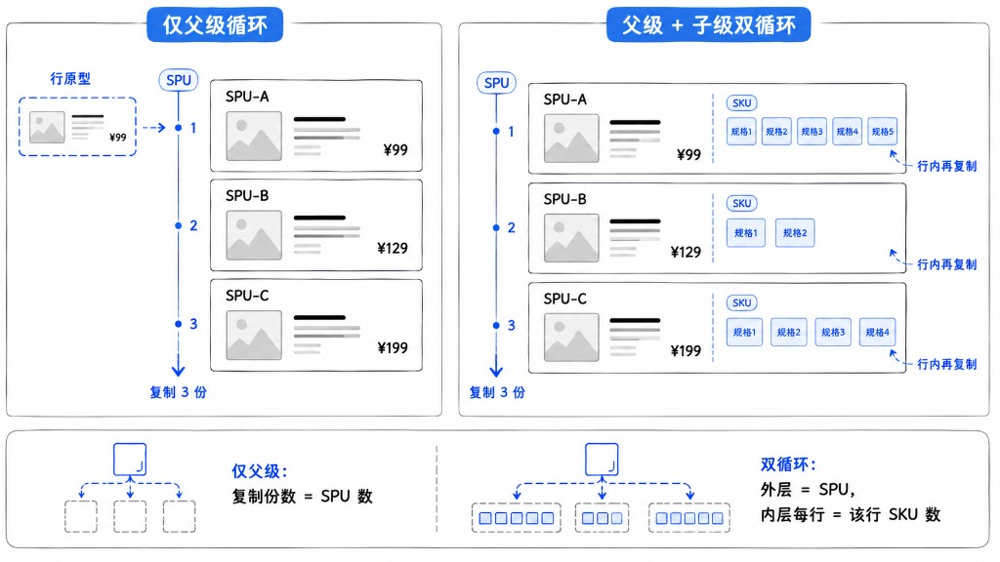

#### 内置列表变量一览

除用户自建列表外，系统内置 **商品列表**、**商品专辑列表** 两类取值。数据结构与 Shoplazza [List Products](https://www.shoplazza.dev/reference/list-products-v2025-06)、[Get Collection List](https://www.shoplazza.dev/reference/collection-list-v2025-06) 对齐，但**仅向配置侧暴露邮件里常用的展示项**（编号、SEO、库存、条码、排序规则等后台字段不进入变量面板，以减轻映射负担）。

| 内置列表 | 每行表示 | 结构说明 |
| --- | --- | --- |
| 商品列表 | 见 **列表行粒度** | **按 SPU**：一行一件商品，可选「规格列表」子列 + 模板双循环。**按 SKU**：一行一个规格，可跨多个商品、每商品只选部分 SKU；模板仅父级循环（见下）。 |
| 商品专辑列表 | 一个商品专辑（Collection） | 一行一个系列/专辑入口；无子列表。口语「专辑」= 店匠商品专辑，非音乐专辑。 |

#### 内置列表 · 场景配置（范围 / 抽取 / 排序）

在场景的**业务变量**里，为内置列表槽配置「候选范围、抽取与排序」；模板侧只绑定列表变量与字段映射，不重复维护商品/专辑 ID。下列为两类内置列表在场景侧的**专用配置项**（对接 Shoplazza 商品与专辑接口；编辑器预览可用内置 mock）。

##### 内置·商品列表 · 场景配置（粒度 / 范围 / 抽取 / 排序）

每个**内置商品列表**槽，在场景业务变量中除列定义外，还须配置下列项（与模板侧列表重复正交）。

**0. 列表行粒度**（二选一，决定 `values` 一行代表什么、模板用哪种循环）：

| 列表行粒度 | 场景 `values` 形态 | 模板循环 | 典型邮件模块 |
| --- | --- | --- | --- |
| **按 SPU（商品）** | 每行一件商品；可有「规格列表」子列 | **仅父级**，或 **父级 + 子级双循环**（有子列表列时） | 商品栅格、多商品卡、每卡下规格横条 |
| **按 SKU（规格）** | 每行一个规格；多商品的部分 SKU 合并为**一条扁平行列表** | **仅父级循环**；行模板 = 规格块，**可不展示 SPU 区块** | 混排规格条、多商品各选若干色号/尺码 |

**示例（按 SKU）：** 商品 A 有 5 个 SKU，运营只勾 3 个；商品 B 勾 5 个 SKU → 列表共 **8 行**（每行一个 SKU，均带所属 SPU 信息），不是 2 行 SPU。

- 切换粒度时应清空选取、列定义与模板侧重绑（画布可用物化重绑恢复）。
- **按 SKU** 时槽上**不声明**「规格列表」子列类型；规格字段为**行级列**，见下节「内置·商品列表 · 支持的项」中 **按 SKU** 表。

##### 场景面板 · 商品范围与粒度怎么配

内置**商品列表**在场景业务变量里，除抽取/排序外，还须区分「面板里配什么」与「弹窗里选什么」：

| 配置项 | 能配什么 | 在画布上看到什么 |
| --- | --- | --- |
| 列表行粒度 | **按 SPU（商品）** 或 **按 SKU（规格）** 二选一 | 决定列表一行是一件商品还是一个规格；**按 SKU** 时模板只能**仅父级循环**（见上文「列表·循环模式」）。 |
| 商品范围（摘要） | 只读，展示当前已选范围的**一句话结论** | 如「已选 3 个商品 · 按 SPU」「已选 5 个规格（SKU）」「专辑「夏日系列」内商品 · 按 SKU」「全部商品 · 按 SPU」等。 |
| 选择商品… | 打开**选择商品**弹窗，确定范围并勾选 | 具体勾选在弹窗完成；面板不展开整页商品树。 |

- **列表行粒度**在场景面板改；**选哪些商品/规格、选哪家专辑、是否全店**在「选择商品…」弹窗里改（见下节）。
- 改完场景配置后须**保存变量**，顶栏**保存**后才会写入场景数据；否则刷新可能丢失。

**1. 商品范围模式**（三选一；在「选择商品…」弹窗顶栏切换，互斥）：

| 范围模式 | 能配什么 | 在画布 / 发送上看到什么 |
| --- | --- | --- |
| **自由选择商品** | **按 SPU**：弹窗 **SPU** 页签，表格多选商品（商品信息、售价、库存）。**按 SKU**：弹窗 **SKU** 页签，展开商品后多选规格（可跨多个商品） | **按 SPU**：列表行 = 已勾选商品。**按 SKU**：列表行 = 已勾选规格之和（如 A 的 3 个 + B 的 5 个 = 8 行），**不是** 2 行商品卡。 |
| **全部商品** | 弹窗 **全部商品** 页签；无需勾选，确认即表示「店铺在售全集」为候选池 | 摘要如「全部商品 · 按 SPU/SKU」；**按 SKU** 时仍可在弹窗 **SKU** 页签里只勾部分规格（若产品允许二次收窄），或结合列表长度控制展示条数。 |
| **按商品专辑取商品** | 弹窗 **专辑** 页签，**单选一个**商品专辑（见下「两种选专辑」） | 候选池 = 该专辑内商品；**按 SPU** 再勾商品，**按 SKU** 再勾规格。换专辑应清空原勾选。 |

- 三种模式互斥；切换页签或模式时应清空或重新确认原勾选。
- **最多展示条数**：**按 SPU** 时对商品行数截断；**按 SKU** 时对 **SKU 总行数**截断（全局上限，非每商品各 N 个）。可在场景配置**列表长度**（及模板列表重复上限）体现；截断顺序须在编辑器中向运营说明（如勾选顺序、售价、名称等）。

##### 选择商品… 弹窗（内置商品列表）

点场景面板 **「选择商品…」** 后，用顶栏页签完成范围与勾选（确认后更新摘要并驱动预览）：

| 页签 | 能配什么 | 在画布上看到什么 |
| --- | --- | --- |
| **SPU** | 搜索、筛选；表格**多选**商品（商品信息、售价 CAD、库存等） | **按 SPU** 粒度下，列表按所选商品数复制父级行模板（商品卡）。 |
| **SKU** | 搜索、筛选；商品行可**展开**，子行**多选**规格 | **按 SKU** 粒度下，列表按所选规格总数复制；每行一块规格（图+规格名+价等），**可不画 SPU 商品卡**。 |
| **专辑** | 表格**单选**一个商品专辑（专辑信息、商品数量） | 范围变为「该专辑内的商品」；未选专辑时不可确认。 |
| **全部商品** | 说明文案 + 确认即可，无需勾选 | 范围变为全店在售商品；列表行粒度仍服从场景面板的「按 SPU / 按 SKU」。 |

弹窗底部须展示已选数量（如「已选中 N 个商品」「已选中 N 个规格」「已选中 1 个专辑」）；未满足最少选择时**确认**不可用。

**按 SKU 时在弹窗内勾选规格的约定**（**自由选择**、或已用专辑/全店划定候选池之后）：

| 规则 | 说明 |
| --- | --- |
| 勾选规格 | 须能识别其所属商品；取消商品时，其下已选规格一并取消。 |
| 部分规格 | 同一商品可只勾部分规格（如 5 个 SKU 只勾 3 个）。 |
| 多个商品 | **允许**商品 A 勾部分规格 + 商品 B 勾部分规格，合并成**一条扁平行列表**（见上 8 行示例）。 |
| 只选商品、不选规格 | **按 SKU** 粒度下**不产生列表行**；可提示运营改勾规格或改回 **按 SPU**。 |
| 预览与发送 | 列表取值一行一个规格；可选映射「所属商品名」等，便于混排时区分来源。 |

##### 两种「选专辑」要分清

| 用在哪 | 入口 | 能配什么 | 在画布上看到什么 |
| --- | --- | --- | --- |
| **商品列表** · 范围「按商品专辑取商品」 | 「选择商品…」弹窗 · **专辑** 页签 | **单选**一个专辑 | 列表行来自**该专辑内的商品**（再按 SPU/SKU 勾选）；不是「一行一个专辑」。 |
| **商品专辑列表** 变量 | 场景面板 **「选择专辑…」** | **多选**多个专辑（可全选当前列表） | 列表**一行一个专辑入口**（封面、专辑名、链接等）；不涉及展开专辑内商品。 |

- 口语「专辑」均指店匠**商品专辑（Collection）**，非音乐专辑。
- **商品列表**里选专辑 = 划定**商品从哪来**；**专辑列表**变量 = 邮件里直接展示**多个专辑本身**。

**2. 抽取逻辑**（在候选 SPU 池确定后；算法为 **SPU 级**，对接 Shoplazza）：

| 抽取逻辑 | 能配什么 | 在画布 / 发送上看到什么 |
| --- | --- | --- |
| **无** | 不做相似品/搭配品计算 | 候选池内商品按下方**排序方式**（或接口默认顺序）排列后取前 N 条。 |
| **相似品** | 须配置**锚定商品**（见下） | 由 Shoplazza **SPU 级**相似品算法返回排序后的商品列表（排除锚点 SPU 等规则以后端为准）。 |
| **搭配品** | 须配置**锚定商品**（见下） | 由 Shoplazza **SPU 级**搭配品算法返回排序后的商品列表。 |

**锚定商品**（仅当抽取逻辑为 **相似品** 或 **搭配品** 时必填）：

| 配置项 | 能配什么 | 说明 |
| --- | --- | --- |
| 锚定来源 | 场景中**另一个**内置**商品列表**变量槽 | 不得指向本槽自身；须为已配置的内置商品列表。 |
| 锚定序号 | 该列表中的**第几条**（从 1 起计，如第 1 条、第 2 条） | 取该行的 **SPU** 作为算法锚点；**不按 SKU 规格**参与相似品/搭配品计算。 |

- 抽取逻辑为 **相似品 / 搭配品** 时，**不展示**下方「排序方式」（顺序由算法结果决定）。
- 抽取逻辑为 **无** 时，须配置「排序方式」。
- **按 SKU** 且抽取为相似品/搭配品：算法先给出 **SPU 候选**，再在「选择商品…」弹窗 **SKU** 页签中勾选要展示的规格（或按产品规则默认每 SPU 取 1 个主推规格，须在编辑器说明中写清）。

**3. 排序方式**（仅当抽取逻辑为 **无** 时可选）：

| 排序方式 | 说明 |
| --- | --- |
| 默认 | 保持 Shoplazza / 后端返回顺序，不再重排。 |
| 名称 A→Z | **按 SPU**：商品名。**按 SKU**：可按规格名或所属商品名（实现择一并在 UI 标明）。 |
| 名称 Z→A | 同上，降序。 |
| 销量从高到低 | **按 SPU**：商品销量。**按 SKU**：规格或商品维度择一并在 UI 标明。 |
| 转化率从高到低 | 同上（商品/规格维度由实现与 Shoplazza 字段对齐）。 |
| 售价从高到低 | **按 SPU**：展示价区间。**按 SKU**：该规格售价。 |
| 售价从低到高 | 同上，升序。 |

##### 内置·商品专辑列表 · 场景配置（范围 / 排序）

**1. 专辑范围**

| 配置项 | 能配什么 | 在画布 / 发送上看到什么 |
| --- | --- | --- |
| 专辑范围（摘要） | 只读，如「未选择专辑」「已选 2 个专辑」 | 一眼看到当前选了几个系列。 |
| 选择专辑… | 打开**选择专辑**弹窗：搜索、**多选**（含全选当前列表）；列：专辑信息、商品数量 | 确认后列表行数 = 所选专辑数；每行一个专辑入口（封面、名称、链接等）。 |

- 不涉及专辑内商品展开——那是**商品列表 · 按商品专辑取商品**（在「选择商品…」弹窗里**单选**专辑）。
- 未选专辑时列表为空；预览应提示先点「选择专辑…」。

**2. 排序方式**

| 排序方式 | 说明 |
| --- | --- |
| 默认 | 保持 Shoplazza / 后端返回顺序。 |
| 名称 A→Z | 按专辑名称升序。 |
| 名称 Z→A | 按专辑名称降序。 |
| 销量 | 按销量排序（以后端/Shoplazza 专辑维度指标为准）。 |

#### 内置·商品列表 · 支持的项

可映射项随场景 **列表行粒度** 变化；模板字段映射时仅展示当前粒度下的列。

**按 SPU（商品行）· 商品级：**

| 项名称 | 说明 | 取值类型 |
| --- | --- | --- |
| 商品图 | 列表/卡片主图 | 链接 |
| 图片替代文字 | 商品图无障碍说明 | 文本 |
| 商品名 | 商品标题 | 文本 |
| 现价 | 展示售价（多规格时取主推或最低价） | 文本 |
| 原价 | 展示划线价 | 文本 |
| 角标 | 促销标签 | 文本 |
| 商品链接 | 商品详情 | 链接 |
| 规格列表 | 该商品下各规格；模板 **父+子双循环** 时绑定 | 子列表 |

**按 SPU · 规格列表（子列表列，第 2 级）：**

| 项名称 | 说明 | 取值类型 |
| --- | --- | --- |
| 规格图 | 规格缩略图 | 链接 |
| 图替代文字 | 规格图无障碍说明 | 文本 |
| 规格名 | 规格名称 | 文本 |
| 规格链接 | 规格详情链接 | 链接 |

**按 SKU（规格行，扁平行）· 行级：**

| 项名称 | 说明 | 取值类型 |
| --- | --- | --- |
| 规格图 | 该 SKU 主图 | 链接 |
| 图替代文字 | 规格图无障碍说明 | 文本 |
| 规格名 | 规格标题 | 文本 |
| 规格链接 | 规格详情链接 | 链接 |
| 售价 | 该规格售价 | 文本 |
| 对比价 | 该规格划线价 | 文本 |
| 所属商品名 | 冗余自 SPU，便于混排时区分商品 | 文本 |
| 所属商品链接 | 冗余自 SPU | 链接 |

- **按 SKU** 时无「规格列表」子列；上表即 `itemFields` 全集（可按模板只绑其中一部分）。
- 若邮件只需规格条、不要商品标题，行模板仅绑规格图/规格名等；若混排需标注来源，可绑「所属商品名」。

**邮件里只要规格、不要 SPU 商品卡（SKU-only 模块）怎么配：**

| 步骤 | 能配什么 | 在画布上看到什么 |
| --- | --- | --- |
| 场景 | 内置**商品列表** · **按 SKU**；「选择商品…」里勾若干规格；抽取选「无」时可配排序 | 摘要如「已选 N 个规格（SKU）」。 |
| 模板 | 列表宿主上**仅父级行模板**；行内只绑规格图、规格名、售价等，**不绑**商品名/角标/「规格列表」子循环 | 多行**规格条**纵向排列，无「一件商品一张大卡 + 底下规格横条」的双层结构。 |

- 开发验收可参考场景 **contentAlign 交互测试（开发专用）**（`align-inspector-test`）内附的 SKU-only 示例模块（含说明文案与多行规格预览）。

> **不纳入内置可选项（商品）：** 商品编号、SPU 编码、handle、供应商、品牌、商品类型、长描述、价格区间、总库存、销量、条形码、规格选项位、规格编号等——多用于后台或报表，常规营销邮件不在正文展示。对接 Shoplazza 时由实现层投影；若业务后续确需某一后台字段，再单独评审扩容。

#### 内置·商品专辑列表 · 支持的项

覆盖常见邮件模块：**系列入口、分类主推、专辑封面 + 标题跳转**等。

| 项名称 | 说明 | 取值类型 |
| --- | --- | --- |
| 封面图 | 专辑/系列封面 | 链接 |
| 封面替代文字 | 封面图无障碍说明 | 文本 |
| 专辑名 | 系列标题 | 文本 |
| 简介 | 一两句系列说明（模块有文案位时使用） | 文本 |
| 专辑链接 | 进入该专辑/系列页 | 链接 |

> **不纳入内置可选项（商品专辑）：** 专辑编号、handle、是否智能专辑、排序方式、SEO 标题/关键词/描述、创建/更新时间、图片宽高等——邮件正文通常不展示。专辑链接由店铺域名与专辑标识在实现层拼接。

> 说明：上表为内置列表在变量面板与字段映射中的**完整可选集合**；具体模板只绑定其中一部分即可。**自建列表**的列类型仍须遵守上文「列表列（子项）类型」；模板侧重复与映射见上文「模板侧 · 列表重复配置」。

---

### 8. 按变量显示或隐藏模块

除**画布根**外，任意区块可在 Inspector **「显隐」**页签配置是否显示。逻辑只有一层，等价于：

**若（所配条件成立）→ 显示本区块及全部子区块；否则 → 不显示（整块隐藏，不占位）。**

### 产品原则（单层 if，不做复合条件）

| 原则 | 能配什么 | 在画布上看到什么 |
| --- | --- | --- |
| **默认始终可见** | **不配置**显隐，或显隐选 **「始终显示」** | 该区块在预览与发送中**一直出现**；这是未配置时的默认行为，无需额外操作。 |
| **仅单层 if** | 每个区块最多 **1 个条件变量 + 1 种判断方式**（可选比较值） | 只判断「这一个条件」成不成立；成立则显示，不成立则隐藏。 |
| **不做 AND / OR** | **不支持**「条件 A 并且条件 B」「条件 A 或者条件 B」 | 不能配多条条件组合；需要「既要优惠码不为空又要 VIP」时，须在场景侧合成一个变量，或拆成多个区块分别配显隐（产品上不保证组合语义）。 |
| **不做嵌套条件组** | **不支持**括号、优先级、多段表达式 | 不是通用公式编辑器，只是「看一个变量 → 选一种比法 → 显示或不显示」。 |

- 判断依据来自**场景业务变量**当前取值，不是模板里写死的文案、主题档位或段内写死颜色。
- **条件变量**只能从场景 **业务变量** 列表里选（与字段绑变量同源）；**颜色**型变量槽**不会**出现在显隐下拉里（即使场景里已创建）。
- **画布根**不可配显隐（整封邮件始终存在版心壳）。

### 在哪里配

| 配置项 | 能配什么 | 在画布上看到什么 |
| --- | --- | --- |
| 显隐页签 | 选中画布上某一区块后，在 Inspector 打开 **「显隐」** | 与「内容 / 样式 / 布局 / 列表」并列；邮件根节点无此页签。 |

### 显示方式

| 配置项 | 能配什么 | 在画布上看到什么 |
| --- | --- | --- |
| 显示方式（默认） | **始终显示** — 未改过时即为此项 | **始终可见**：该块在预览里一直出现；模板里**不写入**显隐规则。 |
| 显示方式 | **条件显示** | **单层 if**：须再选「条件变量」与判断方式；**仅当**该条件成立时显示，**否则**本块及子级整体隐藏。 |

- **默认**：新建区块、从未打开过「显隐」页签时，视同 **始终显示**（始终可见）。
- 从「条件显示」改回「始终显示」时，应清除已配条件，恢复为始终可见。
- 场景中尚无可用于判断的变量时，无法启用「条件显示」，须先在场景业务变量中创建并维护取值（含列表槽）。

### 条件显示 · 通用配置项

在「显示方式」为 **条件显示** 时，须配置下列项（缺一不可）：

| 配置项 | 能配什么 | 在画布上看到什么 |
| --- | --- | --- |
| 条件变量 | 从场景 **业务变量** 中选 **1 个**；仅 **文本、链接、图片、数值、布尔、列表** 六类（见下表） | 例如会员名、优惠码、是否 VIP、某商品列表等；**不含**颜色型变量；切换变量时判断方式按新类型重置。 |
| 满足条件时显示 | 选一种**判断方式**（随条件变量类型变化，见下节） | **成立 → 显示；不成立 → 隐藏**（仅此一条 if，无第二条件）。 |
| 比较值 | 仅当所选判断方式需要对比时填写（文本、数字或真/假） | 如「优惠码 **等于** REWARD-25」「列表长度 **大于** 0」；不需要对比的方式（如「为空」）不出现此项。 |

### 条件变量类型与判断方式一览

先选**条件变量**，「满足条件时显示」下拉**只出现该类型允许的选项**；切换变量类型后，判断方式会换一套，已填比较值可能清空。

| 条件变量类型 | 判断的是什么 | 可选判断方式（下拉，共 4～8 项） | 是否要填「比较值」 |
| --- | --- | --- | --- |
| **文本** | 该变量的文案内容 | 为空、不为空、等于、不等于 | **等于 / 不等于** 时须填一段文字 |
| **链接** | 该变量的链接地址（URL） | 为空、不为空、等于、不等于 | **等于 / 不等于** 时须填链接地址 |
| **图片** | 该变量的图片地址（URL） | 为空、不为空、等于、不等于 | **等于 / 不等于** 时须填图片地址；常用「不为空」表示有图才显示 |
| **数值** | 该变量的数字 | 为空、不为空、等于、不等于、大于、大于等于、小于、小于等于 | **为空 / 不为空** 不需填；**比较类**须填数字 |
| **布尔** | 是否已赋值及真 / 假 | 为空、不为空、为真、为假 | **均不需**比较值 |
| **列表** | 该列表**一共有几行**（列表长度）；运算符见下文「列表」小节 | 两类：**有无数据**（空 / 非空）、**长度比较**（等于 / 大于 / 大于等于 / 小于 / 小于等于） | **长度*** 类须填整数 N；**空 / 非空** 不需填 |

- **不支持颜色型变量**作条件：场景里若有「颜色」类业务变量，只用于绑颜色字段，**不会**进入显隐「条件变量」下拉（与主题色、段内颜色无关）。
- **为空 / 不为空（兼容）**：凡可作条件变量的类型均提供（列表为 **数组为空 / 数组不为空**）。用于对接方**未传、传错类型**或场景里**尚未赋值**时仍能配显隐；语义因类型而异，见各小节。
- **文本 / 链接 / 图片** 三类另提供「等于 / 不等于」，比较值形态分别为文案、URL。
- **列表** 判断的是**整表行数**，不是某一列「商品名」「价格」等行内字段（行内条件不做）。

### 文本 · 链接 · 图片

适用场景变量类型：**文本、链接、图片**（类型见「变量类型」表）。判断的是该变量在场景里的**当前取值**是否为空、是否等于某段内容。

| 判断方式（下拉选项） | 能配什么 | 在画布上看到什么 |
| --- | --- | --- |
| 为空 | 不需比较值 | 场景里**未赋值**、空串或仅空白时，**显示**本块。 |
| 不为空 | 不需比较值 | 场景里**有非空内容**时，**显示**本块。 |
| 等于 | 须填一段文本（链接/图片即填 URL） | 与场景取值**完全一致**时显示。 |
| 不等于 | 须填一段文本（同上） | 与场景取值**不一致**时显示。 |

### 数值

适用场景变量类型：**数值**。先可按**是否已有合法数字**判断，再可按与比较值的大小关系判断。

| 判断方式（下拉选项） | 能配什么 | 在画布上看到什么 |
| --- | --- | --- |
| 为空 | 不需比较值 | 场景里**未赋值**，或传入内容**不是合法数字**时，**显示**本块（兼容对接漏传、类型错误）。 |
| 不为空 | 不需比较值 | 场景里已是**合法数字**（含 0）时，**显示**本块。 |
| 等于 | 须填数字 | 场景数值 **=** 比较值时显示。 |
| 不等于 | 须填数字 | 场景数值 **≠** 比较值时显示。 |
| 大于 | 须填数字 | 场景数值 **>** 比较值时显示。 |
| 大于等于 | 须填数字 | 场景数值 **≥** 比较值时显示。 |
| 小于 | 须填数字 | 场景数值 **<** 比较值时显示。 |
| 小于等于 | 须填数字 | 场景数值 **≤** 比较值时显示。 |

- **为空** 时不会把 **0** 当成「空」；0 是有效数字，须用 **等于 0**、**小于等于 0** 等比较类运算符。

### 布尔

适用场景变量类型：**布尔**（开关型变量）。场景侧维护取值时只能从 **真 / 假** 下拉选择（对应 `true` / `false`），不能当作文本手输。

| 判断方式（下拉选项） | 能配什么 | 在画布上看到什么 |
| --- | --- | --- |
| 为空 | 不需比较值 | 场景里**尚未赋值**，或传入**不是真/假**时，**显示**本块（兼容对接漏传、类型错误）。 |
| 不为空 | 不需比较值 | 场景里已明确为 **真** 或 **假** 时，**显示**本块（不关心具体真还是假）。 |
| 为真 | 不需比较值 | 场景里为 **真** 时显示本块（如「是否 VIP」为真才露出权益区）。 |
| 为假 | 不需比较值 | 场景里为 **假** 时显示本块。 |

- **为空** 表示「没有布尔取值」；**为假** 表示「取值是假」——二者不同：未赋值走 **为空**，已赋 **假** 走 **为假**。

### 列表

适用场景变量类型：**列表**。显隐里对列表**只有一种判断方式**：按场景里该列表**当前有多少行**（列表长度）决定显示与否；配置时先理解「判断方式」，再在「满足条件时显示」下拉里选具体**运算符**。

#### 判断方式（列表仅这一种）

| 项目 | 能配什么 | 在画布上看到什么 |
| --- | --- | --- |
| 判断对象 | **整表行数**：场景里该列表变量当前有几条记录（行） | 例如商品列表 5 行、手填列表 0 行；改场景取值或内置商品/专辑配置后，行数变，显隐结果跟着变，须重新预览。 |
| 不支持的判断 | **不能**按「第 2 行商品名」「某一列价格」等**行内字段**做条件 | 行内条件不做；若业务要「某字段有值才显示」，须在场景侧合成布尔/文本变量，或拆区块分别配显隐。 |
| 与列表重复的关系 | 显隐只看**场景里该列表变量的当前行数**，与模板里是否已做「列表重复」排版无关 | 场景里列表 0 行时，「数组不为空」不成立；场景有行且模板已绑列表重复，画布才会既露出模块又按行复制排版。 |

#### 支持的判断运算符

在「满足条件时显示」下拉中，列表型条件变量可选下列**运算符**（与编辑器文案一致）；选好后，仅 **长度*** 类须再填整数 **N**（比较值）。

**A. 有无数据（不需比较值）**

| 运算符（下拉选项） | 能配什么 | 在画布上看到什么 |
| --- | --- | --- |
| 数组为空 | 不需比较值 | 列表 **0 行**，或场景里**尚未赋值 / 不是列表形态**时，**显示**本块（兼容对接漏传；与文本类「为空」同类，列表专用文案）。 |
| 数组不为空 | 不需比较值 | 列表 **至少有 1 行** 时显示本块（如「有推荐商品才展示商品区」）。 |

**B. 列表长度与 N 比较（须填整数 N ≥ 0）**

| 运算符（下拉选项） | 能配什么 | 在画布上看到什么 |
| --- | --- | --- |
| 长度等于 | 须填整数 N | 行数 **= N** 时显示（如恰好 4 条才显示活动条）。 |
| 长度大于 | 须填整数 N | 行数 **> N** 时显示。 |
| 长度大于等于 | 须填整数 N | 行数 **≥ N** 时显示；**N = 1** 时与「数组不为空」等价（至少一条才显示）。 |
| 长度小于 | 须填整数 N | 行数 **< N** 时显示。 |
| 长度小于等于 | 须填整数 N | 行数 **≤ N** 时显示。 |

- 内置商品列表、专辑列表等，行数随场景「选商品 / 选专辑 / 列表长度」变化；改配置后应重新看显隐预览。

### 典型用法（举例）

| 场景意图 | 建议配置 | 在画布上看到什么 |
| --- | --- | --- |
| 有优惠码才展示兑换区 | 条件变量 = 优惠码；不为空 | 没填优惠码时整块兑换模块消失。 |
| 仅 VIP 可见 | 条件变量 = 是否 VIP；为真 | 非 VIP 预览时该模块隐藏。 |
| 有推荐商品才展示栅格 | 条件变量 = 某商品列表；数组不为空 | 列表 0 条时不展示商品区。 |
| 凑满 3 件才展示进度文案 | 条件变量 = 购物车列表；长度大于等于 3 | 不足 3 件时隐藏提示条。 |

### 不适用与边界

- **不能**对画布根配置显隐。
- **不能**配置 AND / OR / 多条件组合；每个区块至多 **一条 if**（一个变量、一种判断）。
- **未配置显隐**的区块：**默认始终可见**（与显隐页签选「始终显示」效果相同）。
- 隐藏父块时，其**子块一并隐藏**（子随父级）；即使子块单独未配显隐或单独配了「始终显示」，父级不可见时子级仍不可见。
- 条件变量当次取值**类型与判断方式不匹配**（不属于各类型「为空 / 不为空」等兼容语义）时，视为条件不成立，**隐藏**本区块。
- 显隐在预览中随**场景变量取值**即时变化；发送侧须使用同一份业务数据规则，以保证与预览一致。

---

### 9. 一套数据、多套版式

### 需求期望

运营在同一**场景**下只维护**一份业务变量目录与取值**（会员名、优惠码、商品列表等），却可以用**多套版式**做出外观与结构完全不同的邮件：版式 A 可能是长图 + 单列列表，版式 B 可能是卡片宫格 + 短文案。切换版式时**不重录业务数据**，只换「用哪一棵区块树、哪些字段绑哪些变量、默认长什么样」。

**不要求每个版式都用上全部变量**：场景里可以声明很多业务变量，但**某一版式只需绑定它用到的子集**；未在本版式任何区块上绑定的变量，在该版式预览中**不出现、也不参与排版**，取值仍留在场景里供其它版式或发送侧使用。

| 期望 | 能配什么 | 在画布上看到什么 |
| --- | --- | --- |
| 一份业务变量 | 场景里建槽、填取值（含列表行数与列值）；**全场景共用同一套槽与取值** | 改一次「会员名称」，**凡绑了该变量的版式**里对应标题一起变；**没绑的版式**不受影响。 |
| 版式按需选用变量 | 各版式在区块树上**只绑需要的变量**；不必覆盖场景里全部槽 | 列表版可绑「权益清单」+「会员名称」；精简版只绑「会员名称」、不出现优惠码区块——即使场景里仍有「优惠码」取值。 |
| 多份模板结构 | 每套版式独立维护**区块树**（模块、嵌套、顺序） | 顶栏切换版式后，画布上的模块组成可以完全不同。 |
| 绑定可各不同 | 各版式在各自区块树上配置**区块参数**与**变量绑定**（子集可不同） | 同一「权益列表」在 A 版绑纵向容器重复，在 B 版绑 2×2 栅格；同一变量也可在 A 绑标题、在 B 绑按钮文案；B 版可不绑「入会优惠码」。 |
| 初始主题各不同 | 每套版式维护自己的**主题预设初始值** | 打开 A 版是白底大圆角，打开 B 版是深色紧凑间距；与业务文案无关。 |

### 关系示意

下图强调：**业务变量目录与取值只有一份**；**每套版式各有一份区块配置**，且**各自只绑定其中一部分变量**；区块上的**结构/外观参数**与**绑定到的变量**可以版式间不一致；**初始主题**也按版式分开。

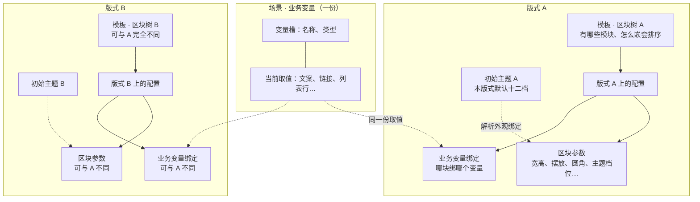
```mermaid
flowchart TB
  subgraph scene["场景 · 业务变量（一份）"]
    slots["变量槽：名称、类型"]
    values["当前取值：文案、链接、列表行…"]
    slots --- values
  end

  subgraph layoutA["版式 A"]
    treeA["模板 · 区块树 A<br/>有哪些模块、怎么嵌套排序"]
    themeA["初始主题 A<br/>本版式默认十二档"]
    cfgA["版式 A 上的配置"]
    treeA --> cfgA
    paramA["区块参数<br/>宽高、摆放、圆角、主题档位…"]
    bindA["业务变量绑定<br/>哪块绑哪个变量"]
    cfgA --> paramA
    cfgA --> bindA
  end

  subgraph layoutB["版式 B"]
    treeB["模板 · 区块树 B<br/>可与 A 完全不同"]
    themeB["初始主题 B"]
    cfgB["版式 B 上的配置"]
    treeB --> cfgB
    paramB["区块参数<br/>可与 A 不同"]
    bindB["业务变量绑定<br/>可与 A 不同"]
    cfgB --> paramB
    cfgB --> bindB
  end

  values -.->|"同一份取值"| bindA
  values -.-> bindB
  themeA -.->|"解析外观绑定"| paramA
  themeB -.-> paramB
```

### 切换版式时什么变、什么不变

| 切换顶栏版式 | 不变 | 会变 |
| --- | --- | --- |
| 从版式 A → 版式 B | 场景里业务变量的**槽与取值** | **整棵区块树**、各区块的**参数与绑定**、**本版式初始主题**下的外观 |
| 仅切换主题（不换版式） | 区块树、业务变量、绑定关系 | 当前版式下，已绑主题档位的外观（颜色、字号等） |

### 示例：欢迎会员 · 两套版式

场景 **「欢迎会员」** 维护一份业务变量：**会员名称**、**入会优惠码**、**会员权益清单**（列表）。

| 版式 | 区块树差异 | 绑定与参数差异（举例） | 初始主题（举例） |
| --- | --- | --- | --- |
| **列表版** | 标题 + 单列容器，容器上对「权益清单」做列表重复 | 标题绑「会员名称」；列表行模板绑清单各列；容器圆角、间距偏大 | 白底、正文偏大、按钮主色偏品牌蓝 |
| **四宫格版** | 标题 + 2×2 栅格，栅格上对同一清单重复 | 标题可绑「会员名称」；宫格内卡片绑清单列；**可不绑「入会优惠码」**（场景里仍有该变量，本版式未使用） | 浅灰铺底、字号略小、按钮胶囊更紧凑 |

运营在场景里填好会员名、优惠码与权益条目后，切换版式预览：**文案与列表数据不变**，**排版与模块结构**随版式切换；若在某一版式内再切换主题，则只改外观档位，仍不改业务变量。

---

### 10. 一封邮件里：谁是一份、谁有多份

本节说明**一封邮件（一个场景）**内，哪些数据**全场景只有一份**、哪些数据**按版式各有一份**。与 [§9 一套数据、多套版式](#9-一套数据多套版式) 一致：**业务变量一份、版式可多份、每套版式各自一份模板与本版式主题样式预设**；编辑时还可**随时切换公共主题**（见 [§6](#6-外观主题与配色)）。

### 结构总览

下图除场景与版式外，单独标出**主题样式预设**两条线：**每套版式自带一份**（内含一条或多套十二档样式预设，作该版式的默认主题来源），以及**全项目公共主题**（不随场景复制，编辑当前版式时可在顶栏**随意切换**选用，不改区块树与业务变量）。

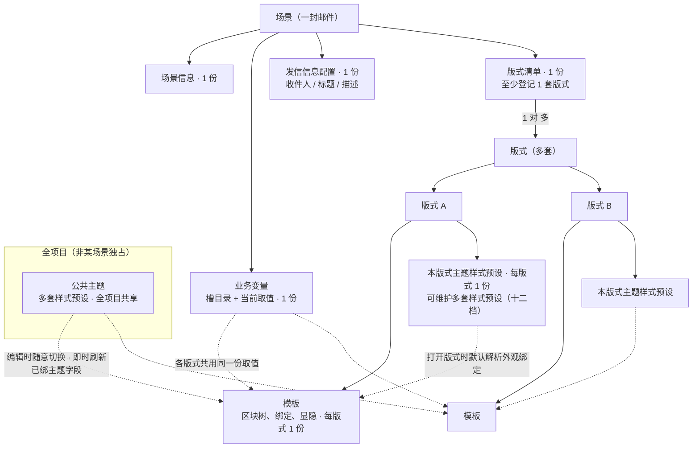
```mermaid
flowchart TB
  scene["场景（一封邮件）"]

  scene --> info["场景信息 · 1 份"]
  scene --> bv["业务变量<br/>槽目录 + 当前取值 · 1 份"]
  scene --> sendCfg["发信信息配置 · 1 份<br/>收件人 / 标题 / 描述"]
  scene --> manifest["版式清单 · 1 份<br/>至少登记 1 套版式"]

  manifest -->|"1 对 多"| layouts["版式（多套）"]

  layouts --> vA["版式 A"]
  layouts --> vB["版式 B"]

  vA --> treeA["模板<br/>区块树、绑定、显隐 · 每版式 1 份"]
  vA --> localA["本版式主题样式预设 · 每版式 1 份<br/>可维护多套样式预设（十二档）"]

  vB --> treeB["模板"]
  vB --> localB["本版式主题样式预设"]

  subgraph global["全项目（非某场景独占）"]
    pub["公共主题<br/>多套样式预设 · 全项目共享"]
  end

  bv -.->|"各版式共用同一份取值"| treeA
  bv -.-> treeB
  localA -.->|"打开版式时默认解析外观绑定"| treeA
  localB -.-> treeB
  pub -.->|"编辑时随意切换 · 即时刷新已绑主题字段"| treeA
  pub -.-> treeB
```

| 主题相关 | 归属 | 与场景的关系 | 编辑时的行为 |
| --- | --- | --- | --- |
| **本版式主题样式预设** | 挂在**某一套版式**下 | **1 场景 : 多版式**，**每版式 1 份**；内含一条或多条样式预设（每条 = 一套十二档） | 打开该版式时，默认用**本版式自己的**样式预设解析模板里已绑定主题的外观；可在本版式预设的多套主题条目间切换 |
| **公共主题** | **全项目**共享 | **不**计入「一个场景里几份」；所有场景、所有版式编辑时均可选用 | 顶栏把样式来源切到某一**公共主题**后，当前版式预览里所有已绑主题的字段按该公共主题的十二档**一并刷新**；可随时切回**本版式主题样式预设**，无需改模板或业务变量 |

### 数量关系一览

| 数据单元 | 与场景的比例 | 承载的产品内容 | 主要对应章节 |
| --- | --- | --- | --- |
| **场景信息** | **1 : 1** | 展示名、备注、进入编辑器时默认用哪套主题来源、设计稿引用等；**不参与**区块排版 | [§2](#2-编辑器里一封邮件由什么构成) |
| **业务变量** | **1 : 1** | 变量槽目录 + 当前取值；**全版式共用** | [§7](#7-正文业务变量) |
| **发信信息配置** | **1 : 1** | 收件人规则、邮件标题、邮件描述；配套**发信信息变量**（仅文本） | [§11](#11-发信收件人标题与摘要) |
| **版式清单** | **1 : 1** | 本场景登记哪些版式、顶栏默认打开哪一套；**至少 1 套**版式 | [§9](#9-一套数据多套版式) |
| **模板**（某套版式下） | **1 : 多** | 该版式的区块树、区块参数、业务变量绑定、条件显隐等 | [§3](#3-版式里能配什么画布与模块)–[§5](#5-八种模块分别能配什么)、[§8](#8-按变量显示或隐藏模块) |
| **本版式主题样式预设** | **1 : 多**（每版式 1 份） | 该版式下的**主题样式预设**集合（一条或多条，每条含完整十二档）；作该版式**默认**主题来源 | [§6](#6-外观主题与配色) |
| **公共主题** | **全项目共享**（非场景份数） | 系统提供的多套公共样式预设；编辑任意版式时均可选用 | [§6](#6-外观主题与配色) |

**结构约束（产品侧）：**

- **模板只挂在版式下**：场景层**不**再单独维护一份与版式无关的「空模板」；要在编辑器里编辑某封邮件，该场景**至少要有 1 套版式**（仅一套时，常见展示名为「默认版式」）。
- **业务变量不随版式复制**：场景里可声明很多变量槽，某一版式的模板**只绑定其中一部分**；未绑定的变量在该版式预览中不出现（见 [§9](#9-一套数据多套版式)）。
- **主题分两条线**：**本版式主题样式预设**随版式各有一份；**公共主题**不随场景或版式复制，但编辑时可在「本版式预设 ↔ 公共主题」之间**随意切换**，只影响预览中的外观档位，不影响区块树与业务变量。

### 版式清单管什么

| 配置项 | 能配什么 | 在画布上看到什么 |
| --- | --- | --- |
| 版式列表 | **至少 1 套**版式（名称、说明等） | 顶栏「版式」下拉里出现对应名称；只有一套时仍须在清单中登记 |
| 当前默认版式 | 清单中的某一套 | 打开该场景时，默认进入这一套下的**模板**与**本版式主题样式预设**（场景信息还可声明默认样式来源为本版式预设或某一公共主题，见 [§6](#6-外观主题与配色)） |

### 单版式与多版式示意

**仅 1 套版式（单对外样式）：**

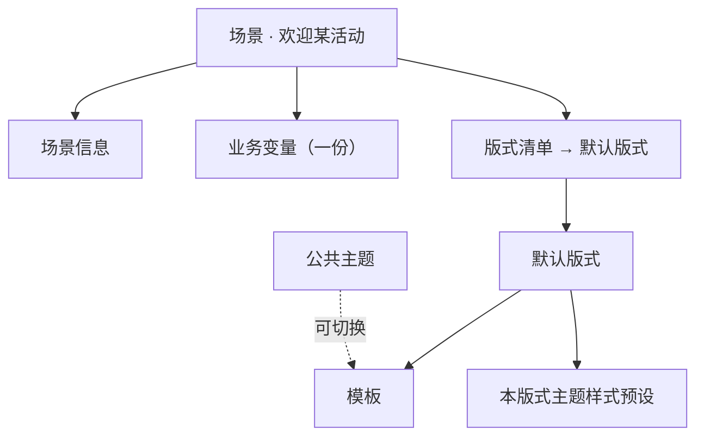
```mermaid
flowchart TB
  s["场景 · 欢迎某活动"]
  s --> info1["场景信息"]
  s --> data1["业务变量（一份）"]
  s --> list1["版式清单 → 默认版式"]
  list1 --> L1["默认版式"]
  L1 --> t1["模板"]
  L1 --> th1["本版式主题样式预设"]
  pub1["公共主题"] -.->|"可切换"| t1
```

**2 套版式（与 [§9 示例](#示例欢迎会员--两套版式) 同类）：**

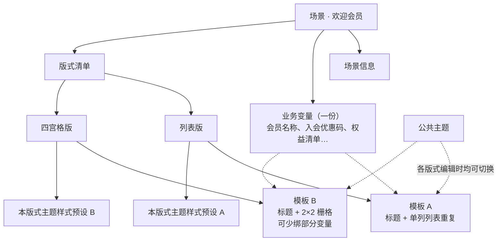
```mermaid
flowchart TB
  s["场景 · 欢迎会员"]
  s --> info2["场景信息"]
  s --> data2["业务变量（一份）<br/>会员名称、入会优惠码、权益清单…"]
  s --> list2["版式清单"]
  list2 --> LA["列表版"]
  list2 --> LB["四宫格版"]
  LA --> tA["模板 A<br/>标题 + 单列列表重复"]
  LA --> thA["本版式主题样式预设 A"]
  LB --> tB["模板 B<br/>标题 + 2×2 栅格<br/>可少绑部分变量"]
  LB --> thB["本版式主题样式预设 B"]
  pub2["公共主题"] -.->|"各版式编辑时均可切换"| tA
  pub2 -.-> tB
  data2 -.-> tA
  data2 -.-> tB
```

### 与全文名词的对应

| 口语 / 章节用语 | 在场景内的归属 | 数量 |
| --- | --- | --- |
| **场景** | 整封信的编辑与数据边界 | 1 |
| **业务侧数据** / **业务变量** | 场景级一份 | 1 |
| **发信信息** / **发信信息变量** | 场景级一份配置；变量仅文本，服务发送通道 | 1 |
| **版式** | 对外样式与结构的一套 | ≥ 1 |
| **模板** | 某套版式下的区块树与绑定 | 每版式 1 |
| **本版式主题样式预设** | 某套版式下的主题样式预设（可含多套十二档条目） | 每版式 1 |
| **公共主题** | 全项目共享；编辑时与本版式预设**随意切换** | 不按场景计份 |

因此：**1 个场景** ⊃ **≥ 1 套版式** ⊃ **每套版式各 1 份模板 + 1 份本版式主题样式预设**；**业务变量**始终在场景层 **1 份**。**公共主题**在场景外共享，编辑任一套版式时均可切换，不改变上述 1 对多划分。

走**发送通道**时的收件人、标题、描述等，见 [§11 发信：收件人、标题与摘要](#11-发信收件人标题与摘要)（与正文业务变量、版式模板并列，属场景级另一块配置）。

---

### 11. 发信：收件人、标题与摘要

模板进入**发送通道**时，除正文外还要配**收件人、邮件标题、邮件描述**（收件箱主题行与预览摘要）。与 [§7 正文业务变量](#7-正文业务变量) **分开**：正文用业务变量，发信用 **发信信息变量**（**仅文本**，不支持列表）。发信配置在**场景级一份**，**不随版式切换**而改变。

### 变量机制（与正文同一套思路）

正文 [§7](#7-正文业务变量) 与发信信息都走 **「用户自定义变量槽」**：运营或**外部系统**在场景里**自行声明**槽名（key）与类型，再在模板或发信文案里**引用**；系统**不内置** `memberName`、`storeName` 等业务字段名，文档与示例里的名字仅作举例。

| | 业务变量 | 发信信息变量 |
| --- | --- | --- |
| 机制 | 先建槽 → 再绑定 / 填取值 | **相同**（先建槽 → 标题/描述/收件人里插值或绑定） |
| 差异 | 类型多（文本、链接、列表…）；绑区块树 | **单独目录**；**仅文本**；只服务发信字段 |
| 对外接入 | 外部按槽 key 传入当次取值，驱动正文 | 外部按槽 key 传入当次发信取值，驱动标题/描述/收件人 |

两套槽**分目录、分类型白名单**，避免绑错层；底层可复用同一套「槽目录 + 取值 + 插值/绑定」能力，作为邮件模块对外的公共契约，而不是写死某行业的字段表。

### 要做什么

| 能力 | 说明 |
| --- | --- |
| **发信信息变量** | 场景里**自建**文本型槽（名称自定），只用于收件人 / 标题 / 描述 |
| **收件人** | 每次发送只填 **1 个**；多人要发就拆成多次任务（每人一套变量取值，标题与正文才能个性化） |
| **邮件标题、邮件描述** | 本期：**固定文案 + 发信信息变量插值**（见下「发送编排」第 ② 步） |

### 发送编排（架构顺序）

单次发送按下面顺序执行；**先发信正文、再发信信息**写死在架构里，本期与未来能力都遵守。

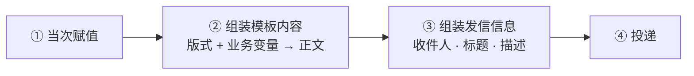
```mermaid
flowchart LR
  A["① 当次赋值"] --> B["② 组装模板内容<br/>版式 + 业务变量 → 正文"]
  B --> C["③ 组装发信信息<br/>收件人 · 标题 · 描述"]
  C --> D["④ 投递"]
```

| 步骤 | 本期做什么 | 说明 |
| --- | --- | --- |
| ① 当次赋值 | 填入本任务 1 个收件人对应的**业务变量**与**发信信息变量**取值 | 每人一次任务、一套取值 |
| ② 组装模板内容 | 按选定版式渲染**邮件正文** | 与编辑器预览同一套规则；**不在此步**定最终标题/描述 |
| ③ 组装发信信息 | **固定文案 + 发信信息变量插值**，得到标题、描述；解析收件人 | **本期只做到这里** |
| ④ 投递 | 提交正文 + 发信信息 | — |

**第 ③ 步的后续扩展（本期不做、架构预留）：** 将来可能在**正文已组装完成之后**，再根据**当次正文**自动生成或润色标题、描述（业务方常见说法如「根据邮件内容让 AI 写主题和摘要」）。那种能力发生在**第 ③ 步内部**，依赖第 ② 步产出，因此必须先 ② 再 ③；本期不实现、不验收具体生成方式，但管道顺序须按上表预留。

### 示例

场景「欢迎会员」：运营自建发信槽并配置标题文案 `{店铺名} · 欢迎，{会员名}`；发送时先按业务变量渲染正文，再用发信变量插值得到标题。给 Alex、Blake 各发一封 = **2 次发送任务**。

---

### 12. 别的系统如何用来发信

外部系统（CRM、营销自动化、会员系统等）使用本邮件架构时：**结构与绑定在邮件模块内维护**，外部**不重复搭区块树**，只在每次预览或发送时传入**当次选用哪套模板、哪套版式、哪套主题**，以及**当次变量取值与收发件人信息**。

### 邮件模块内已自闭环的内容

下列内容由运营在编辑器中配置并随**邮件模板（场景）**发布，外部**不必**每次传入，也不应在外部系统里再维护一份等价结构。

| 自闭环内容 | 包含什么 | 对应章节 |
| --- | --- | --- |
| **模板组件** | 八种区块类型、外壳与块内可配项、画布与模块嵌套规则 | [§3](#3-版式里能配什么画布与模块)–[§5](#5-八种模块分别能配什么)、[§4](#4-所有模块的通用规则) |
| **版式与模板** | 场景下有哪些版式；每套版式各自的**区块树**（模块、顺序、嵌套） | [§9](#9-一套数据多套版式)、[§10](#10-一封邮件里谁是一份谁有多份) |
| **模板上的绑定关系** | 各配置项绑到哪个**业务变量槽**、哪个**主题档位**（十二档之一）；条件显隐表达式 | [§7](#7-正文业务变量)、[§6](#6-外观主题与配色)、[§8](#8-按变量显示或隐藏模块) |
| **本版式主题样式预设** | 每套版式自带的样式预设条目（十二档取值） | [§6](#6-外观主题与配色)、[§10](#10-一封邮件里谁是一份谁有多份) |
| **公共主题目录** | 全项目可用的公共样式预设条目（不因场景复制） | [§6](#6-外观主题与配色) |
| **业务变量槽目录** | 场景里声明有哪些业务变量（key、类型）；**不含**当次具体取值 | [§7](#7-正文业务变量) |
| **内置商品列表 / 内置商品专辑列表** | 列表·数据源为**内置**时的范围、抽取、排序及行数据（由邮件模块按场景配置拉取或解析，见 [§7.1](#71-列表变量)） | [§7.1](#71-列表变量) |
| **发信信息配置** | 收件人规则；**邮件标题、邮件描述**的固定文案框架及其中引用了哪些**发信信息变量** | [§11](#11-发信收件人标题与摘要) |
| **发信信息变量槽目录** | 场景里声明有哪些发信信息变量（key，仅文本型） | [§11](#11-发信收件人标题与摘要) |

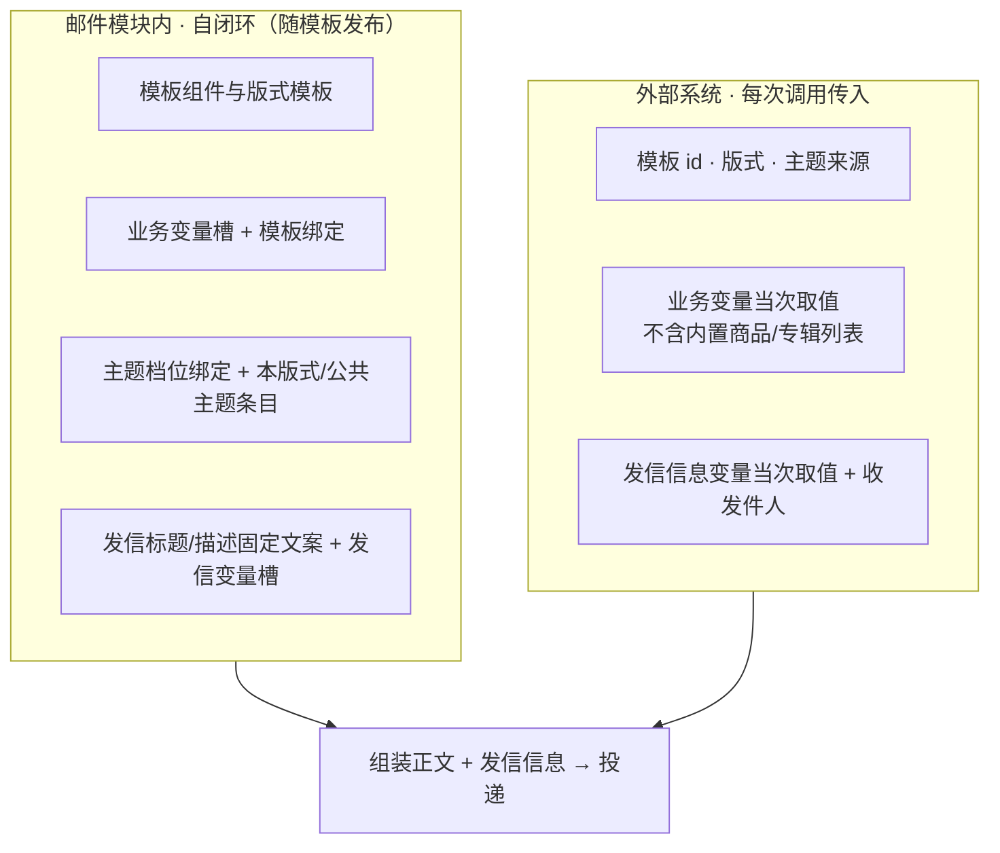
```mermaid
flowchart TB
  subgraph closed["邮件模块内 · 自闭环（随模板发布）"]
    C1["模板组件与版式模板"]
    C2["业务变量槽 + 模板绑定"]
    C3["主题档位绑定 + 本版式/公共主题条目"]
    C4["发信标题/描述固定文案 + 发信变量槽"]
  end

  subgraph external["外部系统 · 每次调用传入"]
    E1["模板 id · 版式 · 主题来源"]
    E2["业务变量当次取值<br/>不含内置商品/专辑列表"]
    E3["发信信息变量当次取值 + 收发件人"]
  end

  closed --> render["组装正文 + 发信信息 → 投递"]
  external --> render
```

### 外部每次调用须传入的信息

单次预览或单次发送，外部至少提供下表六项（多人发送则**每人一次调用**，见 [§11](#11-发信收件人标题与摘要)）。

| # | 传入项 | 说明 |
| --- | --- | --- |
| 1 | **邮件模板标识** | 指明使用哪一个场景（一封邮件 / 一个模板包），如业务侧的模板 id |
| 2 | **版式标识** | 该场景下具体哪一套版式（决定用哪一棵区块树） |
| 3 | **主题来源** | 本次渲染用哪套十二档：**本版式主题样式预设**中的哪一条，或 **公共主题**中的哪一条；须与模板里「绑主题」的字段一起生效 |
| 4 | **业务变量赋值** | 仅针对**自定义**变量槽按 key 传入当次取值；须符合各槽**声明类型**（见下节）。**内置商品列表、内置商品专辑列表**槽不对外暴露赋值入口 |
| 5 | **发件人与收件人信息** | 当次**收件人**（仅 1 个）；**发件人**名称、发件地址等发送通道要求的字段（若由外部系统提供） |
| 6 | **发信信息变量赋值** | 按槽 key 传入标题、描述（及收件人规则若绑变量）所需的**当次**文本取值；用于插值场景里已配置好的固定文案框架，**不**重复传入标题/描述整段固定文案（固定部分在自闭环的发信配置里） |

### 业务变量传入规则

**1. 内置列表：不对外暴露赋值**

若场景中某列表槽的**列表·数据源**为 **内置商品列表** 或 **内置商品专辑列表**，则该槽的候选范围、勾选、抽取、排序与行数据均在**邮件模块内**按场景已发布配置完成（编辑器或发送前由模块解析），属于自闭环内容。

- 对外接口**不暴露**上述内置列表槽的赋值入口；外部调用方**无法**传入这些 key 的取值或商品/专辑 ID 列表。
- 外部仍须传入第 1–3 项及**其它自定义**业务变量；模板若绑了内置列表，重复份数由模块内解析结果决定。

**2. 自定义变量：按槽类型传值**

外部只为**自定义**业务变量（含**自定义列表**）传当次取值；每个 key 的取值形态须与该槽在场景里声明的**变量类型**一致：

| 变量类型 | 外部传入形态（当次取值） |
| --- | --- |
| 文本 | 字符串 |
| 链接 | URL 字符串 |
| 图片 | 图片 URL 字符串 |
| 颜色 | 颜色值（与场景约定一致，可含透明度） |
| 数值 | 数字 |
| 布尔 | 真 / 假 |
| 列表（自定义） | **数组**，每项为一行；行内字段 key 与场景为该列表声明的**列（itemFields）**一致 |

**3. 自定义列表：行、子列表均按列类型**

- **父列表**：数组每个元素是一个对象；对象属性名 = 列 key，属性值类型 = 该列声明类型（如文本列传字符串、链接列传 URL、图片列传图片 URL）。
- **子列表列**：该列在父行上的取值为**嵌套数组**；数组每个元素为子行对象，子行字段同样按子列表的 **itemFields** 类型逐项传入（例如父行 `skus: [{ name, price, imageUrl }, …]`）。
- 列类型为**子列表**时，不得用扁平字符串代替整列；列类型为**文本/链接**等标量时，不得传数组（除非产品后续单列多值另有约定，默认不允许）。

**必传与可不传（自定义业务变量）：**

| | 规则 |
| --- | --- |
| **必传** | 当前所选版式下，模板**已绑定**的正文业务变量槽；以及任一块**条件显隐**所依赖的条件变量槽（即 **绑定用到的 key + 显隐用到的 key**）。 |
| **可不传** | 场景里已声明、但本版式**未绑定**、且**未参与**本版式任一块显隐判断的自定义槽。 |

内置列表槽不在上表范围内（对外不暴露赋值，由模块内解析）。

**主题来源（第 3 项）须表达清楚两类之一：**

| 来源类型 | 外部须指明 | 效果 |
| --- | --- | --- |
| **本版式主题** | 版式标识 + 该版式下某一条**样式预设**（同版式可有多条主题条目） | 按该版式模板 + 本条十二档解析外观绑定 |
| **公共主题** | 某一个**公共主题**标识 | 按该公共主题的十二档解析当前版式模板上的外观绑定 |

### 与发送编排的对应

与 [§11 发送编排](#11-发信收件人标题与摘要) 对齐：外部传入的取值在 ① 注入；②③ 由邮件模块按已发布的自闭环配置执行。

| 编排步骤 | 自闭环提供 | 外部传入 |
| --- | --- | --- |
| ① 当次赋值 | 槽目录、绑定关系、发信文案框架；**内置商品/专辑列表**在模块内解析 | 第 4 项（**仅自定义**槽）、5、6 |
| ② 组装模板内容 | 版式模板、主题档位绑定 | 第 1、2、3 项 + 自定义业务变量取值 + 内置列表解析结果 |
| ③ 组装发信信息 | 标题/描述固定文案、发信变量引用 | 第 5、6 项 |
| ④ 投递 | — | 发送通道执行（可仍由外部触发） |

### 接入示例（单次发送）

外部调用一次「欢迎会员」发送：

1. 模板标识 = `welcome-member`；版式 = `list`；主题 = 本版式预设 `brand-light`。  
2. 业务变量：`memberName=Alex`；自定义列表 `benefits` 按列类型传行数组。若场景另有**内置商品列表**槽，其数据**不由外部传入**，由模板内已配范围在模块内解析。  
3. 发件人 / 收件人：发件人由活动系统填写；收件人 `alex@example.com`（仅 1 人）。  
4. 发信信息变量：`storeName=XX 旗舰店` 等，用于插值已配置的标题 `{storeName} · 欢迎，{memberName}`。

邮件模块加载该场景自闭环配置 → ② 渲染正文 → ③ 插值标题与描述 → ④ 投递。再给 Blake 发一封时，**重新传入**第 4–6 项（新任务），模板 id 与版式可相同，取值不同。

---

## 二、Loyalty & Push 系统接入

> 本部分描述**线上 Loyalty（会员）与 Push（触达/推送）**里已有的邮件能力，以及本期如何接入 [第一部分](#一通用邮件模板架构)。

### 2.1 Loyalty & Push 中的邮件现状与本期范围

Loyalty & Push **线上已有一套邮件模板系统**，运营与用户在业务后台里选模板、看效果、触发发信。与「新邮件模板架构」（见第一部分）的关系：**本期只迁其中一类体验**；另一类仍走旧体系，未来再迁。

#### 现有两大类模板体验

| 类型 | 用户能做什么 | 典型页面 |
| --- | --- | --- |
| **仅预览（不可编辑）** | **不能**改邮件结构或模块；只能在系统提供的页面上**查看模板长什么样**（样式展示 / 预览），选好后由业务侧填数据并发信 | 模板样式展示页、只读预览 |
| **Section 化可编辑** | 在**写死的几类 Section** 里，往模板里**新增**某一类区块，或**编辑**已有模板里某个 Section 对应的内容页；结构是「固定 Section 类型 + 有限编辑」，不是完整自由排版 | Section 选择、Section 内容编辑页 |

两类在 Loyalty & Push 里**并存**，服务不同模板或不同业务场景；对用户来说是两套不同的「用模板」方式。

#### 「仅预览」类：迭代前后用户看到的页面

下图来自 Loyalty & Push 后台 **mail-genius** 中某一封「仅预览」模板的**样式展示页**（staging 示例：[会员条款更新邮件预览](https://zyzshop1.stg.myshoplaza.com/admin/micro_apps_pro/mail-genius/648357938460639202?previewData=%7B%22benefit_type%22%3A%22user_agreement_v2%22%7D)）。页面上有**邮件主题**、桌面/移动端**邮件预览**、**发送测试邮件**等；用户**不能**在此页改版式或增删模块。

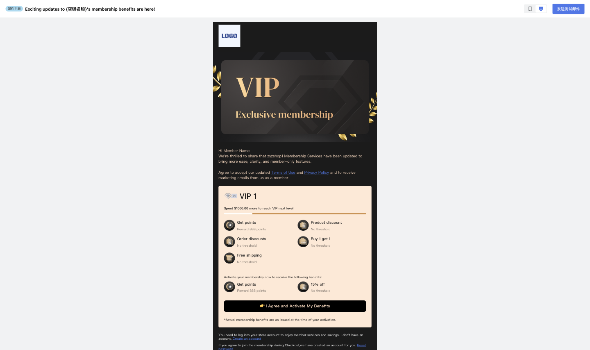

| | 对用户 | 对系统 |
| --- | --- | --- |
| **迭代前** | 即上图这类页面与流程 | 预览与发信前正文/标题/描述由**旧邮件架构**产出 |
| **迭代后** | **体感与上图一致**：仍是同一类样式展示页与操作，所见布局与交互不变 | 同一页面上的预览，以及发信前的正文、邮件标题、邮件描述，改由**新邮件模板架构**生成（见下节「本期要做什么」）；**发信通道**与页面前壳不变 |

#### 发送测试邮件

样式展示页上的 **「发送测试邮件」** 弹窗与流程，迭代前后对用户一致：

- **交互**：填写测试收件邮箱、确认发送；提示须先保存邮件内容，且**内容为示例数据**（与线上一致）。
- **发送测试邮件**：仍走 Loyalty & Push **现有**的测试发信逻辑（入口、校验、投递路径本期不改）。
- **示例数据（demo 变量赋值）**：测试邮件同样需要把业务变量、发信信息变量替换成可读的示例取值；该套 **demo 赋值规则仍由 Loyalty & Push 线上现有逻辑提供**，本期不新建、不替换。新架构只接收当次传入的变量取值并渲染正文与标题/描述，**不负责**定义或维护「测试邮件用哪一组 demo 值」。

#### 本期要做什么

**范围只包含「仅预览、不可编辑」那一类模板**；具体哪几封见 [§2.2 本期替换的模板范围](#22-本期替换的模板范围)。

**发信通道不改** — Loyalty & Push 现有的投递能力（与 ESP / 邮件服务商对接、真正「发出去」的那一层）**维持现状**，本期不替换、不重接发送通道。

本期只把**交给发信通道之前**的产出，改为用**新邮件模板架构**生成：

| 改用新架构的部分 | 说明 |
| --- | --- |
| **模板层（邮件正文）** | 页面上的**预览**，以及发信时邮件**正文内容**的组装，由旧编辑器预览改为新架构（场景、版式、业务变量、主题等，见第一部分 [§3](#3-版式里能配什么画布与模块)–[§7](#7-正文业务变量)、[§9](#9-一套数据多套版式)）。 |
| **邮件标题、邮件描述** | 收件箱**主题行**与**预览摘要**的生成规则改为新架构下的发信信息配置（固定文案 + 发信信息变量插值等，见第一部分 [§11](#11-发信收件人标题与摘要)）；仍由 Loyalty & Push 在发信时把生成好的标题、描述交给**原有发信通道**。 |

对用户而言：仍是「只能看模板、不能改版式」的流程；变的是**背后预览与发信前正文/标题/描述的产出方式**，不是换一家发信通道。

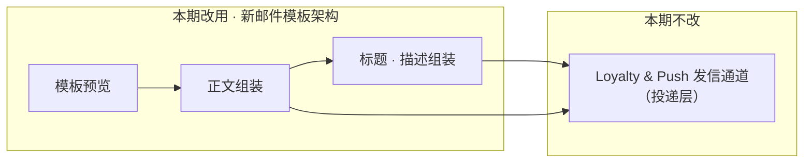
```mermaid
flowchart LR
  subgraph newArch["本期改用 · 新邮件模板架构"]
    P["模板预览"]
    B["正文组装"]
    T["标题 · 描述组装"]
  end

  subgraph unchanged["本期不改"]
    CH["Loyalty & Push 发信通道<br/>（投递层）"]
  end

  P --> B
  B --> T
  T --> CH
  B --> CH
```

#### 本期不做什么

| 不在本期 | 说明 |
| --- | --- |
| **发信通道（投递层）** | 与邮件服务商的对接、发送编排、通道配置等**保持现有实现** |
| **发送测试邮件** | 弹窗、流程，以及测试邮件用的 **demo 变量赋值**（示例数据从哪来、填哪些 key）均保持 Loyalty & Push **现有逻辑** |
| **Section 化可编辑** 的模板 | 仍使用**旧邮件架构**与现有 Section 编辑交互；不接入新编辑器、不改为新架构预览/正文/标题描述 |
| **给用户新的完整邮件编辑器** | 未来在可编辑类模板全部迁到新架构后，再考虑统一的新编辑器；**本期不做** |
| **一次性下线旧架构** | 见下「过渡期」 |

#### 过渡期：两套邮件架构同时运行

本期上线后，Loyalty & Push 内会**有一段时间**：

- **新架构**：承载「仅预览」类模板的**预览、正文组装、标题与描述组装**；
- **旧架构**：继续承载「Section 化可编辑」类模板及原有编辑能力；
- **发信通道**：始终一套，两类模板最终都走**同一套** Loyalty & Push 投递（仅入口前正文/标题/描述来源不同）。

对业务与研发的要求：场景 / 模板要能区分**走哪一套**（配置或路由层），避免同一封模板混用两套渲染。发信时数据接入见 [§2.4](#24-发信时业务变量与发信信息如何接入)。

#### 后续规划（非本期承诺）

在「仅预览」类稳定后，会选择合适时间把 **Section 化可编辑** 的模板也迁到**新邮件模板架构**，并为用户提供**新的编辑器**；届时可逐步收缩旧架构，具体节奏另立迭代。

### 2.2 本期替换的模板范围

下列模板在 Loyalty & Push 中均属于**「仅预览、不可编辑」**类；本期统一改为新架构下的**预览、正文组装、邮件标题与邮件描述**，**发信通道不变**。未列入下表的仅预览类模板，本期仍走旧架构。

| # | Loyalty & Push 业务模板（本期替换） | 样式展示页示意图 |
| --- | --- | --- |
| 1 | 欢迎新会员 | 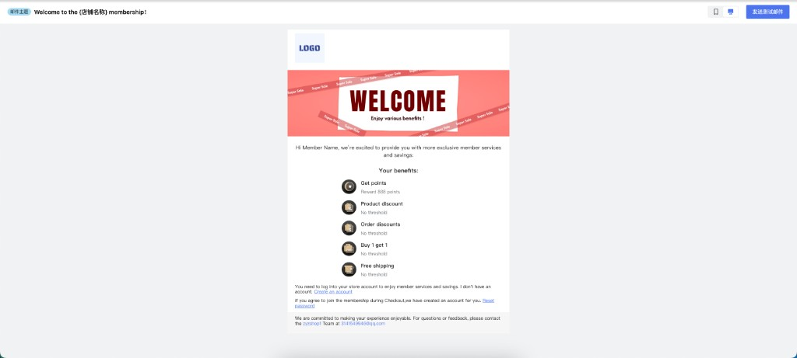 |
| 2 | 生日祝福 | 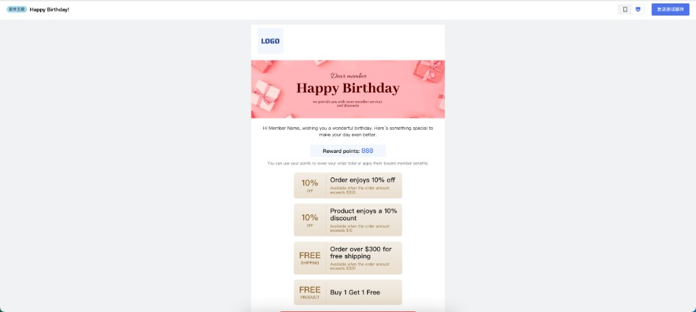 |
| 3 | 会员升级 | 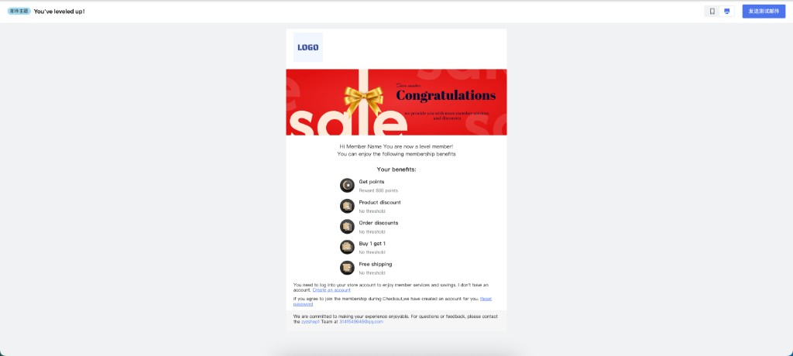 |
| 4 | 积分变动通知 | 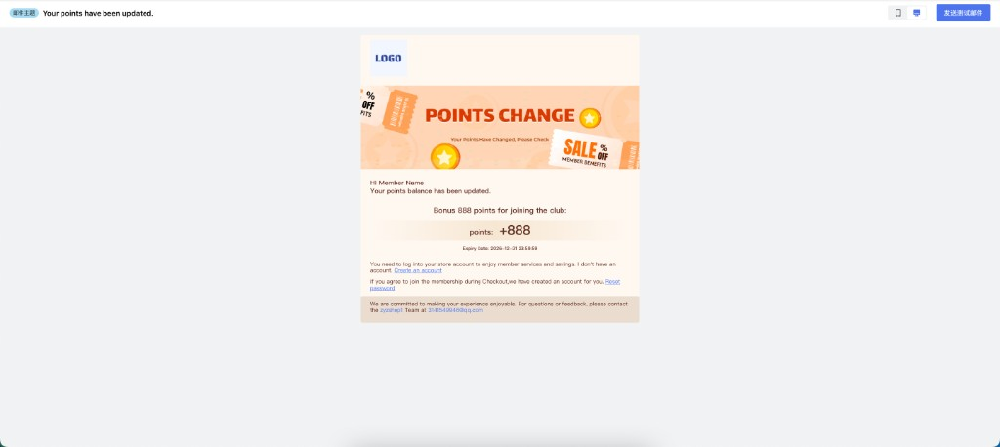 |
| 5 | 积分过期提醒 | 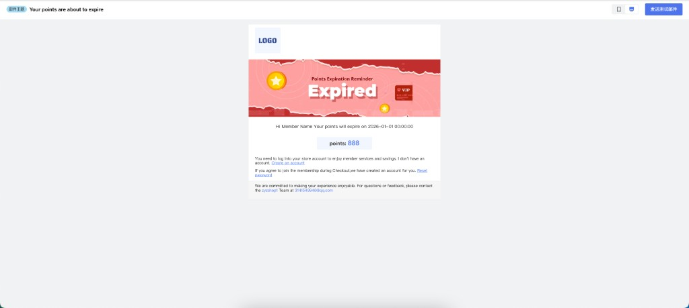 |
| 6 | 自动化激活会员 | 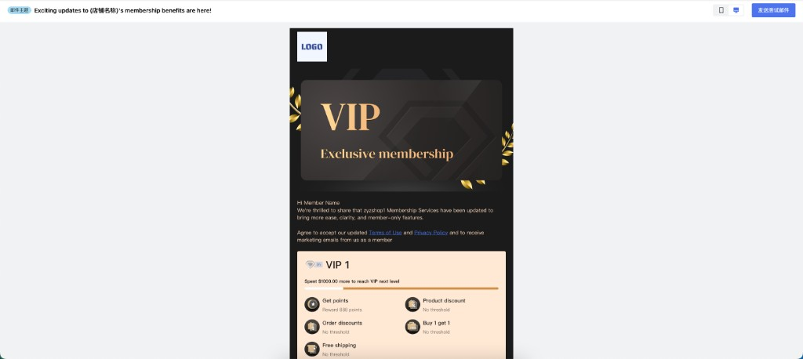 |
| 7 | 会员条款更新邮件 |  |
| 8 | 邀请注册会员邮件 |  |
| 9 | 邀请有礼 · 发给被邀请人的第一封 |  |
| 10 | 邀请有礼 · 发给邀请人（已经有人邀请了） |  |
| 11 | 邀请有礼 · 发给邀请人（邀请了的） |  |

> **说明：** 示意图为 Loyalty & Push 后台 **mail-genius** 样式展示页，页面形态与 [§2.1](#21-loyalty--push-中的邮件现状与本期范围) 一致，迭代前后用户所见一致。上表共 **11 封**（含本期新增的**会员条款更新邮件**）。邀请有礼三封（第 9–11 行）须分别配置、分别发信，不得混用同一套预览或标题描述。本期每封业务模板产品侧**仅提供一套版式**的 JSON；架构仍支持一场景多版式（见 [§9](#9-一套数据多套版式)），本期交付不启用多版式。

### 2.3 迭代后产品需交付什么（按模板）

要让 [§2.2](#22-本期替换的模板范围) 中每一封「仅预览」类模板在 Loyalty & Push 里改用**新邮件模板架构**（预览、正文、标题与描述），产品侧须**按「一封业务模板 = 一套交付物」**准备材料，交给研发接入。发信通道不在此列，仍用线上现有投递。

#### 每一封模板须提供四样东西

以下四项**每一封**都要有一套（[§2.2](#22-本期替换的模板范围) 共 11 封时，即 11 套）。

| # | 交付物 | 里面有什么 | 对应第一部分 |
| --- | --- | --- | --- |
| 1 | **模板组件 JSON** | 该版式下的**区块树**：有哪些模块、怎么嵌套、模块参数（宽高、间距、圆角等）；各区块若需**按变量显示或隐藏**，**条件显隐规则写在本 JSON 的区块树上**（见 [§8](#8-按变量显示或隐藏模块)），**不另交**单独的显隐文件；**不含**会员名、优惠码等具体取值 | [§3](#3-版式里能配什么画布与模块)–[§5](#5-八种模块分别能配什么)、[§4](#4-所有模块的通用规则)、[§8](#8-按变量显示或隐藏模块) |
| 2 | **业务变量，以及与 JSON 的绑定关系** | 本模板要用哪些**业务变量**（名称、类型）；区块树里**哪个字段绑哪个变量**；若用列表重复，绑定与行模板映射一并写在此侧；**凡在 ① 里配了条件显隐的区块**，用来判断的变量须在本项里**先声明**对应槽位 | [§7](#7-正文业务变量)、[§8](#8-按变量显示或隐藏模块) |
| 3 | **样式预设，以及与 JSON 的绑定关系** | 本版式用的**主题样式预设**（十二档取值）；区块树里**哪些外观字段绑哪一档**（或写死字面量） | [§6](#6-外观主题与配色) |
| 4 | **发信标题与描述的 JSON（含变量）** | 本模板层的**邮件标题、邮件描述**：固定文案框架、引用了哪些**发信信息变量**（仅文本）；不含当次某个会员的具体取值。**不含收件人**——收件人由 Loyalty & Push 发信逻辑处理，不属于模板层交付物 | [§11](#11-发信收件人标题与摘要) |

[§2.2](#22-本期替换的模板范围) 共 11 封时，即 **11 套**上述四件套；每套凑齐后即为该封业务模板的完整静态配置。**收件人、发件人**不在四件套内。

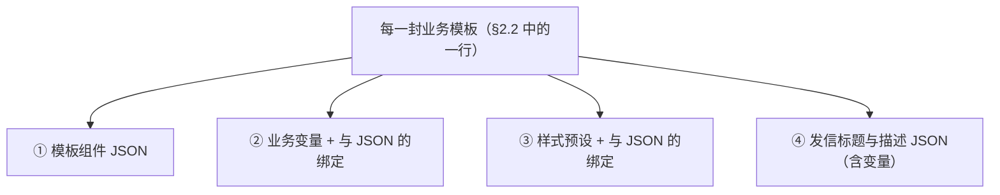
```mermaid
flowchart TB
  one["每一封业务模板（§2.2 中的一行）"]
  one --> A["① 模板组件 JSON"]
  one --> B["② 业务变量 + 与 JSON 的绑定"]
  one --> C["③ 样式预设 + 与 JSON 的绑定"]
  one --> D["④ 发信标题与描述 JSON（含变量）"]
```

### 2.4 发信时：业务变量与发信信息如何接入

每次发信时，Loyalty & Push 向新架构传入当次**业务变量取值**与**发信信息变量取值**，用于生成正文、邮件标题与邮件描述。规则与第一部分 [§12](#12-别的系统如何用来发信) 一致。

#### 静态配置与当次取值

| 层 | 谁准备 | 内容 |
| --- | --- | --- |
| **产品交付（静态）** | 产品 | [§2.3](#23-迭代后产品需交付什么按模板) 四项 |
| **发信接入（动态）** | Loyalty & Push 研发 | 每次发信时：选哪封模板 → 从会员/订单/邀请等业务数据 → **填业务变量取值、发信信息变量取值** → 调新架构渲染 → 把正文与标题/描述交给**原有发信通道** |

#### 一次发信在做什么（逻辑顺序）

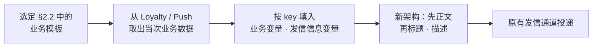
```mermaid
flowchart LR
  T["选定 §2.2 中的<br/>业务模板"]
  D["从 Loyalty / Push<br/>取出当次业务数据"]
  M["按 key 填入<br/>业务变量 · 发信信息变量"]
  R["新架构：先正文<br/>再标题 · 描述"]
  C["原有发信通道投递"]

  T --> D --> M --> R --> C
```

1. **选定模板** — 对应 [§2.2](#22-本期替换的模板范围) 中某一封业务模板（如「欢迎新会员」）。
2. **取业务数据** — 从当前会员、活动、邀请关系等接口拿到本次发信需要的字段（姓名、等级、积分、链接等）。
3. **填入变量** — 只填**已在模板 JSON 里声明过**的变量 key；类型须与场景里一致（文本、链接、列表行等，见第一部分 §7 与 §12「业务变量传入规则」）。
4. **渲染** — 新架构用静态 JSON + 当次取值生成正文，再生成标题与描述；**内置商品/专辑列表**不在此步由 Loyalty & Push 传行数据，由模板内配置在模块内解析。
5. **投递** — 将 HTML 正文、标题、描述交给**现有发信通道**（通道本身本期不改）。

#### 业务变量怎么接

- **原则**：模板 JSON 里绑了哪个 key，发信时就传哪个 key 的**当次取值**；key 名与类型以产品交付的场景配置为准，Loyalty & Push **不另起一套字段名**。
- **映射关系**：每一封业务模板在 Loyalty / Push 侧维护「**业务字段 → 模板里变量 key**」的对接，与 [§2.3](#23-迭代后产品需交付什么按模板) 里声明的 key 一致。
- **列表变量**：自定义列表由 Loyalty & Push 按行传数组；子列表列按嵌套结构传。内置商品/专辑列表**不传**，由新架构按场景里已配好的选品解析。
- **显隐**：须传齐条件显隐依赖的变量取值（计入必传，见 [§12](#12-别的系统如何用来发信)「必传与可不传」）；类型不匹配时该块按 [§8](#8-按变量显示或隐藏模块) **隐藏**。
- **一人一发**：同一模板发给 N 人 = N 次上述流程，每次一套当次取值（与第一部分 §11 一致）。

#### 发信标题、描述怎么接

- 产品已在第 4 项 JSON 里写好**固定句式**和占位的**发信信息变量**名。
- 发信时 Loyalty & Push 只传这些发信信息变量的**当次文本取值**（如本次 `memberName`、`storeName`），由新架构插值成最终标题与描述，再交给发信通道。
