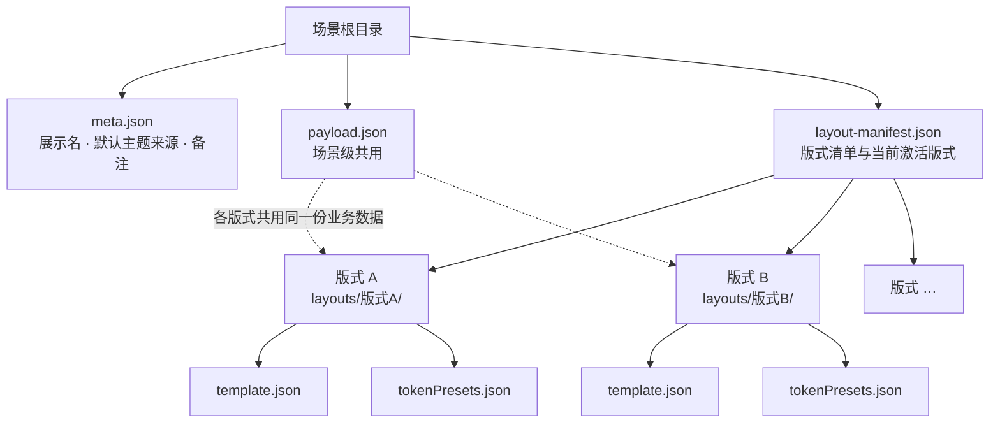
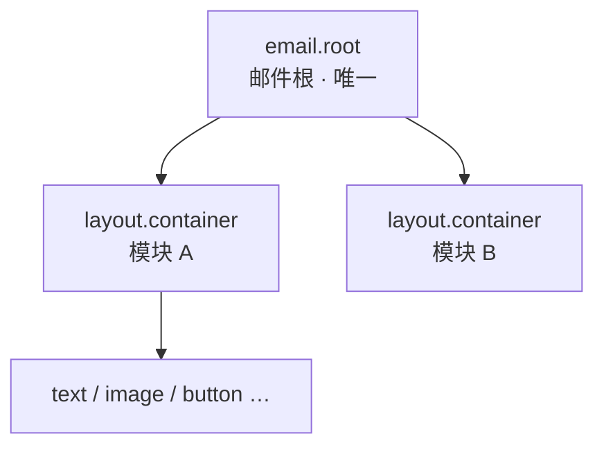

# 邮件模板新架构 — 产品需求说明（PRD）

> **文档性质**  
> 本文档面向研发，用于**落地邮件模板新架构**的需求说明：说明一封邮件由哪些 JSON 模块构成、各文件职责、以及允许使用的 block 类型与概念命名。  
> **与某一本地工程仓库无关**——文中不写具体磁盘路径、仓库目录或实现类路径；落盘位置仅以「场景根目录 / 版式目录」等逻辑层级描述。  
> **概念命名**（如 `template.json`、`blockMeta.blockType`、`bindings`、`tokenPresets`）沿用本架构既定术语，便于设计与实现口径一致。

## 目录

1. [总览：一封邮件模板由哪几块构成](#1-总览一封邮件模板由哪几块构成)
2. [template.json（模板结构）](#2-templatejson模板结构)
3. [tokenPresets.json（主题样式）](#3-tokenpresetsjson主题样式)
4. [payload.json（业务变量）](#4-payloadjson业务变量)
5. [meta.json（场景元信息）](#5-metajson场景元信息)
6. [layout-manifest.json（版式清单）](#6-layout-manifestjson版式清单)

---

## 1. 总览：一封邮件模板由哪几块构成

一封邮件对应一个**场景**目录，其下为若干 JSON 文件，组织为树形结构：根节点为场景；其下可挂**多套版式**；各版式目录内包含独立的结构与样式文件。业务文案、链接、图片地址等由场景根目录的 `payload.json` **全版式共用**，切换版式不切换业务数据。

### 1.1 数据模块

| 模块    | 落盘文件                                      | 职责                             |
| ----- | ----------------------------------------- | ------------------------------ |
| 模板结构  | `layouts/<版式名>/template.json`             | 区块树、父子关系、与变量/主题的绑定关系           |
| 主题样式  | `layouts/<版式名>/tokenPresets.json`         | 颜色、字号、间距、圆角等样式档位               |
| 业务变量  | `payload.json`（场景根目录）                     | 可替换文案、URL、列表等业务取值              |
| 场景元信息 | `meta.json`（场景根目录）                        | 展示名称、默认主题来源（本场景或全库公共预设）、设计稿来源等 |
| 版式    | `layout-manifest.json` + `layouts/<版式名>/` | 同一场景下的多套排版方案及其清单               |

编辑器侧：结构、样式、变量分别由 **底层 Block Inspector**、**样式预设**、**变量赋值** 工作台维护。

### 1.2 目录树形结构

### 1.3 分层原则

1. **结构随版式** — 切换版式即切换对应 `template.json`，区块树可完全不同。
2. **主题预设随版式** — 各版式目录内维护独立的 `tokenPresets.json` 作为该版式的初始样式。
3. **业务数据随场景** — `payload.json` 位于场景根目录，所有版式共用；`template.json` 仅声明绑定关系，不承载业务取值。
4. **场景元信息随场景** — `meta.json` 位于场景根目录，描述场景标识与默认主题策略，不参与区块排版。

---

## 2. template.json（模板结构）

**位置：** 版式目录内 `template.json`（`layouts/<版式名>/`）

**定位：** 版式级结构真源，用于搭起一封邮件的**骨架**——有哪些 block、怎么父子嵌套与摆放。样式档位见同版式 `tokenPresets.json`，业务取值见场景根目录 `payload.json`；本文件只声明结构及与变量/主题的绑定关系，不存业务默认值。

### 2.1 文件职责

- **区块树**：`blocks` 描述全部节点；`parentId`、`children` 表达层级与顺序。
- **类型标识**：每个节点有运行时 `type`，并在 `blockMeta` 中标注语义 `blockType`。
- **绑定关系**：`bindings` 挂接变量或主题；`repeat` 描述列表行结构；`visibility` 描述条件显隐。

### 2.2 结构分层：Root 与 Block

一份 `template.json` 在结构上分为两层：

1. **Root 层（邮件根）** — 有且仅有一个节点，由顶层字段 `rootBlockId` 指向；运行时 `type` 为 `emailRoot`，语义类型为 `email.root`。负责邮件**内容区外壳**（固定宽度、底色、边框、模块纵向间距、可选整页底图等）。
2. **Block 层（业务区块）** — 挂在根节点 `children` 下的全部子节点（及它们再嵌套的后代），即用户可见的模块与内容块（容器、栅格、文本、图片等），构成邮件正文排版。

### 2.3 根节点（email.root）可配置范围

根节点**不允许**配置 `repeat`、`visibility`；列表重复与条件显隐只能写在 Block 层的子块上。

| 配置项 | 含义 | 可配置范围与联动 |
| --- | --- | --- |
| `props.width` | 邮件内容区宽度 | 固定为 **600px**，不可改为其他值（与客户端邮件宽度约定一致）。 |
| `props.backgroundColor` | 内容区背景色 | 必填；可绑主题 token 或字面量。 |
| `props.padding` | 内边距 | 必填、须显式写入；支持统一单边或分边（`unified` / `separate`）。**有底图时**：不缩小底图区域，仅作为叠放在底图之上的子内容区内边距（与无底图时「外圈留白」语义不同）。 |
| `props.border` | 内容区边框 | 必填。 |
| `props.gapMode` | 根下各模块的间距策略 | 仅 `fixed`（固定间距）或 `auto`（主轴剩余空间均分到相邻模块之间）；与 `props.gap` 联动。 |
| `props.gap` | 模块间距数值 | `gapMode` 为 `fixed` 时生效；可为像素字面量或主题 token。 |
| `wrapperStyle.backgroundImage` | 内容区底图 | 可选。配置后启用「底图 + 子块叠放」渲染；`src` / `alt` / `link` 为内容，`fit` / `position` / 圆角 / 边框为样式。**联动**：`fit` 为 `cover` 时 `position` 参与裁切焦点；为 `contain` 时 `position` 不参与小图摆放。 |
| `wrapperStyle.placement` | 相对父级放置 | 根节点在画布上较少调整；契约允许写入。 |
| `wrapperStyle.widthMode` / `heightMode` | 外壳宽高模式 | 契约允许；根节点以固定内容宽度为主。 |

**根节点禁止或废弃的配置（无特殊联动，直接不可用）：**

| 禁止项 | 说明 |
| --- | --- |
| `props.direction`、`props.contentAlign` | 根层**固定纵向堆叠**子模块，顺序由 `children` 决定；对齐请在子 block 上配置。 |
| `props.outerBackgroundColor` | 邮件卡片**外侧**工作区灰底由产品固定，不进模板。 |
| 根级 `fontFamily` 等字体字段 | 字号字体在 **text / button** 块上绑 `fonts.*` token，不在根上配置。 |
| `repeat`、`visibility` | 仅 Block 层子块可配。 |

### 2.4 允许的 Block 类型

以下八种为 **Block 层**允许使用的语义类型（`blockMeta.blockType`）。根节点 `email.root` 见 [2.3](#23-根节点emailroot可配置范围)，不重复列入下表。不得新增表外类型。

| `blockMeta.blockType` | 名称 |
| --- | --- |
| `layout.container` | 布局容器 |
| `layout.grid` | 栅格 |
| `content.text` | 文本 |
| `content.image` | 图片 |
| `content.icon` | 图标 |
| `action.button` | 按钮 |
| `separator.divider` | 分割线 |
| `indicator.progress` | 进度条 |

### 2.5 区块树（blocks）

`blocks` 以 `id` 为键，记录各节点的类型、父子关系及摆放相关字段。`blockMeta` 为编辑器提供各块的展示名称，不改变结构语义。

### 2.6 字段绑定（bindings）

声明某字段跟随 `payload` 变量槽或 `tokenPresets` 主题，也可直接写死在模板中。

### 2.7 列表重复（repeat）

在容器或栅格上声明列表行原型，与 `payload` 中的 collection 槽对应。

### 2.8 可见性（visibility）

按条件控制某 block 是否参与渲染。

### 2.9 与其他 JSON 的关系

- `tokenPresets.json` — 主题样式来源
- `payload.json` — 业务变量取值来源

---

## 3. tokenPresets.json（主题样式）

**位置：** 版式目录内 `tokenPresets.json`（`layouts/<版式名>/`）

---

## 4. payload.json（业务变量）

**位置：** 场景根目录 `payload.json`

---

## 5. meta.json（场景元信息）

**位置：** 场景根目录 `meta.json`

---

## 6. layout-manifest.json（版式清单）

**位置：** 场景根目录 `layout-manifest.json`