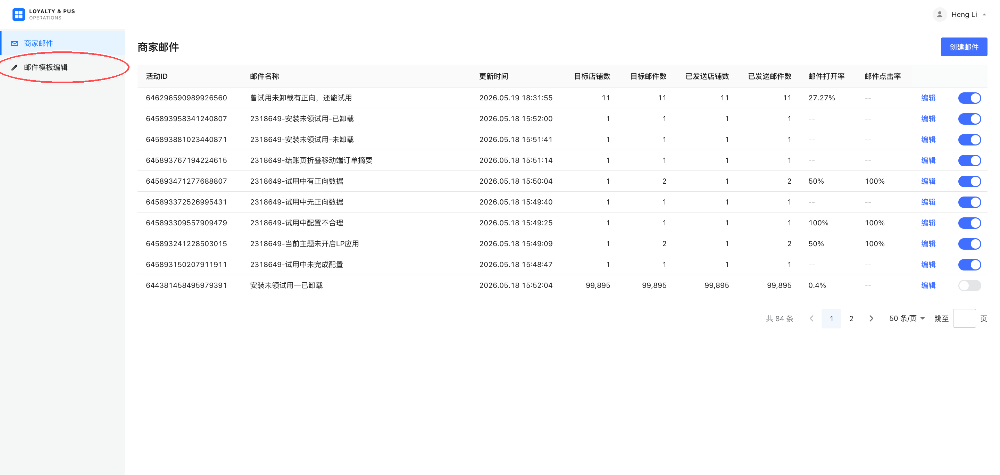
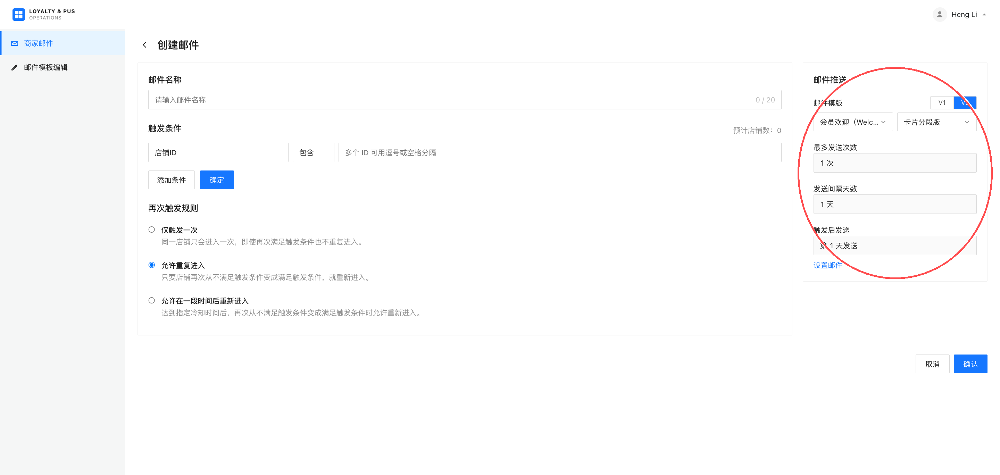
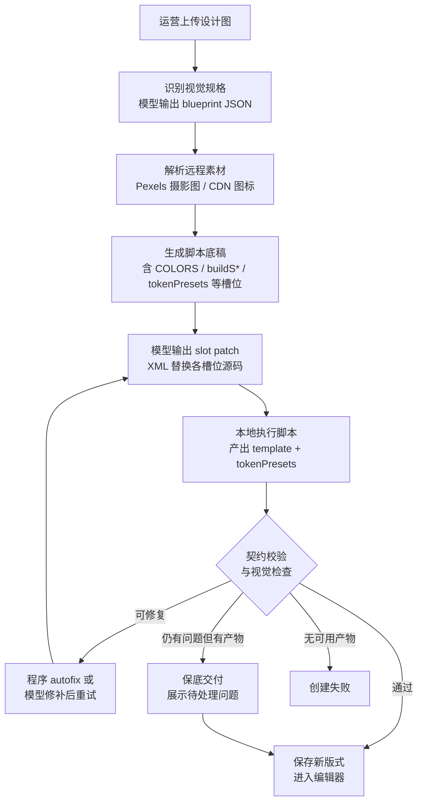

> **原型地址**：http://111.230.53.224/email-templates

> **文档约定**  
> 撰写或更新本文档时须遵守：
> - **独立性**：本文档为**单独交付**的产品需求说明，读者**不依赖**任何特定代码仓库、内部技能文档或实现仓库路径；所需产品与技术边界均应在后续章节中写清，**不在正文引用项目内索引**。
> - **语言**：全文使用**简体中文**。
> - **用词**：采用**定稿的产品化用语**（与产品、运营对外表述一致），避免口语、内部黑话或未定义缩写；界面文案、业务状态名可保留原文。
> - **表达方式**：**直白、具体**，一条需求说清「谁 / 在什么场景 / 要做什么 / 达到什么结果」；优先写**期望与目的**，少写实现与校验细则。
> - **配置优先于交互**：各功能章以**可配置项**与**期望效果**（画布、发信、保存后状态）为主；**点击路径、弹窗标题、按钮文案、选中联动时序、Toast 文案**等交互细节**不在 PRD 维护**（以设计稿 / 原型为准）。测试验收以**配置是否生效、效果是否符合期望**为准，不以逐步操作是否完全一致为准。
> - **读者**：面向**开发、运营、测试、产品**同事共读，各角色能据此理解范围与边界，无需再猜意图。
> - **Mermaid 换行**：节点标签内换行使用 **`<br/>`**（或 `<br>`），**勿**在 Mermaid 中用 `\n`（Cursor 等预览会原样显示 `\n`）。
> - **不写页面布局**：页面分区、左右栏位、顶栏 + 三列等工作区骨架**不在 PRD 维护**（以设计稿 / 原型为准）；PRD 写**配置项、业务规则与期望效果**。
> - **期望与目的优先**：各章只写**产品期望、目的与边界**；渲染管线、校验枚举、issue 数据结构、缓存策略、验收清单等**实现细节不在 PRD 维护**（以实现与契约为准）。**§18** 另附流程示意与 Prompt 参考示例，**不作实现硬性约束**。
> - **变量对接**：内置结构标识、嵌套列与发信灌数约定见 **§12.4**；§12 其余小节写编辑器侧行为与边界。

---

## 1. 产品定位与上线范围

### 1.1 上线场景

本邮件编辑器将在 **Loyalty & Push 内部后台** 上线，供 Loyalty 团队内部人员使用。

### 1.2 当前阶段承载能力

在当前阶段，编辑器主要承担两类工作：

| 能力 | 说明 |
|------|------|
| **编辑邮件模板** | 配置、维护 Loyalty 业务所需的邮件模板结构与样式。 |
| **支撑对商家的发信** | 为 Loyalty 向**商家**发送邮件提供模板能力；发信链路由 Loyalty 业务侧使用上述模板完成。 |

### 1.3 后续演进方向

编辑器在完成内部后台阶段的验证与沉淀后，将**迭代开放至商家端**：由商家自行编辑模板，并向**商家用户**（C 端收件人）发送邮件。商家端的产品形态、权限与发信规则不在本文档当前范围内定义，仅作为演进方向说明边界。

### 1.4 当前用户与交互原则

**当前用户**：Loyalty 内部运营 / 配置人员（非商家、非 C 端用户）。

**交互原则**：面向内部专业用户，界面与操作以**尽可能露出配置项与结构信息**为优先，便于排查与快速改模板；**不以「面向非技术用户的交互友好」为设计目标**。具体表现为：更多字段、绑定关系、版式与变量信息直接可见，可接受较高的操作门槛与学习成本。

**发布状态维护**：模板层、版式层均在 **§2.4 目录页** 或 **编辑器**（规则见 **§5**）维护 **发布 / 撤回发布**；**已发布**项在列表 / 下拉中可带 **「已发布」** 标签。

---

## 2. 入口与活动集成

编辑器在 Loyalty & Push 内部后台有 **两处触点**：**模板资产维护**（§2.1 → §2.4）与 **邮件活动绑定发信**（§2.2）。二者配合：**先在编辑器维护模板 / 版式 → 活动侧绑定 → 按绑定渲染发信**。

### 2.1 模板维护入口

| 项 | 说明 |
|----|------|
| **触点** | 内部后台 **「商家邮件」** 分组下 **「邮件模板」** 菜单（与「商家邮件」活动列表同级） |
| **期望** | 进入 **§2.4 邮件模板目录页**，管理模板 / 版式资产并进入编辑器 |
| **分工** | 「商家邮件」= 活动列表；「邮件模板」= 模板 / 版式资产，二者分离 |



### 2.2 邮件活动 · V2 集成

| 配置 / 规则 | 期望效果 |
|-------------|----------|
| **版本** | 活动页 **邮件推送** 区域支持 **V1 / V2**；**V2** 使用本编辑器产出的模板（V1 不在本文档范围） |
| **活动绑定** | 须同时选定 **邮件模板（场景）** + **版式**；保存后活动长期持有该绑定 |
| **备选项门槛** | 两个下拉均**仅展示已发布**项：模板层、版式层各须 **已发布** 且未删除 |
| **发信结果** | 活动执行发送时，按绑定的 **模板 + 版式** 渲染正文；活动侧不重复搭版 |
| **活动内编辑** | 可进入编辑器修改该绑定下的区块、变量、样式、模板信息，并可 **测试发信**（§13.4） |
| **活动内限制** | **不可**切换其它模板 / 版式，**不可**改发布状态或新建 / 复制 / 删除版式；上述须在 **§2.4 目录页** 完成 |



### 2.3 发信前模板可用性校验（活动已保存后的撤回发布）

#### 场景说明

运营在邮件活动中通过 V2 **已选定并保存** 某套 **邮件模板 + 版式** 后，活动记录会长期持有该绑定关系。此后若在 **邮件编辑器**（入口一）中将该模板的 **模板层** 和 / 或 **版式层** **撤回发布**（状态变为未发布 / 草稿），活动页上的历史选型**不会自动改写**，但此时模板资产已不满足「可对活动发信」的条件。

#### 产品要求

| 项 | 说明 |
|----|------|
| **校验时机** | 在**真正执行发送**之前（进入发信逻辑、渲染正文并投递之前），须对当前活动所绑定的 **模板 + 版式** 做一次 **可用性校验**。 |
| **校验内容（两层，均须通过）** | ① **模板层**：绑定的邮件模板当前为 **已发布**（且未被删除）；<br>② **版式层**：绑定的版式当前为 **已发布**（且该版式未被删除）。 |
| **校验不通过时的行为** | **不走发送逻辑**——本次不向商家投递该活动邮件；须明确失败原因（如「模板已撤回发布」「版式已撤回发布」），便于运营回到编辑器重新发布，或在活动页改绑其他已发布模板 / 版式后再次发送。 |
| **与 §2.2 下拉门槛的关系** | §2.2 的「仅已发布进备选项」约束的是**新建 / 改绑**时的选择；§2.3 约束的是**已保存活动在后端异步发信时**的状态——二者缺一不可。 |

#### 活动页打开时的校验（与发信前一致）

| 项 | 期望效果 |
|----|----------|
| **校验时机** | 打开已保存 V2 绑定的活动页时，立即执行与发信前相同的可用性校验 |
| **不可用时的展示** | 活动页标明绑定**不可用**（统一提示 **「模板异常」**，不区分未发布 / 已删除等细因） |
| **不可用时的限制** | **不可**进入编辑器改内容、**不可**按有效模板保存或发信，直至重新发布或在活动页改绑已发布组合 |

#### 边界说明

- 活动页可继续展示历史绑定的模板名 / 版式名（即使已不在「仅已发布」备选项列表中），但以红色 **「模板异常」** 标明当前绑定无效。
- 模板或版式被 **删除**、**撤回发布** 时，均视为不可用，统一提示 **「模板异常」**。
- 本节约束 **V2 + 本邮件编辑器** 链路；V1 旧模板发信规则不在本文档展开。

### 2.4 邮件模板目录页

经 §2.1 **「邮件模板」** 进入 **邮件模板目录页**（非直接进入编辑器）。在此浏览、筛选模板与版式，并进入编辑器编辑某一版式。


| 配置 / 能力 | 期望效果 |
|-------------|----------|
| **列表排序** | 模板列表、版式列表均按**最近编辑时间倒序**；时间相同再按创建时间倒序 |
| **模板摘要** | 展示模板名、发布状态、描述、发信主题 / 预览摘要、数据变量规模（槽数 / 取值数） |
| **模板级能力** | 新建、复制、发布 / 撤回、删除、维护模板信息（§13） |
| **版式级能力** | 新建（空白 / 复制 / §18 以图创建）、重命名、发布 / 撤回、删除、进入编辑 |
| **搜索与筛选** | 模板、版式各自关键词搜索；各自可 **仅看已发布** |
| **与 §5 关系** | 目录页承担模板 / 版式的**创建、复制、发布、删除、切换场景**；编辑器承担**当前场景内切换版式**及同类版式操作（见 **§5**） |

---

## 4. 邮件模板数据模型总览

本章说明编辑器各功能背后**数据如何分层、谁跟谁、一份还是多份**。此处仅为**总览**，不展开字段级与存储细节；后续将按编辑功能与发信链路**在本 PRD 内逐章展开**。

### 4.1 邮件模板（场景）与版式：一对多

**邮件模板**在业务上对应一个**发信场景**（如欢迎新会员、弃单挽留、好友加入获奖等）：同一类业务意图、同一套可复用的核心信息。

同一场景在对外呈现上，往往需要**多套组件摆放与版面设计**（如「卡片分段版」「居中对齐版」）。因此产品采用：

- **1 个邮件模板（场景）** → **多个版式**（各版式独立维护结构与版式级样式）；
- 活动发信、编辑器内选型时，须同时选定 **模板 + 版式**（见 §2.2）。

运营在 **「模板组件」** Tab 中编辑的，实质是**当前版式下的邮件结构**（区块树、绑定关系等），即日常所说的「搭版」主要落在**版式**这一层，而不是场景层再复制多份结构。

| 概念 | 产品含义 | 数量关系 |
|------|----------|----------|
| **邮件模板** | 发信**场景**（欢迎、挽留等） | 1 个场景 |
| **版式** | 同一场景下的一种**对外排版**（组件位置、模块组合差异） | 每场景 **多个** |
| **版式结构** | 该版式下的区块树与绑定（编辑器 **模板组件**） | 每版式 **1 份** |
| **数据变量** | 场景共用的业务文案、链接、列表数据等 | 每场景 **1 份**，多版式共用 |
| **模板信息** | 场景级发信元信息（标题、摘要等，编辑器 **模板信息** Tab） | 每场景 **1 份** |
| **版式默认主题** | 该版式的颜色、字号、圆角等平面设计档位（编辑器 **主题样式** 默认来源） | 每版式 **1 份** |
| **公共主题** | 全系统可复用的设计主题，可在某版式上**切换预览**不同主题效果 | 多份共享库，**不**替代版式自有默认配置 |

### 4.2 数据与编辑功能的对应关系

下列关系便于从编辑功能反查数据归属：

| 编辑功能 | 数据归属 | 切换版式时 |
|----------|----------|------------|
| **目录页 / 当前模板** | 场景 | 换场景须回目录页；变量、模板信息随场景变 |
| **版式切换** | 当前版式 | 换版式则结构、默认主题、画布预览切换 |
| **模板组件** | 当前**版式结构** | 随版式切换 |
| **数据变量** | 当前**场景**一份 | **不**随版式切换而复制多份 |
| **主题样式** | 当前**版式默认主题**；可临时切**公共主题**看效果 | 默认配置随版式切换；公共主题为跨版式共享资源 |
| **模板信息** | 当前**场景** | 不随版式切换 |

### 4.3 主题样式：版式默认与公共主题

**平面设计规则**（颜色、字号、圆角等）因版式而异：不同版式上，同一类区块可能需要不同的色板、字号阶梯或圆角策略。故 **主题样式的默认配置跟随版式**，每个版式自带一套**默认主题配置**（运营在 **主题样式** Tab 维护的主对象）。

同时，许多色板与字号体系可在多个场景、版式间**沉淀复用**。系统提供 **公共主题**（全系统级设计主题库）：在编辑某一版式时，运营可**自由切换**公共主题，在画布上**预览**「若套用另一套设计，该版式长什么样」，而不必为每次预览复制一整份版式。

| 类型 | 作用 | 与版式的关系 |
|------|------|----------------|
| **版式默认主题** | 该版式发信、预览时**默认生效**的样式档位 | 与版式 **1 : 1** 维护 |
| **公共主题** | 可复用设计资产；编辑时**切换查看**套用效果 | **多 : 多** 可选用；切换为预览/编辑辅助，**不**改变「该版式默认主题是哪一套」的归属定义（保存与跟随意语义见 **§11**） |

### 4.4 章节索引

下列专章已写入本 PRD；阅读时可按编号跳转。

| 章节 | 主题 | 说明 |
|------|------|------|
| **§5** | 模板 / 版式管理 | **§2.4 目录页** + 编辑器 |
| **§6** | 邮件根 · 画布级配置 | 版心宽度、预览视窗、渲染默认 |
| **§7** | 八种基础组件 | §7.8–§7.15 分节；跟随意 **§11.6** |
| **§8** | 版式结构编排 | 结构能力、嵌套约束、插入期望 |
| **§9** | 组件插入默认与模块库 | 母版库、存为模块 |
| **§10** | 区块结构树 | 与画布同一结构、选中同步 |
| **§11** | 主题样式变量 | 十二档、公共主题、跟随意 |
| **§12** | 数据变量 | §12.4 内置结构目录、§12.8–§12.9 变量维护、§12.10 胶囊绑定 |
| **§13** | 模板信息与测试发信 | 场景 meta 配置、测试发信期望 |
| **§14** | 保存与放弃未保存分工 | 四套保存按钮、放弃未保存 |
| **§15** | 列表重复（repeat） | 绑定向导、字段映射 |
| **§16** | 条件显隐 | 配置面板「显隐」页签 |
| **§17** | 模板检查 | 保存前问题提示（期望见 §17） |
| **§18** | 以设计图 AI 创建版式 | 增强能力，非主路径 |

---

## 5. 邮件模板与版式管理

本章约定 **§2.4 邮件模板目录页** 与 **编辑器** 中对模板 / 版式的管理能力。与 §4 对应：**邮件模板 = 场景**，**版式 = 场景下的排版**；列表展示用**名称**，系统用**内部标识**区分记录（见 §5.1）。

**能力分工**（交互入口以原型为准）：

| 能力 | **目录页** | **编辑器** |
|------|------------|------------|
| 新建 / 复制 **邮件模板** | ✅ | ❌ |
| 发布 / 撤回 / 删除 **邮件模板** | ✅ | ❌ |
| 维护模板 **展示名 / 信息** | ✅（§13） | ✅（§13） |
| 新建 / 复制 **版式** | ✅ | ✅ |
| 重命名 / 发布 / 删除 **版式** | ✅ | ✅ |
| **切换版式** | ✅（进入编辑时选定） | ✅ |
| **切换邮件模板（场景）** | ✅ | ❌（须回目录页） |

### 5.1 名称与唯一性

| 项 | 说明 |
|----|------|
| **展示名称** | **邮件模板名称**、**版式名称**由运营填写，用于下拉与列表展示。 |
| **名称可否重复** | **允许重复**。多个模板可同名、多个版式可同名；**不以名称作为系统唯一键**。 |
| **系统唯一性** | 每条邮件模板、每条版式各有**系统内部标识**（由系统分配，运营界面不可见），用于活动绑定与切换；运营界面以名称为主。 |

### 5.2 新建邮件模板

| 配置项 | 约束 | 期望效果 |
|--------|------|----------|
| **模板名称** | 必填；去首尾空格后非空；最长 **80** 字；**允许**与其他模板同名 | 创建成功后新增一条**邮件模板（场景）** |
| **初始版式** | 同步自动创建 **1** 个版式，默认名 **「默认」** | 初始版式为**可编辑空白结构**（最小画布 + 默认主题样式） |
| **场景级数据** | — | 初始化空的数据变量目录与模板信息入口（§12、§13） |
| **发布状态** | — | 模板与首个版式均为 **未发布**（§5.5） |
| **创建失败** | — | 须明确失败原因；**不出现部分保存成功** |

> **复制整封模板**见 **§5.2.1**；在已有模板下**追加版式**见 **§5.4**。

#### 5.2.1 复制邮件模板（场景）

| 项 | 期望效果 |
|----|----------|
| **新模板名称** | 运营指定展示名（默认「{源名} 副本」，最长 80 字，允许同名）；系统分配新场景内部标识 |
| **复制范围** | 全部未删除版式（各含版式结构 + 默认主题）、整份数据变量、模板信息 |
| **重置项** | 发布状态 → **未发布**；已逻辑删除版式不含；活动绑定不迁移 |
| **未保存编辑** | 源场景未保存内容**不**自动保存；复制后切换至新场景 |

### 5.3 邮件模板（场景）操作

| 操作 | 期望效果 |
|------|----------|
| **修改展示名** | 在模板信息（§13）中编辑；**无**单独「重命名邮件模板」能力 |
| **发布 / 撤回发布** | 模板层独立状态；**未发布**与**已发布**互斥，同一时刻仅暴露其一操作 |
| **删除** | **逻辑删除**；删除前须二次确认；目录与活动备选项移除；已绑定活动表现为 **模板异常**（§2.3） |
| **模板信息** | 字段见 §13；保存后目录摘要区与编辑器一致 |

### 5.4 版式操作

针对当前邮件模板下的版式（目录页与编辑器规则一致）：

| 操作 | 配置 / 约束 | 期望效果 |
|------|-------------|----------|
| **新建（空白）** | 版式名称必填，最长 80 字，允许同名 | 空白版式（最小画布 + 默认主题）；**未发布**；成为当前编辑对象 |
| **复制** | 须指定源版式与新版式名 | 复制源版式结构 + 默认主题；数据变量与模板信息不变；新版式 **未发布** |
| **重命名** | 仅改展示名；最长 80 字 | 内部标识不变；已绑定活动引用不受影响 |
| **发布 / 撤回** | 版式层独立状态 | 同 §5.3 互斥规则 |
| **删除** | 至少保留 **1** 个版式 | **逻辑删除**；删除当前编辑版式时切换到其它可见版式；已绑定活动可能 **模板异常** |
| **以设计图创建** | 可选，见 **§18** | 生成结构与默认主题初稿 |

**列表展示**：编辑器版式列表仅含未逻辑删除的版式，按最近编辑时间新→旧；已发布项可带 **已发布** 标签。

**未保存编辑**：同模板内新建 / 复制 / 删除版式或切换版式前，若当前版式、数据变量或样式预设有未保存改动，须确认是否丢弃（§5.6）。

### 5.5 发布状态：活动发信与测试发信

模板层、版式层各维护**独立的发布状态**（未发布 / 已发布）。二者组合决定模板资产能否用于**正式活动发信**；**编辑器内测试发信**单独约定。

#### 5.5.1 邮件活动选用与正式发信（须已发布）

与 §2.2、§2.3 一致，汇总如下：

| 场景 | 要求 |
|------|------|
| **活动页 V2 下拉备选项** | **邮件模板**、**版式** 两个下拉均**仅展示已发布**项；未发布的不进入列表，运营无法在活动中新建或改绑时选到。 |
| **活动正式发信** | 活动已绑定的 **模板 + 版式** 在发信执行前须通过可用性校验：两层均为 **已发布** 且未被删除；否则**不发信**（§2.3）。 |
| **活动页已保存但事后撤回发布** | 历史绑定可仍展示名称，但须提示 **「模板异常」** 并限制「设置邮件」与发信（§2.3）。 |

即：**只有已发布的邮件模板 + 已发布的版式**，才出现在活动侧可选范围内，并支持活动链路**正常发送**。

#### 5.5.2 编辑器「发送测试邮件」（不受发布状态限制）

| 项 | 说明 |
|----|------|
| **范围** | 顶栏 **「发送测试邮件」**（或等价按钮）。 |
| **与发布状态** | **不受**模板、版式发布状态限制——无论当前模板 / 版式为 **未发布** 或 **已发布**，只要满足发信通道与「模板信息」等配置条件，**均可**发送测试邮件。 |
| **目的** | 便于运营在草稿阶段自测版式与变量效果，无需先发布再测。 |
| **与正式发信区分** | 测试发信仅用于编辑器内验证，**不**代表活动侧可绕过 §5.5.1 的发布门槛。 |

### 5.6 未保存更改确认

下列操作若存在**未保存**的版式结构、数据变量或样式预设改动，须先确认是否**丢弃**未保存内容后再继续：

- 新建 / 复制 / 删除版式；切换版式；返回目录页并切换模板。

**不触发**：复制整封邮件模板（§5.2.1，场景级切换）。

**期望**：用户选择丢弃后，未保存改动不写入；选择取消则留在当前编辑上下文。

### 5.8 复制能力对照（避免混淆）

| 维度 | **§5.2.1 复制邮件模板** | **§5.4 复制版式** | **§8 复制区块** |
|------|-------------------------|---------------------------|------------------------|
| **作用范围** | 整封场景（新模板目录） | 同场景下新增一条版式 | 当前版式内新增同级模块 |
| **数据变量** | 复制整份数据变量 | **不**复制，共用场景数据变量 | 不涉及变量目录 |
| **版式主题** | 每个被复制版式各一份 | 复制源版式一份 | 随区块保留绑定 |
| **发布状态** | 模板 + 全部新版式 → 未发布 | 仅新版式 → 未发布 | 不变 |
| **典型用途** | 新活动场景、AB 场景分叉 | 同场景多排版（如居中版 / 卡片版） | 快速克隆模块壳 |

---

## 6. 邮件根 · 画布级配置

本章约定 **邮件根**（画布根节点）在 **「模板组件」** Tab 下的配置范围。每版式有且仅有 **1 个**邮件根，承载 **600px 邮件内容区** 的画布级背景、边距与顶层子模块间距；**不属于** §7 八种可自由插入的基础组件。

数据归属见 §4.2：邮件根属当前**版式结构**（区块树最顶层），切换版式则切换对应邮件根及其子树。

> **范围说明（本章）**  
> **§6.4** 为邮件根**可写入版式**的配置项；**§6.5–§6.6** 为预览与发信一致性的产品期望。绑定**样式预设**见 **§11**；**业务变量**见 **§12**。

### 6.1 定位与约束

| 项 | 说明 |
|----|------|
| **每版式唯一** | 新建版式时自动生成 **1** 个邮件根；**不可**再插入、复制或删除邮件根 |
| **配置范围** | **内容 / 样式 / 布局** 三页签；**无**「显隐」页签（显隐仅配置在子区块） |
| **与区块树** | 树顶为邮件根；其下为版心内各顶层模块 |

### 6.2 与顶层子模块的关系

邮件根的**直接子级**为 §7 中的基础组件（实践中多为 **布局容器**）。根节点对子模块**固定纵向排列**：自上而下依次堆叠，**不提供**横排切换，也**不提供**与单块相同的 **「容器内内容摆放」** 对齐分组。

相邻顶层模块之间的**竖向间距**由 **组件 · 布局** 中的 **间距 / 间距模式** 控制（语义与 **布局容器** 内核中的间距一致，但作用对象是邮件根的直接子级）。

### 6.4 配置项详表

#### 6.4.1 样式与布局（常显项）

| 配置项 | 可选范围 |
|--------|----------|
|**内容区背景色**|颜色（含透明）；新建版式默认为白色系|
|**画布描边模式**|**四边统一** / **四边独立**|
|**画布描边宽度 / 样式 / 颜色**|非负像素宽度；**实线 / 虚线 / 点线**；颜色含透明；默认无描边|
|**页面内边距模式**|**四边统一** / **四边独立**|
|**页面内边距数值**|各边非负像素；默认 **0**|
|**间距模式**|**固定像素** / **自动均分（主轴剩余空间）**|
|**间距**|非负像素；仅当间距模式为 **固定像素** 时出现；默认 **0**|
|**画布宽度（固定）**|只读 **600px**|

#### 6.4.2 内容区底图（可选）

在 **内容** 页签启用 **内容区底图** 后，画布以「**底图层 + 叠放层**」渲染：底图铺满 600px 内容区（或按填充策略适配），顶层子模块叠在上方。底图的 **地址、填充策略、画面位置、背景圆角、背景描边** 均在 **内容** 页签配置（与 §7.3.3 容器底图一致）；**样式** 页签中的 **内容区背景色**、**画布描边** 仍指 600px 内容区外壳，不含底图裁切项。

| 配置项 | 可选范围 |
|--------|----------|
|**背景图地址**|图片 URL|
|**背景替代文本**|字符串（建议 ≤100 字）|
|**背景链接地址**|URL（可选）|
|**背景填充策略**|**裁切铺满** / **完整显示**|
|**背景画面位置**|九宫格锚点（如居中、左上、右下等）；仅 **裁切铺满** 时可配|
|**背景圆角 / 背景描边**|与 §7.3.2 容器圆角、描边**相同模式与枚举**|
|**关闭背景图**|操作按钮|

### 6.5 渲染默认（产品期望）

**目的**：保证画布预览、测试发信与正式发信对收件人呈现一致；部分排版能力由系统统一注入，**不在配置面板暴露**，也**不要求运营在 PRD 层理解实现细节**。

**期望**：
- 预览与发信使用同一套合并与渲染结果，不出现「画布好看、发信走样」。
- 未在 §6.4 提供的项（如全局字体、固定行高等）由系统默认处理；具体规则以实现与契约为准，不在本文展开。

### 6.6 画布预览视窗（桌面 / 移动）

**目的**：让运营在搭版时切换桌面 / 移动预览，自检窄屏下的排版与折行，**不**维护第二套移动版式文件。

**期望**：
- **画布预览** 标题旁提供 **桌面 / 移动** 切换；切换仅影响当前预览，**不写入**版式保存内容。
- **测试发信** 按**当前预览态**抓取邮件效果发送。
- 版心宽度等产品常量见 **§6.4**；具体像素、裁切与自适应规则以实现为准。

### 6.7 不支持的能力（与八种基础组件的差异）

| 能力 | 邮件根 | 八种基础组件（§7） |
|------|--------|---------------------|
| **条件显隐** | **不支持**（无显隐页签） | 支持（显隐页签） |
| **列表重复绑定** | **不支持** | **布局容器 / 栅格 / 图片** 支持 |
| **容器内内容摆放** | **不支持**（子模块固定纵排） | **外层容器 · 布局** 中配置 |
| **宽度 / 高度模式** | 内容区 **固定 600px 宽**；无宽度 / 高度模式切换 | 各块在外壳中自洽配置 |
| **容器圆角** | **不支持**（内容区外壳无圆角项；底图可单独设 **背景圆角**） | **外层容器 · 样式** |
| **区块展示名** | 标题固定为「画布设置」；**无**块名称输入框 | 各区块展示名在对应组件配置中维护 |

---

## 7. 模板组件 · 总览

本章约定 **「模板组件」** Tab 下可编排的**基础组件类型**，以及各组件在配置上的**统一分层**（外层容器 vs 内核）。**邮件根**（画布级配置）见 **§6**；本章仅覆盖八种可插入、可嵌套的基础组件。

数据归属见 §4.2：此处编辑的是当前**版式结构**（区块树），切换版式则切换整套结构。

> **范围说明（本章）**：八种基础组件的字段与页签；跟随意、变量、repeat、显隐见专章。

### 7.1 八种基础组件

可插入、编排的**基础组件**共 **8 种**：

| # | 组件名称 | 产品用途（摘要） |
|---|----------|------------------|
| 1 | **布局容器** | 纵向或横向排布子区块，控制模块内顺序与间距，可嵌套其它组件。 |
| 2 | **栅格** | 按行、列排布子区块（如商品宫格、多列信息区），支持列数、间距与单元格尺寸策略。 |
| 3 | **文本** | 展示一段或多段文案（标题、说明、价格等）。 |
| 4 | **图片** | 展示图片资源；可作为**带底图的容器**，在其上叠放子区块。 |
| 5 | **图标** | 展示小尺寸图标（装饰、标签旁图标等）。 |
| 6 | **按钮** | 可点击的行动点（主按钮、文字链式按钮等），含文案与跳转目标。 |
| 7 | **分割线** | 模块之间的分隔线。 |
| 8 | **进度条** | 展示进度或完成度（如任务进度、步骤完成比例）。 |

**与「邮件根」的关系**：画布最顶层的 **邮件根** 承载整封邮件的**画布级**设置（见 **§6**），**不是**上表中的第 9 种可插入组件；日常搭版使用的是上表 **8 种**可自由增删、嵌套的基础组件。


#### 配置面板共性（八种基础组件）

| 配置范围 | 说明 |
|----------|------|
| **页签** | **内容 / 样式 / 布局**；具备 repeat 或显隐能力时另含 **列表 / 显隐** |
| **区块展示名** | 可编辑；仅用于识别，**不改变**组件类型与渲染 |
| **repeat 预览态** | 行模板内 **内容** 字段可只读；**样式 / 布局** 仍按 §7 配置 |

### 7.2 配置分层：外层容器 + 内核

从抽象上看，**每一种**基础组件（含布局类与内容类）都由两层构成：

| 层次 | 含义 | 配置上的特点 |
|------|------|----------------|
| **外层容器** | 包裹组件可见内容的**壳**：决定该组件在父级中占多大、如何对齐、是否有背景/描边/圆角/内边距等。 | **8 种基础组件共用同一套外层容器配置范围**（见 §7.3）。文本的外壳与按钮的外壳，在「能配哪些外壳项」上**一致**。 |
| **内核** | 组件**本体**要表达的能力与内容：文本的正文、按钮的胶囊样式与链接、栅格的列数、图片的图源等。 | **因组件类型而异**；仅该类型在配置面板中展示对应内核项。 |

界面按 **内容 / 样式 / 布局** 分组展示，产品语义仍分 **外层容器** 与 **内核** 两层。

### 7.3 外层容器：统一配置范围

八种基础组件（§7.1）共用**同一套外层容器配置**，分组如下：

| 配置页签 | 分组标题 | 所含外层项 |
|----------------|----------|------------|
| **布局** | **外层容器 · 布局** | 容器内内容摆放、宽度/高度模式、固定宽高、内边距 |
| **样式** | **外层容器 · 样式** | 容器背景色、容器圆角、容器描边 |

#### 7.3.1 适用说明

| 项 | 说明 |
|----|------|
| **共用组件** | 布局容器、栅格、文本、图片、图标、按钮、分割线、进度条 — **8 种均可**配置 §7.3.2 全部「通用外壳项」。 |
| **容器底图** | 仅 **布局容器、栅格、图片** 可额外配置 §7.3.3「容器底图」；其余 5 种无此项。 |
| **邮件根** | **不在**本节范围；画布根配置见 **§6**。 |

#### 7.3.2 通用外壳配置项（八种组件一致）

下表为**产品配置项名称**与**运营可选范围**（与发信导出语义一致）。

| 配置项 | 可选范围 |
|--------|----------|
|**容器内内容摆放 · 水平对齐**|**靠左** / **水平居中** / **靠右**（三选一）|
|**容器内内容摆放 · 竖直对齐**|**靠上** / **竖直居中** / **靠下**（三选一）|
|**宽度模式**|**跟随内容** / **铺满父级** / **自定义**|
|**固定宽度**|非负像素值（如 `320px`）；仅当宽度模式为 **自定义** 时出现|
|**高度模式**|**跟随内容** / **铺满父级** / **自定义**|
|**固定高度**|非负像素值；仅当高度模式为 **自定义** 时出现|
|**内边距模式**|**四边统一** / **四边独立**|
|**内边距数值**|各边非负像素；默认 **0**|
|**容器背景色**|颜色（含透明）|
|**容器圆角模式**|**四角统一** / **四角独立**|
|**容器圆角**|非负像素；默认 **0**（直角）|
|**容器描边模式**|**四边统一** / **四边独立**|
|**容器描边宽度**|非负像素；默认 **0**（无描边）|
|**容器描边样式**|**实线** / **虚线** / **点线**|
|**容器描边颜色**|颜色（含透明）；默认透明|

#### 7.3.3 容器底图（布局容器、栅格、图片）

启用 **容器底图** 时，画布以「**底图层 + 叠放层**」渲染：底图铺满外壳，子区块叠在上方。底图字段在 **内容** 页签；**外层容器 · 样式** 中的圆角 / 描边指**模块外壳**，与底图轮廓分组区分。

| 配置项 | 可选范围 |
|--------|----------|
|**背景图地址**|图片 URL|
|**背景替代文本**|字符串（建议 ≤100 字）|
|**背景链接地址**|URL（可选）|
|**背景填充策略**|**裁切铺满** / **完整显示**|
|**背景画面位置**|九宫格锚点（如居中、左上、右下等）；仅 **裁切铺满** 时可配|
|**背景圆角 / 背景描边**|与 §7.3.2 容器圆角、描边**相同模式与枚举**|

### 7.4 内核：因组件而异的配置（总览）

各组件**仅内核部分**不同。下表列出 8 种组件内核的**产品关注点**；字段见各组件分节。

| 组件 | 内核主要配置关注点 |
|------|-------------------|
| **布局容器** | 子区块排列方向（纵/横）、子级间距等结构属性（**§7.8**）。 |
| **栅格** | 每行列数、行列统一间距、单元格宽高模式、矩阵格内默认对齐等（**§7.9**）。 |
| **文本** | 结构化正文、区块级字号/字色、正文内局部样式与链接等（**§7.10**）。 |
| **图片** | 主图资源与裁切/适配、叠放层内子块排列等（**§7.11**）。 |
| **图标** | 图标来源（URL/内置）、链接、颜色、尺寸等（**§7.12**）。 |
| **按钮** | 按钮文案、链接目标、按钮胶囊本体宽度/颜色/边框/字样式等（**§7.13**）。 |
| **分割线** | 线条颜色、线条本体宽度模式/宽度、线条粗细等（**§7.14**）。 |
| **进度条** | 当前进度值/满槽刻度、槽色与已完成段颜色、条带宽度/高度/圆角等（**§7.15**）。 |

### 7.8 布局容器

**用途**：模块内纵/横排子区块；可嵌套、可挂容器底图。


#### 7.8.2 组件 · 布局（内核）

| 配置项 | 可选范围 |
|--------|----------|
|**排列方向**|**纵向排列** / **横向排列**（二选一；默认 **纵向**）|
|**间距模式**|**固定像素** / **自动均分（主轴剩余空间）**|
|**间距**|非负像素；仅当间距模式为 **固定像素** 时出现|

**铺满父级外壳时的补充**：当布局容器外壳为 **铺满父级** 或 **自定义** 时，**容器内内容摆放** 决定**全部直接子区块作为一组**在容器矩形内的水平/竖直位置；**排列方向 / 间距** 仍只控制子区块彼此之间的顺序与间隙。

#### 7.8.3 组件 · 内容（容器底图）

配置项同 **§7.3.3 容器底图**；未启用时可配置为启用。

---

### 7.9 栅格

**用途**：行×列矩阵排布子区块；可挂容器底图。


#### 7.9.2 组件 · 布局（内核）

| 配置项 | 可选范围 |
|--------|----------|
|**每行列数**|正整数（≥1；界面默认 **2**）|
|**间距**|非负像素（如 `8px`、`12px`；默认约 **12px**）|
|**单元格宽度模式**|**自动均分** / **固定宽度**|
|**单元格宽度**|非负像素；仅当单元格宽度模式为 **固定宽度** 时出现|
|**单元格高度模式**|**按行内容最大高度** / **固定高度**|
|**单元格高度**|非负像素；仅当单元格高度模式为 **固定高度** 时出现|

**填格期望**：子级按**从左到右、从上到下**顺序落入矩阵；可多于满格（继续换行）或少于满格（末行留空）；格内可再嵌套其它组件。

#### 7.9.3 组件 · 内容（容器底图）

配置项同 **§7.3.3**。

---

### 7.10 文本

**用途**：段落文案；叶子组件。正文结构化维护，**画布与发信同源渲染**。


#### 7.10.2 组件 · 内容（结构化正文）

| 配置项 | 可选范围 |
|--------|----------|
|**正文（结构化）**|多段落、多 **连续文字片段**；支持换行与局部样式|
|**正文工具条**|**粗体**、**斜体**、**下划线**、**删除线**、**链接** 等|
|**变量胶囊**（绑定业务数据时）|整段或句内变量|

#### 7.10.3 组件 · 样式（区块默认字号与字色）

| 配置项 | 可选范围 |
|--------|----------|
|**字号**|非负像素（如 `14px`、`20px`）|
|**文字颜色**|颜色（含透明）|

---

### 7.11 图片

**用途**：位图展示；主图走容器底图语义；可叠放子区块。


#### 7.11.2 组件 · 内容（主图）

主图配置同 **§7.3.3 容器底图**（字段分组在 **内容** 页签）。

| 配置项 | 可选范围 |
|--------|----------|
|**图片地址**|图片 URL（必填）|
|**替代文本**|字符串（建议 ≤100 字）|
|**链接地址**|URL（可选）|
|**填充策略**|**裁切铺满** / **完整显示**|
|**画面位置**|九宫格锚点；仅 **裁切铺满** 时可配|
|**图片圆角 / 图片描边**|与 §7.3.3 **相同模式与枚举**|

#### 7.11.3 组件 · 叠放布局

图片含子区块时，叠放层内**直接子级**排布语义同 **§7.8.2 布局容器** 内核。

| 配置项 | 可选范围 |
|--------|----------|
|**排列方向**|**纵向排列** / **横向排列**（默认 **纵向**）|
|**间距模式**|**固定像素** / **自动均分（主轴剩余空间）**|
|**间距**|非负像素；仅当间距模式为 **固定像素** 时出现|

---

### 7.12 图标

**用途**：小尺寸符号；叶子组件。


#### 7.12.2 组件 · 内容（图标来源与链接）

| 配置项 | 可选范围 |
|--------|----------|
|**图标来源**|**链接地址** / **内置图标**|
|**图标链接**（链接地址模式）|URL（http/https 等）|
|**内置图标**（内置图标模式）|预置图标清单项|
|**链接地址**|URL（可选）|

#### 7.12.3 组件 · 样式（图标颜色与尺寸）

| 配置项 | 可选范围 |
|--------|----------|
|**图标颜色**|颜色（含透明）|
|**尺寸**|非负像素（如 `16px`、`24px`）|

---

### 7.13 按钮

**用途**：行动点（文案 + 链接 + 胶囊样式）；叶子组件。


#### 7.13.2 组件 · 内容（文案与跳转）

| 配置项 | 可选范围 |
|--------|----------|
|**按钮文字**|字符串（建议 ≤100 字）|
|**链接地址**|URL（可选）|

#### 7.13.3 组件 · 样式（按钮胶囊本体）

| 配置项 | 可选范围 |
|--------|----------|
|**按钮宽度模式**|**跟随文字** / **铺满容器** / **自定义**|
|**按钮宽度**|非负像素；仅当宽度模式为 **自定义** 时出现|
|**按钮背景色**|颜色（含透明）|
|**按钮文字颜色**|颜色（含透明）|
|**按钮文字字号**|非负像素（默认约 `15px`）|
|**按钮文字样式**|**加粗** / **斜体** 开关|
|**按钮圆角**|与边框圆角通用模式一致（四角统一/独立）|
|**按钮描边**|与边框通用模式一致（统一/独立、宽度、样式、颜色）|

---

### 7.14 分割线

**用途**：模块间分隔线；叶子组件；线条本体 + 外层容器。


#### 7.14.2 组件 · 内容

当前无专用字段；样式见 **§7.14.3**。

#### 7.14.3 组件 · 样式（线条本体）

| 配置项 | 可选范围 |
|--------|----------|
|**分割线颜色**|颜色（含透明）；缺省为浅灰（系统缺省）|
|**线条宽度模式**|**铺满容器** / **自定义**|
|**线条宽度**|非负像素；仅当宽度模式为 **自定义** 时出现|
|**线条粗细**|非负像素（如 `1px`、`2px`）；缺省约 **1px**（系统缺省）|

---

### 7.15 进度条

**用途**：进度/完成度展示；叶子组件；数值在 **内容**，条带样式在 **进度条 · 样式**。


#### 7.15.2 组件 · 内容（进度数值）

| 配置项 | 可选范围 |
|--------|----------|
|**当前进度值**|有限数值（默认可为 `0`）|
|**满槽刻度**|有限**正数**（默认可为 `100`）|

#### 7.15.3 进度条 · 样式（条带本体）

| 配置项 | 可选范围 |
|--------|----------|
|**进度槽底色**|颜色（含透明）|
|**已完成段颜色**|颜色（含透明）|
|**条带宽度模式**|**铺满容器** / **自定义**|
|**条带宽度**|非负像素；仅当宽度模式为 **自定义** 时出现|
|**条带高度**|非负像素（如 `10px`）；缺省约 **10px**（系统缺省）|
|**条带圆角**|与边框圆角通用模式一致（四角统一/独立）|

---

## 8. 版式结构编排

本章约定 **「模板组件」** 视图下**版式结构**可做的编排能力、嵌套约束与**期望效果**。**八种组件各自能配什么**见 **§7**；**区块结构树**见 **§10**；插入内容来源见 **§9**。

> **说明**：具体在画布 / 区块树上如何点选、弹窗如何关闭等**交互细节以原型为准**；本章只写**结构能力与效果**。

### 8.1 结构能力一览

| 能力 | 作用范围 | 期望效果 |
|------|----------|----------|
| **插入子级** | 向**容器**内追加子区块 | 新块成为该容器的子级；邮件根下插入即追加**顶层模块** |
| **插入同级** | 在当前块之后追加**同级**区块 | 不改变既有父子关系 |
| **上移 / 下移** | 同一父级下的兄弟顺序 | 仅调整同级排序；邮件根子级顺序即版心内模块上下顺序 |
| **复制区块** | 以选中块为根的**整棵子树** | 克隆外壳 + 内核 + 全部后代 + 变量绑定；作为**新同级**出现在原块下方；**不含**兄弟与祖先 |
| **删除区块** | 以选中块为根的**整棵子树** | 从结构中移除；有子级时子级一并删除；**邮件根不可删** |
| **存为模块** | 容器及其全部后代 | 写入 **§9** 模块库；子树内**不得**含列表 repeat |

结构变更须 **保存区块** 后持久化（§14）；未保存时切换版式等须确认（§5.6）。

### 8.2 嵌套与容器约束

| 父级类型 | 可否有子级 | 说明 |
|----------|:----------:|------|
| **邮件根** | ✓ | 仅 **插入子级**（追加顶层模块）；**无**同级插入 |
| **布局容器 / 栅格 / 图片** | ✓ | 可 **插入子级** 与 **插入同级** |
| **文本 / 图标 / 按钮 / 分割线 / 进度条** | ✗ | 叶子组件，仅 **插入同级** |

- **栅格**内子块按 **行 × 列** 填格顺序落入单元格（§7.9）。
- **列表 repeat** 行模板 / 映射字段子树内的区块：**不可**在画布上增删改结构（§15）；本章以下均指**常规静态结构**。

### 8.3 插入内容与初始效果

插入时可选择 **§7.1 八种基础组件** 或 **§9 我的模块**。

| 来源 | 期望效果 |
|------|----------|
| **出厂样例**（未保存插入默认时） | 各类型带可见默认内容与样式（布局容器 / 栅格**不含**预置子块） |
| **插入默认配置**（§9.3） | 同类型新插入块采用已保存的单块样板 |
| **我的模块**（§9.4） | 整段子树快照插入，保留保存时的嵌套与展示名 |
| **主题折算** | 新块写入当前主题档位的静态值，画布**立即可读**（§9.2） |

### 8.4 复制 / 删除（期望效果）

**复制**：副本含原块全部后代；变量绑定**保留**且仍指向原变量槽；**邮件根不可复制**。

**删除**：删除含子级的块时，子级一并删除；须二次确认（具体文案以原型为准）。

**列表 repeat 行内块**：**不提供**复制（§15）。


## 9. 组件插入默认与模块库

本章约定两类**跨模板复用**能力：**组件插入默认配置**（按**组件类型**保存单块出厂样式）与 **存为模块 / 模块库**（保存**多区块子树**并在插入时复用）。二者共用 **§9.2** 保存规则。

>
> **与 §8 的分工**：§8 讲画布上**怎么插**；本章讲插进去的内容**从哪来**——出厂样例、运营自定义单组件默认，或已存模块。

### 9.1 定位

| 项 | 说明 |
|----|------|
| **作用域** | **系统级**母版库，不随某一封邮件模板或版式保存；全模板共享 |
| **与 §8** | 插入时可选用本章保存的**插入默认**或**模块** |
| **与 §7** | 快照为 **内容 / 样式 / 布局** 字段；**不含**列表 repeat、显隐、变量 / 主题绑定 |
| **边界** | **不**修改已插入版式中的历史区块；**不**替代 **保存区块** |

### 9.2 保存规则（期望）

- **包含**：各组件 **内容 / 样式 / 布局** 当前展示值。
- **不包含**：变量绑定、主题跟随意、repeat、显隐。
- **插入后**：新块 / 模块画布**立即可预览**，无需先绑变量或改主题。

### 9.3 组件插入默认配置

| 配置项 | 约束 | 期望效果 |
|--------|------|----------|
| **粒度** | 八种基础组件**各一份**；单块、无子级 | 该类型**新插入**单块优先用此样板 |
| **可保存对象** | 基础组件（**非**邮件根） | 保存当前块的 **内容 / 样式 / 布局** |
| **不写入** | — | 子级结构、展示名、变量 / 主题绑定、repeat、显隐 |
| **回退** | 未保存插入默认时 | 使用 **§8.3** 出厂样例 |
| **影响范围** | — | **仅**之后新插入的同类型单块；已有区块不变 |

### 9.4 存为模块与模块库

| 配置项 | 约束 | 期望效果 |
|--------|------|----------|
| **模块定义** | 命名的一段**完整子树**（容器 + 全部后代） | 可在任意模板 / 版式 **§8** 插入整段 |
| **根类型** | **布局容器 / 栅格 / 图片** | 与 §8 存为模块能力一致 |
| **禁止** | 子树内**任一**块含 repeat | 须先解除 repeat |
| **快照规则** | 逐块按 §9.2 | 保留嵌套结构与展示名 |
| **模块库变更** | 重命名 / 删除 / 更新模块 | **不影响**已插入各版式中的实例 |
| **删除模块** | 逻辑删除 | 列表不再展示；已插入实例保留 |

### 9.5 两种能力对照

| 维度 | **§9.3 组件插入默认** | **§9.4 存为模块** |
|------|------------------------|-------------------|
| **保存对象** | 单块，无子级 | 多区块子树 |
| **索引键** | **组件类型**（8 种之一） | **运营命名的模块** |
| **结构** | 不保存子级 | 保存完整嵌套与展示名 |
| **插入时** | §8 插入单块 | §8 插入整段模块 |
| **根类型限制** | 八种基础组件（非邮件根） | 仅 **布局容器 / 栅格 / 图片** 为根 |
| **repeat** | 保存时单块不应含 repeat | 子树内**不得**含 repeat |
| **影响已有块** | 否 | 否 |
| **底层快照** | §9.2 | §9.2（逐块） |

---

## 10. 区块结构树

**区块结构树**与画布展示**同一套版式结构**：树用于纵览层级与定位区块；字段编辑在配置面板（§7）。

| 项 | 期望效果 |
|----|----------|
| **结构一致** | 树中父子关系、顺序与画布 / 发信结构一致 |
| **选中同步** | 在树或画布选中同一区块时，配置面板展示对应 **§7 / §6** 配置项 |
| **节点信息** | 行展示 **区块展示名** + **组件类型**（与 §7.1 一致）；列表 repeat 预览行见 **§15** |
| **展开 / 收拢** | 支持逐层展开与「全部展开 / 折叠至首层」；**首层**指邮件根下版心内的顶层模块 |
| **职责边界** | 树**不提供**结构增删（见 **§8**）；**不**编辑字段取值 |

---

## 11. 主题样式变量

本章约定顶栏 **「主题样式」** Tab 下如何维护**样式预设**（颜色、间距、字号、圆角等**档位**），以及版式内各区块字段如何通过 **来源胶囊** **跟随**某一档位。**八种组件能配哪些字段**见 **§7**；本章只讲**主题档位从哪维护、如何作用到画布与发信**。

> **与 §4.3 的关系**：**本邮件样式预设** = 该版式的**版式默认主题**（与版式 **1 : 1** 保存）；**公共样式预设** = 全系统可复用的设计资产，编辑时可切换用于**画布预览**，**不**替代「该版式自有默认主题」的归属。二者在侧栏分开展示，保存语义不同（见 §11.3–§11.5）。

### 11.1 定位与与其它功能的关系

| 项 | 说明 |
|----|------|
| **工作视图** | **主题样式**（配置见 **§11.3**）。 |
| **作用域** | **本邮件样式预设**随当前 **版式** 切换（换版式即换一套默认档位）；**公共样式预设**为**跨模板 / 跨版式**共享库。 |
| **与顶栏「保存区块」** | 顶栏 **保存区块** 保存**版式结构**（含跟随意等，见 §11.2.3）；**十二档取值**须在 **§11.3** 单独 **保存**，二者**不可**互相替代。 |
| **与 §9 母版库** | 保存插入默认 / 存为模块时，主题跟随意按 **§9.2** 转为静态值，**不**保留跟随意。 |
| **与数据变量** | **样式字段**可跟随意主题档位；**内容字段**跟随意**业务变量**（**§12**）。二者通过同一套 **来源胶囊** 区分，互不替代。 |

### 11.2 标准样式档位（主题变量目录）

样式预设由 **颜色、间距、字号、圆角** 四组共 **12** 个标准档位组成。运营在右侧按分组编辑；界面**不出现**技术键名，仅展示中文档位名。

#### 11.2.1 四组十二档

| 分组 | 档位（产品名） | 典型用途（摘要） |
|------|----------------|------------------|
| **颜色** | **主色**、**副色**、**主背景** | 文字色、图标色、描边色；容器 / 底图背景（主背景优先） |
| **间距** | **模块上下间距**、**页面左右间距**、**组件内部间隙** | 版心内模块间距、页面左右留白、栅格 gap / 内边距等 |
| **字号** | **大标题字号**、**小标题字号**、**正文字号**、**极小字** | 各组件 **字号** 类样式字段的跟随意 |
| **圆角** | **面板容器圆角**、**主按钮圆角** | 外壳圆角、按钮 / 胶囊圆角、容器底图圆角等 |

> **说明**：若历史模板中存在上表以外的档位键，界面归入 **「其他分组」** 并以 **「其他项 n」** 展示，供排查与迁移；新建模板 / 新建公共预设以**标准十二档**为起点。

#### 11.2.2 与区块字段的对应关系（跟随意）

在 **模板组件** Tab 选中区块后，**样式类**字段（§7 各组件 **样式** 或 **外层容器 · 样式** 中的颜色、字号、圆角、间距等）可通过 **来源胶囊** 绑定到**上表中的某一档**。系统按字段类型**收窄可选档位**，避免误绑（示例）：

| 字段类型（摘要） | 通常可选的档位 |
|------------------|----------------|
| **字号** | 大标题 / 小标题 / 正文 / 极小字 |
| **文字色、图标色** | 主色、副色、主背景 |
| **容器 / 底图背景色** | 主背景、主色、副色 |
| **内边距、gap 等间距** | 模块上下间距、页面左右间距、组件内部间隙 |
| **圆角（含四角绑定）** | 面板容器圆角、主按钮圆角 |

**不可绑定样式预设的字段（固定规则）**

| 项 | 说明 |
|----|------|
| **结构类字段** | 如列数、宽度模式等；**不展示**来源胶囊。 |
| **内容类字段** | 文案、链接、图片地址等；仅可绑**业务变量**（数据变量专章），**不可**绑样式预设。 |
| **文本段内局部样式** | 正文编辑器中对**选区**单独设的字号 / 字色为**固定字面量**（§7.10.3），**不可**绑样式预设。 |

#### 11.2.3 跟随意与保存（期望）

- 样式字段可 **跟随** 主题档位；改档位后画布**即时预览**。
- **解除跟随 / 恢复样式预设** 须 **保存区块** 后生效。
- 主题档位须在 **主题样式** Tab 单独 **保存**，与 **保存区块** 分工不同。

### 11.3 样式预设（配置与期望）

| 类型 | 配置 | 期望效果 |
|------|------|----------|
| **本邮件** | 当前版式默认主题；**十二档**（§11.2.1） | 正式发信、默认预览以本版式档位为准；随版式切换 |
| **公共预设** | 全系统共享；可**新建 / 删除** | 编辑时可切换**预览**另一套色板；**不**覆盖版式已保存的本邮件档位 |
| **设为模板默认** | 场景级元信息 | 打开编辑器时默认选中的预设项（本邮件或某一公共预设） |
| **档位编辑** | 颜色 / 间距 / 字号 / 圆角 | 改档后，凡**跟随**该档的区块字段画布**即时**预览新值 |
| **保存分工** | 档位取值须 **主题样式 Tab · 保存** | 与 **保存区块** 独立；只保存区块**不会**保存十二档 |
| **跟随意** | 解除 / 恢复跟随 | 须 **保存区块** 后生效（§11.6） |

### 11.5 本邮件 vs 公共预设（期望）

- **本邮件**：随**版式**切换；正式发信以版式默认主题为准；复制版式/场景时各随版式复制。
- **公共预设**：全系统共享；编辑时可切换**预览**不同色板；保存写入公共库，**不**替代版式本邮件文件。

### 11.6 模板组件 · 字段跟随意（来源胶囊）

在 **模板组件** Tab，**样式类**字段配置项标题右侧展示 **来源胶囊**（与 **业务变量** 胶囊并列，见 §7.1 共性说明）。

#### 11.6.1 来源胶囊（期望）

- **手动填写** / **样式预设** / **解除跟随** / **恢复样式预设**；跟随意时输入框只读，改色须到 **主题样式** Tab。
- 画布、配置面板、发信侧对同一跟随意字段**展示一致**；同档位修改**批量**影响所有跟随块。
- 同一字段**不可**同时绑变量与主题；列表 repeat 行内字段见 **§15**。
- 新插入按当前预设展开；存模块/插入默认转为静态值（§9.2）；**解除/恢复**须 **保存区块**。

---

## 12. 数据变量（业务变量）

本章约定顶栏 **「数据变量」** Tab 下的变量配置与区块绑定规则。**八种组件可绑字段**见 **§7**；列表 repeat、条件显隐见 **§15**、**§16**。

> **产品原则**：编辑器**只定义变量结构与版式绑定关系**，**不**承担选品、排序、相似品算法、JSON 批量导入等对接侧能力；正式发信取值由 Loyalty 接入方按 **§12.4 变量标识** 与结构目录灌入。

> **与 §4.2 的关系**：**数据变量**归属**邮件模板（场景）**，同一场景下**多个版式共用一份**变量目录与预览取值；换版式**不**复制第二份变量，仅版式结构里的**绑定关系**随版式各自维护（绑定仍指向同一场景的变量槽）。

### 12.1 定位（期望）

- **场景级一份**：多版式共用变量目录与预览取值；切换版式不变，切换模板须回目录页。
- **保存分工**：变量目录 → **数据变量** Tab **保存**；绑定关系 → **保存区块**（§14）。
- **与主题样式**：内容字段绑变量，样式字段绑主题档位；**不可**同字段双绑。

### 12.2 总览（期望）

- 变量须从 **内置结构目录** **实例化**，**不可**自定义标识 / 类型 / 列结构。
- 实例化后写入场景变量目录，并附带**只读预览数据**；**变量标识**供发信对接使用（明细见对接说明）。
- 右侧 **变量类型 / 标识 / 列表行字段** 只读；**名称**、**列表长度**（通用列表）等可编辑项见 §12.8–§12.9。

### 12.3 实例化变量

| 配置 / 规则 | 期望效果 |
|-------------|----------|
| **来源** | 只能从 **§12.4 内置结构目录** 实例化；**不可**自定义标识 / 类型 / 列 |
| **唯一性** | 同一标识在同一场景内**不可重复**实例化 |
| **创建结果** | 写入场景变量目录：固定标识、类型、行字段（列表）、**只读预览数据** |
| **与绑定** | 未实例化的标识**不可**用于区块字段绑定（§12.10） |

### 12.4 内置结构目录

编辑器提供**内置结构目录**：运营只能从中**实例化**变量，**不可**自定义标识、类型或列结构。下表为 Loyalty 发信对接使用的**变量标识（key）**与预览约定；嵌套列路径以结构目录定义为准。

#### 12.4.1 通用结构

| 名称 | 标识（key） | 类型 | 预览行数 / 说明 |
|------|-------------|------|-----------------|
| **用户名** | `username` | 文本 | 标量预览示例：`Alice` |
| **店铺链接** | `storeUrl` | 链接 | 标量预览 URL |
| **店铺名称** | `storeName` | 文本 | 标量预览店名 |
| **商品列表** | `productList` | 列表 | 默认 **10** 组预览；SPU 下嵌套 `skus` 子列表 |
| **相似品列表** | `similarSpuList` | 列表 | 默认 **10** 组；主行下嵌套 `similarSpus` |
| **搭配品列表** | `complementSpuList` | 列表 | 默认 **10** 组；主行下嵌套 `complementSpus` |
| **商品专辑列表** | `albumList` | 列表 | 默认 **3** 组预览 |

通用列表预览：商品类默认 **10** 组预览数据，子列表长度按固定分布，图片使用可访问占位 URL；编辑器内改 **列表长度** 仅影响展示截取，不限制发信侧实际灌入行数。

#### 12.4.2 专用结构（Loyalty 内部后台）

下列为 Loyalty 专用列表结构；编辑器内 **列表长度** 为 **locked**（不可改），行字段只读。

| 名称（摘要） | 标识（key） | 默认预览行数 |
|--------------|-------------|--------------|
| 数据展示 | `loyaltyDataDisplayMetrics` | 3 |
| 未完成配置 | `loyaltyUnfinishedConfigItems` | 3 |
| 收益预测 | `loyaltyRevenueForecast` | 2 |
| 推荐订阅套餐 | `loyaltyRecommendedSubscriptionPlans` | 1 |
| 正向数据 | `loyaltyPositiveGrowthData` | 4 |
| 正向 GMV 汇总 | `loyaltyPositiveGrowthGmvSummary` | 1 |
| 异常配置项 | `loyaltyAbnormalConfigItems` | 4 |

#### 12.4.3 发信灌数约定

- 接入方按上表 **标识（key）** 与结构目录定义的列路径灌入正式数据。
- 编辑器内预览取值由内置结构带入，运营**不可**在编辑器内修改。

**期望效果**：

- 实例化后附带**只读预览数据**，供画布与 repeat 预览；正式发信由接入方灌入。
- **列表长度**（通用列表 **1–10**）仅影响编辑器内展示行数。

### 12.5 变量维护（配置项）

| 变量类型 | 可编辑 | 只读 | 期望效果 |
|----------|--------|------|----------|
| **标量** | **变量名称** | 类型、标识、预览取值 | 预览取值不可改；发信由接入方灌入 |
| **列表（通用）** | 名称、**列表长度**（1–10）、行 **不展示** | 类型、标识、行字段、预览单元格 | 列表长度与 repeat 展开行数**同步** |
| **列表（专用·长度锁定）** | 名称、行 **不展示** | 列表长度、行字段 | 长度不可改 |
| **删除** | — | — | 移除槽与预览数据；清理绑定；不可恢复 |
| **保存** | — | — | 须通过 §12.6 多版式联合校验；**保存区块**不保存变量 |

### 12.6 变量与版式的关系（期望）

- **变量目录与预览取值**归属**邮件模板（场景）**，多版式共用一份。
- **绑定关系**写在各**版式结构**里；改变量名、列表长度等须单独 **保存** 变量。
- 修改变量后须保证**同场景下各版式**的绑定仍可用，否则保存失败并提示。

### 12.8 标量 / 列表变量（补充）

标量、列表的字段分工已见 **§12.5**。列表 **数据预览** 按 **列表长度** 展示各行预览取值；**不展示** 勾选使该行不参与 repeat 预览（与 **§16** 模板显隐不同）。

### 12.9 与 repeat 的关系（期望）

- **列表长度** 与 repeat 宿主配置**双向同步**；画布行数随更新。
- repeat **字段映射**在 **§15** 维护。

### 12.10 区块字段 · 变量绑定（期望）

| 绑定方式 | 含义 | 期望效果 |
|----------|------|----------|
| **手动填写** | 版式内字面量 | 固定文案 / 链接 / 图片 |
| **业务变量** | 跟随标量变量槽 | 画布与发信取该槽预览值 / 正式灌入值 |
| **句内变量** | 正文内嵌变量胶囊 | 可混静态与动态；整段跟随时正文只读预览 |
| **列表字段驱动** | repeat 字段映射 | 行模板内字段由映射决定；**不可**改绑无关变量 |

**规则**：仅已实例化且类型兼容的变量可绑；变量目录在 **数据变量 Tab** 维护，绑定在 **保存区块** 时持久化；**不可**同字段双绑变量与主题档位。


---

## 13. 模板信息与测试发信

**模板信息**为场景级配置（§13.2），各版式共用。**发送测试邮件**期望见 §13.4。

### 13.1 范围

**模板信息**为场景级配置，各版式共用；可在目录页或编辑器维护（字段见 §13.2）。活动入口进入时可编辑内容，发布状态仍在目录页维护（§2.2）。

### 13.2 配置项

| 分组 | 字段 | 说明 |
|------|------|------|
| **基础信息** | **模板展示名** | 目录、顶栏、活动下拉等处的显示名称。 |
| | **描述** | 内部备注，不对收件人展示。 |
| **发信信息** | **邮件主题行** | 测试发信与对接渲染时的 Subject；可与活动侧策略叠加，活动正式发信规则不在本章展开。 |
| | **预览摘要（Preheader）** | 收件箱预览摘要行；测试发信时一并带入。 |

> **说明**：测试发信时若主题行为空，系统可按 **展示名 + 模板标识** 生成兜底主题（实现细节不影响产品验收口径：运营应配置明确主题行）。

### 13.3 保存

仅保存 **§13.2** 场景级模板信息；与 **保存区块**、变量、样式预设**相互独立**（§14）。

### 13.4 发送测试邮件（期望）

| 项 | 期望效果 |
|----|----------|
| **内容** | 与**当前画布预览**一致（含预览视窗、样式、变量预览、repeat 展开、显隐规则） |
| **主题 / 摘要** | 使用 §13.2 已保存值 |
| **发布状态** | **不受**模板 / 版式发布限制（§5.5.2） |
| **与活动发信** | **不**代表活动可绕过发布门禁（§2.3） |


---

## 14. 保存分工

编辑器内 **四类数据须分别保存**，**不可互相替代**：

| 保存对象 | 期望效果 |
|----------|----------|
| **版式结构**（区块树、绑定、repeat、显隐） | 保存后画布 / 发信结构一致；有问题时阻止保存（§17） |
| **主题样式十二档** | 保存后跟随该档位的区块在发信侧按新版式主题展开 |
| **数据变量** | 保存后同场景各版式共用更新后的变量目录与预览；须多版式联合校验（§12.6） |
| **模板信息** | 保存后目录摘要、测试发信主题 / 摘要更新 |

**未保存**：切换版式、返回目录等破坏性操作前须确认是否丢弃未保存内容（§5.6）。**放弃未保存区块**仅丢弃版式结构草稿，不影响其它三类未保存态。

**外部变更**：若模板数据被其它途径修改，须提示用户，**不静默覆盖**未保存编辑。


---

## 15. 列表重复（repeat）

本章约定如何在版式内把 **一行区块模板** 按 **列表变量** 展开为多行预览，并在发信时按业务数据渲染。**列表变量**见 **§12**；**行内字段绑定**见 **§12.10**。

### 15.1 能力与宿主

| 项 | 说明 |
|----|------|
| **产品目标** | 同一套子区块结构（如内容卡片）重复 N 次，每行数据来自列表变量的一行。 |
| **repeat 宿主** | 仅 **布局容器**、**栅格**、**图片** 三种块可作为宿主；**邮件根** 不支持（§6.7）。 |
| **嵌套** | 支持列表内再嵌套子列表（如明细行）；模板内 repeat 嵌套深度最多 **2** 层（含当前宿主层）。第 1 层可绑定顶层列表变量，第 2 层仅可绑定最近父项中的子列表字段；不支持第 3 层及更深嵌套。 |

### 15.2 绑定配置

| 配置项 | 约束 | 期望效果 |
|--------|------|----------|
| **列表源** | 须已实例化的列表变量；嵌套时绑子列表字段 | 画布按 **列表长度** 虚拟展开多行 |
| **字段映射** | 行模板内可绑字段 → 列表列 | 每行预览 / 发信取对应列值 |
| **列表长度** | 通用列表可改（1–10）；与 **§12** 同步 | 画布行数随更新 |
| **嵌套深度** | 最多 **2** 层 repeat | 第 2 层仅绑父项子列表；更深须拦截 |
| **未绑定** | — | 宿主为普通静态容器 |

### 15.3 行内约束与解除绑定

| 项 | 期望效果 |
|----|----------|
| **行模板内结构** | repeat 行模板 / 映射字段子树内**不可**增删改结构、**不可**复制（须在宿主层搭版） |
| **画布预览** | 按 **列表长度** 与行 **不展示** 展开；数据来自预览取值或正式发信 |
| **解除绑定 · 保留为静态** | 按当前预览展开为多个静态区块，清除 repeat |
| **解除绑定 · 删除子树** | 移除 repeat 管理的子结构 |
| **再次绑定** | 须清理旧静态残留；嵌套解除 / 重绑规则与 §15.1 深度限制一致 |

### 15.4 与模块库、插入默认

| 项 | 期望效果 |
|----|----------|
| **存为模块** | 子树内含 repeat 时**不可**存为模块（§9.4） |
| **插入默认 / 模块** | 快照**不含** repeat、显隐、变量绑定（§9.2） |

---

## 16. 条件显隐

本章约定区块如何按 **业务变量** 的取值**显示或隐藏**。**邮件根**不支持条件显隐（§6.7）；普通块在配置面板 **显隐** 页签配置。

### 16.1 规则结构

| 项 | 说明 |
|----|------|
| **默认** | **始终展示**（无显隐规则）。 |
| **条件展示** | 绑定某一 **标量变量** 槽 + **运算符** + 可选 **比较值**。 |
| **可用变量** | 仅 **标量变量**（非列表变量）；类型决定可用运算符（文本 / 数值 / 布尔 / 链接等）。 |
| **列表变量** | **不可**作为显隐条件（列表行级 **不展示** 见 **§12.8**，与模板显隐不同）。 |

### 16.2 运算符（摘要）

| 变量类型 | 典型运算符 |
|----------|------------|
| **文本 / 链接** | 为空、非空、等于、不等于、包含 等 |
| **数值** | 等于、不等于、大于、小于 等 |
| **布尔** | 为真、为假 |
| **集合** | 为空、非空（是否有多行预览数据） |

### 16.3 预览期望

| 配置 / 模式 | 期望效果 |
|-------------|----------|
| **编辑器默认** | 已配置显隐的区块**仍展示**，便于搭版时编辑规则 |
| **模拟全部隐藏**（可选） | 按「条件不满足」裁剪预览；被裁剪块**不占版心高度** |
| **测试发信 / 正式发信** | 按规则求值；条件不满足的块**不占高度** |


### 16.4 保存与发信

| 项 | 说明 |
|----|------|
| **保存** | 显隐规则写在对应区块上；须 **保存区块** 后生效。 |
| **预览与发信一致** | 测试发信、正式发信与导出渲染须使用**同一套显隐求值规则**；条件不满足的块**不占版心高度**。编辑器画布默认保留条件块以便搭版；开启 **§16.3「模拟全部隐藏」** 时可按裁剪效果预览。 |
| **发信** | 业务系统按变量标识灌入取值即可驱动显隐（标识见对接说明）。 |

---

## 17. 模板检查

**目的**：在保存前帮运营发现明显问题（如必填为空、绑定失效），减少无效保存与发信失败。

**期望**：
- 有问题时在界面集中提示，并可定位到相关区块或变量。
- 严重问题应阻止保存；一般建议项可保存但仍提示。
- 具体校验项、错误码与实现细节不在 PRD 维护，以实现与契约为准。

---

## 18. 以设计图 AI 创建版式（增强能力）

**定位**：新建版式时的**可选提效能力**，不改变 §5「空白 / 复制版式」主路径。生成的是版式结构与默认主题初稿，**不**自动生成业务变量取值；运营须对照设计图人工验收，并按 §8 / §11 / §17 继续修正后 **保存区块** / **保存** 样式预设。

**思路概要**：不是把设计图一次性交给大模型直接吐模板，而是 **先提取视觉规格 → 程序解析远程素材并准备脚本底稿 → 模型按槽位 patch → 本地执行与校验 → 失败则修补重试 → 保存新版式**。下文流程图与 Prompt 示例仅供理解链路，**实现可按技术方案调整，不要求逐字照抄**。

### 18.1 入口与输入

| 项 | 说明 |
|----|------|
| **入口** | **§2.4 目录页** 或编辑器内 **新建版式**；创建方式选 **以图创建**（带 **AI** 标记）。复制版式仍走 §5。 |
| **设计图** | JPG / PNG / WebP，单张上限 **10MB**。 |
| **版式名** | 必填；新建版式默认 **未发布**。 |


### 18.2 整体流程

运营侧感知为：**上传设计图 → 等待分步进度 → 进入新版式编辑器**（约 **2–8 分钟**）。系统内部建议按下列链路串联；失败时自动重试（上限约 **3** 次），仍失败则创建失败并提示。



| 前端进度（示意） | 含义 |
|------------------|------|
| 识别视觉规格 | 从设计图提取色板、分区、资产槽、间距字号等 |
| 搜索远程素材 | 按规格搜索摄影图与图标 URL，注入脚本常量 |
| 生成还原脚本 | 模型 patch 各模块槽位，拼成可执行脚本 |
| 执行脚本并校验 | 运行脚本、做结构与契约检查 |
| 检查视觉质量 | 对照 blueprint 做像素级语义检查（如图标外框、页脚字号） |
| 保存新版式 | 写入新版式；默认未发布 |

### 18.3 结果与验收期望

| 项 | 说明 |
|----|------|
| **产出** | 新版式 **版式结构** + **版式默认主题**（十二档初值）。 |
| **不等于零问题** | 生成完成仍可能带待处理 `validationIssues`；界面须展示，运营按 §17 模板检查继续改。 |
| **人工验收** | 须对照设计图检查；像素差异通过搭版与改主题修正。 |
| **发信** | 新版式须 **发布** 后才能在 §2.2 活动中选用。 |

### 18.4 Prompt 与返回示例（参考）

以下为**参考节选**，占位符（如 `{emailKey}`）由程序在运行时替换；**不要求实现逐字一致**。链路中另有「脚本 patch」「失败修补」等轮次，输出形态一般为 `<mjs-patches>` XML，此处以**第一步「识别视觉规格」**为例。

**Prompt 节选**

```text
你是邮件模板视觉规格分析助手。只看设计图，只输出 JSON，不写模板代码。

须包含：emailKey、displayName、idPrefix、description、canvas、colors、spacing、
typography、emailRootBackground、imageSlots、iconSlots、dividers、visualChecks、sections。

imageSlots 只写搜索条件（slotId、query、targetWidth、height），不写 URL。
iconSlots 写 pack（tabler / simple-icons / lucide）、iconQuery、colorHex 等。
sections 自上而下粗分区（sectionId 从 s1 递增），每区一句 summary，不要复制长正文。
只输出 JSON，不要 markdown 或解释。

运行参数：emailKey={emailKey}，displayName={displayName}，idPrefix={idPrefix}
（附带设计图）
```

**返回示例**

```json
{
  "emailKey": "summer-sale",
  "displayName": "夏季促销",
  "idPrefix": "ss",
  "description": "白底促销邮件，顶栏 Logo + 头图 + 双列商品 + 页脚",
  "canvas": { "sourceImageWidth": 382, "sourceImageHeight": 994, "emailRootWidth": "600px" },
  "colors": { "primary": "#000000", "secondary": "#F4F3EA", "surface": "#FFFFFF" },
  "spacing": { "section": "22px", "gap": "13px", "pageInline": "22px" },
  "typography": { "display": "28px", "h1": "26px", "body": "10px", "caption": "6px" },
  "emailRootBackground": "#FFFFFF",
  "imageSlots": [
    { "slotId": "hero", "query": "summer fashion banner", "targetWidth": 600, "height": "280px", "required": true, "usage": "首屏头图" }
  ],
  "iconSlots": [
    { "slotId": "brandLogo", "pack": "simple-icons", "iconQuery": "adidas", "colorHex": "#000000", "required": true, "usage": "顶栏 Logo", "hasBox": false }
  ],
  "dividers": [],
  "visualChecks": ["社媒图标带 1px 外框", "页脚合规文字约 6px"],
  "sections": [
    { "sectionId": "s1", "name": "顶栏", "backgroundColor": "#FFFFFF", "pageInline": true, "padTop": "8px", "padBottom": "8px", "targetHeight": "40px", "gap": "0", "summary": "品牌 Logo 居中", "texts": [], "imageSlotIds": [], "iconSlotIds": ["brandLogo"], "visualChecks": [] },
    { "sectionId": "s2", "name": "头图", "backgroundColor": "#F4F3EA", "pageInline": false, "padTop": "0", "padBottom": "0", "targetHeight": "280px", "gap": "0", "summary": "通栏摄影头图", "texts": [], "imageSlotIds": ["hero"], "iconSlotIds": [], "visualChecks": [] }
  ]
}
```

后续「生成还原脚本」阶段：程序注入素材常量与脚本底稿后，模型按设计图输出 `<mjs-patches>`，用 `<patch kind="slot" id="buildS2">` 等形式替换各模块源码；校验失败时可附带错误与当前 slot 源码再修补重试。


---

