> **文档约定**  
> 撰写或更新本文档时须遵守：
> - **独立性**：本文档为**单独交付**的产品需求说明，读者**不依赖**任何特定代码仓库、内部技能文档或实现仓库路径；所需技术细节均应在后续章节或配套接口说明中写清，**不在正文引用项目内索引**。
> - **语言**：全文使用**简体中文**。
> - **用词**：采用**定稿的产品化用语**（与产品、运营对外表述一致），避免口语、内部黑话或未定义缩写；界面文案、业务状态名可保留原文。
> - **表达方式**：**直白、具体**，一条需求说清「谁 / 在什么场景 / 要做什么 / 达到什么结果」；少用空泛形容词；实现细节仅在与验收直接相关时写入正文。
> - **读者**：面向**开发、运营、测试、产品**同事共读，各角色能据此理解范围、验收标准与边界，无需再猜意图。
> - **Mermaid 换行**：节点标签内换行使用 **` `**（或 ` `），**勿**在 Mermaid 中用 `\n`（Cursor 等预览会原样显示 `\n`）。

---

## 1. 产品定位与上线范围

### 1.1 上线场景

本邮件编辑器将在 **Loyalty & Push 内部后台** 上线，供 Loyalty 团队内部人员使用。

### 1.2 当前阶段承载能力

在当前阶段，编辑器主要承担两类工作：

| 能力 | 说明 |
|------|------|
| **编辑邮件模板** | 配置、维护 Loyalty 业务所需的邮件模板结构与样式。 |
| **支撑对商家的发信** | 为 Loyalty 向**商家**发送邮件提供模板能力；发信链路由 Loyalty 业务侧使用上述模板完成。 |

### 1.3 后续演进方向

编辑器在完成内部后台阶段的验证与沉淀后，将**迭代开放至商家端**：由商家自行编辑模板，并向**商家用户**（C 端收件人）发送邮件。商家端的产品形态、权限与发信规则不在本文档当前范围内定义，仅作为演进方向说明边界。

### 1.4 当前用户与交互原则

**当前用户**：Loyalty 内部运营 / 配置人员（非商家、非 C 端用户）。

**交互原则**：面向内部专业用户，界面与操作以**尽可能露出配置项与结构信息**为优先，便于排查与快速改模板；**不以「面向非技术用户的交互友好」为设计目标**。具体表现为：更多字段、绑定关系、版式与变量信息直接可见，可接受较高的操作门槛与学习成本。

**发布状态维护入口（编辑器内）**：模板层、版式层的 **发布 / 撤回发布** 均放在顶栏对应下拉的底部操作区（**「邮件模板」** 与 **「版式结构」** 共用同一套交互：列表项右侧展示 **「已发布」** 标签，未发布项无标签；底部提供新建 / 重命名 / 发布或撤回 / 删除）。

---

## 2. 入口

邮件编辑器在 Loyalty & Push 内部后台有 **2 处入口 / 触点**（§2.1、§2.2）：一处用于**进入编辑器维护模板**，一处用于**在邮件活动中选用已维护的模板与版式并参与发信**。

### 2.1 首页侧栏 · 商家邮件

| 项 | 说明 |
|----|------|
| **位置** | 内部后台**首页**左侧导航；在 **「商家邮件」** 业务菜单所在分组中，**新增「邮件编辑器」** 菜单项（与「商家邮件」列表页同级展示，见下图）。 |
| **操作** | 用户点击 **「邮件编辑器」** 后，**进入邮件编辑器**（打开模板编辑界面，非仅跳转外链说明页）。 |
| **与列表页关系** | 「商家邮件」菜单仍进入商家邮件活动列表；「邮件编辑器」专门承担模板编辑，二者分工分离。 |

> **图示说明**：内部后台首页侧栏示意。产品定稿菜单名为 **「邮件编辑器」**（与「商家邮件」活动列表同级）。

### 2.2 创建 / 编辑邮件活动页 · 邮件推送（V2）

| 项 | 说明 |
|----|------|
| **位置** | **商家邮件 → 创建邮件**（或编辑已有邮件活动）页面；右侧 **「邮件推送」** 区域（与左侧触发条件、再次触发规则等并列，见下图红圈）。 |
| **版本选择** | 在 **「邮件模版」** 一行提供 **V1 / V2** 切换；选 **V2** 时启用本邮件编辑器产出的模板能力（V1 为既有旧链路，本期不展开）。 |
| **可选内容（V2）** | ① **邮件模板**：下拉展示在**邮件模板编辑器**中已创建、对后台可见的模板（按模板名称展示）； ② **版式**：选定模板后，再选该模板下的**版式**（**版式**为本编辑器新增概念：同一份业务数据可对应多套对外排版，如「卡片分段版」「居中对齐版」等）。 |
| **发布状态（备选项门槛）** | V2 的 **邮件模板**、**版式** 两个下拉列表，**仅展示状态为「已发布」的项**；未发布的不进入备选项，运营无法在活动中选用。发布状态分 **两层**，分别约束两个下拉： • **模板层**：整封邮件模板（场景）须为 **已发布**，才会出现在「邮件模板」列表中； • **版式层**：该模板下的某一 **版式** 须为 **已发布**，才会出现在「版式」列表中（须先选中已发布模板；仅展示该模板下已发布的版式）。 |
| **进入编辑器** | 在已选定 **模板 + 版式** 后，点击 **「设置邮件」** 文本按钮，进入邮件编辑器，编辑该活动所绑定模板在当前版式下的内容与配置（见下图红圈，含 V2 选择与「设置邮件」）。 |
| **编辑器约束（活动入口）** | 经 **「设置邮件」** 从邮件活动进入编辑器时，活动页已绑定 **模板 + 版式**，编辑器内须与活动配置保持一致，因此**禁止**以下操作： • **切换**顶栏中的邮件模板、版式； • **修改发布状态**——顶栏 **「邮件模板」**、**「版式结构」** 下拉底部均不提供「发布 / 撤回发布」（与侧栏入口进入时的交互对齐，活动入口下两项下拉的操作区一致）； • **允许**：编辑该绑定下的区块、变量、样式等内容。 发布 / 撤回须在侧栏 **「邮件编辑器」** 入口（入口一）的顶栏对应下拉中操作。 |
| **业务结果** | 运营为本邮件活动选定 **模板 + 版式** 并保存后，该活动**后续执行发送**时，按此次绑定的 **模板与版式** 渲染并发出邮件正文（发信链路使用编辑器维护的结构与样式，活动侧不再重复搭版）。 |
| **与入口一关系** | 入口一侧栏 **「邮件编辑器」** 可自由切换模板 / 版式并维护资产；入口二先在活动中**绑定**模板与版式，再经 **「设置邮件」** 进入编辑器做内容编辑，二者配合完成「先配置模板 → 挂到活动 → 按绑定版式改内容并发信」。 |

> **图示说明**：创建 / 编辑邮件活动页右侧「邮件推送」示意；示例已选模板「会员欢迎」、版式「卡片分段版」，「设置邮件」可点击。V2 下拉中的模板、版式均须满足 §2.2「发布状态」——仅 **已发布** 项进入备选项（模板一层、版式一层）。

### 2.3 发信前模板可用性校验（活动已保存后的撤回发布）

#### 场景说明

运营在邮件活动中通过 V2 **已选定并保存** 某套 **邮件模板 + 版式** 后，活动记录会长期持有该绑定关系。此后若在 **邮件编辑器**（入口一）中将该模板的 **模板层** 和 / 或 **版式层** **撤回发布**（状态变为未发布 / 草稿），活动页上的历史选型**不会自动改写**，但此时模板资产已不满足「可对活动发信」的条件。

#### 产品要求

| 项 | 说明 |
|----|------|
| **校验时机** | 在**真正执行发送**之前（进入发信逻辑、渲染正文并投递之前），须对当前活动所绑定的 **模板 + 版式** 做一次 **可用性校验**。 |
| **校验内容（两层，均须通过）** | ① **模板层**：绑定的邮件模板当前为 **已发布**（且未被删除）； ② **版式层**：绑定的版式当前为 **已发布**（且该版式未被删除）。 |
| **校验不通过时的行为** | **不走发送逻辑**——本次不向商家投递该活动邮件；须明确失败原因（如「模板已撤回发布」「版式已撤回发布」），便于运营回到编辑器重新发布，或在活动页改绑其他已发布模板 / 版式后再次发送。 |
| **与 §2.2 下拉门槛的关系** | §2.2 的「仅已发布进备选项」约束的是**新建 / 改绑**时的选择；§2.3 约束的是**已保存活动在后端异步发信时**的状态——二者缺一不可。 |

#### 典型用例（验收参考）

1. 活动 A 绑定「会员欢迎 + 卡片分段版」，保存时模板与版式均为 **已发布** → 触发发送 → **允许发信**。
2. 保存后，在编辑器将「会员欢迎」**撤回发布** → 活动 A 再次触发发送 → **不发信**，提示模板不可用。
3. 保存后，仅将「卡片分段版」**撤回发布**，模板仍为已发布 → 活动 A 再次触发发送 → **不发信**，提示版式不可用。
4. 运营在编辑器将模板 / 版式 **重新发布** 后，未改活动绑定 → 活动 A 再次触发发送 → **恢复允许发信**（绑定关系未变，仅发布状态恢复）。

#### 活动页打开时的展示（与发信前校验一致）

| 项 | 说明 |
|----|------|
| **校验时机** | 打开**创建 / 编辑邮件活动**页且已存在 V2 绑定的 **模板 + 版式** 时（含从列表进入编辑、页面加载已保存选型），须立即执行与发信前相同的**可用性校验**。 |
| **不可用时的 UI** | 在 **「邮件模版」下拉选择器区域下方**展示一行**红色提示**；文案统一为 **「模板异常」**（不区分未发布、已删除、版式不可用等细因，避免运营记多套话术）。 |
| **伴随行为** | 展示「模板异常」时：**「设置邮件」** 不可点击；保存 / 发信亦不应在绑定修复前按有效模板执行（与 §2.3 发信门禁一致）。运营须在编辑器重新发布对应模板 / 版式，或在活动页改绑其他已发布组合。 |

#### 边界说明

- 活动页可继续展示历史绑定的模板名 / 版式名（即使已不在「仅已发布」备选项列表中），但以红色 **「模板异常」** 标明当前绑定无效。
- 模板或版式被 **删除**、**撤回发布** 时，均视为不可用，统一提示 **「模板异常」**。
- 本节约束 **V2 + 本邮件编辑器** 链路；V1 旧模板发信规则不在本文档展开。

---

## 3. 邮件编辑器 · 整体布局

本章描述**邮件模板编辑器**（经侧栏「邮件编辑器」进入，或经活动「设置邮件」进入的同一界面）的页面骨架与各区域职责。具体字段、绑定规则、区块能力在后续章节展开；此处只约定**布局分区与左右分工原则**。

### 3.1 总体结构：上栏 + 主工作区

编辑器页面为**上下结构**：

| 区域 | 职责 |
|------|------|
| **上栏（顶栏）** | 全局上下文与全局操作：当前编辑哪套模板、哪套版式；切换工作视图；保存；测试发信。 |
| **主工作区（下方）** | 以**画布**为视觉与交互中心，左右两侧随顶栏 **Tab** 切换展示不同的列表与配置面板。 |

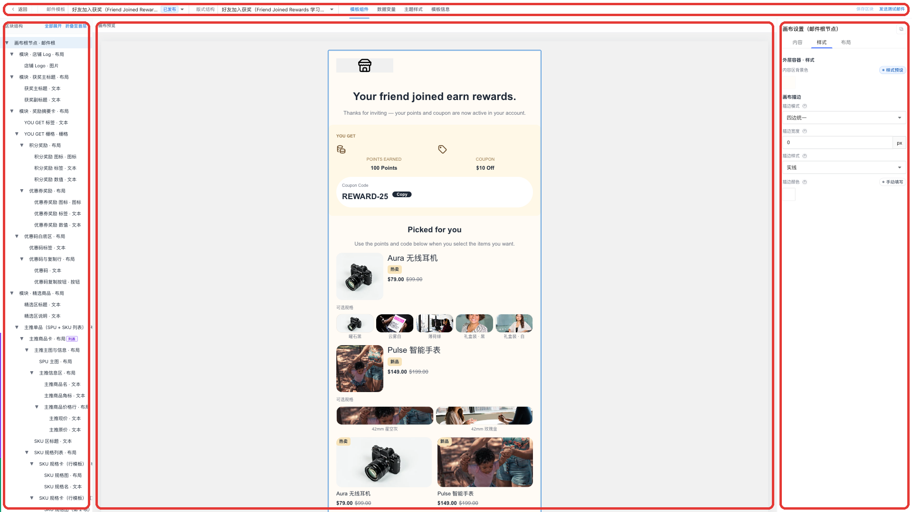

> **图示说明**：邮件编辑器全页示意；示例模板「好友加入获奖」、工作视图 **模板组件**。四个红框对应：**① 顶栏**（§3.2）、**② 左侧列表区**（区块结构等，随 Tab 变化）、**③ 中间画布**、**④ 右侧配置区**（随 Tab 与选中项变化）。顶栏 Tab 定稿名称见 §3.3。

### 3.2 顶栏

| 模块 | 说明 |
|------|------|
| **邮件模板** | 切换当前场景，并在下拉底部维护模板（新建、重命名、发布 / 撤回发布、删除）。细则见 **§5**。从活动「设置邮件」进入时**锁定**（见 §2.2）。 |
| **版式结构** | 切换当前版式，并在下拉底部维护该模板下的版式。细则见 **§5**。活动入口进入时**锁定**。 |
| **工作视图 Tab** | 切换主工作区左右面板所服务的编辑对象（见 §3.3）。顶栏一次只激活一个 Tab；定稿名称：**模板组件**、**数据变量**、**主题样式**、**模板信息**。 |
| **保存** | 将当前编辑成果**保存**至服务端（具体保存范围随 Tab 与后续章节定义，如版式结构、变量取值、主题配置等）。 |
| **测试发信** | 按当前模板、版式与**模板信息**配置发送一封**测试邮件**（**不受**发布状态限制，见 §5.5）。须已配置发信通道，见「模板信息」Tab。 |

> **说明**：模板 / 版式选择与各 Tab 内的编辑相互独立——先选定「编哪套模板、哪套版式」，再在对应 Tab 下编辑模板组件、数据变量、主题样式或模板信息。

### 3.3 工作视图 Tab（顶栏切换）

顶栏提供以下 **4 个**工作视图（名称与界面顶栏 Tab 一致）：

| Tab | 用户目标 | 左侧（列表 / 选项） | 右侧（配置） |
|-----|----------|---------------------|--------------|
| **模板组件** | 查看并编辑当前版式下的**区块树**（邮件由哪些模块组成、如何嵌套） | 当前版式的**区块列表 / 树**（可选中某一区块或模块） | 选中区块的**属性与绑定**（样式、内容来源、列表绑定等） |
| **数据变量** | 维护本模板使用的**业务变量**（文案、链接、列表数据等） | **变量槽列表**（可选中某一变量） | 选中变量的**取值与字段配置** |
| **主题样式** | 维护当前版式使用的**主题色与样式预设**（颜色、字号、圆角等档位） | **样式预设 / 主题条目列表**（可选中某一预设或样式组） | 选中条目的**具体样式值** |
| **模板信息** | 维护本邮件模板的**发信元信息**（邮件标题、摘要等）及测试发信所需配置；**不**替代活动侧正式发信策略 | 简要说明或导航（轻量）；无复杂列表时左侧为占位提示 | **模板信息字段编辑**（主题行、预览摘要、测试收件等） |

切换 Tab 时：**中间画布始终保留**（见 §3.4）；左右面板内容整体替换为对应 Tab 的列表 + 配置，但交互模式一致。

### 3.4 主工作区：画布居中 + 左右随 Tab 变化

主工作区在版面上为 **左 · 中 · 右三列**（见 §3.1 图示红框 ②③④）：

| 项 | 说明 |
|----|------|
| **左侧面板（②）** | 随当前 Tab 展示**列表或选项**——供用户「选哪一项」：如区块树、变量槽目录、样式预设列表。 |
| **中间画布（③）** | **画布预览**，展示当前「模板 + 版式」合并变量与主题后的邮件效果；布局上**固定居中**，不随左右面板宽窄而移出主视野。标题旁可切换 **桌面 / 移动** 预览视窗（见 **§6.6**），用于在搭版时模拟窄屏下的折行与裁切。 |
| **右侧面板（④）** | 展示**当前选中项**的**配置详情**——供用户「改选中项的属性」。未选中时，可为空状态或提示「请先在左侧选择…」。 |
| **左右分工原则** | **左侧 = 列表 / 选项；右侧 = 选中项配置。** 四个 Tab 均遵守该原则，避免同一 Tab 内再混用多种主导航模式。 |

#### 各 Tab 下的左右分工（摘要）

- **模板组件**：左 = **区块结构树**（§10）；右 = 区块配置面板。选中画布上的区块时，与左侧树、右侧配置**联动**。
- **数据变量**：左 = 变量槽目录；右 = 该槽的类型、取值、列表字段等配置。
- **主题样式**：左 = 预设 / 样式条目列表；右 = 选中样式档位或预设的编辑。
- **模板信息**：左 = 说明占位（轻量）；右 = 模板元信息表单；**测试发信**按钮在顶栏触发，配置项在右侧编辑。

### 3.5 与入口、版式的关系

- 编辑器内所有 Tab 编辑的内容，均落在当前顶栏已选的 **邮件模板 + 版式** 之上；切换版式会切换该版式下的**结构与主题样式**；**数据变量**在同一邮件模板（场景）下**多版式共用一份**（与版式无关的业务取值）。
- 从**活动入口**进入时，顶栏模板 / 版式不可切换，但 Tab 与「左列表 + 右配置」布局**不变**，仍可在锁定范围内编辑模板组件、数据变量、主题样式与模板信息。

---

## 4. 邮件模板数据模型总览

§3 描述的是**界面分区**；本章说明这些分区背后**数据如何分层、谁跟谁、一份还是多份**。此处仅为**总览**，不展开字段级与存储细节；后续将按编辑器各 Tab 与发信链路**在本 PRD 内逐章展开**。

### 4.1 邮件模板（场景）与版式：一对多

**邮件模板**在业务上对应一个**发信场景**（如欢迎新会员、弃单挽留、好友加入获奖等）：同一类业务意图、同一套可复用的核心信息。

同一场景在对外呈现上，往往需要**多套组件摆放与版面设计**（如「卡片分段版」「居中对齐版」）。因此产品采用：

- **1 个邮件模板（场景）** → **多个版式**（各版式独立维护结构与版式级样式）；
- 活动发信、编辑器顶栏选型时，须同时选定 **模板 + 版式**（见 §2.2）。

运营在 **「模板组件」** Tab 中编辑的，实质是**当前版式下的邮件结构**（区块树、绑定关系等），即日常所说的「搭版」主要落在**版式**这一层，而不是场景层再复制多份结构。

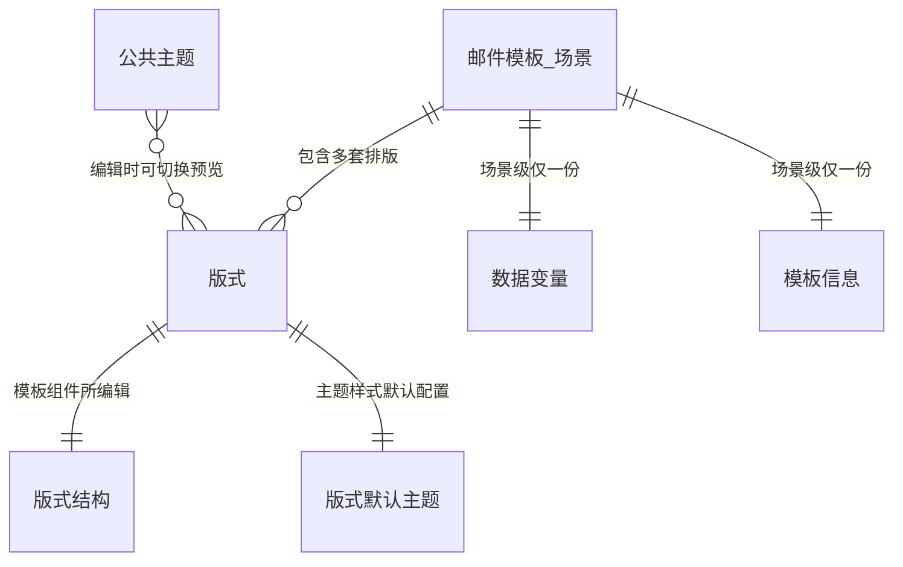

| 概念 | 产品含义 | 数量关系 |
|------|----------|----------|
| **邮件模板** | 发信**场景**（欢迎、挽留等） | 1 个场景 |
| **版式** | 同一场景下的一种**对外排版**（组件位置、模块组合差异） | 每场景 **多个** |
| **版式结构** | 该版式下的区块树与绑定（编辑器 **模板组件**） | 每版式 **1 份** |
| **数据变量** | 场景共用的业务文案、链接、列表数据等 | 每场景 **1 份**，多版式共用 |
| **模板信息** | 场景级发信元信息（标题、摘要等，编辑器 **模板信息** Tab） | 每场景 **1 份** |
| **版式默认主题** | 该版式的颜色、字号、圆角等平面设计档位（编辑器 **主题样式** 默认来源） | 每版式 **1 份** |
| **公共主题** | 全系统可复用的设计主题，可在某版式上**切换预览**不同主题效果 | 多份共享库，**不**替代版式自有默认配置 |

### 4.2 与编辑器布局的对应关系

下列关系与 §3 顶栏、四个 Tab 一致，便于从界面反查数据归属：

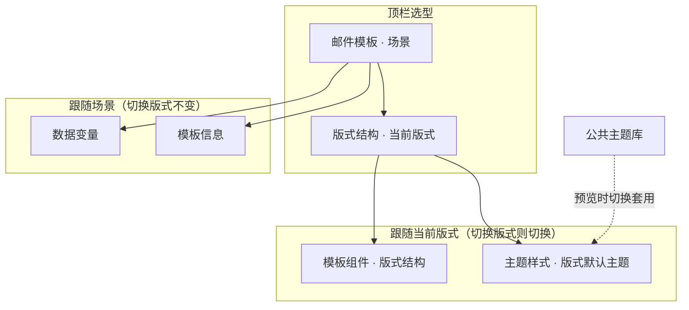

| 编辑器区域（§3） | 数据归属 | 切换版式时 |
|------------------|----------|------------|
| 顶栏 · **邮件模板** | 场景 | 换场景则版式列表、变量、模板信息一并切换 |
| 顶栏 · **版式结构** | 当前版式 | 换版式则结构、默认主题、画布预览切换 |
| Tab · **模板组件** | 当前**版式结构** | 随版式切换 |
| Tab · **数据变量** | 当前**场景**一份 | **不**随版式切换而复制多份 |
| Tab · **主题样式** | 当前**版式默认主题**；可临时切**公共主题**看效果 | 默认配置随版式切换；公共主题为跨版式共享资源 |
| Tab · **模板信息** | 当前**场景** | 不随版式切换 |

### 4.3 主题样式：版式默认与公共主题

**平面设计规则**（颜色、字号、圆角等）因版式而异：不同版式上，同一类区块可能需要不同的色板、字号阶梯或圆角策略。故 **主题样式的默认配置跟随版式**，每个版式自带一套**默认主题配置**（运营在 **主题样式** Tab 维护的主对象）。

同时，许多色板与字号体系可在多个场景、版式间**沉淀复用**。系统提供 **公共主题**（全系统级设计主题库）：在编辑某一版式时，运营可**自由切换**公共主题，在画布上**预览**「若套用另一套设计，该版式长什么样」，而不必为每次预览复制一整份版式。

| 类型 | 作用 | 与版式的关系 |
|------|------|----------------|
| **版式默认主题** | 该版式发信、预览时**默认生效**的样式档位 | 与版式 **1 : 1** 维护 |
| **公共主题** | 可复用设计资产；编辑时**切换查看**套用效果 | **多 : 多** 可选用；切换为预览/编辑辅助，**不**改变「该版式默认主题是哪一套」的归属定义（保存与跟随意语义见 **§11**） |

### 4.4 后续章节（预告）

本章不展开字段定义、校验规则与接口形态。后续在本 PRD 中**沿 §3 交互分区**逐项深入，例如：

- **邮件根** → 画布级配置（内容区背景、页面内边距、600px 宽度等，**§6**）；
- **模板组件** → 八种基础组件、外层容器与内核配置（**§7** 总览；各组件配置范围见 §7 后续分节）；
- **画布搭版** → 选中区块、在画布上添加 / 移动 / 复制 / 删除组件（**§8**）；
- **组件插入默认与模块库** → 单组件出厂默认、运营自定义插入默认、存为模块与模块库插入（**§9**）；
- **区块结构树** → 左侧树形导航、全部展开 / 折叠至首层（**§10**）；
- **数据变量** → 场景级变量槽与取值；
- **主题样式** → 版式默认主题、公共主题、档位维护与区块跟随意（**§11**）；
- **模板信息** → 场景级发信元信息与测试发信；
- **顶栏复制** → 「邮件模板」与「版式结构」下拉均提供 **复制** 入口（**§5.2.1**、**§5.4.2**）。

---

## 5. 顶栏 · 邮件模板与版式管理

本章约定顶栏 **「邮件模板」**、**「版式结构」** 两个下拉及其底部操作区的产品行为。与 §4 对应：**邮件模板 = 场景**，**版式 = 场景下的排版**；列表展示用**名称**，系统用**内部标识**区分记录（见 §5.1）。

操作入口：展开对应下拉，在选项列表下方的**操作区**执行（与 §1.4 发布状态展示方式一致：已发布项在列表行右侧展示 **「已发布」** 标签）。

除 **新建** 外，顶栏支持两类 **复制**（与画布内「复制区块」§8.7 不同）：

| 能力 | 入口 | 详见 |
|------|------|------|
| **复制邮件模板** | 「邮件模板」下拉 → **复制** | **§5.2.1** |
| **复制版式结构** | 「版式结构」下拉 → **复制** | **§5.4.2** |

### 5.1 名称与唯一性

| 项 | 说明 |
|----|------|
| **展示名称** | **邮件模板名称**、**版式名称**由运营填写，用于下拉与列表展示。 |
| **名称可否重复** | **允许重复**。多个模板可同名、多个版式可同名；**不以名称作为系统唯一键**。 |
| **系统唯一性** | 每条邮件模板、每条版式各有**系统内部标识**（由服务端分配），用于存储、切换、活动绑定与校验；运营界面以名称为主，不要求感知标识。 |

### 5.2 新建邮件模板

| 项 | 说明 |
|----|------|
| **入口** | 顶栏 **「邮件模板」** 下拉底部操作区 → **新建**。 |
| **交互形式** | 弹出 **「创建新模板」** 弹窗（非页内 inline 表单）。 |
| **必填信息** | **模板名称**（展示名，单行输入）；提交前须非空（去首尾空格后）。名称最长 **80** 字。 |
| **名称重复** | **允许**与其他模板同名；系统为每条模板分配**唯一内部标识**，不以名称作为唯一键。 |
| **创建结果** | ① 新增一条**邮件模板（场景）**；② **同步自动创建 1 个版式**作为初始版式，展示名默认为 **「默认」**（运营可随后在「版式结构」中重命名或再建更多版式）。 |
| **初始版式内容** | **可编辑空白结构**（最小画布 + 默认主题样式）。 |
| **场景级数据** | 初始化**空的数据变量**目录与**模板信息**等场景级配置入口（详见后续章节）。 |
| **创建后界面** | 创建成功后关闭弹窗，编辑器**切换到该新建模板**，并选中上述初始版式。 |
| **初始发布状态** | 新建完成的**邮件模板**与**同步创建的首个版式**，发布状态均为 **未发布**（见 §5.5）。 |
| **失败提示** | 创建失败时，弹窗内展示错误提示（如「创建失败，请稍后重试」），不关闭弹窗，便于修改后重试。 |
| **与复制的关系** | **复制整封模板**见 **§5.2.1**；本节仅指「空白场景」新建。 |

> **说明**：在已有模板下**追加版式**见 **§5.4.1**、**§5.4.2**；复制整封模板见 **§5.2.1**。

#### 5.2.1 复制邮件模板（场景）

以**当前顶栏选中的邮件模板**为源，生成**另一条独立场景**（新场景目录 + 新内部标识），用于在同套版式与变量配置基础上快速派生新活动场景。

| 项 | 说明 |
|----|------|
| **入口** | 顶栏 **「邮件模板」** 下拉底部操作区 → **复制**（须已选中源模板；无选中时置灰）。 |
| **交互形式** | 弹出 **「复制邮件模板」** 弹窗；默认名称建议为 **「{源模板名} 副本」**（可改）。 |
| **必填信息** | **新模板展示名称**；非空；最长 **80** 字；**允许**与库内其它模板同名。 |
| **新场景标识** | 系统为新场景分配**唯一内部标识**（由名称推导，冲突时自动避让编号）；**与源场景标识不同**。 |

**复制范围（包含）**

| 层级 | 复制内容 |
|------|----------|
| **场景 · 版式清单** | 源场景中全部**未逻辑删除**的版式条目；**已逻辑删除的版式不复制**。 |
| **每个被复制版式** | 该版式的 **版式结构**（`template`：区块树、变量绑定、列表 repeat、条件显隐等）与 **版式默认主题**（`tokenPresets` / `$themeRef`）。 |
| **场景 · 数据变量** | 整份 **payload**（变量槽目录 + 当前取值），与源场景一致。 |
| **场景 · 模板信息** | 可复制的 **meta** 配置（如标题、摘要、测试发信相关项等）；新场景 **展示名** 以弹窗填写为准。 |

**复制范围（不包含 / 重置）**

| 项 | 说明 |
|----|------|
| **发布状态** | 新场景的**邮件模板**与**每一个被复制版式**的发布状态均重置为 **未发布**（须重新发布后才可供活动选用，见 §5.5.1）。 |
| **逻辑删除标记** | 新场景及其版式清单**不含** `deletedAt`；仅复制「仍可见」的版式。 |
| **活动绑定** | **不**复制、**不**迁移任何邮件活动已绑定的模板 / 版式；活动仍指向源场景。 |
| **当前编辑会话** | **不**把源场景顶栏「未保存的区块更改」带入新场景；复制完成后**切换至新场景**（源场景未保存内容仍留在源场景内存态，未自动落盘）。 |

**复制后界面与激活版式**

| 项 | 说明 |
|----|------|
| **切换** | 成功后关闭弹窗，编辑器**切换到新复制的模板**。 |
| **激活版式** | 若源场景的「当前激活版式」仍存在于副本中，则副本沿用该版式为当前编辑对象；若源激活版式已被逻辑删除而未复制，则激活副本中**第一个被复制的版式**。 |

**前置校验与失败（须拦截并提示，不半量落盘）**

| 条件 | 产品行为 |
|------|----------|
| 源模板不存在或已被逻辑删除 | 不可复制，提示源不可用。 |
| 源场景**没有任何可复制的版式**（均已逻辑删除或落盘缺失） | 不可复制，提示无可用版式。 |
| 某一被复制版式的结构文件缺失 | 不可复制，提示对应版式不可用。 |
| 源版式结构 / 主题 / 变量与多版式联合校验不通过 | 不可复制，提示校验失败（如「源版式模板校验失败，无法复制场景」）。 |
| 副本落盘前整包校验不通过 | 不可复制，提示「复制模板校验失败」。 |
| 新场景内部标识与已有目录冲突 | 不可复制，提示标识已存在。 |

**与 §5.6 未保存确认的关系**：复制邮件模板属于**场景级**操作，**不**走 §5.6「未保存的更改」弹窗；但若复制前当前版式有未保存编辑，切换至新场景后，源场景那些未保存内容**不会**自动写入源场景磁盘。

**活动入口（§2.2）**：从活动页进入、顶栏锁定模板 / 版式时，**不展示**「复制」操作。

### 5.3 邮件模板（场景）操作

针对**当前选中的邮件模板**，在下拉底部操作区提供以下能力：

| 操作 | 说明 |
|------|------|
| **新建** | 见 §5.2。 |
| **复制** | 见 **§5.2.1**；须先选中源模板（与版式 **复制** 入口对称，见 §5.4.2）。 |
| **重命名** | 修改当前模板的**展示名称**；名称仍允许与其他模板重复。 |
| **发布** | 仅当当前模板为 **未发布** 时展示。将模板标记为 **已发布**。 |
| **撤回发布** | 仅当当前模板为 **已发布** 时展示。将模板标记为 **未发布**。 |
| **删除** | **逻辑删除**当前模板；执行前须弹出**二次确认**弹窗，用户确认后方可删除。 |

**重命名（弹窗）**

| 项 | 说明 |
|----|------|
| **标题** | **「重命名邮件模板」** |
| **可改范围** | 仅**展示名称**；**内部标识不变**。 |
| **校验** | 名称非空；最长 80 字。 |

**删除（二次确认）**

| 项 | 说明 |
|----|------|
| **标题** | **「删除邮件模板」** |
| **文案要点** | 确认是否删除当前模板名称；说明删除后无法继续编辑，且**已绑定该模板的活动**将表现为 **「模板异常」**（与 §2.3 一致）。 |
| **按钮** | **取消** / **确认删除**（危险操作样式）。 |

**发布 / 撤回发布（二选一展示）**

| 当前发布状态 | 操作区展示 |
|--------------|------------|
| **未发布** | **发布**（或等价文案，如「发布模板」） |
| **已发布** | **撤回发布** |

### 5.4 版式操作

针对**当前邮件模板下、当前选中的版式**，在 **「版式结构」** 下拉底部操作区提供以下能力：

| 操作 | 说明 |
|------|------|
| **新建** | 见 **§5.4.1**（空白版式）。 |
| **复制** | 见 **§5.4.2**；须先选中源版式。 |
| **重命名** | 见 §5.4.3。 |
| **发布** | 仅当当前版式为 **未发布** 时展示。将版式标记为 **已发布**（操作区文案可为 **「发布版式」**）。 |
| **撤回发布** | 仅当当前版式为 **已发布** 时展示。将版式标记为 **未发布**。 |
| **删除** | 见 §5.4.4。 |

**发布 / 撤回发布（二选一展示）**：规则同 §5.3——未发布显示 **发布**，已发布显示 **撤回发布**。

**与模板的关系**：版式始终从属于某一邮件模板；切换顶栏「邮件模板」后，「版式结构」下拉仅展示**未逻辑删除**的版式列表（按创建时间**新→旧**排序）及操作。

#### 5.4.1 新建版式（空白）

| 项 | 说明 |
|----|------|
| **入口** | 当前模板下，**「版式结构」** 下拉底部 → **新建**。 |
| **交互形式** | 弹出 **「新建版式结构」** 弹窗。 |
| **必填信息** | **版式名称**（展示名）；提交前须非空；最长 **80** 字。占位示例可为「例如：居中流式版」。 |
| **名称重复** | **允许**与同模板下其它版式或其它模板的版式同名；系统分配**唯一版式内部标识**（由名称推导，冲突时自动避让编号，运营界面以名称为准）。 |
| **创建内容** | **空白版式**（最小画布 + 默认主题样式），与 §5.2 初始版式同级起点。 |
| **初始发布状态** | **未发布**。 |
| **创建后界面** | 关闭弹窗后，**自动切换到新建的版式**为当前编辑对象，并加载空白结构与默认主题。 |
| **失败提示** | 创建失败时弹窗内提示（如「创建失败，请稍后重试」）。 |
| **与复制的关系** | **复制版式**见 **§5.4.2**（独立入口与弹窗，与「邮件模板」**复制**对称）。 |

**当前版式有未保存更改时**：在**同一模板内**发起 **新建** 或 **复制**（§5.4.2）前，若当前版式存在**未保存的编辑**，须先走 §5.6 确认；用户确认「继续」后**丢弃**当前版式未保存更改，再执行新建或复制。

#### 5.4.2 复制版式结构

以**当前顶栏选中的版式**为源，在同一场景（同一邮件模板）下追加**一条新版式**，内容与源版式一致（结构 + 版式主题），但使用**新的版式内部标识**。交互与 **§5.2.1 复制邮件模板** 对称。

| 项 | 说明 |
|----|------|
| **入口** | 当前模板下，**「版式结构」** 下拉底部操作区 → **复制**（须已选中源版式；无选中时置灰）。 |
| **交互形式** | 弹出 **「复制版式结构」** 弹窗；默认名称建议为 **「{源版式名} 副本」**（可改）。 |
| **必填信息** | **新版式展示名称**；非空；最长 **80** 字；**允许**与同模板下其它版式同名。 |
| **源对象** | **当前顶栏选中的版式**（须为列表中的可见版式）。 |
| **目标** | 同一场景下的**一条新版式**记录；**不是**复制整封模板（整封复制见 §5.2.1）。 |

**复制范围（包含）**

| 层级 | 复制内容 |
|------|----------|
| **版式结构** | 源版式的完整 **template**（区块树、区块展示名、变量绑定、列表 repeat、条件显隐等）。 |
| **版式默认主题** | 源版式的 **tokenPresets**（含模板内 `$themeRef` 与样式档位配置）。 |

**复制范围（不包含 / 不变）**

| 项 | 说明 |
|----|------|
| **场景级数据变量** | **不**复制第二份 payload；新版式与场景内其它版式**共用同一份**数据变量（§4.2）。绑定关系在 template 中保留，仍指向**同一套变量槽**。 |
| **场景级模板信息** | **不变**；不因复制版式而新增 meta。 |
| **其它版式** | **不**改动场景中已有版式。 |
| **发布状态** | 新版式为 **未发布**；源版式发布状态**不变**。 |

**创建后界面**

| 项 | 说明 |
|----|------|
| **切换** | 成功后关闭弹窗，**自动切换到新建的版式**为当前编辑对象。 |
| **画布内容** | 加载**复制结果**（与源版式结构 / 主题一致），非空白起点。 |

**前置校验与失败**

| 条件 | 产品行为 |
|------|----------|
| 源版式 `template` 文件缺失 | 不可创建，提示源版式不可用。 |
| 源版式结构或主题校验不通过 | 不可创建，提示「源版式模板校验失败，无法复制」。 |
| 新版式内部标识已存在 | 不可创建，提示版式标识冲突。 |

**与画布「复制区块」的区别（§8.7）**：§8.7 的 **复制** 是在**当前版式内**克隆某一区块子树为**同级模块**；本节是在**同一场景**下新增**另一条版式记录**，二者互不影响。

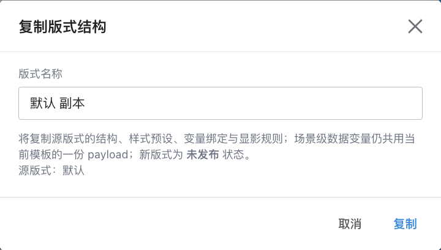

#### 5.4.3 重命名版式

| 项 | 说明 |
|----|------|
| **标题** | **「重命名版式结构」** |
| **可改范围** | 仅**版式展示名称**；**版式内部标识不变**（重命名不影响活动已绑定的版式引用）。 |
| **校验** | 名称非空；最长 80 字。 |

#### 5.4.4 删除版式

| 项 | 说明 |
|----|------|
| **行为** | **逻辑删除**当前选中的版式；列表中不再展示，系统保留删除记录供校验与活动侧「模板异常」判断。 |
| **二次确认** | 标题 **「删除版式」**；文案须包含版式名称，并说明删除后无法继续选用，**已绑定该版式的活动**将表现为 **「模板异常」**。按钮：**取消** / **确认删除**。 |
| **至少保留一个版式** | 每个邮件模板下须**至少保留 1 个未删除的版式**。当**仅剩 1 个**可见版式时，**删除**操作**置灰不可用**（不提供删除入口）。 |
| **删除后切换** | 若删除的是当前正在编辑的版式，系统自动切换到**另一个未删除的版式**（优先按创建时间较新的可见版式）并加载其内容。 |
| **未保存更改** | 若当前版式有未保存编辑，删除前须先走 §5.6 的丢弃确认。 |

### 5.5 发布状态：活动发信与测试发信

模板层、版式层各维护**独立的发布状态**（未发布 / 已发布）。二者组合决定模板资产能否用于**正式活动发信**；**编辑器内测试发信**单独约定。

#### 5.5.1 邮件活动选用与正式发信（须已发布）

与 §2.2、§2.3 一致，汇总如下：

| 场景 | 要求 |
|------|------|
| **活动页 V2 下拉备选项** | **邮件模板**、**版式** 两个下拉均**仅展示已发布**项；未发布的不进入列表，运营无法在活动中新建或改绑时选到。 |
| **活动正式发信** | 活动已绑定的 **模板 + 版式** 在发信执行前须通过可用性校验：两层均为 **已发布** 且未被删除；否则**不发信**（§2.3）。 |
| **活动页已保存但事后撤回发布** | 历史绑定可仍展示名称，但须提示 **「模板异常」** 并限制「设置邮件」与发信（§2.3）。 |

即：**只有已发布的邮件模板 + 已发布的版式**，才出现在活动侧可选范围内，并支持活动链路**正常发送**。

#### 5.5.2 编辑器「发送测试邮件」（不受发布状态限制）

| 项 | 说明 |
|----|------|
| **范围** | 顶栏 **「发送测试邮件」**（或等价按钮）。 |
| **与发布状态** | **不受**模板、版式发布状态限制——无论当前模板 / 版式为 **未发布** 或 **已发布**，只要满足发信通道与「模板信息」等配置条件，**均可**发送测试邮件。 |
| **目的** | 便于运营在草稿阶段自测版式与变量效果，无需先发布再测。 |
| **与正式发信区分** | 测试发信仅用于编辑器内验证，**不**代表活动侧可绕过 §5.5.1 的发布门槛。 |

### 5.6 版式切换与结构操作前的「未保存」确认

下列操作若当前版式存在**未保存的区块结构等编辑**，须先弹出确认弹窗：

| 触发操作 | 说明 |
|----------|------|
| **新建版式** | §5.4.1 |
| **复制版式** | §5.4.2 |
| **删除版式** | §5.4.4 |
| **切换版式**（顶栏下拉选择其它版式） | 切换后将加载目标版式内容 |
| **删除邮件模板** | §5.3 |
| **切换邮件模板** | 切换到其它场景 |

**不触发 §5.6 的操作**：**复制邮件模板**（§5.2.1）——属场景级切换，见该节说明。

| 项 | 说明 |
|----|------|
| **标题** | **「未保存的更改」**（或等价文案） |
| **文案要点** | 当前版式有未保存更改，继续操作将**丢弃**这些编辑。 |
| **按钮** | **取消**（留在当前版式继续编辑）/ **继续**（丢弃未保存更改并执行原操作） |

> **范围说明**：本节针对**版式级结构等未保存状态**；变量、主题等其它 Tab 的保存范围在后续章节分别约定。

### 5.7 典型用例（验收参考）

以下用例供**测试**在侧栏 **「邮件编辑器」** 入口下验收顶栏 **「邮件模板」**、**「版式结构」** 及关联弹窗；与 §2.2 活动页下拉、§2.3 发信门禁的联动用例见该节，此处不重复展开。

**前置**：已能打开邮件编辑器；除特别说明外，指在**侧栏入口**（可自由切换模板 / 版式、可操作发布与删除）。

#### 邮件模板

| # | 操作步骤（摘要） | 预期结果 |
|---|------------------|----------|
| T1 | 「邮件模板」下拉 → **新建** → 填写合法名称 → 创建 | 弹出「创建新模板」；成功后关闭弹窗，顶栏切到该模板，且自动带有 1 个初始版式（展示名「默认」）；模板与版式均为**未发布**（列表无「已发布」标签） |
| T2 | 创建时名称仅空格或留空 → 提交 | 不可提交或提示名称不能为空 |
| T3 | 当前模板 → **重命名** → 修改为合法名称 → 保存 | 弹出「重命名邮件模板」；顶栏与下拉展示新名称；允许与同库其它模板同名 |
| T4 | 当前模板为**未发布** → 查看下拉底部操作区 | 展示 **发布**（或等价文案），**不**展示「撤回发布」 |
| T5 | 执行 **发布** 后再次打开下拉 | 列表当前项右侧出现 **「已发布」**；底部改为 **撤回发布**，不再展示「发布」 |
| T6 | 当前模板 → **删除** → **取消** | 弹出「删除邮件模板」二次确认；取消后模板仍在，可继续编辑 |
| T7 | 当前模板 → **删除** → **确认删除** | 模板从下拉列表消失（逻辑删除）；若删的是当前项，编辑器切到其它未删模板 |
| T8 | 「邮件模板」下拉 → 切换至另一模板 | 顶栏模板名、版式列表、画布与右侧配置随场景切换；**数据变量 / 模板信息** 随场景变，**模板组件 / 主题样式** 随当前版式变（与 §4.2 一致） |
| T9 | 当前模板 → **复制** → 使用默认建议名或修改 → 确认 | 弹出「复制邮件模板」；成功后进入**新模板**；新模板含源模板全部**可见版式** + **payload**；模板与各版式均为**未发布** |
| T10 | 源模板仅 1 个可见版式且已逻辑删除其余版式 → **复制** | 应失败并提示无可复制版式（或等价文案） |

#### 版式结构

| # | 操作步骤（摘要） | 预期结果 |
|---|------------------|----------|
| L1 | 当前模板下「版式结构」→ **新建** → 填写合法名称 → 创建 | 弹出「新建版式结构」；成功后自动切到新版式，画布为空白起点（最小结构 + 默认主题） |
| L2 | 当前版式 → **重命名** → 保存 | 弹出「重命名版式结构」；顶栏与下拉展示新版式名 |
| L3 | 模板下存在 **≥2 个** 版式 → 当前版式 → **删除** → 确认 | 弹出「删除版式」二次确认；确认后该版式从列表消失 |
| L4 | 模板下**仅剩 1 个**可见版式 → 打开「版式结构」下拉底部 | **删除** 为**置灰不可用**，无法发起删除 |
| L5 | 删除当前正在编辑的版式（且尚有其它版式）→ 确认 | 自动切换到另一未删版式并加载其内容 |
| L6 | 当前版式为**未发布** / **已发布** | 底部操作区与 §5.3 相同规则：未发布显示 **发布版式**，已发布显示 **撤回发布** |
| L7 | 「版式结构」下拉 → **复制** → 确认 | 弹出「复制版式结构」；成功后新版式与当前版式结构/主题一致；**数据变量**仍为本场景同一份；自动切到新版式 |
| L8 | 「版式结构」下拉 → **新建** → 创建 | 空白版式（§5.4.1） |
| L9 | 当前版式有未保存区块更改 → **复制** 或 **新建** | 先弹 §5.6；**继续** 后丢弃未保存更改再执行 |

#### 未保存的区块更改

| # | 操作步骤（摘要） | 预期结果 |
|---|------------------|----------|
| U1 | 修改当前版式区块结构且**未点「保存区块」** → 切换**另一版式** | 先弹出「未保存的更改」；**取消** 留在当前版式且修改仍在；**继续** 则丢弃未保存修改并切换 |
| U2 | 同上未保存状态 → **切换邮件模板** / **新建版式** / **删除** 当前版式或模板 | 均先走 U1 同款确认（与 §5.6 触发列表一致） |
| U3 | 未保存状态下确认弹窗点 **继续** 后 | 顶栏「保存区块」恢复为不可用（无未保存态），目标操作已执行 |

#### 发布状态与测试发信（顶栏相关）

| # | 操作步骤（摘要） | 预期结果 |
|---|------------------|----------|
| P1 | 模板、版式均为**未发布** → 顶栏 **发送测试邮件** | **允许**发送（不受发布状态限制，§5.5.2） |
| P2 | 模板、版式均**已发布** → 创建邮件活动页 V2 | 「邮件模板」「版式」下拉中**可见**该组合（§5.5.1） |
| P3 | 将已用于活动的模板或版式 **撤回发布** 后 → 活动页打开或触发发信 | 活动侧 **「模板异常」** 且不发信（§2.3，与顶栏撤回发布联动） |

#### 活动入口约束（回归）

| # | 操作步骤（摘要） | 预期结果 |
|---|------------------|----------|
| C1 | 从活动页 **「设置邮件」** 进入编辑器 | 顶栏**不可**切换邮件模板 / 版式；下拉底部**无**发布、撤回、删除、新建、**复制模板**等（§2.2）；**可**编辑内容与 **发送测试邮件** |

### 5.8 复制能力对照（避免混淆）

| 维度 | **§5.2.1 复制邮件模板** | **§5.4.2 复制版式结构** | **§8.7 画布复制区块** |
|------|-------------------------|---------------------------|------------------------|
| **作用范围** | 整封场景（新模板目录） | 同场景下新增一条版式 | 当前版式内新增同级模块 |
| **数据变量** | 复制整份 payload | **不**复制，共用场景 payload | 不涉及 payload 目录 |
| **版式主题** | 每个被复制版式各一份 | 复制源版式一份 | 随区块保留绑定 |
| **发布状态** | 模板 + 全部新版式 → 未发布 | 仅新版式 → 未发布 | 不变 |
| **典型用途** | 新活动场景、AB 场景分叉 | 同场景多排版（如居中版 / 卡片版） | 快速克隆模块壳 |

---

## 6. 邮件根 · 画布级配置

本章约定 **邮件根**（画布根节点）在 **「模板组件」** Tab 下的配置范围。每版式有且仅有 **1 个**邮件根，承载 **600px 邮件内容区** 的画布级背景、边距与顶层子模块间距；**不属于** §7 八种可自由插入的基础组件。

数据归属见 §4.2：邮件根属当前**版式结构**（区块树最顶层），切换版式则切换对应邮件根及其子树。

> **范围说明（本章）**  
> **§6.4** 为邮件根**可写入版式**的配置项；**§6.5** 为**渲染默认**（字体、行高等，影响发信 HTML）；**§6.6** 为**画布桌面/移动预览视窗**（有效宽度与 fill/hug 自适应，不写版式）。绑定**样式预设 / 主题变量**见 **§11**；**业务数据变量**见 **§12**（总览；绑定与取值细则见 §12 后续小节，待写）。

### 6.1 定位与选中方式

| 项 | 说明 |
|----|------|
| **每版式唯一** | 新建版式时自动生成 **1 个**邮件根；运营**不能**再插入、复制或删除邮件根。 |
| **区块树** | 树顶为 **邮件根**（可带自定义展示名，如「画布根」）；其下挂载各顶层模块（初始版式通常含 **布局容器** + 占位 **文本**）。 |
| **选中方式** | 点击画布空白（未点中具体区块），或点击区块树中的 **邮件根** 行。 |
| **配置面板标题** | 选中邮件根时，右侧配置面板标题为 **「画布设置（邮件根节点）」**，区别于选中普通区块时的 **「区块设置」**。 |
| **页签** | 展示 **内容 / 样式 / 布局** 三个页签；**不展示**「显隐」页签——条件显隐只能配置在子区块或容器上。 |

### 6.2 与顶层子模块的关系

邮件根的**直接子级**为 §7 中的基础组件（实践中多为 **布局容器**）。根节点对子模块**固定纵向排列**：自上而下依次堆叠，**不提供**横排切换，也**不提供**与单块相同的 **「容器内内容摆放」** 对齐分组。

相邻顶层模块之间的**竖向间距**由 **组件 · 布局** 中的 **间距 / 间距模式** 控制（语义与 **布局容器** 内核中的间距一致，但作用对象是邮件根的直接子级）。

### 6.3 右侧配置面板 · 分组入口

| 配置页签 | 分组标题 | 所含配置 |
|----------------|----------|----------|
| **内容** | **组件 · 内容** | **内容区底图**（可选；未启用时仅 **「启用背景图」** 按钮） |
| **样式** | **外层容器 · 样式**、**画布描边** | **内容区背景色**；整封邮件内容区外轮廓 **描边** |
| **布局** | **组件 · 布局**、**外层容器 · 布局** | **页面内边距**、**间距模式**、**间距**；**画布宽度（固定）** |

> **命名说明**：界面沿用「外层容器 · 样式 / 布局」分组标题，语义上指 **600px 邮件内容区** 这一画布壳，而非某个可插入模块的外壳；下表使用产品化名称描述。

### 6.4 配置项详表

#### 6.4.1 样式与布局（常显项）

| 配置项 | 可选范围 | 画布上的表现 |
|--------|----------|----------------|
| **内容区背景色** | 颜色（含透明）；新建版式默认为白色系 | 填充 **600px 宽** 邮件内容区矩形；无内容区底图时即整区纯色底。 |
| **画布描边模式** | **四边统一** / **四边独立** | 与 §7.3.2「容器描边模式」相同。 |
| **画布描边宽度 / 样式 / 颜色** | 非负像素宽度；**实线 / 虚线 / 点线**；颜色含透明；默认无描边 | 沿 **600px 内容区外缘** 绘制边框；预览与发信导出一致。 |
| **页面内边距模式** | **四边统一** / **四边独立** | 与 §7.3.2「内边距模式」相同。 |
| **页面内边距数值** | 各边非负像素；默认 **0** | **未启用内容区底图**：背景色、描边贴内容区边缘，内边距在内侧推开**直接子模块**。 **已启用内容区底图**：底图**铺满**内容区；页面内边距**仅作用于叠放在底图之上的子模块**，不改变底图铺满范围（布局页签顶部有说明文案）。 |
| **间距模式** | **固定像素** / **自动均分（主轴剩余空间）** | 控制**直接子模块**之间的竖向间隙策略。 |
| **间距** | 非负像素；仅当间距模式为 **固定像素** 时出现；默认 **0** | **固定像素**：相邻顶层模块之间插入该高度的竖向空隙。 **自动均分**：将内容区**剩余高度**均分到相邻子模块之间；当子模块均为「跟随内容」高度且无剩余空间时，视觉与紧凑排列一致。 |
| **画布宽度（固定）** | 只读 **600px** | 邮件正文版心标准宽度；预览与发信 HTML **均为 600px**。若结构偏离 600px，保存/校验阶段提示修复。 |

#### 6.4.2 内容区底图（可选）

在 **内容** 页签启用 **内容区底图** 后，画布以「**底图层 + 叠放层**」渲染：底图铺满 600px 内容区（或按填充策略适配），顶层子模块叠在上方。底图的 **地址、填充策略、画面位置、背景圆角、背景描边** 均在 **内容** 页签配置（与 §7.3.3 容器底图一致）；**样式** 页签中的 **内容区背景色**、**画布描边** 仍指 600px 内容区外壳，不含底图裁切项。

| 配置项 | 可选范围 | 画布上的表现 |
|--------|----------|----------------|
| **背景图地址** | 图片 URL | 在内容区矩形内显示底图；未加载或透明区域可透出 **内容区背景色** 或系统默认浅灰兜底。 |
| **背景替代文本** | 字符串（建议 ≤100 字） | 无障碍替代说明；画布选中态可编辑，收件端按邮件客户端规则呈现。 |
| **背景链接地址** | URL（可选） | 配置后底图区域可点击跳转。 |
| **背景填充策略** | **裁切铺满（cover）** / **完整显示（contain）** | **cover**：保持比例放大直至**铺满**内容区，超出部分裁切，可配合「背景画面位置」选择保留画面的哪一侧。 **contain**：完整显示图片，可能留白；留白区显示内容区背景色或兜底色。 |
| **背景画面位置** | 九宫格锚点（如居中、左上、右下等）；仅 **cover** 时可配 | 控制 **cover** 裁切时的**焦点**；**contain** 下不参与摆放（控件置灰）。 |
| **背景圆角 / 背景描边** | 与 §7.3.2 容器圆角、描边**相同模式与枚举** | 作用于**底图可见区域**外轮廓，而非整个 600px 内容区外壳（内容区外壳仍用 **画布描边**，且无单独的「内容区圆角」项）。 |
| **关闭背景图** | 操作按钮 | 清除底图配置，回到纯色 **内容区背景色** 模式。 |

### 6.5 渲染默认（不提供配置项）

下列规则属于 **「渲染默认」**：在 **600px 邮件版心** 内，预览与发信 HTML **始终按此呈现**，但右侧配置面板**不提供**对应控件，或**保存版式时不得写入同名配置**（保存校验不通过）。与 §6.4「运营可在面板中修改的配置」并列。

> **范围说明**：本节只写**会影响发信 HTML 的固定排版/呈现**（如字体、行高、邮件表格排版）。**桌面 / 移动预览视窗**与 fill/hug 窄屏自适应见 **§6.6**；**不含** §6.1 的树操作规则；**不含**编辑器工作区灰底（见 §6.5.6）。

#### 6.5.1 版心内固定排版（注入渲染，不写版式）

| 项目 | 固定取值 | 作用于 | 预览与发信中的表现 |
|------|----------|--------|-------------------|
| **正文字体族** | Arial, sans-serif | **文本**、**按钮**文案 | 全邮件统一字体族；运营**不能**在配置面板改「邮件字体」 |
| **文本行高** | **1.3**（相对行高） | **文本**块 | 段落行距固定；**无**行高配置项 |
| **按钮胶囊内边距** | **8px 12px**（上下 8、左右 12） | **按钮**本体 | 胶囊可点区域内边距固定；**无**内边距配置项 |
| **按钮默认字号** | **15px** | **按钮**（未配字号时） | 未在按钮样式中指定字号时，按 15px 显示 |
| **图片/底图透明区兜底** | 浅灰（约 **#f0f0f0**） | **图片**、各层**容器底图**（含 **内容区底图**） | 透明、未加载或未铺满区域显示浅灰底 |

#### 6.5.2 禁止写入版式的排版项（配置了也无效或报错）

| 不能配置 / 不能写入 | 说明 |
|---------------------|------|
| **文本行高** | 不提供配置项；版式中若写入文本行高配置，**保存校验不通过** |
| **文本旧版排版字段** | 已废弃的独立「字重模式 / 斜体模式 / 装饰模式」等字段不得出现在版式中 |
| **按钮胶囊内边距** | 不提供配置项；版式中若写入按钮胶囊内边距配置，**保存校验不通过** |
| **区块外壳 overflow** | 外壳溢出裁切由系统统一处理，**不提供**对应配置项，**不得**写入版式 |

#### 6.5.3 邮件 HTML 呈现方式（整封版心）

| 约定 | 预览与发信中的表现 |
|------|-------------------|
| **仅用邮件表格排版** | 模块纵向排布、对齐、外壳、进度条等一律用 **presentation 表格** 实现；**不用** Flex、object-fit、绝对定位叠层等网页排版 |
| **预览与发信同构** | 测试发信 / 导出 HTML 的正文与画布 **600px 版心** 内**同一套排版规则**，不靠发信后再套一层样式「修正」版式 |
| **底图裁切方式** | 底图 **裁切铺满** 用背景图 position 控制焦点；**完整显示** 不用 object-fit，留白见 §6.5.1 兜底色 |
| **「跟随内容」外壳发信** | 外壳为 **跟随内容** 宽/高的块，发信时会把**实测像素**写入 HTML；版式里仍只保存模式，不写死 px |

#### 6.5.4 邮件根与内容区底图（渲染语义）

下列在 **§6.4 可配项之外** 仍固定生效，且主要落在邮件根或全版心底图上：

| 约定 | 预览与发信中的表现 |
|------|-------------------|
| **顶层模块纵排** | 邮件根下直接子模块**恒为自上而下**表格行；间距仅 §6.4「间距 / 间距模式」可改 |
| **内容区底图 + 页面内边距** | 启用 **内容区底图** 时，**页面内边距**只推开**叠在底图上的子模块**，不缩小底图铺满范围（与 §6.4 文案一致，属渲染层固定语义） |
| **底图叠放层默认对齐** | 叠放层默认 **靠上、靠左**；子模块仍可在各自 **外层容器 · 布局** 改对齐 |
| **背景画面位置** | 仅 **裁切铺满** 时参与；**完整显示** 时不参与（配置项置灰） |
| **底图圆角/描边 vs 画布描边** | **背景圆角 / 背景描边** 只作用于底图区域；**画布描边** 只沿 600px 内容区外缘 |

#### 6.5.5 子模块外壳缺省（与邮件根配合）

新建版式会为各基础组件写入默认 **容器内内容摆放（靠左 + 靠上）**。若版式中某块缺失该项，渲染仍按 **靠左、靠上** 回退（**不是**邮件根上的配置，但影响版心内排版观感）。

**文本块竖直摆放（补充）**：**文本**块的 **容器内内容摆放 · 竖直** 在渲染时**固定为靠上**；运营仅通过 **水平** 对齐控制段落在外壳内的左右/居中位置（与 §7.10 一致）。

#### 6.5.6 基础组件缺省回退（未在面板单独配置时）

下列为**八种基础组件**在版式未填写对应项时，预览与发信共用的**产品缺省表现**（具体色值以实现为准，验收以画布与测试发信一致为准）：

| 组件 | 缺省表现 |
|------|----------|
| **按钮** | 文案显示为 **「按钮」**；链接为占位链接；字重**默认偏粗**（须在样式中显式关闭加粗才变为常规字重）；字号见 §6.5.1 |
| **分割线** | 线条颜色为浅灰；线条粗细约 **1px**；线条本体宽度模式为 **铺满容器（fill）** |
| **进度条** | 进度槽为浅米色系、已完成段为金黄色系；条带高度约 **10px**；条带圆角为**大圆角胶囊形**；条带宽度模式为 **铺满容器（fill）**；当前进度 **0**、满槽刻度 **100** 参与计算 |

#### 6.5.7 编辑器预览环境（不进发信正文）

| 项 | 说明 |
|----|------|
| **工作区灰底** | **600px 版心外侧**为浅灰工作区背景，仅编辑器预览用；**不出现在**测试发信 / 正式发信正文中 |
| **发信抓取范围** | 测试发信与 HTML 导出仅包含 **600px 邮件版心** 内内容，不含工作区灰底与版心外留白 |

> **与 §6.4 的关系**：§6.4 = 运营在配置面板能改的；§6.5 = 系统固定、影响发信正文的排版与 HTML 规则。邮件根章节须**两段一起读**。

### 6.6 画布预览视窗（桌面 / 移动）

在编辑器画布中模拟不同终端阅读宽度，用于检查 **铺满父级（fill）**、**跟随内容（hug）** 在窄屏下的折行与裁切。能力挂在**整封邮件预览**上，与 **§6.4 邮件根版心（600px）** 强相关；**不**在右侧配置面板增加字段，**不**单独保存「移动版式」。

**入口**：中间 **「画布预览」** 标题旁的 **桌面 / 移动** 切换（见 §3.4）。

#### 6.6.1 视窗宽度（不写版式）

| 模式 | 预览视窗宽度 | 说明 |
|------|-------------|------|
| **桌面** | **600px** | 与 §6.4 **画布宽度（固定）** 一致；视窗宽 = 版心配置宽 |
| **移动** | **375px** | 常见手机逻辑宽；视窗**窄于** 600px 版心，触发 §6.6.2 的自适应与裁切 |

切换 **桌面 / 移动** 只改变**当前画布预览态**，**不修改**版式里已保存的 **画布宽度（仍为 600px）**，刷新或重进编辑器后须重新选择预览模式。

#### 6.6.2 邮件根与版心内的自适应（仅预览态）

画布由外到内：**预览视窗** → **600px 邮件内容区外壳（邮件根）** → **版心内各模块**。

| 层级 | 预览中的表现 |
|------|-------------|
| **预览视窗** | 宽度 = 当前模式（600 或 375）；**不出现横向滚动条**；超出视窗宽的内容 **裁切隐藏**（视窗为最外层可见边界） |
| **邮件根外壳** | 配置宽度 **恒为 600px**（§6.4）；**移动** 模式下外壳仍为 600px 宽，**超出 375px 视窗的部分被视窗裁切**（右侧不可见，但不改版式里的 600px） |
| **版心内排版有效宽度** | **取较小值：版心配置宽、当前预览视窗宽** → 桌面 **600px**，移动 **375px**；邮件根内顶层模块的表格排版按此**有效宽度**计算 |
| **铺满父级（fill）** | 在有效宽度内横向 **100% 铺满**；**移动** 预览时随有效宽度变窄而收缩、换行 |
| **跟随内容（hug）** | 随内容收窄，但 **不超过父级可用宽**；**移动** 下父级更窄，长文案等更易折行 |
| **自定义固定（fixed）** | **仍按配置的像素宽高占位**，**不**被视窗压窄；若固定宽大于有效宽度，由父级或视窗 **裁切**，不撑出横向滚动 |

各模块外壳超出父级可视区域时，统一 **裁切隐藏**（与 §6.5 块级裁切一致），**不改变**子级 fixed 的配置数值。

#### 6.6.3 与保存、测试发信的关系

| 项 | 说明 |
|----|------|
| **保存版式** | 保存 **600px 版心结构**与各块配置；**不保存**当前是桌面还是移动预览 |
| **测试发信** | 按 **当前画布预览** 抓取 HTML（测试发信弹窗说明为「按当前画布预览发送」）。若在 **移动** 预览下发送，版心 **内** fill/hug 的折行与占位以 **375px 有效宽度** 为准；投递文档外层仍按 **600px 版心** 包装 |
| **活动正式发信** | 由活动侧与邮件客户端呈现；编辑器 **移动** 预览用于**搭版自检**，不维护第二套移动版式文件 |

#### 6.6.4 选中邮件根时的表现（移动预览）

**移动** 预览且选中 **邮件根**（点击画布空白）时：选中高亮画在 **可见的预览视窗** 外缘（375px），避免 600px 根外壳被裁切后 **选中框右侧缺一段**。

#### 6.6.5 与 §6.5 的分工

| | **§6.5 渲染默认** | **§6.6 预览视窗** |
|--|-------------------|-------------------|
| **作用** | 全邮件固定排版（字体、行高、表格呈现等） | 画布上模拟 **窄屏** 时的 **有效宽度、裁切、fill/hug 自适应** |
| **是否写版式** | 部分禁止写入；部分注入渲染 | **不写版式** |
| **收件人侧** | 发信 HTML 按 §6.5 固定规则 | 正式发信不随编辑器切换；**测试发信**随当前预览态（见 §6.6.3） |

### 6.7 不支持的能力（与八种基础组件的差异）

| 能力 | 邮件根 | 八种基础组件（§7） |
|------|--------|---------------------|
| **条件显隐** | **不支持**（无显隐页签） | 支持（显隐页签） |
| **列表重复绑定** | **不支持** | **布局容器 / 栅格 / 图片** 支持 |
| **容器内内容摆放** | **不支持**（子模块固定纵排） | **外层容器 · 布局** 中配置 |
| **宽度 / 高度模式** | 内容区 **固定 600px 宽**；无 hug / fill / fixed 切换 | 各块在外壳中自洽配置 |
| **容器圆角** | **不支持**（内容区外壳无圆角项；底图可单独设 **背景圆角**） | **外层容器 · 样式** |
| **区块展示名** | 标题固定为「画布设置」；**无**块名称输入框 | 选中块可在配置面板中改展示名 |

### 6.8 本章边界与后续章节

| 主题 | 本章是否展开 | 说明 |
|------|----------------|------|
| 邮件根**可配置项**与画布表现 | **是** | §6.4 |
| 邮件根**渲染默认**（字体/行高等不可配置） | **是** | §6.5 |
| **桌面 / 移动** 预览视窗与版心内自适应 | **是** | §6.6 |
| 八种基础组件外壳 / 内核 | **否** | **§7** |
| 绑定**主题 / 样式预设** | **否** | **§11** |
| 绑定**业务数据变量** | **否** | **数据变量** Tab（待写） |
| 画布上添加 / 移动 / 复制 / 删除区块 | **否** | **§8** |
| 左侧区块结构树 | **否** | **§10** |
| 组件插入默认 / 模块库 | **否** | **§9** |

**阅读顺序建议**：搭版前先通读 **§6.4 可配置项**、**§6.5 渲染默认**（含 §6.5.6 组件缺省回退、§6.5.7 编辑器工作区）与 **§6.6 预览视窗**（移动下 fill/hug 折行），再阅读 **§7** 八种基础组件，按 **§8** 在画布上搭结构；需复用样式时读 **§9**，用 **§10** 在树中定位层级。

---

## 7. 模板组件 · 总览

本章约定 **「模板组件」** Tab 下可编排的**基础组件类型**，以及各组件在配置上的**统一分层**（外层容器 vs 内核）。**邮件根**（画布级配置）见 **§6**；本章仅覆盖八种可插入、可嵌套的基础组件。

数据归属见 §4.2：此处编辑的是当前**版式结构**（区块树），切换版式则切换整套结构。

> **范围说明（本章）**  
> 仅描述**基础组件配置**——运营在右侧配置面板中，为选中区块设置的**尺寸、摆放、外观**以及**该组件类型独有的内容/结构项**（如文本写什么、按钮文案与链接、栅格列数等）。  
> **本章暂不展开**：绑定**样式预设 / 主题变量**（**§11**）、绑定**业务数据变量**（待写）、**列表重复**、**条件显隐**；上述能力在后续章节单独约定，但在产品上仍作用于同一批区块。

### 7.1 八种基础组件

运营在区块树中插入、编排的**基础组件**共 **8 种**。名称与界面区块树、右侧配置面板标题一致：

| # | 组件名称 | 产品用途（摘要） |
|---|----------|------------------|
| 1 | **布局容器** | 纵向或横向排布子区块，控制模块内顺序与间距，可嵌套其它组件。 |
| 2 | **栅格** | 按行、列排布子区块（如商品宫格、多列信息区），支持列数、间距与单元格尺寸策略。 |
| 3 | **文本** | 展示一段或多段文案（标题、说明、价格等）。 |
| 4 | **图片** | 展示图片资源；可作为**带底图的容器**，在其上叠放子区块。 |
| 5 | **图标** | 展示小尺寸图标（装饰、标签旁图标等）。 |
| 6 | **按钮** | 可点击的行动点（主按钮、文字链式按钮等），含文案与跳转目标。 |
| 7 | **分割线** | 模块之间的分隔线。 |
| 8 | **进度条** | 展示进度或完成度（如任务进度、步骤完成比例）。 |

**与「邮件根」的关系**：画布最顶层的 **邮件根** 承载整封邮件的**画布级**设置（见 **§6**），**不是**上表中的第 9 种可插入组件；日常搭版使用的是上表 **8 种**可自由增删、嵌套的基础组件。

**配图样例邮件**：下文各组件 **画布预览** 示意图取自专用样例邮件 **「PRD 八种组件配图」**（邮件根下纵向排列八种组件出厂样例，版式 **默认**）；仅用于文档与验收对照，不作为业务发信模板。

#### 选中基础组件时的配置面板共性

八种基础组件在 **「模板组件」** Tab 下选中后，右侧配置面板遵循下列共性（邮件根见 **§6**，不在此列）：

| 项 | 说明 |
|----|------|
| **面板标题** | **区块设置**（区别于邮件根的 **「画布设置（邮件根节点）」**） |
| **区块展示名** | 面板顶部可编辑 **区块展示名**，用于区块树识别与协作排查；**不改变**组件类型与渲染能力 |
| **复制定位信息** | 提供 **复制定位信息** 操作，便于报错定位与沟通 |
| **配置页签** | 通常含 **内容 / 样式 / 布局**；当块具备列表或显隐能力时，另含 **列表 / 显隐** 页签 |
| **列表预览态** | 处于列表重复的**虚拟预览**上下文时，**内容** 页签内字段可**只读或不可编辑**（细则见列表专章）；**样式 / 布局** 仍按各组件规则配置 |

### 7.2 配置分层：外层容器 + 内核

从抽象上看，**每一种**基础组件（含布局类与内容类）都由两层构成：

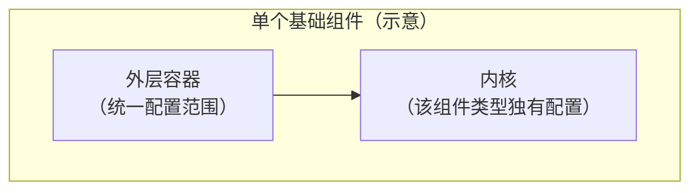

| 层次 | 含义 | 配置上的特点 |
|------|------|----------------|
| **外层容器** | 包裹组件可见内容的**壳**：决定该组件在父级中占多大、如何对齐、是否有背景/描边/圆角/内边距等。 | **8 种基础组件共用同一套外层容器配置范围**（见 §7.3）。文本的外壳与按钮的外壳，在「能配哪些外壳项」上**一致**。 |
| **内核** | 组件**本体**要表达的能力与内容：文本的正文、按钮的胶囊样式与链接、栅格的列数、图片的图源等。 | **因组件类型而异**；仅该类型在配置面板中展示对应内核项。 |

**直观例子**：

- **文本组件**：外层容器决定文本块在邮件中的**占位与壳样式**；**内核**决定**写什么字、字号与字色**等文本本体属性。  
- **按钮组件**：外层容器与文本组件**相同范围**的外壳配置；**内核**决定**按钮文案、链接、按钮本体样式**（如胶囊形态），而非外壳的 padding / 背景（外壳仍由外层容器承担）。

因此，运营在右侧配置面板中看到的字段，可归为两类心理模型：**先改「这块区域怎么占、怎么摆、壳长什么样」**（外层容器），**再改「里面这个组件本身是什么」**（内核）。界面可能按 **内容 / 样式 / 布局** 等分组展示，但产品语义上仍落在上述两层。

### 7.3 外层容器：统一配置范围

八种基础组件（§7.1）共用**同一套外层容器配置**；在右侧配置面板中统一出现在：

| 配置页签 | 分组标题 | 所含外层项 |
|----------------|----------|------------|
| **布局** | **外层容器 · 布局** | 容器内内容摆放、宽度/高度模式、固定宽高、内边距 |
| **样式** | **外层容器 · 样式** | 容器背景色、容器圆角、容器描边 |

> **图示说明**：八种基础组件的外层分组**标题与字段范围一致**；示例选用 **文本** 区块便于对照 §7.2「外壳 + 内核」——「样式」页签中 **「组件 · 样式」**（字号、文字颜色等）属**内核**，其下的 **「外层容器 · 样式」** 才是本节外壳配置。

> **本章范围**：下列配置项仅描述**字面量 / 结构类**设置；绑定**样式预设**见 **§11**，绑定**业务变量**见数据变量专章（待写），此处不展开跟随意规则。

#### 7.3.1 适用说明

| 项 | 说明 |
|----|------|
| **共用组件** | 布局容器、栅格、文本、图片、图标、按钮、分割线、进度条 — **8 种均可**配置 §7.3.2 全部「通用外壳项」。 |
| **容器底图** | 仅 **布局容器、栅格、图片** 可额外配置 §7.3.3「容器底图」；其余 5 种无此项。 |
| **邮件根** | **不在**本节范围；画布根配置见 **§6**。 |

#### 7.3.2 通用外壳配置项（八种组件一致）

下表为**产品配置项名称**、**运营可选范围**及**画布预览中的表现**（与发信导出语义一致）。

| 配置项 | 可选范围 | 画布上的表现 |
|--------|----------|----------------|
| **容器内内容摆放 · 水平对齐** | **靠左** / **水平居中** / **靠右**（三选一） | 决定**内核**（叶子块）或**子区块整组**（容器块）在当前外壳**水平方向**上的位置：靠左贴边、居中、或靠右贴边。 |
| **容器内内容摆放 · 竖直对齐** | **靠上** / **竖直居中** / **靠下**（三选一） | 同上，作用于**竖直方向**：靠上、居中或靠下。水平与竖直两轴**独立**配置，组合成九种摆放（如左上、正中、右下）。 |
| **宽度模式** | **跟随内容（hug）** / **铺满父级（fill）** / **自定义（fixed）** | **hug**：外壳宽度随内部内容收窄（内容有多宽，块就多宽，受父级约束）。 **fill**：外壳在父级可用宽度内**横向铺满**。  **fixed**：外壳宽度为下方「固定宽度」像素值，不再随内容伸缩；内容超出时预览层对块级区域**裁切隐藏**（不撑破外壳）。 |
| **固定宽度** | 非负像素值（如 `320px`）；仅当宽度模式为 **自定义（fixed）** 时出现 | 画布上该块外层**精确占用的宽度**；在邮件表格排版下表现为对应列或单元格宽度。 |
| **高度模式** | **跟随内容（hug）** / **铺满父级（fill）** / **自定义（fixed）** | 语义同宽度模式，作用于**竖直方向**：随内容增高、铺满父级可用高度、或固定高度。 |
| **固定高度** | 非负像素值；仅当高度模式为 **自定义（fixed）** 时出现 | 画布上外层**精确占用的高度**；内容超出时块级区域**裁切隐藏**。 |
| **内边距模式** | **四边统一** / **四边独立** | **四边统一**：一条边距值同时作用于上、右、下、左。 **四边独立**：上、右、下、左分别填写。 |
| **内边距数值** | 各边非负像素；默认 **0** | 在外壳**内侧**、内容**外侧**留白；背景色、描边画在外壳边缘，padding 推开内核/子内容与边缘的距离。启用**容器底图**时（§7.3.3），内边距**仅作用于叠放在底图之上的子内容区域**，不改变底图铺满范围。 |
| **容器背景色** | 颜色（含透明） | 填充外壳矩形区域背景；在底图之下或无上底图时作为纯色底。默认未设时常为透明，透出父级背景。 |
| **容器圆角模式** | **四角统一** / **四角独立** | **四角统一**：一个圆角半径作用于四个角。 **四角独立**：左上、右上、右下、左下分别设置。 |
| **容器圆角** | 非负像素；默认 **0**（直角） | 外壳可见区域的角部圆滑程度；与描边、背景色一并裁剪。 |
| **容器描边模式** | **四边统一** / **四边独立** | **四边统一**：四边同宽。 **四边独立**：上、右、下、左描边宽度分别设置。 |
| **容器描边宽度** | 非负像素；默认 **0**（无描边） | 沿外壳外缘绘制边框线；宽度为 0 时不显示。 |
| **容器描边样式** | **实线** / **虚线** / **点线** | 描边线的视觉样式。 |
| **容器描边颜色** | 颜色（含透明）；默认透明 | 描边颜色；透明时即使有宽度也可能不可见。 |

**容器内内容摆放 — 按块类型的语义差异**

| 块类型 | 配置对象 | 画布含义（补充） |
|--------|----------|------------------|
| **文本、图标、按钮、分割线、进度条** 等叶子块 | **内核**在外壳内 | 如：文本段落在外壳矩形内的靠左/居中；按钮胶囊在外壳内的对齐。 |
| **布局容器**（纵/横排） | **全部直接子区块**作为一组 | 整组子模块在外壳内的水平+竖直位置（如模块标题+正文整体居中）。子块之间相对顺序仍由内核「排列方向 / 间距」决定。 |
| **栅格** | **矩阵格内子级**的默认对齐 | 配合栅格内核的列数、格间距；控制子块在各自格子内的对齐（完整矩阵对齐能力在栅格内核章节展开）。 |

**尺寸模式 — 父级约束（保存时校验）**

| 场景 | 限制 | 界面表现 |
|------|------|----------|
| 父级为 **布局容器** 或 **图片**（叠放容器），且父级 **宽度模式 = 跟随内容（hug）** | 当前块**不可**选 **宽度模式 = 铺满父级（fill）** | 「铺满父级（fill）」选项**置灰**；提示会形成「父宽随子、子宽铺满父」的循环依赖。 |
| 父级为 **纵向** 布局容器 / 图片，且父级 **高度模式 = 跟随内容（hug）** | 当前块**不可**选 **高度模式 = 铺满父级（fill）** | 同上，作用于高度轴。 |

**外壳溢出与布局容器特例（补充）**

| 项 | 预览与发信中的表现 |
|----|-------------------|
| **外壳内容溢出** | 内容超出该块外壳矩形时，**裁切隐藏**，不撑破外壳（与 §6.5.2 一致） |
| **跟随内容宽度的布局容器** | 当 **布局容器** 外壳为 **跟随内容（hug）** 且置于满宽父级内时，外壳在视觉上可**收缩为子内容实际占位宽度**（便于横排标签、图标+文案等模块） |
| **铺满/定高时的内层成组对齐** | 当 **布局容器** 或 **图片（叠放）** 外壳为 **铺满父级（fill）** 或 **自定义（fixed）** 时，**容器内内容摆放** 控制**全部直接子区块作为一组**在满宽/满高矩形内的位置（纵排时尤常用竖直居中） |

**与内核尺寸的边界（易混点）**

| 外层容器 | 内核（示例） | 分工 |
|----------|--------------|------|
| 外层 **宽度模式 / 固定宽度** | 按钮 **按钮宽度模式**、分割线 **线条宽度模式**、进度条 **条带宽度模式** | 外层管**整块在邮件中的占位**；内核管**按钮胶囊 / 线条 / 条带本体**多宽。两者独立，需分别配置。 |
| 外层 **高度模式 / 固定高度** | 分割线 **线条粗细**（写在 props，不占外层 height） | 外层高度随模式变化；分割线厚度仅改变线条像素高度，不替代外层高度语义。 |

#### 7.3.3 容器底图（布局容器、栅格、图片）

在**外壳**上挂载 **容器底图** 时，画布以「**底图层 + 叠放层**」渲染：底图铺满外壳（或按填充策略适配），子区块（或栅格格内内容）叠在上方。右侧配置面板中，底图的 **地址、替代文本、链接、填充策略、画面位置、背景圆角、背景描边** 均在 **内容** 页签的 **组件 · 内容**（或等价分组）中配置；**外层容器 · 样式** 中的 **容器圆角 / 容器描边** 仍指**模块外壳**，与底图轮廓分组区分。

| 配置项 | 可选范围 | 画布上的表现 |
|--------|----------|----------------|
| **背景图地址** | 图片 URL | 在外壳区域内显示底图；未加载或透明区域可透出 **容器背景色** 或系统默认浅灰兜底（`#f0f0f0` 量级）。 |
| **背景替代文本** | 字符串（建议 ≤100 字） | 无障碍替代说明；画布选中态可编辑，收件端按邮件客户端规则呈现。 |
| **背景链接地址** | URL（可选） | 配置后底图区域可点击跳转（邮件 HTML 链出）。 |
| **背景填充策略** | **裁切铺满（cover）** / **完整显示（contain）** | **cover**：保持比例放大直至**铺满**外壳，超出部分裁切；可配合「背景画面位置」选择保留画面的哪一侧。 **contain**：完整显示图片，可能留白；留白区显示容器背景色或兜底色。 |
| **背景画面位置** | 九宫格锚点（如居中、左上、右下等）；仅 **cover** 时可配 | 控制 **cover** 裁切时的**焦点**；**contain** 下不参与摆放（控件置灰）。 |
| **背景圆角 / 背景描边** | 与 §7.3.2 容器圆角、描边**相同模式与枚举** | 作用于**底图可见区域**的外轮廓，而非整个邮件模块外壳（模块外壳仍用「容器圆角 / 容器描边」）。 |

| 块类型 | 底图典型用途 | 与子级关系 |
|--------|--------------|------------|
| **布局容器** | 模块背景（如 Banner、卡片区底纹） | 可含子区块；**排列方向 / 间距**属内核，叠放层内子块按内核纵/横排。启用底图后，**内边距只推开叠放子内容**，不缩小底图铺法。 |
| **栅格** | 宫格区域统一底图 | 格内商品图等仍在格子里；底图在栅格外壳之下。 |
| **图片** | **主图即底图**（无单独「内核主图」字段） | 可选再叠放子区块（如角标、按钮）；主图资源与裁切均写在容器底图项上。 |

### 7.4 内核：因组件而异的配置（总览）

各组件**仅内核部分**不同。下表列出 8 种组件内核的**产品关注点**（不列字段名）；逐项配置范围在 **§7 后续分节** 按组件展开。

| 组件 | 内核主要配置关注点 |
|------|-------------------|
| **布局容器** | 子区块排列方向（纵/横）、子级间距等结构属性（**§7.8**）。 |
| **栅格** | 每行列数、行列统一间距、单元格宽高模式、矩阵格内默认对齐等（**§7.9**）。 |
| **文本** | 结构化正文、区块级字号/字色、正文内局部样式与链接等（**§7.10**）。 |
| **图片** | 主图资源与裁切/适配、叠放层内子块排列等（**§7.11**）。 |
| **图标** | 图标来源（URL/内置）、链接、颜色、尺寸等（**§7.12**）。 |
| **按钮** | 按钮文案、链接目标、按钮胶囊本体宽度/颜色/边框/字样式等（**§7.13**）。 |
| **分割线** | 线条颜色、线条本体宽度模式/宽度、线条粗细等（**§7.14**）。 |
| **进度条** | 当前进度值/满槽刻度、槽色与已完成段颜色、条带宽度/高度/圆角等（**§7.15**）。 |

### 7.8 布局容器

**布局容器**用于在模块内**纵向或横向**排布子区块，可嵌套其它基础组件；也可挂载 **容器底图**，在其上叠放子区块（如 Banner、卡片区）。

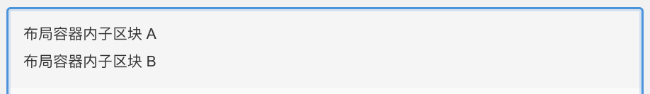

> **范围说明（本节）**  
> 描述**布局容器独有**的 **组件 · 布局**、**组件 · 内容（容器底图）** 配置项，以及与本组件相关的画布表现。**外层容器 · 布局 / 样式** 与八种组件共用，见 **§7.3**（不在此重复字段表）。绑定**样式预设**见 **§11**；**业务变量**、**列表重复**、**条件显隐**在后续专章说明。

#### 7.8.1 配置分层与面板入口

| 层次 | 配置面板位置 | 本组件说明 |
|------|--------------|------------|
| **内核** | **布局** 页签 → **组件 · 布局** | 子区块**排列方向**、**间距模式**、**间距**（§7.8.2） |
| **容器底图** | **内容** 页签 → **组件 · 内容** | 可选 **容器底图**；未启用时仅 **「启用背景图」**（§7.8.3） |
| **外层容器** | **布局** / **样式** 页签 → **外层容器 · 布局 / 样式** | 与 §7.3.2 一致；**容器内内容摆放** 作用于**全部直接子区块**作为一组（§7.3.2 补充表） |

选中布局容器时，右侧配置面板标题为 **「区块设置」**；页签含 **内容 / 样式 / 布局**（及具备条件时的 **列表 / 显隐**）。

#### 7.8.2 组件 · 布局（内核）

| 配置项 | 可选范围 | 画布上的表现 |
|--------|----------|----------------|
| **排列方向** | **纵向排列** / **横向排列**（二选一；默认 **纵向**） | **纵向**：直接子区块自上而下依次堆叠（邮件表格行语义）。 **横向**：直接子区块自左而右并排（邮件表格列语义）。子区块在容器内的**先后顺序**由区块树顺序决定。 |
| **间距模式** | **固定像素（gap）** / **自动均分（主轴剩余空间）** | 控制**相邻直接子区块**之间的间隙策略（主轴 = 纵向时为竖向、横向时为横向）。 |
| **间距** | 非负像素；仅当间距模式为 **固定像素** 时出现 | **固定像素**：相邻子区块之间插入该长度的空隙。 **自动均分**：将容器在主轴方向的**剩余空间**均分到相邻子项之间；当子项均为「跟随内容」且无剩余空间时，视觉与紧凑排列一致。 |

**铺满父级外壳时的补充**：当布局容器外壳为 **铺满父级（fill）** 或 **自定义（fixed）** 时，**容器内内容摆放** 决定**全部直接子区块作为一组**在容器矩形内的水平/竖直位置；**排列方向 / 间距** 仍只控制子区块彼此之间的顺序与间隙。

**与外层容器「容器内内容摆放」的分工**

| 配置项 | 作用对象 | 画布含义 |
|--------|----------|----------|
| **组件 · 布局**（排列方向 / 间距） | **直接子区块之间** | 子模块**相对顺序**与**彼此间距**（纵排或横排）。 |
| **外层容器 · 布局**（容器内内容摆放） | **全部直接子区块作为一组** | 整组子模块在布局容器**外壳矩形**内的靠左/居中/靠上等（见 §7.3.2）。 |

**启用容器底图时（补充）**

| 项 | 说明 |
|----|------|
| **叠放层排布** | 子区块叠在底图之上；**排列方向 / 间距模式 / 间距** 仍作用于叠放层内的直接子级，语义与无底图时一致。 |
| **与页面内边距** | **外层容器 · 布局** 中的 **内边距** 在启用底图后**仅推开叠放子内容**，不缩小底图铺满范围（§7.3.3）。 |

#### 7.8.3 组件 · 内容（容器底图）

布局容器与 **栅格**、**图片** 同属可配置 **容器底图** 的组件（§7.3.1）。底图相关项均在 **内容** 页签 **组件 · 内容** 分组内。

**未启用底图**

| 配置项 | 可选范围 | 画布上的表现 |
|--------|----------|----------------|
| **启用背景图** | 操作按钮 | 点击后为该容器创建 **容器底图** 配置（默认 **裁切铺满**、画面位置 **居中**、无描边/圆角）。 |

**已启用底图**

| 配置项 | 可选范围 | 画布上的表现 |
|--------|----------|----------------|
| **背景图地址** | 图片 URL | 在布局容器外壳区域内显示底图。 |
| **背景替代文本** | 字符串（建议 ≤100 字） | 无障碍替代说明。 |
| **背景链接地址** | URL（可选） | 底图区域可点击跳转。 |
| **关闭背景图** | 操作按钮 | 清除底图；回到纯色 **容器背景色** 或透明底。若容器背景色为空，系统会补一层浅灰兜底，避免出现不可见空白区。 |
| **背景填充策略** | **裁切铺满（cover）** / **完整显示（contain）** | 与 §7.3.3 相同。 |
| **背景画面位置** | 九宫格锚点；仅 **cover** 时可配 | 与 §7.3.3 相同。 |
| **背景圆角 / 背景描边** | 与 §7.3.3 **相同模式与枚举** | 作用于**底图可见区域**；模块外壳仍用 **外层容器 · 样式** 中的 **容器圆角 / 容器描边**。 |

> **图示说明**：启用底图后，**背景填充策略 / 画面位置 / 背景圆角 / 背景描边** 与地址类字段同在 **内容** 页签展示（非单独拆到「样式」页签）。

#### 7.8.4 外层容器（引用）

布局容器的 **外层容器 · 布局 / 样式** 字段范围、可选枚举与画布表现，与 §7.3.2、§7.3.3 **完全一致**。搭版时常见组合：

| 场景 | 建议配置要点 |
|------|--------------|
| **通栏模块（纵排标题+正文）** | 外壳 **宽度 = 铺满父级（fill）**；内核 **纵向排列** + **固定像素间距**；子块各自外壳按需配置。 |
| **横排图标+文案** | 内核 **横向排列**；注意子块 **高度模式** 与 **容器内内容摆放 · 竖直对齐** 搭配。 |
| **Banner 底图+按钮** | **内容** 启用 **容器底图**；子按钮/文案叠在底图上；**内边距** 推开叠放内容。 |

#### 7.8.5 本节边界

| 主题 | 本节是否展开 | 说明 |
|------|----------------|------|
| 组件 · 布局（排列方向 / 间距） | **是** | §7.8.2 |
| 组件 · 内容（容器底图） | **是** | §7.8.3 |
| 外层容器通用项 | **引用** | §7.3.2–§7.3.3 |
| 列表重复（布局容器作宿主） | **否** | 后续专章 |
| 条件显隐 | **否** | 后续专章 |
| 样式预设绑定 | **否** | **§11** |
| 业务变量绑定 | **否** | 后续专章 |

---

### 7.9 栅格

**栅格**用于按**行 × 列**矩阵排布子区块（如商品宫格、多列信息区）；也可挂载 **容器底图**，在宫格区域统一铺底，格内再放各子区块。

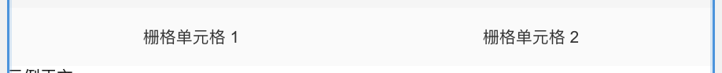

> **范围说明（本节）**  
> 描述**栅格独有**的 **组件 · 布局**、**组件 · 内容（容器底图）** 配置项，以及与本组件相关的画布表现。**外层容器 · 布局 / 样式** 与八种组件共用，见 **§7.3**（不在此重复字段表）。绑定**样式预设**见 **§11**；**业务变量**、**列表重复**、**条件显隐**在后续专章说明。

#### 7.9.1 配置分层与面板入口

| 层次 | 配置面板位置 | 本组件说明 |
|------|--------------|------------|
| **内核** | **布局** 页签 → **组件 · 布局** | **每行列数**、**间距**、**单元格宽度/高度模式**及对应像素值（§7.9.2） |
| **容器底图** | **内容** 页签 → **组件 · 内容** | 可选 **容器底图**；未启用时仅 **「启用背景图」**（§7.9.3） |
| **外层容器** | **布局** / **样式** 页签 → **外层容器 · 布局 / 样式** | 与 §7.3.2 一致；**容器内内容摆放** 作用于**矩阵格内子级**的默认对齐（§7.3.2 补充表） |

选中栅格时，右侧配置面板标题为 **「区块设置」**；页签含 **内容 / 样式 / 布局**（及具备条件时的 **列表 / 显隐**）。栅格在 **内容** 页签**无**除容器底图外的其它内核字段；未启用底图时，分组下方可能显示 **「当前分类下暂无可编辑项」** 的占位提示。

#### 7.9.2 组件 · 布局（内核）

| 配置项 | 可选范围 | 画布上的表现 |
|--------|----------|----------------|
| **每行列数** | 正整数（≥1；界面默认 **2**） | 决定矩阵**每行有几列**。直接子区块按区块树顺序依次填入格子：先填满第一行，再换行；**末行不满列**时，剩余格位在预览中**留空**（不占子块）。 |
| **间距** | 非负像素（如 `8px`、`12px`；默认约 **12px**） | **列间**与**行间**使用**同一间距值**：列与列之间、行与行之间各插入该长度的空隙。设为 **0** 时格子紧贴。 |
| **单元格宽度模式** | **自动均分（auto）** / **固定宽度（fixed）** | **auto**：在栅格**外层可用宽度**内，各列**等分**列宽。 **fixed**：每列宽度为下方 **单元格宽度**；整块栅格在父级内随列宽之和收缩，且不超过父级可用宽度。 |
| **单元格宽度** | 非负像素；仅当单元格宽度模式为 **固定宽度** 时出现；切换为 fixed 且未填时，编辑器可预填 **160px** | 每个矩阵格的 **列宽**；**不**等同于栅格块自身的 **外层容器 · 宽度**。 |
| **单元格高度模式** | **按行内容最大高度（content-max）** / **固定高度（fixed）** | **content-max**：**同一数据行**内，各格按该行**最高子块内容**统一行高（预览层测量后写回行高）。 **fixed**：每行轨道高度为下方 **单元格高度**，与子内容多少无关。 |
| **单元格高度** | 非负像素；仅当单元格高度模式为 **固定高度** 时出现；切换为 fixed 且未填时，编辑器可预填 **220px** | 矩阵**行轨道**的固定高度。 |

**子区块如何进入矩阵**

| 项 | 说明 |
|----|------|
| **顺序** | 区块树中栅格的**直接子级**顺序 = 矩阵**从左到右、从上到下**的填格顺序。 |
| **容量** | 子块个数可多于 `列数 × 行数` 的完整矩形（多出行继续换行），也可少于满格（末行留空）。 |
| **格内类型** | 每格通常放一个子区块（文本、图片、按钮、布局容器等）；格内亦可再嵌套。 |

**与外层容器「容器内内容摆放」的分工**

| 配置项 | 作用对象 | 画布含义 |
|--------|----------|----------|
| **组件 · 布局**（列数 / 间距 / 单元格宽高） | **矩阵结构** | 有几列、格间距多大、每格与每行的尺寸策略。 |
| **外层容器 · 布局**（容器内内容摆放） | **每个矩阵格内**的默认对齐 | 格内子块在**该矩阵格**内的靠左/居中/靠上等；无子块时仍按栅格级默认值占位。格内子块若自身配置了 **容器内内容摆放**，可覆盖该格默认（与 §7.3.2 一致）。 |
| **外层容器 · 布局**（宽度/高度模式） | **整块栅格外壳** | 决定栅格在父级中占多大；与 **单元格宽度/高度** 独立配置。 |

**单元格高度 — 与外层定高的配合（补充）**

| 场景 | 画布表现 |
|------|----------|
| **content-max** + 栅格外壳 **自定义高度** + 某行格内有子块 **高度 = 铺满父级（fill）** | 该行可纵向**撑满**栅格内层可用高度，以便格内 fill 子块生效。 |
| **fixed** 单元格高度 | 行高由 **单元格高度** 决定，不再按内容测量同行等高。 |
| 格内 **布局容器** 设为 **自定义（fixed）** 高度 | 保存校验时**建议**改为 **跟随内容（hug）** 以参与同行等高；若该 layout 为**可渲染的容器底图裁切层**则例外（与布局容器底图语义一致）。 |

#### 7.9.3 组件 · 内容（容器底图）

栅格与 **布局容器**、**图片** 同属可配置 **容器底图** 的组件（§7.3.1）。字段含义、枚举与画布表现见 **§7.3.3**；与布局容器相同的交互如下（配图以栅格为例）。

**未启用底图**

| 配置项 | 可选范围 | 画布上的表现 |
|--------|----------|----------------|
| **启用背景图** | 操作按钮 | 点击后为栅格外壳创建 **容器底图**（默认 **裁切铺满**、画面位置 **居中**）。 |

**已启用底图**

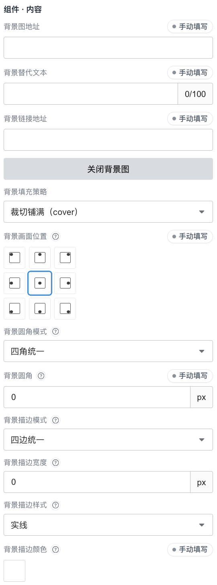

| 配置项 | 可选范围 | 画布上的表现 |
|--------|----------|----------------|
| **背景图地址** | 图片 URL | 在栅格外壳区域内显示底图；矩阵表格叠在底图之上。 |
| **背景替代文本** | 字符串（建议 ≤100 字） | 无障碍替代说明。 |
| **背景链接地址** | URL（可选） | 底图区域可点击跳转。 |
| **关闭背景图** | 操作按钮 | 清除底图；回到 **容器背景色** 或透明/兜底色。 |
| **背景填充策略** | **裁切铺满（cover）** / **完整显示（contain）** | 与 §7.3.3 相同。 |
| **背景画面位置** | 九宫格锚点；仅 **cover** 时可配 | 与 §7.3.3 相同。 |
| **背景圆角 / 背景描边** | 与 §7.3.3 **相同模式与枚举** | 作用于**底图可见区域**；模块外壳仍用 **外层容器 · 样式** 中的 **容器圆角 / 容器描边**。 |

> **图示说明**：启用底图后，**背景填充策略 / 画面位置 / 背景圆角 / 背景描边** 与地址类字段同在 **内容** 页签展示。典型用途：宫格区**统一底纹**，格内再放商品图、文案等。

#### 7.9.4 外层容器（引用）

栅格的 **外层容器 · 布局 / 样式** 与 §7.3.2、§7.3.3 **完全一致**。搭版时常见组合：

| 场景 | 建议配置要点 |
|------|--------------|
| **通栏商品宫格（2×2 / 3×N）** | 外壳 **宽度 = 铺满父级（fill）**；内核 **自动均分列宽** + **按行内容最大高度**；**间距** 用固定像素控制格缝。 |
| **固定卡片格（定宽列）** | **单元格宽度模式 = 固定宽度**，填写目标列宽；栅格外壳可用 **跟随内容（hug）** 使整块随列宽收缩。 |
| **格内内容居中** | **外层容器 · 布局** 调整 **容器内内容摆放**（矩阵格默认）；或对单个格内子块单独设对齐。 |
| **宫格底图 + 商品块** | **内容** 启用 **容器底图**；**内边距** 推开叠放在底图上的矩阵内容；格内仍用内核列数/间距排布。 |

#### 7.9.5 本节边界

| 主题 | 本节是否展开 | 说明 |
|------|----------------|------|
| 组件 · 布局（列数 / 间距 / 单元格宽高） | **是** | §7.9.2 |
| 组件 · 内容（容器底图） | **是** | §7.9.3 |
| 外层容器通用项 | **引用** | §7.3.2–§7.3.3 |
| 格内子块类型差异（文本/图/按钮等） | **否** | 各类型在后续分节；栅格仅提供矩阵槽位 |
| 列表重复（栅格作宿主） | **否** | 后续专章 |
| 条件显隐 | **否** | 后续专章 |
| 样式预设绑定 | **否** | **§11** |
| 业务变量绑定 | **否** | 后续专章 |

---

### 7.10 文本

**文本**用于展示标题、说明、价格等**段落文案**；无子区块、无容器底图。正文以**结构化段落**维护，画布与发信 HTML 由同一份正文数据渲染。

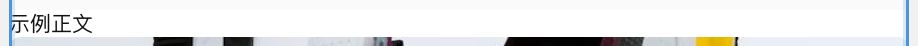

> **范围说明（本节）**  
> 描述**文本独有**的 **组件 · 内容**、**组件 · 样式** 配置项，以及与本组件相关的画布表现。**外层容器 · 布局 / 样式** 与八种组件共用，见 **§7.3**。**布局** 页签**无**「组件 · 布局」分组，仅含 **外层容器 · 布局**。绑定**样式预设**见 **§11**；**业务变量**、**列表重复**、**条件显隐**在后续专章说明。

#### 7.10.1 配置分层与面板入口

| 层次 | 配置面板位置 | 本组件说明 |
|------|--------------|------------|
| **内核 · 正文** | **内容** 页签 → **组件 · 内容** | **正文（结构化）** 富文本编辑区（§7.10.2） |
| **内核 · 样式** | **样式** 页签 → **组件 · 样式** | **字号**、**文字颜色**（区块级默认，§7.10.3） |
| **外层容器** | **布局** / **样式** 页签 → **外层容器 · 布局 / 样式** | 与 §7.3.2 一致；**容器内内容摆放** 作用于**文本段落在外壳内**的位置（§7.3.2 补充表） |

选中文本区块时，右侧配置面板标题为 **「区块设置」**；页签含 **内容 / 样式 / 布局**（及具备条件时的 **列表 / 显隐**）。

#### 7.10.2 组件 · 内容（结构化正文）

| 配置项 | 可选范围 | 画布上的表现 |
|--------|----------|----------------|
| **正文（结构化）** | 多段落、多 **run**（连续文字片段）；可在编辑区内直接输入与换行 | 预览中按段落与 run 渲染 HTML；**粗体 / 斜体 / 下划线 / 删除线 / 链接** 等可作用于**选中范围**（工具条），写入对应 run。 |
| **正文工具条** | **粗体**、**斜体**、**下划线**、**删除线**、**链接** 等 | 对当前选区设置字符级样式；未单独选中的 run 继承 **组件 · 样式** 中的区块默认字号、字色。 |
| **变量胶囊**（绑定业务数据时） | 整段或句内变量 | **整段跟随变量** 或 **列表字段驱动** 时，编辑区为**只读预览**；**句内变量** 时正文可编辑，变量以胶囊展示，取值在 **数据变量** 侧维护（后续专章）。 |

**正文数据模型（产品语义）**

| 项 | 说明 |
|----|------|
| **段落** | 一次 Enter 形成新段落；段落之间在画布上分段落显示。 |
| **run** | 同一段落内可拆为多个 run，分别设置粗斜体、装饰线、链接、局部字号/字色（局部字号/字色为**字面量**，不可绑样式预设）。 |
| **区块默认字符样式** | **组件 · 样式** 的 **字号 / 文字颜色** 作为该文本块默认 typography；正文工具条设置的 run 级样式可覆盖局部。 |
| **行高** | **不可配置**；全项目固定 **1.3** 相对行高，见 **§6.5**（发信与预览一致）。 |
| **块级默认字符样式** | 保存版式时，文本块须带有**块级默认加粗 / 斜体 / 装饰线**状态，供未单独设样式的文字继承；**样式** 页签不单独展示该项，运营在 **正文** 工具条对选区设置（与 §6.5.5 竖直靠上一并理解） |

**与「组件 · 样式」的分工**

| 配置入口 | 作用范围 | 典型用途 |
|----------|----------|----------|
| **组件 · 内容**（正文 + 工具条） | **写什么字**、段内**局部**加粗/链接等 | 标题文案、价格数字加粗、一句带链接的说明 |
| **组件 · 样式**（字号 / 文字颜色） | **整块文本**默认字号与字色 | 模块主标题 20px、正文 14px、辅助说明灰色 |

#### 7.10.3 组件 · 样式（区块默认字号与字色）

| 配置项 | 可选范围 | 画布上的表现 |
|--------|----------|----------------|
| **字号** | 非负像素（如 `14px`、`20px`） | 该文本块**默认字号**；未在 run 上单独指定字号的文字使用此值。 |
| **文字颜色** | 颜色（含透明） | 该文本块**默认字色**；未在 run 上单独指定颜色的文字使用此值。 |

**样式相关固定规则（补充）**

| 项 | 说明 |
|----|------|
| **行高** | 不提供配置项；固定 **1.3**，见 **§6.5**。 |
| **字体族** | 不提供 per-block 配置；全邮件使用 **§6.5** 约定的画布字体（如 Arial）。 |
| **段内字号 / 段内字色** | 仅在正文编辑器的**选区**上设置，且为**固定字面量**；不可通过样式预设胶囊绑定到 run。 |
| **容器底图** | 文本**不支持**容器底图（§7.3.1）。 |

#### 7.10.4 外层容器（引用）

文本的 **外层容器 · 布局 / 样式** 与 §7.3.2 **完全一致**。搭版时常见组合：

| 场景 | 建议配置要点 |
|------|--------------|
| **模块主标题** | 外壳 **宽度 = 铺满父级（fill）**；**容器内内容摆放 · 水平 = 居中**；内核 **字号** 偏大、**正文** 写标题文案。 |
| **左对齐正文** | 外壳 **fill** 或 **hug**；**水平 = 靠左**；**字号 / 文字颜色** 区分层级。 |
| **价格 / 强调句** | 在 **正文** 中对数字或关键词用工具条 **加粗** 或 **下划线**；或单独 run 设局部字色（字面量）。 |
| **置于栅格 / 布局容器内** | 先配父级矩阵或纵排；文本块外壳 **hug** 宽常见于格内标签，**fill** 宽常见于通栏说明。 |

#### 7.10.5 本节边界

| 主题 | 本节是否展开 | 说明 |
|------|----------------|------|
| 组件 · 内容（结构化正文） | **是** | §7.10.2 |
| 组件 · 样式（字号 / 文字颜色） | **是** | §7.10.3 |
| 外层容器通用项 | **引用** | §7.3.2 |
| 行高 / 字体族（渲染默认） | **引用** | **§6.5** |
| 业务变量 / 列表字段绑定正文 | **否** | 后续专章 |
| 样式预设绑定 | **否** | **§11** |
| 条件显隐 | **否** | 后续专章 |

---

### 7.11 图片

**图片**用于展示 Logo、Banner、商品图等**位图资源**；主图即 **容器底图** 语义（无单独的「内核主图」字段）。可在主图之上**叠放子区块**（角标、按钮、文案条等），叠放层内子块按 **组件 · 叠放布局** 纵/横排。

> **范围说明（本节）**  
> 描述**图片独有**的 **组件 · 内容（主图）**、**组件 · 叠放布局**，以及与本组件相关的画布表现。**外层容器 · 布局 / 样式** 与八种组件共用，见 **§7.3**。**样式** 页签**无**「组件 · 样式」分组，主图裁切/圆角/描边与地址类字段均在 **内容** 页签。绑定**样式预设**见 **§11**；**业务变量**、**列表重复**、**条件显隐**在后续专章说明。

#### 7.11.1 配置分层与面板入口

| 层次 | 配置面板位置 | 本组件说明 |
|------|--------------|------------|
| **内核 · 主图** | **内容** 页签 → **组件 · 内容** | **图片地址**、**替代文本**、**链接地址**、**填充策略**、**画面位置**、**图片圆角 / 描边**（§7.11.2） |
| **内核 · 叠放** | **布局** 页签 → **组件 · 叠放布局** | 叠放子区块的 **排列方向**、**间距模式**、**间距**（§7.11.3）；无子级时仍可见，供插入子块后生效 |
| **外层容器** | **布局** / **样式** 页签 → **外层容器 · 布局 / 样式** | 与 §7.3.2 一致；**宽高模式** 决定主图**裁切视口**；**容器内内容摆放** 作用于**叠放子区块整组**（§7.3.2） |

选中图片区块时，右侧配置面板标题为 **「区块设置」**；页签含 **内容 / 样式 / 布局**（及具备条件时的 **列表 / 显隐**）。与布局容器/栅格不同：图片**无**「启用背景图」开关，创建后即须配置 **图片地址**。

#### 7.11.2 组件 · 内容（主图）

主图字段写在 **外壳 · 容器底图** 槽位上（§7.3.3），界面文案以「图片」为主（非「背景图」）。**填充策略 / 画面位置 / 图片圆角 / 图片描边** 与地址类字段**同在内容页签**（与布局容器启用底图后的分组方式一致）。

| 配置项 | 可选范围 | 画布上的表现 |
|--------|----------|----------------|
| **图片地址** | 图片 URL（必填） | 在图片块外壳矩形内显示主图；未配置或加载失败时显示占位/错误提示。 |
| **替代文本** | 字符串（建议 ≤100 字） | 无障碍替代说明；邮件客户端按规则展示。 |
| **链接地址** | URL（可选） | 配置后主图区域可点击跳转。 |
| **填充策略** | **裁切铺满（cover）** / **完整显示（contain）** | **cover**：保持比例放大直至铺满外壳，超出裁切；配合 **画面位置** 选择保留区域。 **contain**：完整显示图片，可能留白；留白区透出 **容器背景色** 或系统兜底色（§6.5）。 |
| **画面位置** | 九宫格锚点；仅 **cover** 时可配 | 控制 **cover** 裁切焦点；**contain** 下控件置灰。 |
| **图片圆角 / 图片描边** | 与 §7.3.3 **相同模式与枚举** | 作用于**主图可见区域**外轮廓；模块外壳仍用 **外层容器 · 样式** 的 **容器圆角 / 容器描边**。 |

**裁切视口与外层尺寸（补充）**

| 项 | 说明 |
|----|------|
| **裁切范围** | 内容页签提示：**裁切范围由「布局」页签的宽高设置决定**——即 **外层容器 · 布局** 中的 **宽度/高度模式** 与 **固定宽高** 定义主图可见矩形。 |
| **跟随内容（hug）** | 高度为 hug 时，预览可按图片固有比例推算占位（便于 Logo 等场景）。 |
| **主图地址缺失** | 未配置或无效 **图片地址** 时，画布显示**明确错误提示**，不发信占位图糊弄。 |
| **与布局容器底图差异** | 布局/栅格须先 **启用背景图**；图片块**始终**以主图形态存在，**无**关闭主图回到纯底色的「关闭背景图」按钮（清空地址将触发校验提示）。 |

#### 7.11.3 组件 · 叠放布局

当图片块含有**子区块**（在区块树中插入为图片的子级）时，子块叠在主图之上；下列项控制叠放层内**直接子级**的排布，语义与 **布局容器** 的 **组件 · 布局** 一致（§7.8.2）。

| 配置项 | 可选范围 | 画布上的表现 |
|--------|----------|----------------|
| **排列方向** | **纵向排列** / **横向排列**（默认 **纵向**） | 叠放层内子区块自上而下或自左而右排列。 |
| **间距模式** | **固定像素（gap）** / **自动均分（主轴剩余空间）** | 相邻叠放子级之间的间隙策略。 |
| **间距** | 非负像素；仅当间距模式为 **固定像素** 时出现 | 固定像素：子级之间插入该长度空隙；自动均分：主轴剩余空间均分。 |

**与外层容器的分工**

| 配置项 | 作用对象 | 画布含义 |
|--------|----------|----------|
| **组件 · 叠放布局** | 主图之上的**直接子区块** | 角标、按钮等**彼此顺序与间距**。 |
| **外层容器 · 布局**（容器内内容摆放） | **全部叠放子区块作为一组** | 整组叠放内容在主图矩形内的靠左/居中等。 |
| **外层容器 · 布局**（宽高 / 内边距） | **整块图片外壳** | **固定宽高** 定义主图裁切视口；**内边距** 推开叠放子内容，不缩小主图铺满范围（§7.3.3）。 |

#### 7.11.4 外层容器（引用）

图片的 **外层容器 · 布局 / 样式** 与 §7.3.2、§7.3.3 **完全一致**。搭版时常见组合：

| 场景 | 建议配置要点 |
|------|--------------|
| **店铺 Logo** | **宽度/高度 = 自定义（fixed）** 定视口；**填充策略 = 完整显示（contain）**；**图片地址** 填 Logo URL。 |
| **通栏 Banner** | 外壳 **宽度 = 铺满父级（fill）**、**高度 = 自定义**；**cover** + **画面位置** 控制裁切焦点。 |
| **主图 + 角标按钮** | **内容** 配主图；区块树插入子按钮/文本；**组件 · 叠放布局** 纵/横排 + **内边距** 定位。 |
| **列表项商品图** | 图片块作 repeat 宿主时，**图片地址** 可绑定列表字段（后续专章）；外壳常用 **hug** 或 **fixed** 定尺寸。 |

#### 7.11.5 本节边界

| 主题 | 本节是否展开 | 说明 |
|------|----------------|------|
| 组件 · 内容（主图） | **是** | §7.11.2 |
| 组件 · 叠放布局 | **是** | §7.11.3 |
| 外层容器通用项 | **引用** | §7.3.2–§7.3.3 |
| 列表重复（图片作宿主） | **否** | 后续专章 |
| 条件显隐 | **否** | 后续专章 |
| 样式预设绑定 | **否** | **§11** |
| 业务变量绑定 | **否** | 后续专章 |

---

### 7.12 图标

**图标**用于展示小尺寸符号（礼物、时钟、箭头等）；为叶子组件，**无子区块**、无容器底图。图标本体由**图标地址**、**图标颜色**、**尺寸**驱动，可选 **链接地址** 作为点击跳转目标。

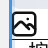

> **范围说明（本节）**  
> 描述**图标独有**的 **组件 · 内容**、**组件 · 样式** 配置项，以及与本组件相关的画布表现。**外层容器 · 布局 / 样式** 与八种组件共用，见 **§7.3**。**布局** 页签**无**「组件 · 布局」分组，仅含 **外层容器 · 布局**。绑定**样式预设**见 **§11**；**业务变量**、**列表重复**、**条件显隐**在后续专章说明。

#### 7.12.1 配置分层与面板入口

| 层次 | 配置面板位置 | 本组件说明 |
|------|--------------|------------|
| **内核 · 资源** | **内容** 页签 → **组件 · 内容** | **图标来源**（链接地址 / 内置图标）、**图标链接**（§7.12.2） |
| **内核 · 样式** | **样式** 页签 → **组件 · 样式** | **图标颜色**、**尺寸**（§7.12.3） |
| **外层容器** | **布局** / **样式** 页签 → **外层容器 · 布局 / 样式** | 与 §7.3.2 一致；**容器内内容摆放** 作用于图标本体在外壳内的位置 |

选中图标区块时，右侧配置面板标题为 **「区块设置」**；页签含 **内容 / 样式 / 布局**（及具备条件时的 **列表 / 显隐**）。

#### 7.12.2 组件 · 内容（图标来源与链接）

| 配置项 | 可选范围 | 画布上的表现 |
|--------|----------|----------------|
| **图标来源** | **链接地址** / **内置图标** | 仅影响编辑入口；保存版式时落盘的始终是**图标地址**（URL）。 |
| **图标链接**（链接地址模式） | URL（http/https 等） | 指向 SVG/图片资源 URL；图标本体按该地址渲染。 |
| **内置图标**（内置图标模式） | 预置图标清单项 | 选择后自动填入对应图标地址；清单加载失败时给出提示。 |
| **链接地址** | URL（可选） | 配置后图标区域可点击跳转。 |

**来源模式与绑定（补充）**

| 项 | 说明 |
|----|------|
| **模式切换目的** | 仅为便捷编辑：手工输入 URL 或从内置库挑选。最终保存的仍是图标地址。 |
| **字段被绑定时** | 当**图标地址**跟随变量或样式预设绑定时，来源模式控件会锁定；需先解除跟随后再手改。 |
| **内置图标着色边界** | 线框类图标通常可配合 **图标颜色** 着色；部分品牌图标会标注不建议改色。 |
| **未配置颜色** | 未设置 **图标颜色** 时，按资源原色或系统默认规则呈现（以实现为准）。 |

#### 7.12.3 组件 · 样式（图标颜色与尺寸）

| 配置项 | 可选范围 | 画布上的表现 |
|--------|----------|----------------|
| **图标颜色** | 颜色（含透明） | 作为图标本体主色（对可着色资源生效）。 |
| **尺寸** | 非负像素（如 `16px`、`24px`） | 控制图标渲染尺寸；默认约 `24px`。 |

**样式相关固定规则（补充）**

| 项 | 说明 |
|----|------|
| **文本排版字段** | 图标无字号/行高等文本排版项；只保留颜色与尺寸。 |
| **容器底图** | 图标不支持容器底图（§7.3.1）。 |
| **本体 vs 外壳** | 图标颜色/尺寸作用于**图标本体**；外层占位、对齐、背景、描边仍由 **外层容器** 控制。 |

#### 7.12.4 外层容器（引用）

图标的 **外层容器 · 布局 / 样式** 与 §7.3.2 **完全一致**。搭版时常见组合：

| 场景 | 建议配置要点 |
|------|--------------|
| **标签前导图标** | 外壳常用 **hug**，通过 **容器内内容摆放** 控制与同级文本对齐；图标尺寸 12–20px 常见。 |
| **状态符号（成功/提醒）** | 用 **图标颜色** 区分语义（如绿色/橙色），外壳可保持透明背景。 |
| **可点击图标入口** | 配置 **链接地址**；外壳可加内边距扩大点击热区。 |
| **与文本同行** | 父级布局容器设横向排列；图标块用固定或 hug 尺寸，间距由父级内核控制。 |

#### 7.12.5 本节边界

| 主题 | 本节是否展开 | 说明 |
|------|----------------|------|
| 组件 · 内容（来源与链接） | **是** | §7.12.2 |
| 组件 · 样式（颜色 / 尺寸） | **是** | §7.12.3 |
| 外层容器通用项 | **引用** | §7.3.2 |
| 列表重复（图标作宿主） | **否** | 后续专章 |
| 条件显隐 | **否** | 后续专章 |
| 样式预设绑定 | **否** | **§11** |
| 业务变量绑定 | **否** | 后续专章 |

---

### 7.13 按钮

**按钮**用于承载明确行动（如「复制优惠码」「立即购买」）；为叶子组件，**无子区块**、无容器底图。按钮分为外层容器与按钮胶囊本体两层：外层控制占位与摆放，胶囊本体控制文案、链接与视觉样式。

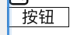

> **范围说明（本节）**  
> 描述**按钮独有**的 **组件 · 内容**、**组件 · 样式** 配置项，以及与本组件相关的画布表现。**外层容器 · 布局 / 样式** 与八种组件共用，见 **§7.3**。**布局** 页签**无**「组件 · 布局」分组，仅含 **外层容器 · 布局**。绑定**样式预设**见 **§11**；**业务变量**、**列表重复**、**条件显隐**在后续专章说明。

#### 7.13.1 配置分层与面板入口

| 层次 | 配置面板位置 | 本组件说明 |
|------|--------------|------------|
| **内核 · 内容** | **内容** 页签 → **组件 · 内容** | **按钮文字**、**链接地址**（§7.13.2） |
| **内核 · 样式** | **样式** 页签 → **组件 · 样式** | 按钮胶囊本体的**宽度模式/宽度**、背景色、文字色、文字字号、加粗/斜体、描边、圆角（§7.13.3） |
| **外层容器** | **布局** / **样式** 页签 → **外层容器 · 布局 / 样式** | 与 §7.3.2 一致；决定按钮块在父级中的占位、对齐、外壳背景与描边 |

选中按钮区块时，右侧配置面板标题为 **「区块设置」**；页签含 **内容 / 样式 / 布局**（及具备条件时的 **列表 / 显隐**）。

#### 7.13.2 组件 · 内容（文案与跳转）

| 配置项 | 可选范围 | 画布上的表现 |
|--------|----------|----------------|
| **按钮文字** | 字符串（建议 ≤100 字） | 按钮胶囊内展示文案。 |
| **链接地址** | URL（可选） | 点击按钮时跳转目标；未填时画布可按默认占位链接处理。 |

**内容绑定（补充）**

| 项 | 说明 |
|----|------|
| **变量绑定** | 按钮文字、链接地址可跟随**数据变量**；跟随时输入框只读预览，值在 **数据变量** Tab 维护。 |
| **字段职责** | **按钮文字**、**链接地址** 只描述按钮「说什么、点去哪里」；不负责胶囊颜色、字号、圆角等外观。 |

#### 7.13.3 组件 · 样式（按钮胶囊本体）

| 配置项 | 可选范围 | 画布上的表现 |
|--------|----------|----------------|
| **按钮宽度模式** | **跟随文字（hug）** / **铺满容器（fill）** / **自定义（fixed）** | 控制**按钮胶囊本体**宽度，不影响按钮外层容器宽度。 |
| **按钮宽度** | 非负像素；仅当宽度模式为 **自定义（fixed）** 时出现 | 按钮胶囊本体固定宽度。 |
| **按钮背景色** | 颜色（含透明） | 按钮胶囊填充色。 |
| **按钮文字颜色** | 颜色（含透明） | 按钮文字颜色。 |
| **按钮文字字号** | 非负像素（默认约 `15px`） | 按钮文字字号。 |
| **按钮文字样式** | **加粗** / **斜体** 开关 | 对整段按钮文字生效。 |
| **按钮圆角** | 与边框圆角通用模式一致（四角统一/独立） | 控制胶囊角部形态。 |
| **按钮描边** | 与边框通用模式一致（统一/独立、宽度、样式、颜色） | 控制胶囊边框。 |

**本体样式与外层容器分工（补充）**

| 配置入口 | 作用范围 | 常见误区 |
|----------|----------|----------|
| **组件 · 样式** | 按钮胶囊本体（文本与胶囊框） | 将「按钮宽度模式」误当成区块外层宽度。 |
| **外层容器 · 布局** | 整个按钮区块占位、对齐、内边距 | 外层 fill 不等于胶囊 fill；两层可独立组合。 |

**固定渲染规则（补充）**

| 项 | 说明 |
|----|------|
| **按钮内边距** | 胶囊内边距为系统固定值，不在配置面板中暴露（见 §6.5.1）。 |
| **胶囊内文字水平对齐** | 胶囊内文字**始终水平居中**；不在样式页签单独配置。 |
| **铺满容器宽胶囊在块内位置** | 当胶囊本体为 **铺满容器（fill）** 时，胶囊在按钮块内的**左/中/右**由 **外层容器 · 布局 · 容器内内容摆放 · 水平** 控制。 |
| **缺省文案与链接** | 未配置按钮文字、链接时，按 §6.5.6 缺省回退显示。 |
| **容器底图** | 按钮不支持容器底图（§7.3.1）。 |

#### 7.13.4 外层容器（引用）

按钮的 **外层容器 · 布局 / 样式** 与 §7.3.2 **完全一致**。搭版时常见组合：

| 场景 | 建议配置要点 |
|------|--------------|
| **主 CTA（通栏）** | 外层常用 **fill**；按钮本体可选 **fill**（整块可点击）或 **hug**（居中胶囊）。 |
| **卡片内次级按钮** | 外层 **hug** + 本体 **hug/fixed**；通过父级布局控制与文案间距。 |
| **强调行动按钮** | 用背景色 + 白字 + 适度圆角；必要时加描边提升对比。 |
| **链接式轻按钮** | 背景透明或弱底色、描边 0 或细描边，依赖文字颜色区分层级。 |

#### 7.13.5 本节边界

| 主题 | 本节是否展开 | 说明 |
|------|----------------|------|
| 组件 · 内容（按钮文字 / 链接） | **是** | §7.13.2 |
| 组件 · 样式（胶囊本体） | **是** | §7.13.3 |
| 外层容器通用项 | **引用** | §7.3.2 |
| 列表重复（按钮作宿主） | **否** | 后续专章 |
| 条件显隐 | **否** | 后续专章 |
| 样式预设绑定 | **否** | **§11** |
| 业务变量绑定 | **否** | 后续专章 |

---

### 7.14 分割线

**分割线**用于模块内容之间的视觉分隔；为叶子组件，**无子区块**、无容器底图。分割线由**线条本体**（一条横线）与**外层容器**两层组成：线条颜色、粗细、本体长度在 **样式** 页签 **组件 · 样式** 中配置；占位与对齐由 **外层容器** 承担。

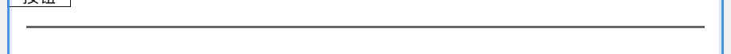

> **范围说明（本节）**  
> 描述**分割线独有**的 **组件 · 样式** 配置项，以及与本组件相关的画布表现。**外层容器 · 布局 / 样式** 与八种组件共用，见 **§7.3**。**内容** 页签无专用字段，仅显示「当前分类下暂无可编辑项」提示。绑定**样式预设**见 **§11**；**业务变量**、**列表重复**、**条件显隐**在后续专章说明。

#### 7.14.1 配置分层与面板入口

| 层次 | 配置面板位置 | 本组件说明 |
|------|--------------|------------|
| **内核 · 内容** | **内容** 页签 → **组件 · 内容** | 当前无可编辑项（§7.14.2） |
| **内核 · 样式** | **样式** 页签 → **组件 · 样式** | **分割线颜色**、**线条宽度模式/宽度**、**线条粗细**（§7.14.3） |
| **外层容器** | **布局** / **样式** 页签 → **外层容器 · 布局 / 样式** | 与 §7.3.2 一致；控制分割线块在父级中的占位、对齐、外壳背景与描边 |

选中分割线区块时，右侧配置面板标题为 **「区块设置」**；页签含 **内容 / 样式 / 布局**（及具备条件时的 **列表 / 显隐**）。

#### 7.14.2 组件 · 内容（当前无字段）

| 配置项 | 说明 |
|--------|------|
| **组件 · 内容** | 当前无专用表单，面板提示 **「当前分类下暂无可编辑项」**。 |

> 分割线的业务含义主要由样式定义（颜色、粗细、长度）；不承载文案或链接，因此内容页签为空是预期行为。

#### 7.14.3 组件 · 样式（线条本体）

| 配置项 | 可选范围 | 画布上的表现 |
|--------|----------|----------------|
| **分割线颜色** | 颜色（含透明）；缺省为浅灰（见 §6.5.6） | 作用于线条本体颜色。 |
| **线条宽度模式** | **铺满容器（fill）** / **自定义（fixed）** | 控制线条本体长度，不改变分割线外层容器宽度。 |
| **线条宽度** | 非负像素；仅当宽度模式为 **自定义（fixed）** 时出现 | 固定线条本体长度。 |
| **线条粗细** | 非负像素（如 `1px`、`2px`）；缺省约 **1px**（见 §6.5.6） | 线条本体可见厚度；**不占用**外层容器 **高度模式** 的占位语义。 |

**本体与外层分工（补充）**

| 配置入口 | 作用范围 | 常见误区 |
|----------|----------|----------|
| **组件 · 样式** | 分割线本体（颜色/长度/粗细） | 把线条宽度模式误当成整个区块宽度模式。 |
| **外层容器 · 布局** | 分割线区块外层占位、对齐、内边距 | 外层 fill 不代表线条本体 fill；两层可独立组合。 |

#### 7.14.4 外层容器（引用）

分割线的 **外层容器 · 布局 / 样式** 与 §7.3.2 **完全一致**。搭版时常见组合：

| 场景 | 建议配置要点 |
|------|--------------|
| **模块间全宽分隔** | 外层常用 **fill**；线条宽度模式用 **fill**。 |
| **卡片内短分隔** | 外层可保持 fill，对齐置中；线条宽度模式设 **fixed** 并填写像素值。 |
| **弱分隔语义** | 线条颜色降低对比度（浅灰）或减小粗细。 |
| **强调分隔语义** | 增加粗细或提高颜色对比；必要时配合上下内边距拉开视觉间距。 |

#### 7.14.5 本节边界

| 主题 | 本节是否展开 | 说明 |
|------|----------------|------|
| 组件 · 内容（暂无字段） | **是** | §7.14.2 |
| 组件 · 样式（线条本体） | **是** | §7.14.3 |
| 外层容器通用项 | **引用** | §7.3.2 |
| 列表重复（分割线作宿主） | **否** | 后续专章 |
| 条件显隐 | **否** | 后续专章 |
| 样式预设绑定 | **否** | **§11** |
| 业务变量绑定 | **否** | 后续专章 |

---

### 7.15 进度条

**进度条**用于展示任务或等级完成度（如会员升级进度）；为叶子组件，**无子区块**、无容器底图。进度由**槽（未达成段）**与**已完成段**两条色带叠合而成：数值写在 **内容** 页签，条带外观写在 **样式** 页签分组 **「进度条 · 样式」**（非「组件 · 样式」），外层容器继续负责占位与对齐。

> **范围说明（本节）**  
> 描述**进度条独有**的 **组件 · 内容**、**进度条 · 样式** 配置项，以及与本组件相关的画布表现。**外层容器 · 布局 / 样式** 与八种组件共用，见 **§7.3**。**布局** 页签**无**「组件 · 布局」分组，仅含 **外层容器 · 布局**。绑定**样式预设**见 **§11**；**业务变量**、**列表重复**、**条件显隐**在后续专章说明。

#### 7.15.1 配置分层与面板入口

| 层次 | 配置面板位置 | 本组件说明 |
|------|--------------|------------|
| **内核 · 内容** | **内容** 页签 → **组件 · 内容** | **当前进度值**、**满槽刻度**（§7.15.2） |
| **内核 · 样式** | **样式** 页签 → **进度条 · 样式** | **进度槽底色**、**已完成段颜色**、**条带宽度模式/宽度**、**条带高度**、**条带圆角**（§7.15.3） |
| **外层容器** | **布局** / **样式** 页签 → **外层容器 · 布局 / 样式** | 与 §7.3.2 一致；控制进度条块在父级中的占位、对齐、外壳背景与描边 |

选中进度条区块时，右侧配置面板标题为 **「区块设置」**；页签含 **内容 / 样式 / 布局**（及具备条件时的 **列表 / 显隐**）。

#### 7.15.2 组件 · 内容（进度数值）

**内容** 页签仅含下列进度数值项，**不**显示「当前分类下暂无可编辑项」类空状态（与分割线不同）。

| 配置项 | 可选范围 | 画布上的表现 |
|--------|----------|----------------|
| **当前进度值** | 有限数值（默认可为 `0`） | 与满槽刻度同量纲；画布按 **当前值 ÷ 满槽值** 计算已完成段占比，并限制在 **0%–100%**。 |
| **满槽刻度** | 有限**正数**（默认可为 `100`） | 表示「满槽」对应的刻度上限；须 **> 0**，否则校验不通过。 |

**内容绑定（补充）**

| 项 | 说明 |
|----|------|
| **变量绑定** | 当前进度值、满槽刻度可跟随 **数据变量**（数值类型）；跟随时输入框只读预览，值在 **数据变量** Tab 维护。 |
| **字段职责** | **当前进度值**、**满槽刻度** 只描述**进度语义**（完成了多少 / 满格是多少），不负责条带颜色、尺寸与圆角。 |
| **缺省与回退** | 未设置或非法 **当前进度值** 时按 **0** 参与计算；未设置或非法 **满槽刻度** 时按 **100** 参与计算（保存版式时满槽刻度仍须为合法正数）。 |

#### 7.15.3 进度条 · 样式（条带本体）

| 配置项 | 可选范围 | 画布上的表现 |
|--------|----------|----------------|
| **进度槽底色** | 颜色（含透明） | 未达成段（轨道）背景色；默认可约为 `#E8DCC8`。 |
| **已完成段颜色** | 颜色（含透明） | 按占比绘制的已完成段颜色；默认可约为 `#C9A227`；可绑定**样式预设**（如主题主色）。 |
| **条带宽度模式** | **铺满容器（fill）** / **自定义（fixed）** | 控制**条带本体**在可用区域内的长度，不改变进度条外层容器宽度。 |
| **条带宽度** | 非负像素；仅当宽度模式为 **自定义（fixed）** 时出现 | 条带本体固定长度。 |
| **条带高度** | 非负像素（如 `10px`）；缺省约 **10px**（见 §6.5.6） | 条带厚度（与分割线 **线条粗细** 同类语义：**不占用**外层容器 **高度模式** 的占位语义）。 |
| **条带圆角** | 与边框圆角通用模式一致（四角统一/独立） | 控制槽与已完成段外观；未配置时默认为**大圆角胶囊**形态（见 §6.5.6）。 |

**本体与外层分工（补充）**

| 配置入口 | 作用范围 | 常见误区 |
|----------|----------|----------|
| **进度条 · 样式** | 条带本体（颜色、长度、厚度、圆角） | 把 **条带宽度模式** 误当成整个区块的 **宽度模式**。 |
| **外层容器 · 布局** | 进度条区块外层占位、对齐、内边距 | 外层 **fill** 不代表条带一定 **fill**；两层可独立组合。 |

**样式相关固定规则（补充）**

| 项 | 说明 |
|----|------|
| **容器底图** | 进度条不支持容器底图（§7.3.1）。 |
| **无 hug 条宽** | 条带宽度模式仅 **fill / fixed**，无「跟随内容（hug）」——进度条无文案宽度可跟。 |
| **渲染结构** | 画布以表格条带呈现槽与已完成段，便于邮件客户端兼容；占比由 **§7.15.2** 数值驱动。 |

#### 7.15.4 外层容器（引用）

进度条的 **外层容器 · 布局 / 样式** 与 §7.3.2 **完全一致**。搭版时常见组合：

| 场景 | 建议配置要点 |
|------|--------------|
| **通栏升级进度** | 外层 **fill**；条带宽度模式 **fill**；**满槽刻度** 与业务刻度一致（如 `100`）。 |
| **卡片内短条** | 外层 **fill** 或 **hug**，对齐置中；条带宽度模式 **fixed** 并填写像素值。 |
| **品牌色进度** | **已完成段颜色** 绑主题主色；**进度槽底色** 用浅中性色衬托。 |
| **细线/粗线风格** | 调整 **条带高度**；圆角可设为胶囊或直角以匹配模块风格。 |

#### 7.15.5 本节边界

| 主题 | 本节是否展开 | 说明 |
|------|----------------|------|
| 组件 · 内容（当前进度值 / 满槽刻度） | **是** | §7.15.2 |
| 进度条 · 样式（条带本体） | **是** | §7.15.3 |
| 外层容器通用项 | **引用** | §7.3.2 |
| 列表重复（进度条作宿主） | **否** | 后续专章 |
| 条件显隐 | **否** | 后续专章 |
| 样式预设绑定 | **否** | **§11** |
| 业务变量绑定 | **否** | 后续专章 |

---

### 7.16 本章边界与后续章节

| 主题 | 本章是否展开 | 说明 |
|------|----------------|------|
| 八种组件名称与用途 | **是** | §7.1 |
| 外层容器 vs 内核 | **是** | §7.2 |
| 外层容器**统一配置项**与画布表现 | **是** | §7.3.2–§7.3.3 |
| 邮件根（画布级配置） | **否** | **§6** |
| **布局容器**内核与容器底图 | **是** | **§7.8** |
| **栅格**内核与容器底图 | **是** | **§7.9** |
| **文本**内核（正文 + 样式） | **是** | **§7.10** |
| **图片**内核（主图 + 叠放布局） | **是** | **§7.11** |
| **图标**内核（来源 + 样式） | **是** | **§7.12** |
| **按钮**内核（内容 + 胶囊样式） | **是** | **§7.13** |
| **分割线**内核（线条样式） | **是** | **§7.14** |
| **进度条**内核（数值 + 条带样式） | **是** | **§7.15** |
| 八种组件**内核**完整配置项 | **是** | 已在 §7.8–§7.15 全部覆盖 |
| 绑定**主题 / 样式预设** | **否** | **§11** |
| 绑定**业务数据变量** | **否** | 属 **数据变量** Tab，后续专章 |
| **列表重复**（一行模板多行数据） | **否** | 后续专章 |
| **条件显隐** | **否** | 后续专章 |
| 画布上**添加 / 移动 / 复制 / 删除**区块 | **否** | **§8** |
| 左侧**区块结构树**（展开 / 折叠 / 选中） | **否** | **§10** |
| **插入默认配置 / 模块库** | **否** | **§9** |

**阅读顺序建议**：先读 **§6** 邮件根，再通读 §7.1–§7.3 建立「8 种组件 + 外壳/内核」模型；搭版模块时按 §7.4 顺序阅读各组件分节；**在画布上增删改结构**读 **§8**；需固化单组件样式或整段模块时读 **§9**；用 **§10** 在树中定位与纵览层级；需要改文案/列表数据时，转至 **§12**；改色板 / 字号阶梯见 **§11**。

---

## 8. 画布搭版 · 选中与添加组件

本章约定 **「模板组件」** 工作视图下，运营如何在**中间画布**上选中区块、通过浮动操作条**添加八种基础组件**，以及与之配套的移动、复制、删除规则。**八种组件各自能配什么**见 **§7**；本章只讲**结构怎么搭**。

> **配图样例**：下列画布示意图取自样例邮件 **「PRD 八种组件配图」**（版式 **默认**），与 §7 配图为同一封样例，便于对照「选中谁 → 能插什么」。

### 8.1 适用范围与与其它区域的关系

| 项 | 说明 |
|----|------|
| **主要使用 Tab** | **模板组件**（左侧为区块树，右侧为选中区块配置面板，见 §3.3）。 |
| **画布是否常驻** | **是**。切换至 **数据变量 / 主题样式 / 模板信息** Tab 时，中间画布仍保留；**添加、移动、复制、删除**等结构操作仍在画布上完成，左右面板仅切换为变量 / 主题 / 模板信息编辑。 |
| **左侧区块结构树** | 用于**浏览层级**与**选中**某一区块；细则见 **§10**。**不提供**「插入组件」按钮（插入见 **§8**）。在 **模板组件** Tab 下，选中结果与画布、右侧配置面板**三向联动**（其它 Tab 见 §8.1）。 |
| **右侧配置面板** | 选中区块后编辑该块的**内容 / 样式 / 布局**（§7）；**不是**添加新组件的入口。 |
| **邮件根** | 画布最外层内容区；选中后右侧展示 **§6** 画布级配置。在邮件根下 **插入子级** 即向整封邮件版心内**追加顶层模块**（与在空白新模板里搭第一块组件相同）。 |

### 8.2 选中区块

#### 8.2.1 选中方式

| 方式 | 行为 |
|------|------|
| **点击画布上的区块** | 选中该区块；画布以**高亮边框**标示当前选中项（见下图）。 |
| **点击左侧区块树中的行** | 选中同一区块，画布高亮与右侧配置同步切换。 |
| **选中邮件根** | 在区块树中选中 **「画布设置」**（或等价根节点名称）；或在画布上点击**不落在任一子区块可点区域**的版心空白（产品实现上等同于选中邮件根）。右侧进入 **§6** 邮件根配置。 |

#### 8.2.2 联动规则

- **一处选中，三处同步**：区块树当前行、画布高亮、右侧配置面板标题与表单项，均对应当前区块。
- **未选中任何子区块时**：若用户尚未点选子模块，默认以**邮件根**为上下文；此时仅展示 **插入子级**（见 §8.4），不展示 **下方插入**（邮件根无「同级」概念）。
- **列表重复相关区块**：处于 **列表重复** 绑定内部的**行模板 / 映射字段子树**中的区块，画布**不展示**浮动操作条（不可在画布上增删改结构）；该能力在 **列表重复** 专章约定。本章以下均针对**常规静态结构**。

### 8.3 画布浮动操作条

当选中区块且允许结构操作（§8.2.2 末条除外）时，画布在**选中块附近**展示浮动操作条（左侧一组、右侧删除），不遮挡版心主体阅读。

| 按钮 | 说明 | 何时展示 |
|------|------|----------|
| **上移** | 在**同一父级**的子列表中，与上一个兄弟互换顺序 | 当前块有父级，且不是第一个兄弟 |
| **下移** | 与下一个兄弟互换顺序 | 当前块有父级，且不是最后一个兄弟 |
| **复制** | 以**当前选中块**为根，**其下全部子级（任意嵌套深度）**各复制一份，整体作为**一个新同级模块**插入到当前块**正下方**（详见 **§8.7 · 复制区块**） | 当前块不是邮件根，且有父级 |
| **插入子级** | 打开 **§8.5** 组件选择弹窗，向**当前选中块内部**追加子区块 | 当前块为 **邮件根、布局容器、栅格、图片**（可作容器的四种） |
| **下方插入** | 打开组件选择弹窗，在**当前块之后**追加**同级**区块 | 当前块**不是**邮件根，且有父级 |
| **存为模块** | 将**当前选中容器及其全部子级**保存为**可复用模块**，写入 **§9** 模块库 | 当前块为 **布局容器、栅格、图片**（与 **插入子级** 的容器类型一致，**不含**邮件根） |
| **删除** | 删除当前块；若有子级则**一并删除**（见 **§8.7 · 删除区块**） | 当前块不是邮件根 |

操作执行后，顶栏下方**状态行**给出简短结果（如「已在下方插入「文本」」）；新插入的块自动变为**当前选中**，便于继续在右侧改配置。

### 8.4 添加组件的两种方式

添加组件**仅**通过浮动操作条的 **插入子级** 或 **下方插入** 进入，二者差异如下。

| 方式 | 插入位置 | 典型场景 |
|------|----------|----------|
| **插入子级** | 作为**当前选中块**的**最后一个子级** | 在 **布局容器** 内加一行文案；在 **栅格** 某一格内加图标；在 **邮件根** 下加第一个顶层模块 |
| **下方插入** | 作为**当前选中块**的**下一个同级**（同一父级下、紧挨其后） | 在现有 **文本** 模块下再插一条 **分割线**；在 **按钮** 下再插 **文本** 说明 |

#### 8.4.1 当前选中块类型与可用操作

| 当前选中 | **插入子级** | **下方插入** |
|----------|:------------:|:------------:|
| **邮件根** | ✓ | — |
| **布局容器** | ✓ | ✓ |
| **栅格** | ✓ | ✓ |
| **图片**（含叠放层容器语义） | ✓ | ✓ |
| **文本 / 图标 / 按钮 / 分割线 / 进度条** | — | ✓ |

> **说明**：**文本、图标、按钮、分割线、进度条**为叶子组件，**不能**再容纳子级，故无 **插入子级**。**邮件根**不是任一模块的「兄弟」，故无 **下方插入**；向版心追加顶层模块请选中邮件根后使用 **插入子级**。

#### 8.4.2 嵌套与八种组件的关系

- **布局容器、栅格、图片** 常作为「外壳」，其内通过 **插入子级** 叠放 **§7.1** 所列其它组件。
- **栅格** 插入子级时，子块按栅格 **行 × 列** 规则落入单元格（内核见 **§7.9**）；运营只需在画布上选中栅格后 **插入子级** 逐个加格内内容。
- 非法组合（例如向 **文本** 插入子级）在界面上**不出现**对应按钮，避免误操作。

### 8.5 组件选择弹窗

点击 **插入子级** 或 **下方插入** 后，弹出模态框，标题分别为 **「插入子级组件」**、**「下方插入组件」**。弹窗内分为 **基础组件** / **我的模块** 两个分段（详见 **§9.4** 模块库）；默认打开 **基础组件** 分段。

**基础组件** 分段为八种基础组件的**平铺按钮**（固定扫读顺序，须覆盖八种且名称与 §7 一致）：

**按钮、分割线、进度条、栅格、图标、图片、文本、布局容器**（每个按钮含类型短标签与完整中文名；顺序以产品实现为准）。

| 项 | 说明 |
|----|------|
| **选择基础组件** | 在 **基础组件** 分段点击某一组件按钮即完成插入并**关闭弹窗**；新块成为当前选中项。 |
| **选择模块** | 在 **我的模块** 分段点击某一已存模块，按当前 **插入子级 / 下方插入** 语义整段插入（§9.4）。 |
| **取消** | 点击 **取消** 或关闭图标，不改动结构。 |
| **处理中** | 插入过程中弹窗不可关闭，避免重复提交。 |
| **与 §7 / §9 的关系** | 弹窗负责**选类型或选模块**；插入后具体字段在 **模板组件** Tab 右侧配置面板按 **§7** 修改；单组件出厂 / 自定义默认见 **§9.3**。 |

### 8.6 插入后的初始内容

新插入的**单个基础组件**默认带**出厂样例**（可用草稿），便于立刻在画布上看到效果并在其基础上修改：

| 组件类型 | 出厂样例（摘要） |
|----------|------------------|
| **布局容器** | 纵向容器 + 默认内边距 / 背景；**不含**预置子块 |
| **栅格** | 默认列数与间距；**不含**预置格内子块 |
| **文本** | 一段示例正文类文案 |
| **图片** | 占位图与默认尺寸策略 |
| **图标 / 按钮 / 分割线 / 进度条** | 各类型默认可见的示例样式与文案（或默认进度值） |

运营若已保存该类型的 **插入默认配置**（**§9.3**），则**同类型**下一次插入优先采用该默认，而非上表出厂样例；**不影响**版式里已存在的区块。

从 **我的模块** 插入时，插入内容为 **§9.4** 保存时的整段子树快照，而非上表单组件出厂样例。

插入时会将当前版式下可用的**主题样式档位**折算为字面量写入新块，避免新块在画布上因缺少样式而显示异常（与 **§9.2** 物化规则一致；验收以「插入后画布立即可读、保存校验通过」为准）。

### 8.7 其它结构操作（简述）

| 操作 | 产品行为 |
|------|----------|
| **上移 / 下移** | 仅调整**同级顺序**，不改变父子关系；邮件根及其子级列表顺序即版心内模块的上下顺序。 |
| **复制** | 见下 **复制区块**。 |
| **删除** | 见下 **删除区块（二次确认）**。确认后从结构中移除，选中态回退到**父级**（若存在）。 |

**复制区块**

复制以**当前选中的那一块**为起点：从这一级开始，**其下所有子级、孙级……直至最深层叶子**，结构与配置**整体克隆**一份；**不会**复制该块的兄弟模块，也**不会**复制父级或邮件根。

| 项 | 说明 |
|----|------|
| **复制范围（包含）** | ① **当前选中块**本身（外壳 + 内核配置）；② 其 **全部后代区块**（布局容器内的文本、栅格内的多格内容、图片叠放层上的子块等，**任意嵌套深度**均包含）。 |
| **复制范围（不包含）** | 与当前块**同级**的其它模块（「上一个 / 下一个兄弟」）；当前块的**父级**及以上层级。 |
| **落位** | 克隆出的整段结构，作为**一个新的同级模块**，插入在**原选中块正下方**（同一父级下的 children 顺序中紧挨其后）。 |
| **复制过去的内容** | 各块的 **内容 / 样式 / 布局** 配置、**区块树展示名**、已建立的 **数据变量绑定**（绑定关系随新块一并保留，仍指向原变量槽）；父子嵌套关系在副本内部保持不变。 |
| **与删除的对称** | **删除**是从选中级起**去掉**整棵子树；**复制**是从选中级起**新增**一棵同构子树。二者作用范围一致，方向相反。 |
| **邮件根** | **不可复制**（无「复制」按钮）。 |
| **执行后选中** | 自动选中**副本的根节点**（即与被复制块同类型的那一块顶层副本），便于立刻改文案或样式。 |
| **保存** | 复制仅改内存中的版式结构，须顶栏 **保存** 后落盘。 |

**示意（选中「布局容器 A」，其内有文本 B、按钮 C）**

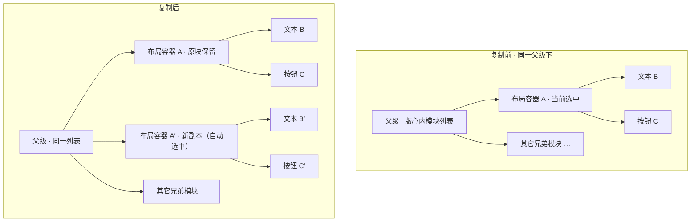

> **验收要点**：复制 **布局容器** 后，区块树中应出现**第二个**同展示名容器，展开后**子节点数量与层级**与原容器一致；复制**叶子**（如单独 **文本**）时，仅增加**一块**同级文本，无子级。列表重复行模板内的块**不提供复制**（与 §8.2.2 一致）。

**删除区块（二次确认）**

| 项 | 说明 |
|----|------|
| **触发** | 浮动操作条右侧 **删除**；**不**在邮件根上展示。 |
| **标题** | **「删除区块」** |
| **文案** | 须包含当前区块在区块树中的**展示名**（如「示例 · 布局容器」）。若该块**含有子级**，须额外说明 **「其全部子级将一并删除」**；无子级时仅确认删除当前块。 |
| **按钮** | **取消** / **删除**（危险操作样式）。 |
| **取消** | 结构不变，保持当前选中。 |
| **确认删除** | 仅关闭弹窗并更新画布与区块树；须 **保存** 后落盘。 |

结构变更后须通过顶栏 **保存** 写入当前版式（与 §5.6 未保存提示规则一致）。

### 8.8 典型搭版流程（验收参考）

1. 新建或打开模板，选中 **邮件根** → **插入子级** → 选 **布局容器**，版心出现第一个模块壳。  
2. 选中该 **布局容器** → **插入子级** → 选 **文本**，容器内出现示例文案；在右侧 **内容** 页签改为业务文案。  
3. 仍选中该 **文本** → **下方插入** → 选 **按钮**，同级增加行动按钮。  
4. 选中 **布局容器**（内含多个子块）→ **复制** → 其**下方**出现一整段同结构副本（含全部子级），再改副本内文案；或选中单独 **按钮** → **复制** 仅得到一块同级按钮。  
5. 需要调顺序时，对目标块 **上移 / 下移**。  
6. **保存** 后切换 **桌面 / 移动** 预览（§6.6）检查折行与间距。

### 8.9 本章边界与后续章节

| 主题 | 本章是否展开 | 说明 |
|------|----------------|------|
| 画布**选中**与三向联动 | **是** | §8.2 |
| **插入子级 / 下方插入** 与组件选择弹窗 | **是** | §8.4–§8.5 |
| 插入后**出厂样例** | **是** | §8.6 |
| **插入默认配置 / 模块库** | **否** | **§9** |
| 上移 / 下移 / 复制 / 删除 | **是** | §8.3、§8.7 |
| 八种组件**配置项** | **否** | **§7.8–§7.15** |
| 邮件根**画布级**配置 | **否** | **§6** |
| **列表重复** 行模板内结构编辑 | **否** | 后续专章 |
| **条件显隐** | **否** | 后续专章 |
| **数据变量** 建槽与取值 | **§12 起** | 总览见 §12；取值 / 列表 / 绑定细则待写 |
| **主题样式** 档位维护 | **否** | **§11** |
| 左侧**区块结构树** | **否** | **§10** |

**阅读顺序建议**：通读 **§7.1–§7.3** 与目标组件分节后，按本章在画布上搭出结构；需固化样式或整段模块时读 **§9**；用 **§10** 在树中查看层级；再回到 **§7** 细调各块配置。改主题档位读 **§11**；需要批量改文案或列表数据时，转至 **§12**。

---

## 9. 组件插入默认与模块库

本章约定两类**跨模板复用**能力：**组件插入默认配置**（按**组件类型**保存单块出厂样式）与 **存为模块 / 模块库**（保存**多 block 子树**并在插入时复用）。二者共用同一套 **「保存为字面量快照」** 规则（**§9.2**）；**须先理解 §9.2 与 §9.3**，再阅读 **§9.4 存为模块**。

> **配图样例**：下列模块相关示意图取自样例邮件 **「PRD 八种组件配图」**（版式 **默认**），与 §7、§8 为同一封样例。
>
> **与 §8 的分工**：§8 讲画布上**怎么插**；本章讲插进去的内容**从哪来**——出厂样例、运营自定义单组件默认，或已存模块。

### 9.1 定位与与其它章节的关系

| 项 | 说明 |
|----|------|
| **主要使用 Tab** | **模板组件**（保存插入默认须在右侧 **区块设置** 面板操作；**存为模块** 在画布浮动操作条，见 §8.3）。 |
| **作用域** | **系统级**母版库，**不**随某一封邮件模板或版式落盘；所有模板共享同一套插入默认与模块库（与 §4 场景 / 版式数据分离）。 |
| **与 §8 插入** | 通过 **§8.5** 弹窗选 **基础组件** 或 **我的模块** 插入；插入位置规则仍按 §8.4。 |
| **与 §7 配置** | 保存的是 **内容 / 样式 / 布局** 三页签内的字段快照；**列表 / 显隐** 专章能力**不**写入母版。 |
| **不负责** | **不**替代版式 **保存**（改结构后仍须顶栏保存当前版式）；**不**修改已插入邮件中的历史区块（除非运营手动改配置）。 |

### 9.2 共性：保存为「字面量快照」

**组件插入默认**与 **存为模块** 在保存时均执行同一套产品语义（下称 **字面量快照**）：

| 项 | 说明 |
|----|------|
| **读取基准** | 以当前画布**合并变量与主题后**的展示值为准（与运营在 **模板组件** Tab 右侧所见一致）。 |
| **纳入字段** | 各组件在 **内容 / 样式 / 布局** 页签中可编辑、且属于该组件类型允许范围的配置项。 |
| **主题样式** | 若字段跟随意 **样式预设 / 主题变量**，保存时**折算为当前展示的字面量**（如具体色值、字号），**不**保留「跟随意」绑定。 |
| **数据变量** | 若字段绑定 **业务变量**，保存时**折算为当前展示的字面量**（如具体文案、链接、图片 URL）；**不**保留变量槽绑定。 |
| **文本正文** | 含变量插值的正文，保存为**展开后的字面量**正文。 |
| **明确不含** | **数据变量绑定**、**主题跟随意**、**列表重复（repeat）**、**条件显隐（visibility）**；保存结果中这些关系**一律清除**。 |
| **插入时** | 新插入块 / 新插入模块子树中的各块，以快照中的字面量写入版式；必要时再按当前版式主题做一次展示物化，保证画布立即可读。 |

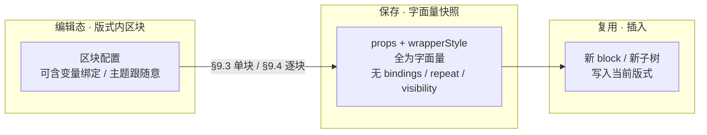

> **设计意图**：母版库保存的是「**长什么样**」的静态样板，而不是「**绑在哪个变量上**」的动态关系；动态绑定仍在版式内单独配置（主题样式见 **§11**，数据变量专章待写）。

### 9.3 组件插入默认配置

#### 9.3.1 是什么

| 项 | 说明 |
|----|------|
| **定义** | 针对 **§7.1 八种基础组件** 之一，保存**一块、无子级**的 **内容 + 样式 + 布局** 默认样板。 |
| **粒度** | **按组件类型一份**（如「文本」「按钮」各一份），**不是**按某一封邮件或某一个 blockId。 |
| **覆盖关系** | 保存后，该类型**下一次及之后**通过 §8 插入的**新**单块，优先采用此默认；**出厂样例**作为未保存时的回退。 |
| **不影响** | 版式里**已插入**的历史区块；其它类型组件；邮件根（**不可**保存插入默认）。 |

#### 9.3.2 入口与操作

| 项 | 说明 |
|----|------|
| **入口** | **模板组件** Tab → 选中某一**基础组件**区块（非邮件根）→ 右侧 **区块设置** 面板标题行 **保存插入默认配置** 操作（标题右侧 **⊛** 图标按钮，`aria-label` 为「保存组件插入默认配置」）。 |
| **前置** | 须先在 **内容 / 样式 / 布局** 页签将当前块调到期望效果；保存的是**当前展示态**，不是未生效的草稿。 |
| **反馈** | 成功提示包含**组件类型中文名**（如「文本的插入默认配置已保存」）；失败时提示校验原因。 |
| **不可操作** | 选中 **邮件根** 时不展示或不可用；八种以外的类型不适用。 |

#### 9.3.3 保存范围（单块）

| 纳入 | 不纳入 |
|------|--------|
| **内容 / 样式 / 布局** 页签内、该类型允许的字段（与 §7 各组件分节一致） | **列表** 页签（含 repeat 绑定） |
| 当前 **区块展示名** **不**写入插入默认（新插入块仍用该类型默认展示名规则） | **显隐** 页签 |
| — | **子级结构**（插入默认仅描述**单块**，`children` 为空） |
| — | 任何 **变量 / 主题** 绑定关系（已按 §9.2 物化为字面量） |

#### 9.3.4 生效与优先级

插入**单个基础组件**时，内容来源优先级：

1. **运营已保存**的该类型 **插入默认配置**（本章）；  
2. 产品 **出厂样例**（§8.6 上表）。

生效时机：**仅对新插入块**；运营可随时再次 **保存插入默认配置** 覆盖该类型默认值。

#### 9.3.5 典型场景

- 欢迎邮件中按钮须统一为品牌色胶囊：调好**一个**按钮 → **保存插入默认配置** → 后续插入的按钮均带同一套样式。  
- 某类型暂不需要自定义：不保存即可，一直使用出厂样例。

### 9.4 存为模块与模块库

#### 9.4.1 是什么

| 项 | 说明 |
|----|------|
| **定义** | 将画布上**一段完整子树**（容器 + 其下全部 nested 区块）保存为**命名模块**，供任意模板 / 版式通过 **§8.5 · 我的模块** 再次插入。 |
| **与 §9.3 的差异** | **§9.3** 管 **单块、按类型**；**§9.4** 管 **多 block、按运营命名**，且保留**父子嵌套与区块展示名**。 |
| **与 §8 · 复制** 的差异 | **复制** 仅在**当前版式**内克隆一段结构；**存为模块** 写入**系统模块库**，跨模板复用。 |

#### 9.4.2 与 §9.2 的逻辑复用

保存模块时，对子树内**每一个 block** 分别执行 **§9.2 字面量快照**（与 §9.3 相同的字段范围与物化规则），再：

- **保留** 块之间的 **父子关系** 与 **children 顺序**；  
- **保留** 各块在区块树中的 **展示名**（`blockMeta`）；  
- **清除** 各块的 bindings / repeat / visibility。

因此：**§9.3 是单块快照；§9.4 是「对子树逐块做 §9.3 同款快照 + 保留结构」**。

#### 9.4.3 入口：存为模块

| 项 | 说明 |
|----|------|
| **触发** | 画布浮动操作条 **存为模块**（§8.3）；须先选中 **布局容器、栅格或图片** 之一。 |
| **弹窗标题** | **「存为模块」** |
| **必填** | **模块名称**（如「双列商品卡」）；名称不能为空。 |
| **说明文案** | 须提示：保存**当前容器及其全部子级**；**不含**列表循环绑定；**已插入**邮件中的实例**不受**本次保存影响。 |
| **反馈** | 成功后在顶栏状态行 / 提示中展示模块名称；系统分配唯一 **`masterId`**（`section.m…` 前缀，与名称无关）；模块出现在 **§8.5 · 我的模块** 列表。 |

#### 9.4.4 可保存条件与限制

| 项 | 说明 |
|----|------|
| **允许的根类型** | **布局容器、栅格、图片**（与可作 **插入子级** 目标的容器一致，**不含**邮件根）。 |
| **子树范围** | 从选中根起，**全部后代 block** 一并保存。 |
| **禁止** | 子树内**任一 block** 存在 **列表重复（repeat）** 绑定时**不可保存**；须先解除 repeat 再存。 |
| **校验** | 保存前须通过模块结构校验；不通过则提示原因，不落库。 |

#### 9.4.5 模块库管理与插入

**列表入口**：**§8.5** 组件选择弹窗 → **我的模块** 分段。

| 操作 | 说明 |
|------|------|
| **浏览** | 按模块名称排序；可展示模块内 block 数量等摘要信息。 |
| **插入** | 点击某一模块即按当前 **插入子级 / 下方插入** 语义整段插入；插入后选中**模块根 block**；顶栏状态行如「已插入子级模块「…」」/「已在下方插入模块「…」」。 |
| **重命名** | 在列表行内修改模块名称；**不**改变已插入版式中的实例。 |
| **删除** | 二次确认后**逻辑删除**（见 **§9.4.6**）；从模块库列表移除，**不**删除各版式里已插入的实例。 |
| **空状态** | 无未删除模块时提示：选中 **布局容器 / 栅格 / 图片** 后使用 **存为模块**（见下图）。 |

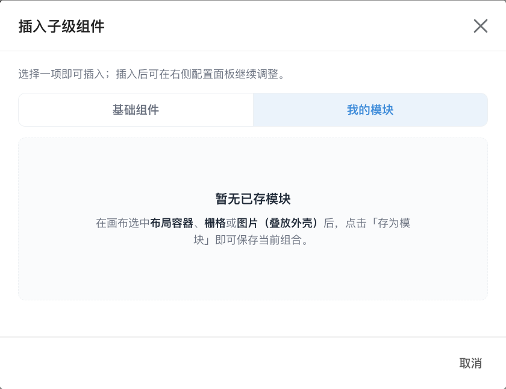

#### 9.4.6 模块库删除（逻辑删除）

| 项 | 说明 |
|----|------|
| **删除方式** | **逻辑删除**：在模块 JSON 写入 `deletedAt`（ISO 时间），**保留**落盘文件；**不**物理删除文件。 |
| **列表影响** | **我的模块** 列表与 `GET /masters/sections` **仅返回**未删除模块。 |
| **唯一键** | **`masterId`** 为唯一标识（新建时自动生成 `section.m…` 前缀 id，**与模块名称无关**）；**名称允许重复**。 |
| **恢复** | 运维可在落盘文件中**删除** `deletedAt` 字段后恢复模块库展示（与版式逻辑删除惯例一致）。 |
| **已插入实例** | 删除模块库记录**不影响**各版式中已插入的 block 结构。 |

#### 9.4.7 与版式中已有实例的关系

| 项 | 说明 |
|----|------|
| **保存** | 仅新增或更新**模块库**记录；**不**修改当前版式内被选中的那段子树。 |
| **库变更** | 重命名 / 删除模块 / 再次 **存为模块** 覆盖同名库项，均**不影响**历史上已从该模块插入到各版式中的 block。 |
| **后续编辑** | 插入后的 block 与版式内其它 block 一样，可在 §7 面板单独改配置；**不会**随模块库更新而联动。 |

### 9.5 两种能力对照

| 维度 | **§9.3 组件插入默认** | **§9.4 存为模块** |
|------|------------------------|-------------------|
| **保存对象** | 单块，无子级 | 多 block 子树 |
| **索引键** | **组件类型**（8 种之一） | **运营命名的模块** |
| **结构** | 不保存 children | 保存完整嵌套与展示名 |
| **入口** | 右侧 **区块设置** 标题行 | 画布 **存为模块** |
| **插入入口** | §8.5 **基础组件** | §8.5 **我的模块** |
| **根类型限制** | 八种基础组件（非邮件根） | 仅 **布局容器 / 栅格 / 图片** 为根 |
| **repeat** | 保存时单块不应含 repeat | 子树内**不得**含 repeat |
| **影响已有块** | 否 | 否 |
| **底层快照** | §9.2 | §9.2（逐块） |

### 9.6 典型用例（验收参考）

1. **单组件默认**：选中 **按钮** → 在 **样式 / 内容** 调好品牌样式 → **保存插入默认配置** → 再 **插入子级 / 下方插入** 新 **按钮** → 新块应带同一套字面量样式（非出厂样例）。  
2. **覆盖默认**：再次选中另一 **按钮** 保存插入默认 → 下一次新插入 **按钮** 应采用**最新**默认。  
3. **存模块**：选中含 **文本 + 按钮** 的 **布局容器** → **存为模块** 命名「行动区」→ **我的模块** 列表出现该项。  
4. **插模块**：选中邮件根 → **插入子级** → **我的模块** → 点「行动区」→ 版心出现整段结构，子块展示名与保存时一致。  
5. **repeat 拦截**：对已绑 **列表重复** 的 **栅格** 点 **存为模块** → 应失败并提示先解除 repeat。  
6. **库删不影响实例**：从 **我的模块** 删除某模块 → 此前已插入该模块的版式**结构仍在**。  

### 9.7 本章边界与后续章节

| 主题 | 本章是否展开 | 说明 |
|------|----------------|------|
| **§9.2 字面量快照** 共性 | **是** | §9.2 |
| **组件插入默认** 保存 / 生效 | **是** | §9.3 |
| **存为模块 / 模块库** | **是** | §9.4 |
| 画布 **插入位置** 规则 | **否** | **§8** |
| 八种组件 **字段定义** | **否** | **§7** |
| **列表重复** 绑定与解除 | **否** | 后续专章 |
| **主题样式** 绑定语义 | **否** | **§11** |
| **数据变量** 绑定语义 | **否** | 后续专章 |
| 母版库 **存储路径 / API** | **否** | 配套接口说明 |

**阅读顺序建议**：在 §8 搭版过程中，若反复插入同类单块 → 用 **§9.3**；若整段版式模块要跨模板复用 → 用 **§9.4**；二者均依赖 **§9.2** 的物化语义，勿与版式内的变量 / 主题绑定混淆。

---

## 10. 左侧区块结构树

本章约定 **「模板组件」** Tab 下、主工作区**左侧面板**中的 **区块结构树**（顶栏标题 **「区块结构」**）：如何展示当前版式的嵌套关系、如何选中区块，以及 **全部展开** / **折叠至首层** 的产品语义。画布上的增删改操作见 **§8**；组件插入默认与模块库见 **§9**；八种组件配置见 **§7**。

> **配图样例**：下列树形示意图取自样例邮件 **「PRD 八种组件配图」**（版式 **默认**），与 §7、§8 为同一封样例。

### 10.1 定位与展示内容

| 项 | 说明 |
|----|------|
| **出现位置** | 顶栏选中 **模板组件** Tab 时，主工作区**左侧**列表区（§3.4）；切换至数据变量 / 主题样式 / 模板信息 Tab 时，左侧替换为对应列表，**不**展示区块结构树。 |
| **展示对象** | 当前 **邮件模板 + 版式** 下的区块**层级关系**，与中间画布为**同一套结构**的两种视图：树侧重**纵览与定位**，画布侧重**所见即所得**。 |
| **根节点** | 最顶行 **邮件根**（界面展示名常为 **「画布根 · 邮件根」**），对应 **§6** 画布级设置；其下为版心内的各顶层模块。 |
| **不负责** | **不**提供插入、复制、删除等结构按钮（均在画布浮动操作条，§8）；**不**编辑字段取值（在右侧配置面板，§7）。 |

### 10.2 树节点行：名称、类型与层级

每一行对应画布上的一个区块（含列表重复展开后的**预览行**，见 §10.7 简述）。

| 项 | 说明 |
|----|------|
| **行文案** | 优先展示运营在配置面板设置的 **区块展示名**，后接 **组件类型** 中文名，形如 **「示例 · 布局容器 · 布局」**；未设展示名时，以 **类型 + 短标识** 区分同行多块。 |
| **类型中文名** | 与 §7.1 八种组件及 **邮件根** 一致（如 **布局**、**栅格**、**文本**、**图片**、**图标**、**按钮**、**分割线**、**进度条**、**邮件根**）。 |
| **层级缩进** | 子级相对父级**向右缩进**，父子关系与画布嵌套一致。 |
| **行首三角** | 有子级的行左侧显示 **▶（折叠）** / **▼（展开）**；点击三角**仅**切换该行子树显隐，不影响其它行。无子级的叶子行留空占位，保持对齐。 |
| **选中高亮** | 当前选中行背景高亮，与画布选中框、右侧配置面板**同一区块**。 |
| **点击行主体** | 点击行内名称区域即**选中**该区块（等同在画布上点选）；点击 **邮件根** 行则进入 **§6** 画布级配置。 |
| **长名称与滚动** | 名称过长时，树区域支持**横向滚动**，避免截断展示名。 |

### 10.3 与画布、配置面板的联动

| 场景 | 行为 |
|------|------|
| **在树中选中** | 画布高亮对应区块，右侧展示其配置项。 |
| **在画布中选中** | 树中对应行高亮；若选中块位于**已折叠**的父级之下，系统自动**展开其全部祖先行**，并将该行**滚入**树区域可见范围（无需手动逐层点开）。 |
| **结构变更后** | 插入、复制、删除、移动（§8）后，树**即时**反映新层级与顺序；新插入块若被自动选中，树与画布同步高亮该块。 |

### 10.4 顶栏批量操作：全部展开

标题栏右侧提供文本按钮 **「全部展开」**。

| 项 | 说明 |
|----|------|
| **作用** | 将树上**每一个**仍有子级的节点置为 **展开** 状态。 |
| **结果** | **所有嵌套层级**均可见——例如 **布局容器** 下的文本、**栅格** 格内子块、**图片** 叠放层上的子块等，全部在树中列出。 |
| **典型用途** | 通读整封邮件结构、查找深层块、对照画布排查嵌套错误。 |
| **与逐行三角的关系** | 执行后各行三角均为 **▼**；仍可对单行再点三角**单独折叠**该子树。 |

### 10.5 顶栏批量操作：折叠至首层

标题栏右侧提供文本按钮 **「折叠至首层」**。

| 项 | 说明 |
|----|------|
| **「首层」含义** | 指 **邮件根之下、版心内的第一层子模块**（即与画布版心上**上下堆叠的顶层模块**同级），**不含**更深层嵌套。 |
| **作用** | 除 **邮件根** 保持展开外，将其余所有节点的子级**全部折叠**；树上仅直观看到「这封邮件由哪几大块组成」。 |
| **结果示例** | 样例邮件折叠后可见 **邮件根 + 8 个顶层模块**（布局容器、栅格、文本、图片……各一行），**不**展开容器内部文本、栅格格内块等。 |
| **不包含** | **不会**隐藏邮件根；**不会**删除任何区块，仅改变树的**显隐**。 |
| **典型用途** | 模块较多时先收拢视图，再对某一顶层模块点 **▶** 单独展开其内部。 |
| **与「全部展开」的关系** | 二者互逆的**批量**操作；单行三角仍可微调某一子树。 |

#### 10.5.1 三种展开状态对照

| 状态 | 邮件根 | 版心顶层模块（如布局、栅格、文本…） | 更深层（容器内子块、格内块等） |
|------|:------:|:----------------------------------:|:------------------------------:|
| **打开版式后默认** | 展开 | 展开 | 展开（**默认全部展开**） |
| **全部展开** | 展开 | 展开 | 展开 |
| **折叠至首层** | 展开 | 可见（顶层行仍在） | **隐藏**（各行 ▶，需手动展开） |
| **手动折叠某行** | — | 仅该行子树隐藏 | 仅影响该行下属 |

### 10.6 列表重复与树（简述）

当版式存在 **列表重复** 绑定时，树中可能在宿主模块下出现**多行预览**（按当前变量取值展开的列表项），并带**彩色标签**区分宿主 / 行 / 映射字段等角色；行展示名可带 **#序号**。列表重复的绑定、物化规则在**后续专章**展开；本章仅约定：树与画布共用同一套预览展开逻辑，选中联动规则与 §10.3 相同。

### 10.7 典型用例（验收参考）

1. 打开 **「PRD 八种组件配图」** → **模板组件** Tab → 左侧应见 **区块结构** 与 **全部展开 / 折叠至首层**。  
2. 点击 **折叠至首层** → 仅见邮件根 + 8 个顶层模块行；**布局容器** 行左侧为 **▶**，其下子级不在列表中。  
3. 点击 **全部展开** → **布局容器** 变为 **▼**，其下示例子级（如文本）出现。  
4. 在画布底部选中 **进度条** → 树自动展开路径并高亮 **进度条** 行。  
5. 在树中点击 **示例 · 文本** → 画布与右侧配置同步切换至该文本块。

### 10.8 本章边界与后续章节

| 主题 | 本章是否展开 | 说明 |
|------|----------------|------|
| 树形展示、行文案、三角折叠 | **是** | §10.2 |
| **全部展开** / **折叠至首层** | **是** | §10.4–§10.5 |
| 与画布 / 配置面板联动 | **是** | §10.3 |
| 画布上插入 / 复制 / 删除 | **否** | **§8** |
| 组件插入默认 / 模块库 | **否** | **§9** |
| 八种组件配置项 | **否** | **§7** |
| **列表重复** 标签与行模板规则 | **否** | 后续专章 |
| **数据变量** | **否** | 后续专章 |

**阅读顺序建议**：搭版时用 **§8** 改结构，用本章**纵览与选中**；需复用样式读 **§9**；改色板 / 字号阶梯读 **§11**；深层块找不到时先 **全部展开** 或依赖画布选中自动展开祖先。

---

## 11. 主题样式变量

本章约定顶栏 **「主题样式」** Tab 下如何维护**样式预设**（颜色、间距、字号、圆角等**档位**），以及版式内各区块字段如何通过 **来源胶囊** **跟随**某一档位。**八种组件能配哪些字段**见 **§7**；本章只讲**主题档位从哪维护、如何作用到画布与发信**。

> **配图样例**：下列主题样式 Tab 与来源胶囊示意图取自样例邮件 **「PRD 八种组件配图」**（版式 **默认**），与 §7、§8 为同一封样例。

> **与 §4.3 的关系**：**本邮件样式预设** = 该版式的**版式默认主题**（与版式 **1 : 1** 落盘）；**公共样式预设** = 全系统可复用的设计资产，编辑时可切换用于**画布预览**，**不**替代「该版式自有默认主题」的归属。二者在侧栏分开展示，保存语义不同（见 §11.3–§11.5）。

### 11.1 定位与与其它区域的关系

| 项 | 说明 |
|----|------|
| **工作视图 Tab** | 顶栏 **主题样式**（§3.3）；左侧为**样式预设列表**，右侧为选中预设的**档位编辑**。 |
| **画布是否常驻** | **是**（§8.1）。切换至本 Tab 时，中间画布仍展示当前版式合并变量与主题后的效果；结构增删改仍在画布完成。 |
| **作用域** | **本邮件样式预设**随当前 **版式** 切换（换版式即换一套默认档位）；**公共样式预设**为**跨模板 / 跨版式**共享库。 |
| **与顶栏「保存区块」** | 顶栏 **保存区块** 落盘**版式结构**（含各 block 配置、跟随标记、绑定登记、解除跟随快照等，见 §11.2.3）；**十二档取值**须在 **§11.4** 单独 **保存**，二者**不可**互相替代。 |
| **与 §9 母版库** | 保存插入默认 / 存为模块时，跟随意主题会**物化为字面量**（§9.2），**不**把主题绑定写入母版。 |
| **与数据变量** | **样式字段**可跟随意主题档位；**内容字段**跟随意**业务变量**（**§12**）。二者通过同一套 **来源胶囊** 区分，互不替代。 |

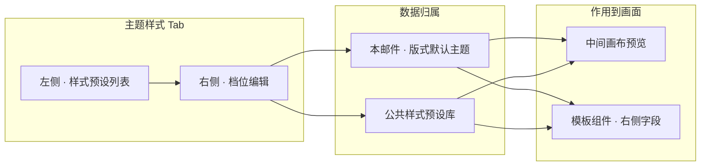

### 11.2 标准样式档位（主题变量目录）

样式预设由若干 **family（分组）× scale（档位）** 组成。产品维护一套**标准档位目录**（共 **12** 项），运营在右侧按分组编辑；界面**不出现** JSON 键名，仅展示中文档位名。

#### 11.2.0 两层分工：档位目录（固定一份）与区块绑定（多处引用）

主题样式与版式结构**分工不同**，运营须区分「改色板」与「指定哪块跟哪一档」：

| 层 | 维护入口 | 内容 | 是否随区块增减 |
|----|----------|------|----------------|
| **档位目录** | **主题样式** Tab | 当前选中预设下的**固定十二档**及其取值（如主色 `#…`、正文字号 `15px`） | **否**——全版式（或全公共库）共用**同一份**档位表，**不**因画布上 block 多寡而增删档位 |
| **区块跟随意** | **模板组件** Tab · 各区块样式字段 | 仅记录「**本字段跟随目录中的哪一档**」 | **是**——每个 block 的每个可绑样式字段**各自**选择档位；保存区块时写入**绑定关系**，**不**在 block 内再维护一套档位取值 |

**产品语义（须写清）**

| 项 | 说明 |
|----|------|
| **目录范围定死** | 新建本邮件 / 公共预设时，以**标准十二档**为起点；运营**不能**为某一个按钮单独「新增一个叫按钮红的主题变量」。特例改色用 **解除跟随 → 手动填写**（§11.6.1），不再占用目录槽位。 |
| **可多 block 绑同一档** | 例如 **主色** 可同时被：按钮胶囊背景、某段文本字色、图标色等**多个 block、多个字段**跟随；在 **主题样式** 改 **主色** 一次，凡绑定 **主色** 的字段**一起**变（§11.6.2「批量改色」）。 |
| **不同 block 可绑不同档** | 同一版式内：A 按钮跟 **主色**，B 文本跟 **正文字号**，布局容器内边距跟 **组件内部间隙**——均从**同一份**十二档目录中**挑选**，互不排斥。 |
| **与业务变量对比** | **数据变量**是「场景一份槽目录 + 多 block 绑不同槽」；**主题样式**是「版式一份档位目录 + 多 block 绑不同**档**」——结构对称，但档位表**不**随业务文案变化，仅随平面设计调整。 |

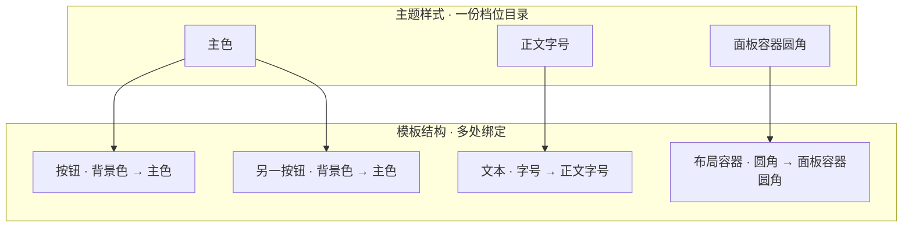

> **说明**：上图仅为示意——实际可选档位须符合 §11.2.2 字段类型收窄规则；**未绑定**的样式字段仍为字面量，不占用目录槽位。

#### 11.2.1 四组十二档

| 分组 | 档位（产品名） | 典型用途（摘要） |
|------|----------------|------------------|
| **颜色** | **主色**、**副色**、**主背景** | 文字色、图标色、描边色；容器 / 底图背景（主背景优先） |
| **间距** | **模块上下间距**、**页面左右间距**、**组件内部间隙** | 版心内模块间距、页面左右留白、栅格 gap / 内边距等 |
| **字号** | **大标题字号**、**小标题字号**、**正文字号**、**极小字** | 各组件 **字号** 类样式字段的跟随意 |
| **圆角** | **面板容器圆角**、**主按钮圆角** | 外壳圆角、按钮 / 胶囊圆角、容器底图圆角等 |

> **说明**：若历史模板中存在上表以外的档位键，界面归入 **「其他分组」** 并以 **「其他项 n」** 展示，供排查与迁移；新建模板 / 新建公共预设以**标准十二档**为起点。

#### 11.2.2 与区块字段的对应关系（跟随意）

在 **模板组件** Tab 选中区块后，**样式类**字段（§7 各组件 **样式** 或 **外层容器 · 样式** 中的颜色、字号、圆角、间距等）可通过 **来源胶囊** 绑定到**上表中的某一档**。系统按字段类型**收窄可选档位**，避免误绑（示例）：

| 字段类型（摘要） | 通常可选的档位 |
|------------------|----------------|
| **字号** | 大标题 / 小标题 / 正文 / 极小字 |
| **文字色、图标色** | 主色、副色、主背景 |
| **容器 / 底图背景色** | 主背景、主色、副色 |
| **内边距、gap 等间距** | 模块上下间距、页面左右间距、组件内部间隙 |
| **圆角（含四角绑定）** | 面板容器圆角、主按钮圆角 |

**不可绑定样式预设的字段（固定规则）**

| 项 | 说明 |
|----|------|
| **结构类字段** | 如列数、宽度模式等；**不展示**来源胶囊。 |
| **内容类字段** | 文案、链接、图片地址等；仅可绑**业务变量**（数据变量专章），**不可**绑样式预设。 |
| **文本段内 run** | 正文编辑器中对**选区**单独设的字号 / 字色为**固定字面量**（§7.10.3），**不可**绑样式预设。 |

#### 11.2.3 存储分工：档位文件、版式结构、编辑器专用元信息

除 §11.2.0 的「目录 vs 绑定」外，落盘时还有**三份数据**须区分（运营只需理解分工，不必记存储文件名）：

| 数据 | 维护入口 | 保存动作 | 内容摘要 |
|------|----------|----------|----------|
| **版式样式预设** | **主题样式** Tab → **保存** | 保存样式预设 | 当前版式（或公共库）的**十二档取值** |
| **版式结构** | **模板组件** Tab 编辑 + 顶栏 **保存区块** | 保存区块 | 各 block 的字段配置；跟随意时含 **「跟随哪一档」的绑定记录** 与字段内的**跟随标记**（见下表） |
| **编辑器专用元信息**（嵌在版式结构内） | **模板组件** Tab · **解除跟随 / 恢复** | 随 **保存区块** 一并落盘 | 仅用于**已解除跟随**字段的恢复快照；**不**参与发信业务语义 |

**版式结构内：跟随意字段的双记录（须一致）**

跟随意不仅出现在来源胶囊上，落盘时**成对写入**，保存前校验二者一致：

| 记录 | 作用 |
|------|------|
| **字段内的跟随标记** | 标明该配置项当前跟随哪一档（可为简单标记，或写在复合结构子项上，如统一内边距、统一圆角下的某一子字段） |
| **同路径的绑定登记** | 与来源胶囊一致：登记为 **样式预设** 来源，并写明所跟档位；供编辑器识别锁定 / 菜单高亮 |

| 项 | 说明 |
|----|------|
| **为何双写** | 画布渲染与对接解析会读**跟随标记**展开颜色/字号；编辑器 UI 读**绑定登记**决定胶囊状态与是否锁定输入框。 |
| **校验** | 仅有跟随标记却无绑定登记（或相反）→ 顶栏校验条报错，**保存区块**可能被拦截。 |
| **手动填写** | 无跟随标记、无样式类绑定登记；输入框可编辑。 |

**编辑器专用元信息（解除跟随专用）**

| 项 | 说明 |
|----|------|
| **何时写入** | 运营对某样式字段执行 **解除跟随** 时：将该字段当前在画布上的**展开结果**写成字面量，并把「解除前的跟随标记 + 绑定登记」快照记入**模板元信息**（仅编辑器用）。 |
| **为何需要** | 解除后字段已是字面量，若不留快照则无法 **恢复样式预设**；快照**不**写入样式预设文件。 |
| **恢复时** | **恢复样式预设** 从快照写回跟随标记与绑定登记，并清除对应快照项。 |
| **与业务变量** | 业务变量的「解除跟随」走 **数据变量** 专章另一套机制；**不**占用本元信息。 |

#### 11.2.4 哪些样式项可以绑定主题档位（在 §11.2.2 之上的补充）

§7 列出各组件配置面板中的每一项；§11.2.2 已约定 **结构类、内容类** 不出现 **样式预设** 来源。本节补充：**即便属于样式类**，也须是编辑器**已支持跟主题**的配置项类型——以选中该配置项后，**来源胶囊** 是否提供 **「样式预设」** 为准（运营不必记忆内部字段名）。

**已支持绑定样式预设的配置项类型**

| 类型（产品表述） | 运营在面板中常见的项（示例） |
|------------------|------------------------------|
| **单色 / 字号等单一取值** | 容器背景色、文字颜色、字号、图标颜色、进度条槽色、组件间隙（gap）等 |
| **内边距** | 外层容器 **内边距**（统一四边或分别设上下左右） |
| **圆角** | 模块外壳圆角、按钮圆角、底图背景圆角等（统一或四角分别设） |
| **描边** | 容器描边的**颜色**；部分场景下的**线宽** |

**仍不可绑定样式预设**

| 情况 | 结果 |
|------|------|
| **结构类、内容类** | 同 §11.2.2；无样式预设来源。 |
| **面板上有该项，但无样式预设来源** | 视为**尚未支持**跟主题；不应通过手工改数据强行绑定；若存在非法跟随关系，**保存区块** 前顶栏校验报错。 |
| **列表重复区域内的行内字段** | 按 **列表重复** 专章；与业务变量映射共用交互，**不**使用 §11.6 的常规样式预设胶囊。 |

> **验收口径**：以 **§7 字段名 + 来源胶囊是否出现「样式预设」** 判断可否绑定；勿要求运营对照内部存储结构验收。

#### 11.2.5 档位标识与界面中文名（对接参考）

界面只展示 §11.2.1 的中文档位名；系统内部用**固定标识**关联「目录 ↔ 区块绑定」。对接或排查时须遵守**分组前缀**约定（运营日常可忽略）：

| 分组 | 内部标识前缀（摘要） | 与中文档位示例 |
|------|----------------------|----------------|
| **颜色** | 短前缀 `colors.` | 主色 → `colors.primary` |
| **间距 / 字号 / 圆角** | 带 `tokens.` 前缀 | 正文字号 → `tokens.typography.body`；组件内部间隙 → `tokens.spacing.gap` |

绑错标识会导致「无法解析」、画布预览失败或校验失败；编辑器内应通过 **选择样式预设项** 点选，避免手填标识。

### 11.3 左侧 · 样式预设列表

顶栏选中 **主题样式** 后，左侧面板标题为 **「样式预设」**，并展示当前可选预设总数（如 **「3 套」**）。列表分两组：

| 分组 | 列表项 | 说明 |
|------|--------|------|
| **本邮件** | **一行**，对应当前版式的**版式默认主题** | 展示**预设名称**（可编辑）与内部标识摘要；选中后右侧编辑的是**本版式落盘**的档位，保存后写入**该版式**的默认主题配置。 |
| **公共预设** | **多行**，全系统共享 | 标题行提供 **新建**；每行展示公共预设名称与 id 摘要。选中后右侧编辑的是**公共库**中的同一份预设，保存后**所有**选用该公共预设的预览场景一并受益。 |

| 操作 | 行为 |
|------|------|
| **选中本邮件** | 画布与右侧档位编辑以**本版式默认主题**为展开基准；跟随意字段按本邮件档位解析。 |
| **选中某一公共预设** | 画布预览改为按该公共预设展开跟随意（**预览 / 对照**另一套色板）；**不**自动覆盖本版式已落盘的默认主题文件。 |
| **新建公共预设** | 弹出 **「新建公共样式预设」**；须填写 **预设名称**（必填）。创建成功后自动选中该项，并写入一套**内置默认十二档**（中性色板与常见间距 / 字号 / 圆角起点），运营可再改。 |

> **图示说明**：左侧面板标题 **「样式预设」**；**本邮件** 对应当前版式默认主题，**公共预设** 区可 **新建** 并多选切换。

### 11.4 右侧 · 档位编辑与保存

右侧面板标题为 **样式预设**；顶部为**预设名称**（可编辑，失焦或回车提交），右侧为操作按钮区。

> **图示说明**：标题行含 **保存**、**设为模板默认**；下方按 **颜色 → 间距 → 字号 → 圆角** 分段展示标准十二档（样例为 **本邮件** 选中态）。

#### 11.4.1 档位表单

| 项 | 说明 |
|----|------|
| **分组展示** | 按 **颜色 → 间距 → 字号 → 圆角** 顺序分段；段标题为分组中文名（见 §11.2.1）。 |
| **颜色档** | 每项为**颜色选择器**（含透明）。 |
| **间距 / 字号 / 圆角档** | 带 **px** 单位的数值输入（字号、圆角等按产品步进规则增减）。 |
| **修改生效范围** | 改档位值后，画布上凡**跟随**该档位的区块字段**即时**按新值预览；仍为**字面量**的字段不变。 |

#### 11.4.2 保存

| 项 | 说明 |
|----|------|
| **保存入口** | 右侧面板标题行 **保存**（仅在有未保存改动时可点）。 |
| **保存本邮件** | 左侧选中 **本邮件** 时：将当前十二档写入**当前版式**的默认主题配置；成功提示含「本邮件样式预设」语义。 |
| **保存公共预设** | 左侧选中某一 **公共预设** 时：将改动写入**公共样式预设库**对应记录；**不**改写当前版式的本邮件文件。 |
| **与顶栏保存区块** | 改档位后若只点顶栏 **保存区块**，**不会**落盘样式预设；须回到本 Tab 点 **保存**。 |
| **未保存提示** | 样式预设有未保存改动时，与版式结构未保存一并计入 **§5.6**「未保存的更改」确认（切换版式 / 模板前提示）。 |
| **公共预设协作** | 其他同事修改并保存公共预设后，本编辑器**静默刷新**公共列表；未保存的公共预设草稿仍受 §5.6 约束。 |
| **选中项失效** | 当前选中的公共预设被删除后，侧栏**自动回退**为 **本邮件**。 |

#### 11.4.2.1 保存样式预设时的校验（标准十二档）

除 §11.7 外，**保存样式预设**（本邮件或公共）时须满足：

| 项 | 说明 |
|----|------|
| **十二档齐全** | 当前预设的 **颜色 / 间距 / 字号 / 圆角** 四组、共 **12** 个标准档位**均须有非空取值**；缺任一档位则保存失败并提示。 |
| **间距档位上限** | **模块上下间距**、**页面左右间距**、**组件内部间隙** 的 px 值**不得超过 24px**（与容器间距产品上限一致）。 |
| **键序归一** | 保存时按固定顺序整理档位键，便于 diff 与对接；运营无感。 |
| **历史非标准档** | 旧数据若含十二档以外的键，在 **主题样式** 面板可能显示为 **其他项 n**；**新保存**须收敛为标准十二档（多余键应迁移或删除后再保存）。 |

#### 11.4.3 设为模板默认

| 项 | 说明 |
|----|------|
| **入口** | 右侧面板 **设为模板默认**（当前项已是默认时展示 **已是模板默认** 并禁用）。 |
| **作用** | 将**当前左侧选中的列表项**（本邮件或某一公共预设）记为该**邮件模板（场景）**打开编辑器时的**默认选中预设**；写入场景级模板元信息。 |
| **不影响** | **不**改变各版式本邮件文件里的档位取值；**不**自动把区块跟随意改绑到公共预设。 |
| **典型用途** | 全场景统一用某公共品牌色板做预览起点；或强制打开即编辑本邮件档位。 |

#### 11.4.4 删除公共预设

| 项 | 说明 |
|----|------|
| **入口** | 仅当选中 **公共预设** 时，标题行展示 **删除**（危险样式）。 |
| **确认** | 二次确认，文案含该公共预设名称。 |
| **结果** | 从公共列表移除（逻辑删除，可运维恢复）；若删除的正是当前选中项，侧栏回退为 **本邮件**。 |
| **不影响** | 各版式**已落盘**的本邮件预设与版式结构；已发信历史不回溯。 |

### 11.5 本邮件默认主题 vs 公共预设（产品语义）

| 维度 | **本邮件（版式默认主题）** | **公共样式预设** |
|------|---------------------------|------------------|
| **归属** | 当前 **版式** 独有 | 全系统共享库 |
| **复制版式 / 复制场景** | 随版式复制各一份（§5.2.1、§5.4.2） | 场景复制**不**复制公共库；版式复制**不**新增公共记录 |
| **画布预览** | 选中本邮件时，跟随意按本版式档位展开 | 选中公共项时，跟随意按该公共档位展开 |
| **发信默认** | 正式发信与对接渲染**以版式本邮件预设为准**展开跟随意（除非发信链路另行指定公共 id，不在本章展开） | 用于多模板**共用色板**与编辑时**对照预览**；改公共预设会影响所有选中该公共项进行预览的编辑会话 |
| **保存** | 写入当前版式默认主题 | 写入公共库；**不**替代版式本邮件文件 |

### 11.5.1 画布预览与落盘：跟随意如何展开

| 项 | 说明 |
|----|------|
| **落盘长什么样** | **保存区块**后，版式结构里跟随意字段仍以**跟随标记 + 绑定登记**形式保留，**不**把主色等展开成死字面量写入结构（除非已 **解除跟随** 或 §9 物化场景）。 |
| **画布上长什么样** | 编辑器在内存中按顺序：**条件显隐** → **列表虚拟展开** → **合并业务变量取值** → 再用 **§11.3 当前选中的样式预设** 把跟随标记**展开**为具体色值/字号，仅供预览与 Inspector 只读回显。 |
| **缺档兜底** | 某一档位在预设中为空或缺失时，预览展开可回退到系统**中性基线**默认值，避免整页空白；但**不能**替代「须维护本邮件十二档」的校验要求。 |
| **解析失败** | 跟随标记指向无效标识、或预设不可用导致展开失败 → **画布预览不可用**（见 §11.7），顶栏校验条提示。 |
| **与顶栏保存区块** | 改档位只点 **保存**（样式预设）即可影响预览；**无须**仅为改色而 **保存区块**。 |
| **对接 / 发信** | 对外提供「结构 + 变量合并」类能力时，**默认不含**主题展开；消费方须自行读取**版式样式预设**（通常为本邮件那份）再展开跟随意。接入页「本地试跑」可选用公共预设做预览，规则不在本章展开。 |

### 11.6 模板组件 · 字段跟随意（来源胶囊）

在 **模板组件** Tab，**样式类**字段配置项标题右侧展示 **来源胶囊**（与 **业务变量** 胶囊并列，见 §7.1 共性说明）。

#### 11.6.1 取值方式

点击胶囊展开菜单，**取值方式**区常见项如下（随字段状态略有增减）：

| 菜单项 | 含义 |
|--------|------|
| **手动填写** | 字段为**固定字面量**；输入框可编辑。 |
| **样式预设** | 字段**跟随** §11.2 中某一档位；输入框**只读预览**当前展开值，改色须到 **主题样式** Tab 改档位或切换跟随意项。 |
| **解除跟随**（跟随时） | 将当前在画布上看到的展开结果**烘焙**为字面量写入该字段；**移除**该路径（及子路径）上的样式类绑定登记；在**模板元信息**写入恢复快照；胶囊变为 **手动填写**，输入框可编辑。须 **保存区块** 后落盘。 |
| **恢复样式预设**（已解除跟随时） | 从**模板元信息**快照写回跟随标记与绑定登记，并清除快照；胶囊回到 **样式预设**，输入框恢复只读。须 **保存区块** 后落盘。 |

**样式预设** 菜单下方另有 **「选择样式预设项」** 分区：列出该字段**允许绑定**的档位（§11.2.2），每项附 **当前预设值** 摘要（如 `当前预设值 #1F2937`）；点选即切换跟随意。

> **图示说明**：样例为选中 **示例 · 按钮** 后，在 **样式** 页签点击 **按钮背景色** 旁胶囊展开；上半为 **取值方式**，下半为可选档位及 **当前预设值** 预览。

#### 11.6.2 跟随意下的联动

| 项 | 说明 |
|----|------|
| **三处一致** | 跟随意字段在画布、右侧输入框预览、胶囊菜单回显的展开值，均来自 **§11.3 当前选中的样式预设**（本邮件或公共）。 |
| **批量改色** | 同档位被多块跟随：在 **主题样式** Tab 修改该档位一次，画布上所有跟随块**同步**更新预览。 |
| **与业务变量** | 同一字段**不能**同时跟随样式预设与业务变量；已绑变量时须先解除变量再绑样式（反之亦然）。 |
| **列表重复行内字段** | 行模板 / 映射字段上的样式跟随意规则在**列表重复**专章约定；本章默认针对**常规静态结构**（§8.2.2）。 |

#### 11.6.3 插入与母版时的物化

| 场景 | 行为 |
|------|------|
| **新插入基础组件**（§8.6） | 出厂样例或 §9.3 插入默认中的跟随意，插入时按**当前选中样式预设**折算为字面量写入新块，保证画布立即可见。 |
| **保存插入默认 / 存为模块**（§9.2） | 一律物化为字面量，**不**保留主题跟随意。 |
| **复制区块**（§8.7） | **保留**已有样式跟随意绑定。 |

#### 11.6.4 解除跟随与恢复（行为细则）

| 步骤 | 解除跟随 | 恢复样式预设 |
|------|----------|----------------|
| **字段值** | 改为当前预览字面量（色值 / 字号等） | 写回解除前的跟随标记形态 |
| **绑定登记** | **删除**该字段（及子路径）上的样式预设登记 | **恢复**登记，与跟随标记一致 |
| **模板元信息** | 写入该字段的快照（含解除前跟随形态） | 删除对应快照项 |
| **胶囊与输入** | 显示 **手动填写**，可编辑 | 显示 **样式预设**，只读预览 |
| **落盘** | 须顶栏 **保存区块** | 须顶栏 **保存区块** |

> **注意**：解除跟随后，若仅改字面量而未 **保存区块**，切换版式会触发 §5.6 未保存确认；快照亦未持久化。

### 11.7 校验与空状态

| 项 | 说明 |
|----|------|
| **缺预设** | 版式结构中存在样式跟随意，但本邮件预设不可用时，校验条提示；**保存区块**可能被拦截。 |
| **跟随标记与绑定不一致** | 有跟随标记却无样式类绑定登记（或相反）→ 校验条报错，**保存区块**可能被拦截。 |
| **主题展开失败** | 结构含跟随意但当前预设无法展开（标识无效、档位缺失等）→ **画布预览不可用**，校验条列出原因；修复档位或改绑/解除跟随后恢复。 |
| **档位取值非法** | 颜色 / 间距 / 字号 / 圆角不符合格式，或间距超过 §11.4.2.1 上限时，**保存样式预设**失败并提示原因。 |
| **未配置预设** | 极端加载失败时，右侧提示「当前邮件尚未配置样式预设」，须先恢复版式数据或新建版式。 |

### 11.8 典型用例（验收参考）

1. 打开某版式 → **主题样式** Tab → 左侧默认选中 **本邮件** → 将 **主色** 改为品牌红 → **保存** → 画布上跟随 **主色** 的按钮 / 文本块同步变红。  
2. 在 **模板组件** Tab 选中 **按钮** → **胶囊样式 · 背景色** 选 **样式预设** → **选择样式预设项** 点 **主色** → 输入框只读，改 **主色** 档位后按钮预览更新。  
3. 左侧改选 **公共预设 · 品牌蓝** → 画布上跟随意块按公共档位预览；点 **保存**（公共）→ 再开另一模板选同一公共项，档位一致。  
4. **解除跟随** 某块圆角 → 仅该块可手调字面量；点 **恢复样式预设** → 恢复跟随意。  
5. 改公共预设名 → **设为模板默认** → 重新从侧栏进入该邮件模板 → **主题样式** Tab 默认选中该公共项。  
6. 仅改档位未点保存 → 切换版式 → 弹出 **§5.6** 未保存确认。  
7. 新插入 **文本** 块 → 无跟随时为字面量；保存某文本为 **插入默认** 后再插入 → 新块样式与默认一致（§9.3）。  
8. 某按钮 **按钮背景色** 跟 **主色** → **解除跟随** → 改字面量 → **保存区块** → 刷新页面后仍为字面量且胶囊为 **手动填写** → **恢复样式预设** → **保存区块** → 恢复跟随意且预览随 **主色** 变化。

### 11.9 本章边界与后续章节

| 主题 | 本章是否展开 | 说明 |
|------|----------------|------|
| **主题样式** Tab 列表与档位编辑 | **是** | §11.3–§11.4 |
| 标准 **十二档** 目录 | **是** | §11.2 |
| 本邮件 vs **公共预设** | **是** | §11.5 |
| 字段 **来源胶囊** 与跟随意 | **是** | §11.6 |
| 保存 / 未保存 / 设为模板默认 | **是** | §11.4 |
| **存储分工**（预设 / 结构双记录 / 解除快照） | **是** | §11.2.3、§11.6.4 |
| **画布预览 vs 落盘**、对接不含主题展开 | **是** | §11.5.1 |
| 哪些样式项**可**绑定主题档位（§11.2.2 之上的补充） | **是** | §11.2.4 |
| 八种组件**各字段表** | **否** | **§7** |
| 画布搭版 / 区块树 | **否** | **§8**、**§10** |
| **数据变量** 建槽与取值 | **§12 起** | 总览见 §12；取值 / 列表 / 绑定细则待写 |
| **列表重复** / **条件显隐** | **否** | 后续专章 |
| **模板信息** / 测试发信 | **否** | 后续专章 |
| 存储路径 / HTTP API | **否** | 配套接口说明 |

**阅读顺序建议**：先读 **§11.2.0–§11.2.3**（目录、双记录、三份数据分工），再在 **§11.3–§11.4** 维护色板；在 **§7** + **§11.6** 为各块绑档位；**§11.5.1** 理解画布与发信差异；解除跟随时对照 **§11.6.4**。搭版与模块复用见 **§8**、**§9**；批量改文案见 **§12**（§12.8 标准变量、§12.9 列表变量；胶囊绑定见 §12.10 待写）。

---

## 12. 数据变量（业务变量）

本章约定顶栏 **「数据变量」** Tab 下如何维护**业务入参**：运营为当前邮件模板（场景）声明「有哪些变量、各是什么类型、预览填什么值」，并在 **模板组件** Tab 通过 **来源胶囊** 把区块字段绑到这些变量上。**八种组件能绑哪些内容字段**见 **§7**；本章含**总览（§12.2–§12.5）**、**自定义标准 / 列表变量（§12.8–§12.9）**、**场景内置变量（§12.4）**；胶囊绑定、列表 repeat、保存与校验等待 **§12.10 及以后**。

> **配图样例**：下列 **数据变量** Tab 与「添加变量」弹窗示意图取自样例邮件 **「优惠券可用（Coupon Available 学习模板）」**（版式 **默认**），与 §7、§11 为同一封样例。

> **与 §4.2 的关系**：**数据变量**归属**邮件模板（场景）**，同一场景下**多个版式共用一份**变量目录与预览取值；换版式**不**复制第二份变量，仅版式结构里的**绑定关系**随版式各自维护（绑定仍指向同一场景的变量槽）。

### 12.1 定位与与其它区域的关系

| 项 | 说明 |
|----|------|
| **工作视图 Tab** | 顶栏 **数据变量**（§3.3）；左侧为**变量槽列表**，右侧为选中变量的**属性与赋值**。 |
| **画布是否常驻** | **是**（§8.1）。切换至本 Tab 时，中间画布仍展示合并变量后的邮件效果；区块增删改仍在画布完成。 |
| **作用域** | **场景级一份**：切换顶栏 **版式结构** 时，左侧变量列表与右侧取值**不变**；切换 **邮件模板** 时，整份变量随场景切换。 |
| **与顶栏「保存区块」** | **保存区块** 落盘**版式结构**（含各 block 与变量的**绑定登记**）；变量目录与预览取值须在 **数据变量** 侧单独 **保存**（§12.8.3、§12.9.6）。二者**不可**互相替代。 |
| **与 §11 主题样式** | **内容类字段**（文案、链接、图片地址、列表数据等）跟随意**业务变量**；**样式类字段**跟随意**主题档位**。同一字段**不能**同时绑变量与主题；通过 **来源胶囊** 区分（§7.1、§11.6）。 |
| **与发信 / 对接** | 对外发信或业务系统灌数时，按各变量 **标识（key）** 传入取值；场景内置变量的 **key 与数据结构** 须与对应接入系统的约定一致（见 §12.4）。 |

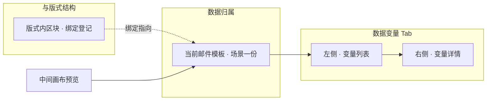

### 12.2 总览：自定义变量 vs 按场景约定

业务变量在「**怎么建槽**」上分两条路径：**自定义**（本模板自行定义入参）与 **按场景约定**（选用接入系统已预置的变量包）。二者写入同一场景的**同一份变量目录**，在列表里并列展示；区别在于 **key、类型、列表列结构、数据来源** 由谁事先约定。

| 维度 | **自定义** | **按场景约定（场景变量）** |
|------|------------|---------------------------|
| **谁定义 key** | 运营在本模板 **新建变量** 时自行填写 **变量标识（key）**（须在场景内唯一） | 由 **场景内置预设** 固定 **key**（及展示名、变量类型）；运营**不可**改 key |
| **谁定义数据结构** | **标准变量**：运营选类型（文本 / 链接 / 图片等）；**列表变量**：创建后在右侧配置**行字段**（列名、列类型） | 预设一次性带入 **列表列定义**、**数据来源规则**、固定长度等；部分项只读 |
| **谁提供预览数据** | 运营在右侧 **赋值** 区填写（或列表 **数据预览** / 从 JSON 导入等，细则待写） | 创建时由系统按预设加载 **预览数据**（如内置商品池 mock）；对接时由**业务系统**按同一 key 灌数 |
| **典型用途** | 活动文案、店铺名、优惠码、一次性链接等**本模板特有**入参 | 商品列表、专辑列表、GMV 指标等**跨模板复用**、且与 Loyalty **某一后台** 已接好的数据形态 |
| **列表中的标记** | 仅展示类型与绑定处数 | 额外展示 **「场景内置」** 摘要（见 §12.5） |

**场景值**（编辑器内简称 **场景**）：在添加 **场景变量** 时选择的下拉项，表示「当前对接的是哪一套业务后台 / 哪一类预置变量库」，而不是邮件模板顶栏里的「发信场景」名称。当前产品提供两类场景值（随 Loyalty 演进可扩展）：

| 场景值（产品展示名） | 含义（验收口径） |
|----------------------|------------------|
| **loyalty 内部后台** | Loyalty 团队**内部**运营后台接入；内置列表如数据展示、收益预测、推荐订阅套餐等 |
| **loyalty 商家端后台** | **商家端**后台接入；内置列表如商品列表、相似品列表、搭配品列表、专辑列表等 |

同一编辑器会话会**记住**上次选用的场景值（便于连续添加多个场景变量）；**不**随邮件模板切换而自动改变——换模板后若仍要加场景变量，须确认场景值是否仍与目标接入系统一致。

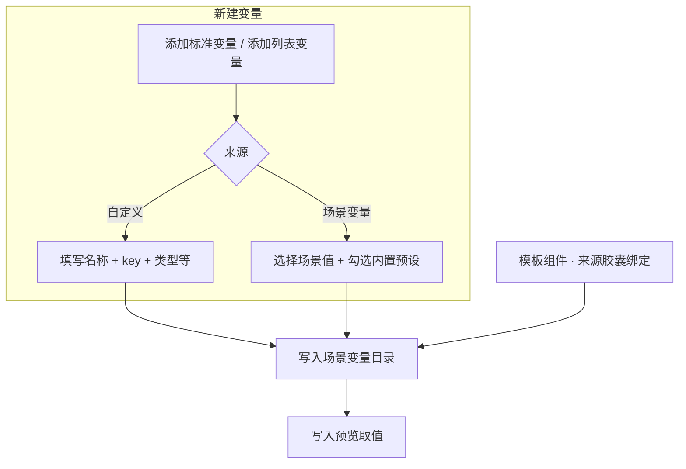

> **产品原则**：能复用场景内置的，优先 **场景变量**，避免运营自建列表列与对接 key 不一致；仅本活动独有的文案 / 链接再用 **自定义**。

### 12.3 自定义变量（入口）

自定义路径的公共规则如下；**标准变量**与**列表变量**的界面与操作分别见 **§12.8**、**§12.9**。

| 项 | 说明 |
|----|------|
| **入口** | 左侧 **变量列表** 标题行 **标准变量** / **列表变量** → 弹窗 **添加标准变量** 或 **添加列表变量** → 切至 **自定义** 页签。 |
| **key 约束** | 在**当前邮件模板（场景）**内唯一；**字母开头**，仅含字母、数字、下划线；与版式绑定登记使用的 **变量标识** 一致。 |
| **与绑定** | 在 **模板组件** Tab 为内容字段选择 **业务变量** 胶囊并点选已建槽；未建槽的 key **不能**在胶囊菜单中出现（绑定细则见 **§12.10**，待写）。 |
| **保存** | 新建变量会**立即写入场景变量目录**；改名称 / 标识 / 赋值等须在右侧点 **保存** 才落盘预览取值（§12.8.3、§12.9.5）。 |

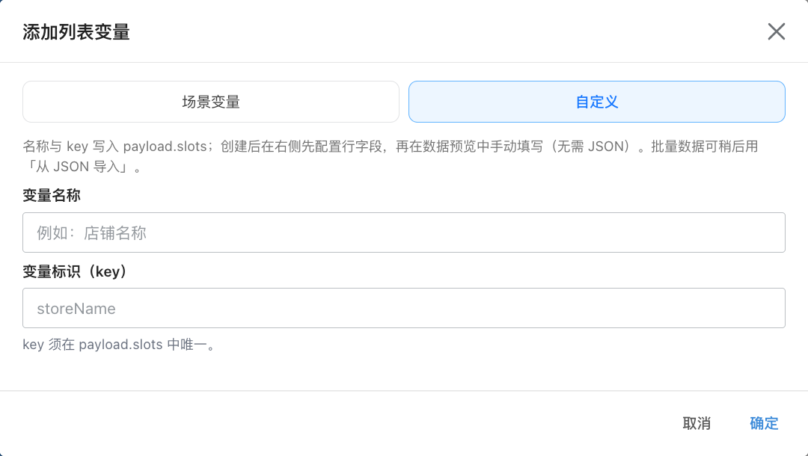

> **图示说明**：弹窗标题 **「添加列表变量」**；上方 **场景变量 / 自定义** 切换；**自定义** 下填写 **变量名称** 与 **变量标识（key）**。添加 **标准变量** 时另含 **变量类型**、**变量初值**（见 §12.8.1 配图）。

### 12.4 按场景约定的变量（场景变量）

| 项 | 说明 |
|----|------|
| **入口** | 同上弹窗，默认或切换至 **场景变量** 页签。 |
| **场景下拉** | 选择 **场景值**（§12.2 表）；切换后从服务端加载该场景下的 **内置标准变量** 或 **内置列表变量** 目录。 |
| **预设表** | 以表格展示预设 **名称**、**标识（key）**、**类型**；勾选一行后点 **创建变量**，系统写入：变量槽定义（含列表 **列结构**、**数据来源** 等）、关联预设 id、以及**预览用**初始数据。 |
| **创建后限制** | 列表行字段、场景内置的数据源配置等**由预设托管**，运营不可随意改列定义（避免与对接契约漂移）；取值预览仍可在右侧查看（发信灌数由业务系统负责）。 |
| **对接语义** | 发信或活动配置时，业务系统按**与预设相同的 key 与 JSON 形态**传参；不同 **场景值** 对应不同后台已接好的字段集合，**不可**混用（例如商家端商品列表 key 不会出现在内部后台预设库中）。 |

> **图示说明**：**场景变量** 页签下先选 **场景**（如 loyalty 商家端后台），再勾选内置项（如 **商品列表**）；点 **创建变量** 一次生成槽定义与预览数据。添加 **标准变量** 时弹窗结构相同，内置项为原子类型变量（部分预设的创建流程若尚未接入，界面会提示先用自定义）。

### 12.5 编辑器界面总览

顶栏选中 **数据变量** 后，主工作区为 **左列表 + 中画布 + 右详情**（§3.4）；中间画布规则与 **§8.1** 一致。

> **图示说明**：左侧 **变量赋值** 与 **20 个** 计数；**变量列表** 可 **列表变量 / 标准变量** 新建；每行展示**名称**、**类型 · 绑定处数**、**key**；选中后右侧为 **变量名称**、**变量标识**、**赋值** 等。样例中变量均为 **自定义** 路径所建（无 **场景内置** 标记）；若从场景预设创建，列表 meta 会带 **场景内置** 前缀。

| 区域 | 说明 |
|------|------|
| **左侧 · 变量赋值** | 标题 **变量赋值** + 当前槽总数；**变量列表** 为单选列表（`role="radio"`），选中项高亮。 |
| **新建** | 标题行 **列表变量**、**标准变量** 打开 §12.3 / §12.4 弹窗。 |
| **列表行摘要** | **名称**；次行 **类型 · N 处**（模板内绑定计数）；第三行 **key**（等宽小字）。 |
| **场景内置标记** | 由场景预设创建的槽，次行前缀 **场景内置**（与类型、绑定处数并列）。 |
| **校验态** | 槽级错误 / 警告时，列表项展示红 / 黄强调（与 §11 字段校验、右下角 **模板检查** 联动，细则待写）。 |
| **右侧 · 变量详情** | **标准变量**见 **§12.8**；**列表变量**见 **§12.9**（含 **列表配置**、**数据预览** 分组）。 |
| **右侧操作** | **保存**（仅当前变量有未提交修改时可点）、**删除**（删除槽并清理**当前版式**模板内绑定，二次确认见 §12.8.4、§12.9.6）。 |

### 12.6 变量目录、取值与版式绑定（分工）

便于与 **§11 主题样式** 对照，业务侧同样采用 **「目录 + 取值 + 结构内绑定」** 三分工（存储形态在配套接口说明中定义，此处只写产品语义）：

| 层 | 产品语义 | 维护入口 |
|----|----------|----------|
| **变量目录** | 本场景有哪些槽：名称、key、类型；列表槽含 **行字段**、数据来源等 | **数据变量** Tab · 左侧列表 + 新建弹窗 + 右侧属性 |
| **变量取值** | 编辑器预览与试跑用的业务值（文案、URL、列表各行数据等） | **数据变量** Tab · 右侧 **赋值** / 数据预览 |
| **绑定关系** | 某区块某字段跟随意哪一个槽（或列表哪一列） | **模板组件** Tab · 字段 **来源胶囊**；落盘在**当前版式结构**中 |

合并预览时：先按绑定把取值填进结构，再叠加 **§11** 主题档位展开，得到画布所见（§11.5.1 与本章叠加）。

### 12.8 自定义 · 标准变量

**标准变量**表示**单值**业务入参（一段文案、一个链接、一个数值等），对应侧栏类型摘要中的 **文本**、**链接**、**数值**、**图片**、**颜色**、**布尔** 等（列表展示名与 §12.5 一致）。

#### 12.8.1 新建（自定义页签）

| 项 | 说明 |
|----|------|
| **入口** | 左侧 **标准变量** → 弹窗 **添加标准变量** → **自定义**。 |
| **变量类型** | 创建时可选 **文本**、**数值**、**链接**（三种）；写入变量目录后可在右侧 **变量属性** 中改类型（仍仅限此三种）。 |
| **变量名称** | 必填；用于左侧列表与右侧标题展示。 |
| **变量标识（key）** | 必填；场景内唯一，规则见 §12.3。 |
| **变量初值** | 可选；填写后作为**编辑器预览取值**写入场景；**留空**则不写入预览层（画布合并时该槽视为未赋值）。**不是**版式结构里的字段默认值。 |
| **确定** | 校验通过后**立即**登记变量目录并选中该变量；若填写了初值，画布预览**即时**反映（无须先点右侧保存）。 |

> **图示说明**：**自定义** 页签下可选 **变量类型**、**变量初值**；确定后出现在左侧列表，摘要为「类型 · N 处」+ key。

#### 12.8.2 右侧详情：变量属性与赋值

选中某一标准变量后，右侧 **变量详情** 分两块：

| 分组 | 字段 | 说明 |
|------|------|------|
| **标题行** | 变量名称（可编辑） | 失焦或回车提交；改的是展示名，**不**改 key。 |
| | **保存** / **删除** | 见 §12.8.3、§12.8.4。 |
| **变量属性** | **变量类型** | 仅当槽为 **文本 / 数值 / 链接** 之一时展示下拉；修改后会**同步更新当前版式**模板内该槽相关绑定，并按新类型调整赋值控件形态。 |
| | **变量标识** | 可编辑（自定义槽）；失焦或回车提交；修改后会**同步重命名**模板绑定与句内插值占位符。格式错误或与已有 key 冲突时提示并回退。 |
| **赋值** | 按类型展示输入控件 | 见下表。 |

| 变量类型（产品展示） | 赋值控件 | 预览合并语义 |
|----------------------|----------|----------------|
| **文本** | 多行文本框 | 非空字符串写入预览 |
| **链接** | 单行输入，占位 `https://…` | 非空 URL 字符串写入预览 |
| **数值** | 数字输入 | 合法数字写入预览；留空则不合并 |
| **图片** | 单行输入，占位「图片 URL（https://…）」 | 非空图片地址写入预览（多由模板绑定登记为图片类型，新建弹窗不直接选此项） |
| **颜色** | 颜色选择器 | CSS 颜色值写入预览 |
| **布尔** | 下拉：未设置 / 真 / 假 | 选择真或假后写入预览；未设置则不合并 |

> **图示说明**：样例为 **文本** 类型变量 **优惠券主标题**（`heroTitleText`）；**赋值** 为多行文本。链接、数值等等价控件见上表。

**留空语义**：赋值留空时，预览合并**不**用外部取值覆盖模板字面量（提示文案为「留空则不合并外部取值到预览」）。发信时由业务系统按 key 灌数，与编辑器预览留空无关。

#### 12.8.3 保存

| 项 | 说明 |
|----|------|
| **何时可点** | 仅当当前变量存在**未提交的修改**（改名称、标识、类型、赋值等）时，标题行 **保存** 可点。 |
| **保存范围** | **当前选中变量** 的目录项与 **预览取值** 写入场景级变量文件；**不**改写版式结构。 |
| **与顶栏** | 改赋值后若只点顶栏 **保存区块**，**不会**落盘变量取值；须在本 Tab 点 **保存**。 |
| **画布** | 保存成功前，画布已按**内存中的草稿**预览；保存后刷新页面仍应保持相同取值。 |

#### 12.8.4 删除

| 项 | 说明 |
|----|------|
| **入口** | 右侧标题行 **删除**（危险样式）。 |
| **确认** | 二次确认，文案含变量展示名。 |
| **结果** | 从场景变量目录移除该槽及取值；并清理**当前版式结构**内指向该 key 的**变量绑定**（含句内插值）。**不可恢复**。 |
| **列表选中** | 删除后左侧自动选中下一变量；若无变量则右侧为空状态提示。 |

#### 12.8.5 校验（标准变量）

| 项 | 说明 |
|----|------|
| **槽级** | 标识格式、重复 key、取值与类型不匹配等，在左侧列表项与右侧详情顶栏展示红 / 黄提示（与右下角 **模板检查** 联动，细则待写）。 |
| **保存拦截** | 场景级校验未通过时，**保存** 可能失败并 Toast 提示；**保存区块** 若因同一问题被拦，见企业级校验交互约定（顶栏 Toast + 右下角 Dock）。 |

### 12.9 自定义 · 列表变量

**列表变量**表示**多行同构数据**（如商品卡列表、权益项列表）：须先声明**每一行有哪些列（行字段）**，再维护**固定展示行数**与**每行预览数据**，最后在版式里用 **列表重复（repeat）** 把区块行模板绑到该变量（repeat 专章待写）。

自定义列表的数据来源为 **手动 / JSON 导入**（`custom`）；与 **§12.4** 场景内置的远程 mock / 内置商品池**不同**。

#### 12.9.1 新建（自定义页签）

| 项 | 说明 |
|----|------|
| **入口** | 左侧 **列表变量** → **添加列表变量** → **自定义**（列表弹窗默认落在 **自定义** 页签）。 |
| **表单** | 仅 **变量名称**、**变量标识（key）**（§12.3 配图）。 |
| **确定后** | 登记 `valueType = 列表`、数据来源 **自定义**；**不**带行字段与行数据。右侧须继续 **配置行字段** → **列表长度** → **数据预览**（或 **从 JSON 导入** 一次写入）。 |

#### 12.9.2 列表配置（右侧 · 列表配置）

右侧对列表变量拆为 **列表配置** 与 **数据预览** 两个分段标题（与 §12.5 总览一致）。

| 配置项 | 说明 |
|--------|------|
| **数据源** | 展示 **从 JSON 导入…** / **重新导入 JSON**（已导入后）。用于**一次性**粘贴 JSON，解析后写入 **行字段定义** 与 **数据预览** 行数据；日常改单格数值在 **数据预览** 填写，不必重复导入。 |
| **列表长度** | 邮件版式**固定展示**的列表项数；可调范围 **1–10**（与版式 repeat 展开行数一致）。变更时会**补齐或截断**预览行数组，列结构不变。 |
| **列表行字段** | 声明每行有哪些列（列 key、列类型、展示名）；摘要一行展示已配置列。点 **配置行字段…** 打开弹窗（见 §12.9.3）。**须先配置行字段**，才能在数据预览中逐条填写。 |

> **图示说明**：样例 **精选商品列表**（`pickedProducts`）；**列表配置** 含数据源入口、列表长度、行字段摘要；下方 **数据预览** 按 Tab 展示每一行（§12.9.4）。

#### 12.9.3 配置行字段（弹窗）

| 项 | 说明 |
|----|------|
| **入口** | **配置行字段…**（列表配置段）。 |
| **弹窗标题** | **列表行字段配置**。 |
| **编辑方式** | 表格编辑各列：**列标识（key）**、**展示名**、**列类型**；类型为 **子列表** 时可展开配置子字段（**最多 2 级列表**：外层列表 + 子列表一层，子列表内**不可**再嵌套列表）。 |
| **列类型（可选）** | **文本**、**数值**、**链接**；以及 **子列表**（用于如「SPU 下 SKU 列表」）。存量数据若含旧版「图片」列类型，保存时归一为 **链接**。 |
| **确定** | 校验通过后写入变量目录的 **行字段** 定义，并**按新列结构**调整预览行（缺列补空、列减少则删键）。 |
| **取消** | 不改动已保存的行字段。 |

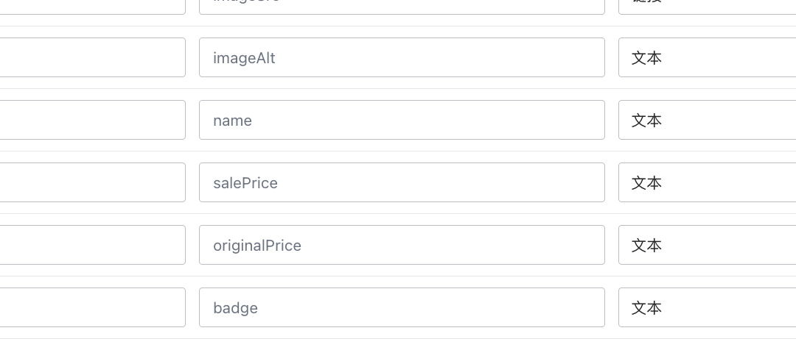

> **图示说明**：为列表变量声明 **itemFields**；支持 **子列表** 行展开子字段（验收时以弹窗内表格为准）。

#### 12.9.4 数据预览

| 项 | 说明 |
|----|------|
| **入口** | 右侧 **数据预览** 分段。 |
| **展示** | 按 **列表长度** 生成 Tab（第 1 项、第 2 项…）；每 Tab 内按行字段渲染输入控件。 |
| **编辑** | 行字段已配置且数据来源为自定义时，可逐格编辑；保存前修改仅存在于**草稿**，画布预览随草稿即时更新。 |
| **不展示** | 可对某一行勾选 **不展示**，该行**不参与**画布列表 repeat 预览（行级显隐，与模板 **条件显隐** 不同，细则待写）。 |
| **子列表列** | 子列表类型列在 Tab 内以嵌套表单或 **编辑** 入口维护子行数据。 |
| **空状态** | 未配置行字段时提示「请先配置列表行字段…」。 |

#### 12.9.5 从 JSON 导入

| 项 | 说明 |
|----|------|
| **入口** | **列表配置** 段 **从 JSON 导入…**（已有数据时为 **重新导入 JSON**）。 |
| **用途** | 粘贴业务方提供的 JSON 数组，一次性生成 **行字段** + **多行预览值**；适合批量灌数或从接口样例粘贴。 |
| **确定** | 解析成功后写入草稿；须在标题行点 **保存** 才落盘。 |
| **失败** | 格式非法或列类型不支持时，弹窗内或 Toast 提示原因，**不**部分写入。 |

#### 12.9.6 保存与删除

| 操作 | 说明 |
|------|------|
| **保存** | 与 §12.8.3 相同：仅提交**当前列表变量**的目录（含行字段、列表长度、行级不展示等）与 **values** 预览数据。 |
| **删除** | 与 §12.8.4 相同：移除槽、取值，并清理**当前版式**内绑定；若存在 **repeat** 绑定，一并按删除规则处理（repeat 专章待写）。 |

#### 12.9.7 与版式 repeat 的关系（摘要）

| 项 | 说明 |
|----|------|
| **分工** | **数据变量** 维护「槽定义 + 预览行数据」；**模板组件** 内在 **列表重复** 区域把区块行模板绑到该列表槽（及列路径）。 |
| **固定长度** | 列表变量的 **列表长度** 应与版式 repeat 展开行数**一致**；不一致时校验提示（细则待写）。 |
| **画布** | 预览时按 repeat 虚拟展开多行，数据来自场景 **预览取值**（非模板内写死 N 份静态块）。 |

#### 12.9.8 校验（列表变量）

| 项 | 说明 |
|----|------|
| **行字段** | 列 key 重复、嵌套超 2 级、空列表等，配置弹窗 **确定** 时拦截。 |
| **取值** | 列类型与单元格值不匹配、固定长度与 values 行数不一致等，在槽级校验与 **模板检查** 中提示（待写）。 |
| **保存** | 未配置行字段或必填预览行缺失时，可能拦截 **保存** 或 **保存区块**（与校验分级一致）。 |

### 12.7 本章边界与后续小节

| 主题 | 本章是否展开 | 说明 |
|------|----------------|------|
| **自定义 vs 场景约定**、**场景值** | **是** | §12.2–§12.4 |
| **Tab 布局与列表 / 详情** | **是** | §12.5 |
| 目录 / 取值 / 绑定三分工 | **是** | §12.6 |
| **自定义 · 标准变量**（新建、赋值、保存、删除） | **是** | §12.8 |
| **自定义 · 列表变量**（行字段、长度、预览、JSON 导入） | **是** | §12.9 |
| **模板组件** 胶囊绑定、句内变量、列表字段驱动 | **否** | §12.10（待写） |
| **列表重复（repeat）** 与变量物化 | **否** | 专章（待写） |
| **条件显隐** 与变量 | **否** | 专章（待写） |
| 未保存确认、槽级校验与 **模板检查** 细则 | **部分** | §12.8.5、§12.9.8；与 §5.6 对齐待写 |
| 发信灌数、外部 API 试跑 | **否** | 接入专章（待写） |

**阅读顺序建议**：先读 **§12.2** 区分 **自定义 / 场景变量**；新建与维护走 **§12.8**（单值）或 **§12.9**（列表）；在 **§12.5** 对照配图熟悉 Tab；在 **§7** + **§12.10**（待写）完成区块绑定；需要改色板读 **§11**。搭版见 **§8**；列表循环见 **repeat** 专章（待写）。

---
